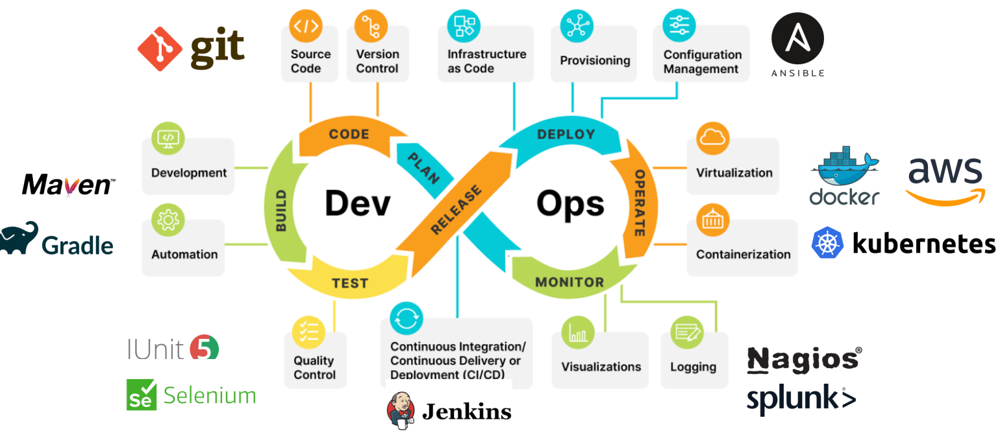
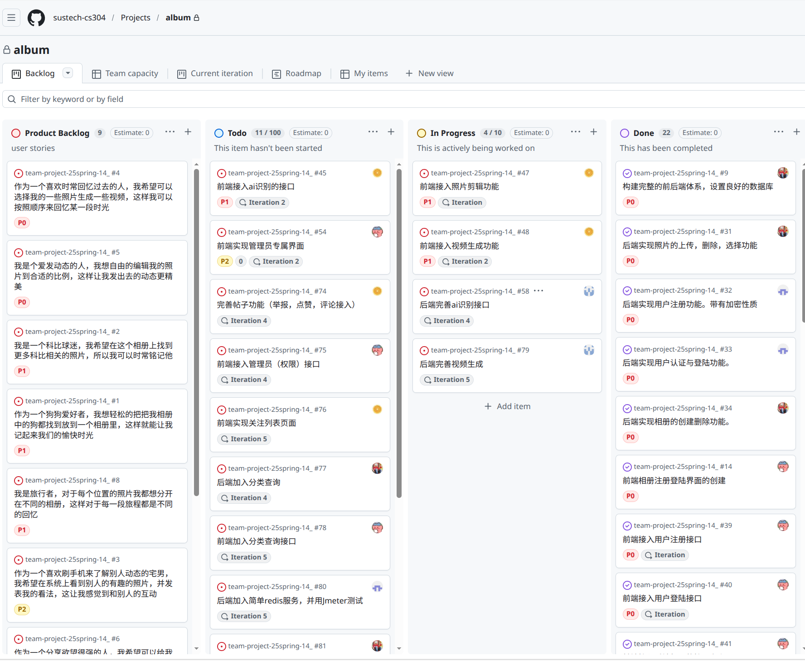
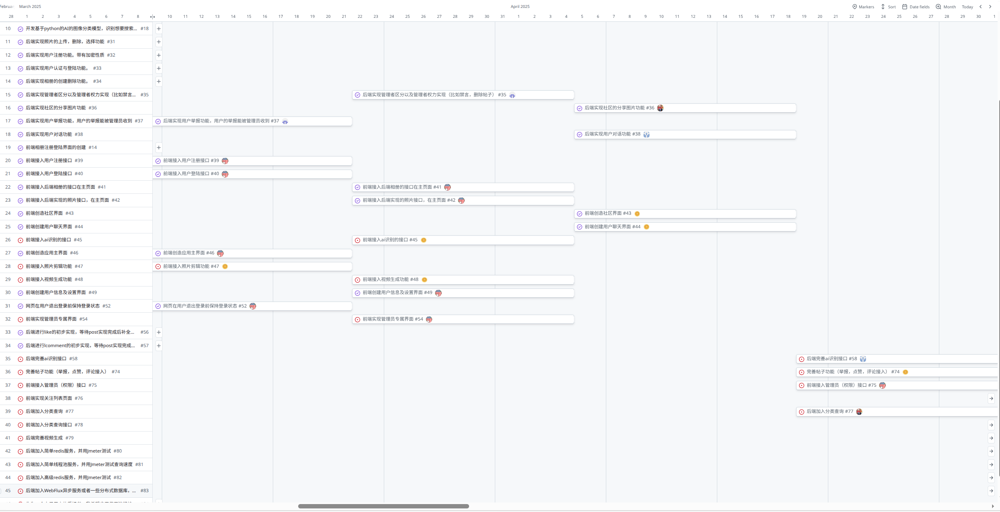
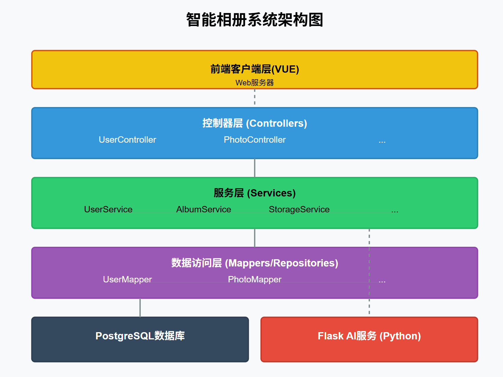

在现在看来，这是一个比较老掉牙的项目了，按理来说，这种传统的前后端项目已经可以轻松被AI完成了，但是苦在大学这段时间也没什么其他那的出手的项目经历了，我就用这个项目来对软件工程流程做一个简单的回忆吧。这里是当时项目的[目录](https://github.com/Joyboy-01/team-project-25spring-14_)

## 项目回忆

项目貌似实践了软件开发的一个完整流程，如下图：


在项目开始之前，首先选定开发流程，当时有很多个选择，比如waterfall，PROTOTYPING，agile等模式，当时选定的是SCRUM PROCESS模式（看到目录中每个sprint的报告想起来的）。简单说，Scrum 会把项目拆成一个个短周期的 Sprint 来推进，每个 Sprint 都会先定好目标和任务，过程中通过站会同步进度，结束时再做评审和复盘。这种方式比较适合需求可能变化、但又希望尽快拿到阶段性成果的项目。然后

然后项目需要作为客户，开发者提出自己对于项目的需求，在不同角色的立场下提出的需求应该是不同，写在了project backlog：

以及开发周期：

当时我是项目经历，进行了任务分配以及每个sprint的任务进度要求。项目使用git进行版本管理，当时课程专门花了一节课来讲git，还讲了git内部怎么保存的各个版本，但是时间久了记得最清楚的就是最常用的一些命令了。当时还记得我们需要给开源项目贡献一个PR，那时我目前为止唯一一个PR,提交在了这里：[typora-latex-theme](https://github.com/Keldos-Li/typora-latex-theme/pull/185)

然后就是开始设计项目的架构，课程上介绍了不少架构，经典的前后端，还有微服务之类的（记不清都有什么了），当时我们就是用的简单前后端（使用JAVA SPRING BOOT），然后把AI服务单独解耦了，主要是项目要求体现一部分AI，也就是接入什么识别模型之类的，还有音频等，当时只会用pytorch调用模型，所以直接用java调用python的服务比较合适（记得当时讨论的结果是这样的）。Springboot已经好久没用了，印象中spirngboot是一个可以方便我们写代码的架构，它可以自动化管理我们实例的生命周期，通过注解和反射来帮助我们简化一些常用的方法，可以通过maven自动化配置，还有他的test框架。确定的架构如下：


现在看来后端的代码实现我感觉很震惊。我们只需要把类定义好，分好，然后写好字端，剩下的注解，sql，从类中取字端填入sql返回这些其他所有的事情都可以完全由ai完成，而且丝毫没有难度，因为没有困难的逻辑。这样看的原因大概是作为学期项目，我们仅仅考虑到了项目的贯通性，主要只实现了CURD，而没有考虑到一些极端或者边界条件。当我把这类“看起来只是 CRUD 的后端”放到真实场景里重新审视时，才发现真正的难点几乎都不在接口本身，而在系统性问题上：高并发下怎么保证吞吐与稳定，分布式调用如何保持一致性与可恢复，幂等性如何避免重复上传/重复触发 AI，数据规模上来后分页、联表与索引如何设计，权限模型如何防越权并留下审计轨迹，文件如何从本地走向对象存储与 CDN，耗时的 AI/GPT 推理如何异步化并配套重试、告警与降级，AI 超时或失败时如何让主流程仍可用。同时还有一整套“规则”需要被明确并正确落地：例如删除相册时照片与标签关联表如何级联或软删除、事务边界在哪里、错误如何统一处理并用日志/trace 定位、缓存如何加且如何失效、以及接口与数据库字段演进时如何保持兼容并用迁移脚本平滑升级。也正因为这些问题存在，后端工程的价值往往不在“能写出代码”，而在“能把复杂现实变成长期可维护、可观测、可演进的系统”。这些都是我们需要明确考虑的事情

构建阶段和测试阶段最后都在Jenkins中完成。

构建阶段我们分为三个流程：前端后端和python

```text
push to master                push to vue                push to python
     |                             |                          |
     v                             v                          v
[backend-build]               [frontend-build]            [python-build]
  - setup JDK                  - setup Node               - setup Python
  - mvn package                - npm ci                   - pip install -r req
  - mvn test                   - npm lint                 - (optional lint/test)
  - upload jar artifact        - npm build                - upload python artifact
                               - upload dist artifact

                   \            |            /
                    \           |           /
                     v          v          v
                     [docker-build]  (only on master push)
                      - download jar artifact
                      - checkout vue + python branch
                      - docker build & push 3 images

                     [apifox-test] (master push)
                      - run API regression suite
```

测试阶段当时在课程中也花了一些时间来学习，但是主要还是概念的学习，我让ai总结了以下：软件测试是验证软件是否符合预期的过程，按流程分为单元测试（测最小代码单元）、集成测试（测模块接口交互）、系统测试（测整体业务）、验收测试 UAT（用户最终验证）；按方法分为黑盒测试（不看代码，按需求测输入输出）、白盒测试（看代码，关注语句、分支、条件覆盖率），常用等价类划分与边界值分析设计用例；实践中以开发者驱动测试 + 自动化测试为主，用测试替身（Stub/Fake/Mock）隔离依赖，还会做性能测试、UI 测试、A/B 测试、变异测试、模糊测试保障质量，核心产出是测试用例与测试套件，以测试预言判断结果是否正确。

项目中我们没有单独写代码，而是通过apifox的自动化测试集成，过程更像是一个黑盒测试，在[报告](https://github.com/Joyboy-01/team-project-25spring-14_/blob/master/sprint2/sprint2.md)中有一些截图来展示我们的自动化测试。现在的测试应该可以让ai来写了，比如可以补充更细粒度的单元测试，集成测试，边界测试等。

最后是CICD，也就是把前面的产物组装然后通过python部署，这些可以自动化集成到jenkins或者其他的自动化流程中。

## 项目总结

其实还有一些东西可以继续做，比如nginx流量分配，redis数据缓存，查寻优化，数据库查寻优化等，或许还能接入向量数据库查寻，应该比过模型会更快。

总之我现在的感觉就是这个项目到目前只能给我带来回忆软件工程的周期以及一些有点的知识点，要是说有什么值的深挖的实现，我觉得没有，我甚至觉得现在直接把项目需求给claude code，他几个问答就能作出比我们简洁的多，且功能性更强的一个智能相册。然而通过总结，我也认识到当时对于软件工程的认知多么浅显，各种优化，边界条件的判断让我们现在的软件构建越来越完善，越来越好。
