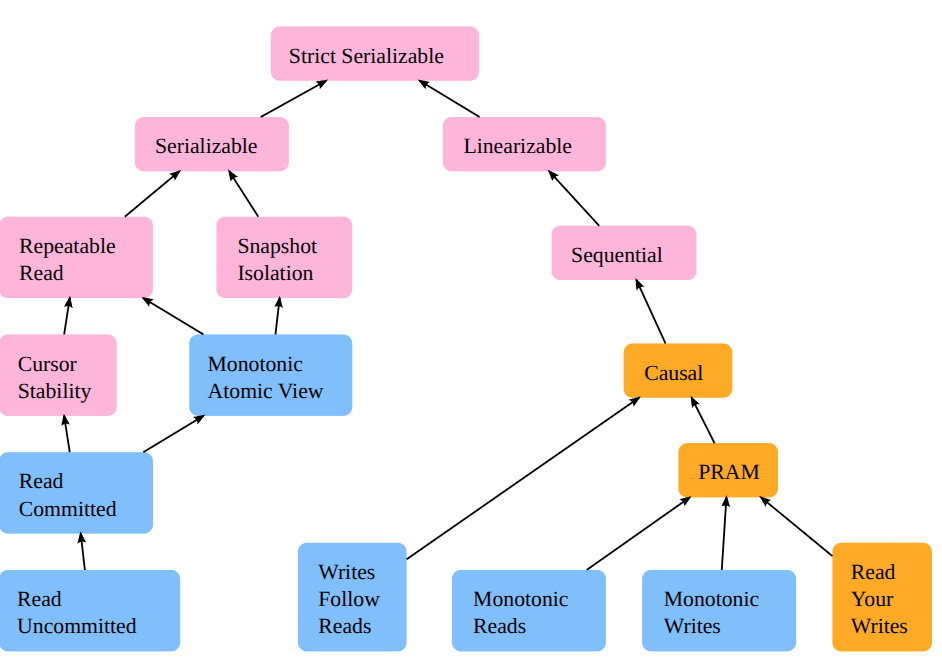
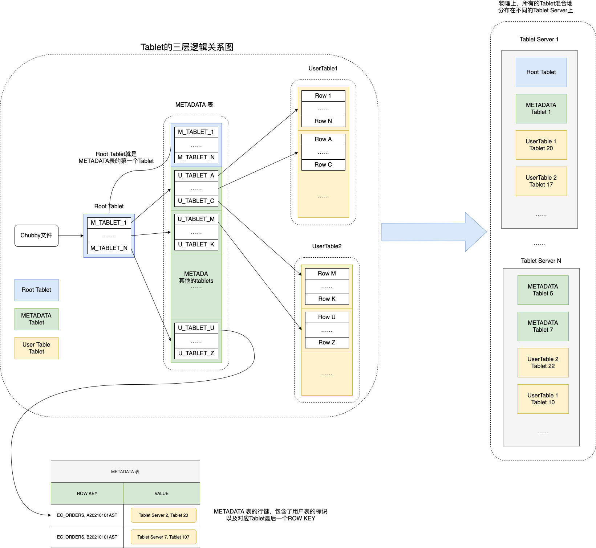
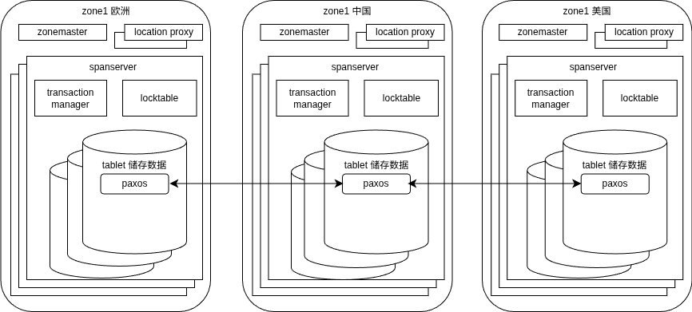
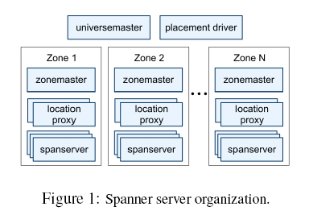
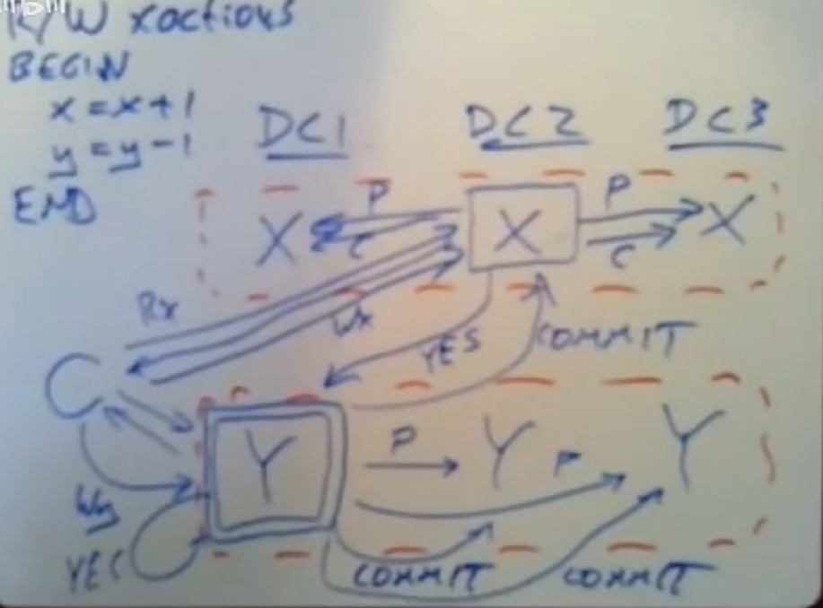
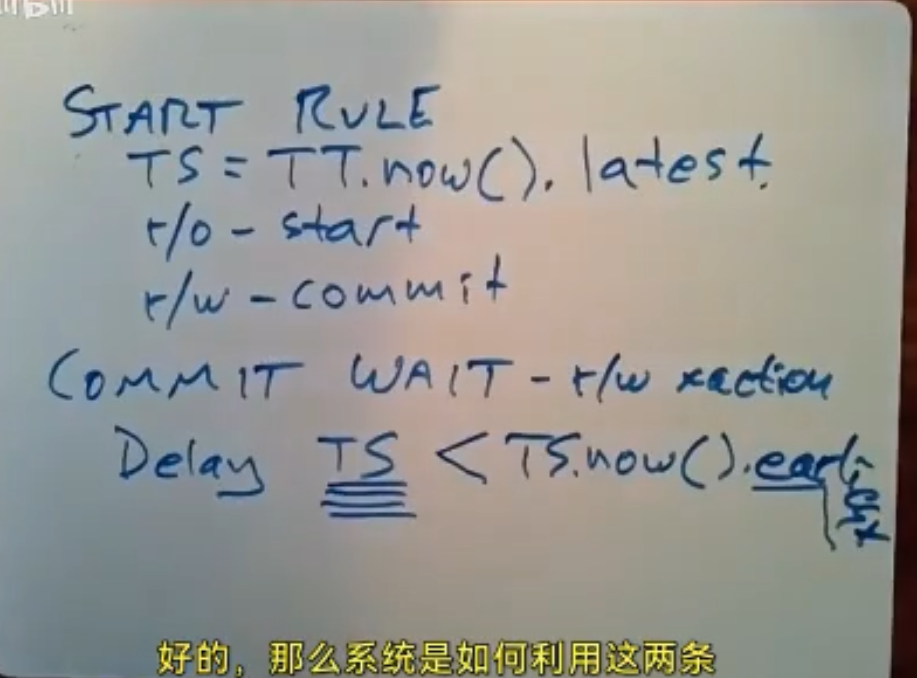

## 分布式数据库学习笔记：BigTable → Megastore → Spanner

> 学习主线：GFS → BigTable → Paxos → Megastore → Spanner

## 一致性基础

**强一致性（线性一致性）**：写完成后所有读都返回相同的信息，系统任何时刻的读都是一样的。

**弱一致性**：数据从"写入"到"对所有读者可见"之间存在一个不确定的时间窗口。

Raft 通过"任何操作必须凑够过半服务器批准"来保证强一致性，当然也可以降级。

**ACID 的一致性 vs CAP 的一致性**：
- ACID 中的 C：事务执行前后，数据库完整性约束不被破坏
- CAP 中的 C：线性一致性（Strong Consistency）

**一致性图谱**：


**MVCC（多版本并发控制）**：通过多副本达到"读远大于写时可以并行读"的效果。MVCC 在操作没有提交时读的仍是旧版本。多个 snapshot 的操作彼此隔离，但如果有写冲突，最后提交时需要处理。

MVCC 的实现是通过 Undo Log 来记录日志的变化，并通过 log 中的版本号来确定属于哪个时刻的 snapshot，而不是真的存了一个快照。

---

## 分布式协调

### 两阶段提交（2PC）

2PC 的问题：
- 执行事务期间没有可用性（参与者需要等待 commit）
- 协调者单点故障
- 数据不一致（协调者宕机）
- 协调者在提交 commit 的瞬间崩溃，没有恢复/回滚机制
- 脑裂问题

3PC 通过"参与者在最后 commit 阶段自行提交"解决了单点故障和阻塞问题，但这导致参与者有较大概率与协调者不一致。

### Raft

Raft 通过**多数派 + commitIndex + 心跳机制**解决了大部分问题。

**心跳接收全流程**（Follower 收到 Leader 的 `AppendEntries`）：

1. **重置选举计时器**：证明 Leader 健在，无条件重置选举超时计时器。
2. **检查并更新任期**：
   - `term < currentTerm`：消息过期，丢弃
   - `term > currentTerm`：更新 currentTerm，立刻转为 Follower，重置计时器
   - `term` 相等：继续后续处理
3. **一致性检查**：在日志中查找索引为 `prevLogIndex` 的条目，对比任期是否与 `prevLogTerm` 一致；不一致则返回 false，Leader 据此调整发送策略。
4. **推进状态机应用**：检查 `leaderCommit > commitIndex`，若是，则将所有已提交（索引 ≤ leaderCommit）但未应用的日志逐个应用到状态机。

**Raft 与 MVCC 如何协作（一个具体时序）**：

1. 客户端发送 `PUT x=1` 给 Raft Leader
2. Leader 将日志条目复制到多数 Follower，然后提交（commitIndex++）
3. Leader 的 apply 线程执行日志：调用存储引擎 `Write(x=1)`，生成新版本 `(revision=10, value=1)`
4. 另一个读请求 `GET x` 到达（要求线性一致性读）：
   - 走 Raft Read Index 拿到当前 commitIndex（假设为 10），读取版本 ≤ 10 的最新已提交版本 → 得到 1
   - 若是长事务的快照读（事务开始时 commitIndex=9），读到版本 9 的值 0
5. 步骤 3 完成之前，任何读操作都只能看到版本 9 的值 0，因为版本 10 还不存在

### Paxos

Paxos 没有固定 leader：每轮都是 2 个 RPC，耗时，且会出现活锁（多个 proposer 不断提议导致）。Raft、Chubby 等都通过机制保证只有一个 master。

**Phase 1 的两个作用**：
1. 竞争 leader 身份，让旧 leader 失效
2. 发现并处理上一轮未完成的写入，保证日志连续

### FLP 不可能定理

舍尔 - 林奇 - 佩特森（FLP）不可能定理：异步系统中，不存在完全可靠的提议者选举算法——选举算法必须依赖随机数或物理时间（如超时机制）。但无论选举成功与否，算法的安全性始终有保障。

---

## MySQL InnoDB 存储引擎

MySQL InnoDB 有三种日志：

| 日志 | 作用 |
|---|---|
| **Redo Log** | 保证持久性，崩溃恢复时前滚已提交的事务 |
| **Undo Log** | 保证原子性（回滚）+ MVCC 多版本读 |
| **Binlog** | 主从复制、PITR 恢复 |

**Redo Log vs Binlog 的区别**：
- Redo Log 是**物理级别**：`"在表空间 t.ibd 的页号 123，偏移量 456 处，将 2 字节改为 0x0010"`
- Binlog 是**逻辑语句级别**：`UPDATE t SET a = 10 WHERE id = 1` 或 `BEFORE: (1, 5) → AFTER: (1, 10)`

---

## BigTable

### 背景：为什么需要 BigTable

普通 MySQL 的局限：
- **海量数据**：几十 TB 甚至 PB 级，单机 MySQL 存不下
- **百万级 QPS**：每秒处理 100 万次以上随机查询或写入

传统分库分表方案的代价——主动放弃关系型数据库三大核心特性：
- **放弃外键约束**：关联数据可能不在同一台机器
- **放弃 ACID 跨行/跨表事务**：分布式事务（2PC）性能极差
- **放弃复杂 SQL**：跨节点聚合几乎不可行

本质：为了性能和扩展性，把功能强大的关系型数据库降级成了 KV 存储。

**扩缩容噩梦**：
- **噩梦一（扩容翻倍）**：取模哈希方案，8 台→10 台会导致几乎所有数据重新分片；翻倍扩容虽好，但新加机器远未达容量上限，造成资源闲置
- **噩梦二（缩容麻烦）**：数据分布紧密耦合在节点数量上，缩容需要全量数据迁移
- **噩梦三（故障恢复需人工介入）**：节点宕机需 DBA 手动确认、提升主库、修改路由，服务中断可能长达数十分钟

**NoSQL 解决的三个问题**：
1. 很强的可扩展性，随时可以加入或撤销服务器
2. 高可用性，确保几乎所有情况下系统都可用
3. 简单性，减少系统出错概率，便利上层应用开发



参考：https://blog.engine.wang/posts/bigtable/

### BigTable 数据模型

- 数据模型：`(row key, column family, column qualifier, timestamp) → value`
- 强一致性限制在**单行**：只要一个 tablet 在任意时刻只有一台 tablet server 在服务，单行读写就是强一致的
- 没有**跨行事务**：设计目标是极致的吞吐和扩展性

### BigTable 写入流程（Tablet Server 视角）

1. 客户端找到对应的 tablet server（用缓存的地址）
2. Tablet server 做权限检查
3. 写 commit log（WAL）到 GFS ← 最关键，持久化保证
4. 写入内存中的 memtable
5. 返回客户端成功

commit log 是一台 tablet server 上所有 tablet 共用一个文件；在 **tablet 迁移**时，需要先对 log 排序，再按 tablet 分发。

Bigtable 对并发写同一行的处理：**tablet server 串行化（sequentialize）所有对同一行的写操作**。

### SSTable 与 Compaction

写入先到内存里的 **memtable**，同时写一份 **commit log**（防止断电数据丢失）。memtable 满了之后刷到磁盘变成 **SSTable**，解决的是**随机写变顺序写**的问题。

同一行的 100 次更新，在磁盘上是 100 条独立记录，每条带自己的 timestamp，可能分布在不同的 SSTable 文件里。

- **Minor compaction**：memtable 满了刷到磁盘，生成一个新的小 SSTable，不合并任何东西
- **Major compaction**：把所有 SSTable 合并成一个，真正删除被覆盖的旧版本和墓碑标记（tombstone）

删除是写一个墓碑标记，等 major compaction 才真正清理——这是 SSTable immutable 的直接推论。

### 崩溃恢复

1. Master 通过心跳发现某台 tablet server 挂了
2. Master 把该机器负责的所有 tablet **重新分配**给其他还活着的 tablet server
3. 新的 tablet server 从 **GFS** 上加载这个 tablet 的数据（SSTable 存在 GFS 上，不是 tablet server 本地）
4. 还需要重放 **commit log** 恢复 memtable 里还没刷到磁盘的数据

> 由于是 GFS 单数据中心恢复，跨数据中心恢复很慢，且需要停止可用性（不像 Paxos 恢复对用户无感知）。

### 三级元数据结构（客户端如何找到数据）

```
Chubby
  └── 存着 Root tablet 的位置
        └── Root tablet（永远不会被分裂，全局唯一）
              └── 存着所有 METADATA tablet 的位置
                    └── METADATA tablet
                          └── 存着所有用户数据 tablet 的位置
                                └── 用户数据 tablet
```

**Master 完全不参与读写路径**，只负责：监控 tablet server 存活、分配 tablet、负载均衡。

客户端会缓存 tablet 地址，从返回的错误中发现 tablet server 地址过期后再刷新。

---

## Chubby

Chubby 并不只是一个分布式锁服务，而是一个完整的**分布式协调服务**，提供文件系统接口、锁、事件通知和租约等综合功能。

如果 Chubby 只提供锁，那么 BigTable 就必须额外用 GFS 来存储 bootstrap 位置、模式信息、ACL，并自己实现心跳、故障检测和通知机制。

**Chubby 提供的核心功能**：
- 文件系统命名空间（目录和文件）
- 临时文件（与 session 绑定，session 过期自动删除）
- Watch（主动推送变化）
- 租约（需要心跳续约）
- 读写锁和小文件存储

**BigTable 使用 Chubby 完成的任务**：
1. 保证任意时间点只有一个主副本是活跃的
2. 存储 BigTable 数据的 bootstrap 位置
3. 发现 tablet server
4. 宣告 tablet server 死亡
5. 存储 BigTable 模式信息（每个表的列家族信息）
6. 存储访问控制列表

**Chubby 中的序列器（Sequencer）机制**：
Master 向 Chubby 请求一个序列器（包含锁名称、模式、生成号的不透明令牌），连同目标存储位置一起交给用户。用户写入时必须将序列器也发送给存储系统（如 GFS），存储系统向 Chubby 验证序列器是否仍然有效，只有验证通过才允许写入。

**Tablet 是纯逻辑概念**：一个"组织单位"，用于将大表按行键范围切分成小段，便于 Master 调度、负载均衡、故障恢复，以及让客户端快速定位数据所在的 Tablet Server。

---

## Megastore

### 背景与目标

```
Bigtable
└── 单数据中心，挂了才恢复，有几十秒不可用
└── 没有跨数据中心副本，整个 DC 挂了就完了
        ↓ 问题很明显
Megastore
└── 在 Bigtable 上加了 Paxos，副本跨数据中心
└── leader 挂了秒级切换，整个 DC 挂了其他 DC 顶上
└── 但写延迟高，跨 Entity Group 事务弱
        ↓ 还不够好
Spanner
└── 解决 Megastore 的延迟和跨组事务问题
```

**NoSQL 特点**：弱一致性（最终一致性，无外键，无 ACID 约束），水平扩展能力，可用性优先于强一致性。

**BigTable 目标**：高可用、高吞吐、可扩展、广泛适用性（NoSQL），最大局限是**单行**操作。

**Megastore 目标**：跨数据中心、低延迟、强一致性（局部强一致）、事务性（ACID，特别是 Atomicity 和 Isolation）。

### Megastore 如何在 BigTable 上建立 ACID

Megastore 为每个 SQL 表定义逻辑表名，将数据行编码到 BigTable 的行键和列中：
- 行键：`Entity Group 标识` + `表名` + `主键值`
- 列：SQL 字段 `subject` → BigTable 列 `data:subject`；同一 SQL 行的所有字段存在 BigTable 同一行的不同列中

**ACID 实现**：
- Redo Log 存在 BigTable 中
- 事务隔离性通过 Megastore 层的**锁**实现
- 快照隔离和写时复制实现事务的 Isolation

> 注意：Raft 不保证读-修改-写序列的原子性，因为它只保证每个单独操作的线性一致性，不能自动将多个操作组合成原子单元。

### 索引本质

无论是普通的 B+ 树、Hash，还是 BigTable/Megastore 的索引，本质上都是把少量的关键区分性内容放到一个新的文件/结构中，达到少量查询找到地址的目的。Megastore 利用 NoSQL 和 BigTable 可以将数据直接存到索引中。

### Megastore 写入完整流程

```
1. 客户端在本地组装写操作，打上时间戳
        ↓
2. 发给 Paxos leader（可能是本地 DC，也可能不是）
        ↓
3. Leader 把这次写入作为一条日志发给所有副本
        ↓
4. 等多数派副本确认收到日志（跨 DC 往返，约 100ms）
        ↓
5. Paxos 提交，日志确认
        ↓
6. 把数据真正写入本地 Bigtable
        ↓
7. 更新协调者状态："本地副本是最新的"
        ↓
8. 返回客户端成功
```

### Megastore 三种读

- **Current read**：保证看到最新，但要等（需确认本地副本是最新的）
- **Snapshot read**：保证看到一致的历史快照，不用等
- **Inconsistent read**：什么都不保证，最快

**Current read 的确认流程**：
```
发起 current read
    ↓
问本地协调者：我这里是最新的吗？
    ↓
协调者说"是" → 直接读本地 Bigtable，不跨 DC
协调者说"不确定" → 发起一轮 Paxos 读，跨 DC 确认
    ↓
确认完成，协调者更新状态，返回数据
```

- 协调者状态存在本地（不写 Chubby，否则 Chubby 会成为瓶颈）
- 协调者崩溃重启后，必须默认"本地副本不是最新的"

### Megastore 的问题

1. **协调者开销大，写延迟极高**：需要保证状态一致性，网络分区时还需等待 Chubby 租约过期才能判断分区
2. **写吞吐极低**：每个 Entity Group 独立跑一个 Paxos 实例，每次写都要等多数派确认；百万个 Paxos 实例同时运行造成"Paxos 心跳风暴"
3. **跨 Entity Group 事务弱**：Entity Group 是强一致的孤岛，孤岛之间只有最终一致性，没办法撤销提交（只能用补偿事务）

> Megastore 的这些局限直接推动了 Spanner 的设计目标：**全局强一致事务，不需要 Entity Group 的限制。**

Megastore 优化：通过**稍带（piggybacking）**——在结果中顺带上获得最终写入权限的 proposer 作为下一个 leader，节约了一次 RPC。

---

## Spanner

### 概述

Spanner 是第一个在**全球规模**上同时实现了**外部一致性**和 **SQL 事务**的生产级数据库，核心秘密是 **TrueTime** 时间 API。

**外部一致性**：如果事务 T₁ 在 T₂ 开始之前提交，那么 T₁ 的提交时间戳一定小于 T₂ 的提交时间戳。

**TrueTime**：返回一个时间区间 `[earliest, latest]`，明确承认时钟有不确定性，并给出误差上界（通常 < 10ms）。在模糊的时间段中给出了一个具体的排序。

**NewSQL**（如 Google Spanner、TiDB）在保留 SQL 便利性与强一致性的同时，提供 NoSQL 那样的水平扩展能力。

### Spanner 解决了什么，放弃了什么

| 问题 | Spanner 解决了吗 |
|---|---|
| 协调者开销 | ✅ 用 TrueTime 替代 |
| Paxos 实例太多 | ✅ 以 tablet 为单位，动态调整 |
| 跨组事务弱 | ✅ 全局强一致事务 |
| 写吞吐低 | ⚠️ 部分改善，仍然是瓶颈 |
| 跨 DC 延迟高 | ❌ 没有解决，物理限制，光速无法突破 |

### 部署结构



- **Universe**：一个 Spanner 部署，统一的全球系统
- **Zone**：部署和管理的基本单元，大致对应一个数据中心（一个 DC 可以有多个 zone）
  - **Zonemaster**：把数据分配给本 zone 内的 spanserver
  - **Location proxy**：帮客户端找到存储对应数据的 spanserver
  - **Spanserver**：实际存储数据并响应客户端请求
- **Universe master**：管理所有 zone 的状态
- **Placement driver**：负责跨 zone 移动数据

Paxos group 的边界不是 zone，而是数据分片——同一份数据的多个副本分散在不同 zone 的 spanserver 上，这些副本之间跑 Paxos 保证强一致。



> 震惊的是**不同的数据（不同的行、不同的表）可以放在不同的数据中心**。

### 三种事务类型

| 事务类型 | 机制 | 特点 |
|---|---|---|
| **读写事务** | 2PC + 锁，强一致 | 需要等 commit wait |
| **只读事务** | 无锁，在任意最新副本执行 | 几乎零开销 |
| **快照读** | 读历史时间点，完全无锁 | 可在任意副本执行 |

- 只读的时间戳是 **start time**，读写的时间戳是 **commit time**
- 读快照不读最新，因为最新数据不保证原子性

### 上锁机制

**Spanner 只在 Leader 上锁，Follower 不上锁**（TiDB、CockroachDB 也如此）。

原因：Leader 是唯一写入口（强一致性的根本），跨副本上锁会产生锁风暴。



### TrueTime 的两条规则



**开始规则**：写事务 Tᵢ 的协调主副本分配的提交时间戳 sᵢ，不小于 eᵢ^server 发生后 `TT.now().latest` 的值。

**提交等待规则**：协调主副本确保，在 `TT.after(sᵢ)` 返回 true 前，客户端无法读取到 Tᵢ 提交的数据，保证 `sᵢ < t_abs(eᵢ^commit)`。

- **Start rule** 保证：在开始读时一定不会读到旧的值，读写 commit 的时间戳之前一定已经提交，防止认为提交了但读不到
- **Commit wait rule** 保证：提交完成后，交易的时间戳一定已经成为过去

Spanner 通过取不确定性的上界来保证：下一个事务开始之前，上一个事务一定已经 commit，这里会引入 2ε 的等待。但可以在等待时间内进行 Paxos 通信（反正时间戳最后发过去不会变）。2PC 由客户端直接发起 prepare，避免写数据被跨 WAN 传输两次。

### Safe Time（安全时间）

为了处理快照读可能是少数派的问题，safetime 保证：

> **所有 ≤ t_safe 的时间戳，数据都已确定、不会再变，可以安全读；> t_safe 的时间戳，数据可能还在提交/回滚，不能读。**

- `t > t_safe^Paxos`：Paxos 层面还没同步到 t
- `t > t_safe^TM`：2PC 有"悬着的准备事务"，结果不确定

读取依据两个变量：Paxos 上次写入时间（写入后不再变化）以及是否有正在准备但没有提交的事务（在这个 t 之前一定都已经提交了）。

在读的时候，需要取确定的完整版本，时间戳取当下不确定性最晚的时间，保证发起读此时刻的数据是完整的。

只读事务去 leader 获取 s_read 时间戳，副本拿到 s_read 之后等待自己的 t_safe 自然推进到 s_read，不需要多次向 leader 确认——Paxos 同步会自动推进 t_safe。等待期间不会读到等待时刻之后才出现的数据，因为 commit wait 保证了时间戳一定是过去的时间，不可能有新事务在等待期间拿到更小的时间戳突然改变副本状态。

### 读写事务完整流程

读写事务用 **2PC + 悲观锁**，流程分两个阶段：

```
【读阶段（Read Phase）】
1. 客户端向涉及的所有 Paxos group 的 leader 发送读请求
2. 每个 leader 在对应行上加读锁，返回数据给客户端
3. 客户端在本地执行计算，确定要写的内容
        ↓
【提交阶段（Commit Phase，即 2PC）】
4. 客户端选定一个 Paxos group 作为 coordinator，
   直接向 coordinator 和所有 participant 发 Prepare（含各自负责的写数据）
        ↓
5. 各 participant leader 加写锁，将写操作记入本地 Paxos 日志（Prepare 状态），
   返回"已准备"给 coordinator
        ↓
6. coordinator 收到多数派确认后，向 TrueTime 申请提交时间戳 s
   → s ≥ TT.now().latest（Start Rule）
        ↓
7. coordinator 等待 TT.after(s) = true，即确保 s 已成为绝对过去
   → Commit Wait，保证外部一致性
        ↓
8. coordinator 通过 Paxos 提交，将时间戳 s 广播给所有 participant
        ↓
9. 各 participant 应用写操作，释放锁，返回成功
        ↓
10. coordinator 返回客户端成功
```

**关键点**：
- 读阶段完全不用 Paxos，只需本地 leader 加锁读
- 写数据由客户端直接发给各 participant，不经过 coordinator 中转，避免跨 WAN 传输两次
- commit wait（第 7 步）通常只需等几毫秒（TrueTime 误差 ε < 10ms），但这段时间可以并行完成 Paxos 广播

### 数据模型

**Directory 数据模型**：用 `INTERLEAVE IN` 把父子表的数据物理上存在一起，解决了分布式数据库里跨表 locality 的问题（有点像 Entity Group）。

**INTERLEAVE IN 示例**：

假设有用户表和订单表，传统分布式数据库里用户和他的订单可能散落在不同机器，每次查"某用户的所有订单"都要跨机器。

```sql
CREATE TABLE Users (
  user_id   INT64 NOT NULL,
  name      STRING(100),
) PRIMARY KEY (user_id);

CREATE TABLE Orders (
  user_id   INT64 NOT NULL,
  order_id  INT64 NOT NULL,
  amount    FLOAT64,
) PRIMARY KEY (user_id, order_id),
  INTERLEAVE IN PARENT Users ON DELETE CASCADE;
```

物理存储上，Orders 的行会被**插入**到对应 Users 行的旁边，按行键排序后长这样：

```
Users(user_id=1)
  Orders(user_id=1, order_id=101)
  Orders(user_id=1, order_id=102)
Users(user_id=2)
  Orders(user_id=2, order_id=201)
```

查 `user_id=1` 的所有订单时，只需一次本地顺序扫描，不需要跨 Paxos group 或跨机器。

**对比 BigTable**：BigTable 没有 schema 概念，不知道 Users 和 Orders 有关联，只能各自按 row key 存，查询时必须分别扫再在应用层 join。

### 模式变更

模式变更也用时间戳来定义：指定一个未来时间点 t，t 之前的操作按旧 schema 执行，t 之后的操作按新 schema 执行，对正在进行的操作几乎没有影响。

### 优化策略

1. **t_safe^TM 细化**：按数据 key range 细化 safe time，消除无冲突读的虚假阻塞
2. **LastTS 细化**：按 key range 粒度减少只读事务不必要的延迟（尚未实现）
3. **MinNextTS(n)**：承诺序列号 n+1 的写操作时间戳至少是 X，这样 t_safe^Paxos 可安全推进到 X-1，让空闲时的历史快照读不需要等写操作才能进行。这个承诺必须在主副本的租约周期内才有效。MinNextTS 默认每 8 秒推进一次，副本也可以按需请求 leader 立刻推进。主副本宕机换新副本时，租约互斥不变性保证新 leader 的时间戳天然大于旧 leader 的所有 MinNextTS 承诺，不需要任何额外处理。

---

## 待解决问题

- Spanner 或其他框架在上锁时，上锁不应该是给 Paxos 组都锁上么？（已解答：**只给 leader 上锁**）
- 只读是否保证了 serializable？和外部一致性的关系？
- 为什么 Spanner 的 NoSQL 对取 SQL 的复杂查询有高效率，而 BigTable 没有？
- 本地读取的情况下怎么保证数据的正确性（Paxos 可能落后），需要 transaction？
- Spanner 的数据是什么样子，和 BigTable 的区别，和 Megastore 的区别？

---

## 参考资料

- https://blog.engine.wang/posts/bigtable/
- https://www.cnblogs.com/linbingdong/p/6253479.html
- 之后还有 Dapper、Dremel、PowerDrill 等谷歌的系统
