## **history:**

perceptron 1958 $\rightarrow$ Backpropagation  1974 $\rightarrow$ boltzman machine 1982 $\rightarrow$ multilayer proception / RNN 1986 $\rightarrow$  LeNet 1990 $\rightarrow$ bidirection RNN/ LSTM 1997  $\rightarrow$  1998 LeNet-5  $\rightarrow$  2006 DBN  $\rightarrow$  2012 AlexNet  $\rightarrow$   2015 ResNet

## BackPropagation & optimizer

### Backpropagation

**Generalization capability**: the gap betweenthe training error and test error.

**deeplearning**: A family of parametric, non-linear and hierarchical representation learning functions, which are massively optimised with (stochastic) gradient descent

**Cost functions**: like CE([Entropy & Cross-Entropy](https://zhuanlan.zhihu.com/p/149186719))

**Output units**: sigmoid, softmaxr

**Hidden units**: relu, leaky relu,sigmoid and so on $\sigma'(x) = \sigma(x)(1 - \sigma(x))$

**Architecture**: layers, depth(the number of layer)

universal approximation theorem:  provided it has enough units, a single layers is sufficient to approximate any continuous function on a closed and bounded subset of ${R}^n$

**Backpropagation**: chain rule

$$
\frac{\partial L}{\partial w^l} = \left( \frac{\partial a^l}{\partial w^l} \right)^T \frac{\partial L}{\partial a^l}
$$

$$
\frac{\partial L}{\partial a^l} = \left( \frac{\partial a^{l+1}}{\partial x^{l+1}} \right)^T \frac{\partial L}{\partial a^{l+1}}
$$

### optimization & regularization

**Gradient descent**:

$$
w^{(t+1)} = w^{(t)} - \eta_t \nabla_{w^{(t)}} L
$$

**Batch gradient descent**:

$$
\nabla_{w^{(t)}} L = \frac{1}{m} \sum_{i=1}^m \nabla_{w^{(t)}} L(w; x_i, y_i)
$$
- Acceleration techniques based on second order derivatives (Hessian) can be used
- We can measure not only the gradient but also the curvature of the loss function
- It’s possible to do a simple theoretical analysis of the convergence rate

- Datasets can be too large for a complete gradient computation to be feasible
- Loss surfaces are highly non-convex and high dimensional

**Stochastic gradient descent (SGD)**：

$$
w^{(t+1)} = w^{(t)} - \eta_t \nabla_{w^{(t)}} L(w; x_i, y_i)
$$
- Faster than gradient descent
    - Start improving from first sample rather than waiting; also, there may be redundant when considering whole training data
- Randomness helps to avoid overfitting, which in turn can improve the accuracy
- Suitable for datasets that change over time

- Mostly, it’s an approximation of an approximation so it’s bound to be imperfect
	- But in practice this is not a problem, in fact it’s an advantage (noise helps against overfitting)

**Mini-batch gradient descent**: sample a mini batch from training set

$$
w^{(t+1)} = w^{(t)} -  \frac{\eta_t}{B} \sum_{b \in B} \nabla_{w^{(t)}} L(w; b)
$$

**challenge:**

- **Ill-conditioning**: extreme differences in $l_i(\theta, \phi) = -\mathbb{E}_{z \sim q_\theta(z|x_i)}\left[\log p_\phi(x_i|z)\right] + KL\left(q_\theta(z|x_i) \parallel p(z)\right)$curvature of the loss landscape along different parameter directions. A fixed learning rate fails to match update speeds for all directions, leading to oscillation, slow convergence or non-convergence.

$$
f(x)≈f(x^{(0)})+(x−x^{(0)})^\top g+\frac12(x−x^{(0)})^\top H(x−x^{(0)})
$$

$$
f(x^{(0)}−ϵg)≈f(x^{(0)})−ϵg^\top g+\frac12ϵ^2g^\top Hg
$$

- condition number: For the Hessian matrix H (characterizing curvatureof the loss landscape): $κ(H)=\frac{λ_{min}}{λ_{max}}$
- ${λ_{max}}$: Largest eigenvalue, corresponding to the steepestdirection.
- $λ_{min}$: Smallest eigenvalue, corresponding to the flattestdirection.
The optimization problem is **ill-conditioned** if κ(H)≫1. If learningrate is fixed then A large learning rate causes oscillation; a small oneresults in extremely slow convergence.
- **Local minima**: Non-convex loss creates suboptimal minimum points that trap the optimizer.
- **Plateaus & saddle points**: Near-zero gradients cause slow progress or stagnation during training.
- **Cliffs & exploding gradients:** Sharp, steep regions in the loss landscape where gradients become extremely large, causing catastrophic parameter updates and training divergence.

**Momentum**:

Keep taking into account past gradients but let their contribution decay exponentially with time

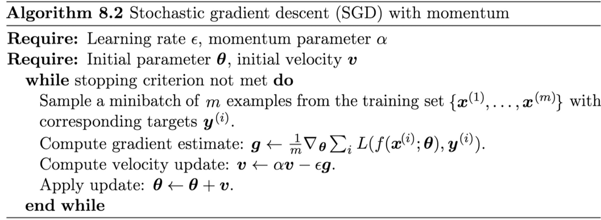

$\alpha$ Typical values are 0.5, 0.9, or 0.99. Usually it starts at a low value that is then raised with time

**Nesterov momentum**:

Just like standard momentum, but use the future gradient (which results in better convergence)

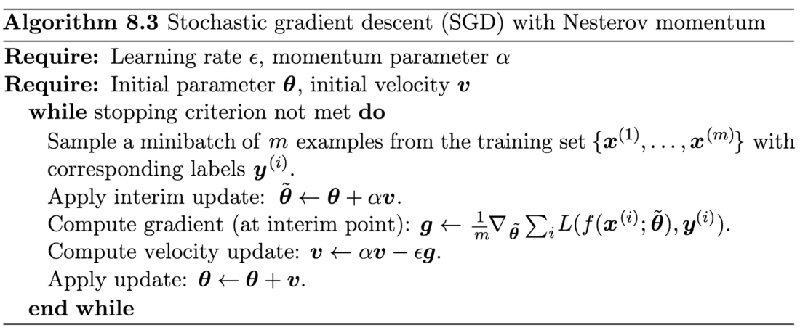

**AdaGrad**:

Accumulate the global sum of squared gradients for each parameter, and normalize learning rates to achieve fully adaptive updates.

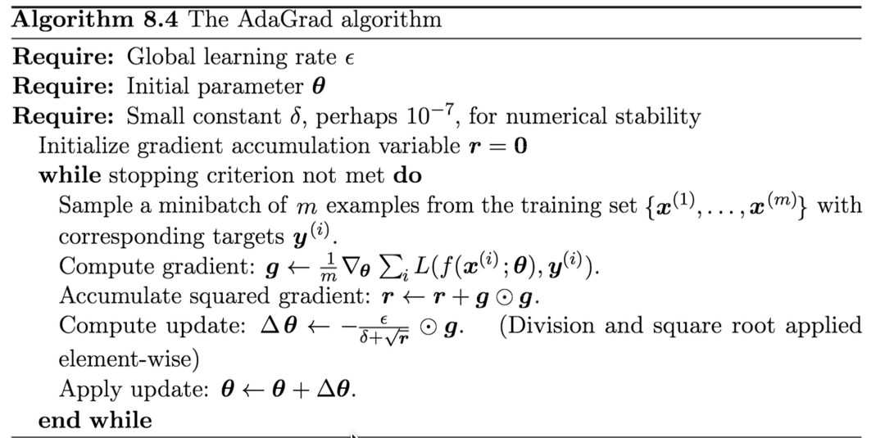

But long history of gradients can slow things down

**RMSprop**

Replace global accumulation with exponential moving average of squared gradients. Only track recent gradient information to fix the over-decay issue of Adagrad.

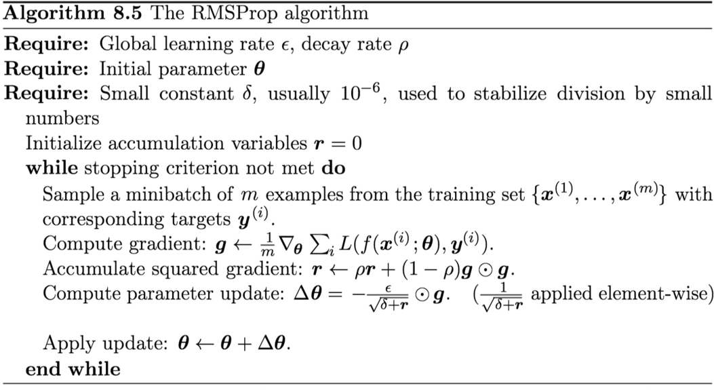

While AdaGrad is designed to work well for convex functions, RMSprop works better in non-convex settings

**Adam**

combining RMSprop with SGD + momentum

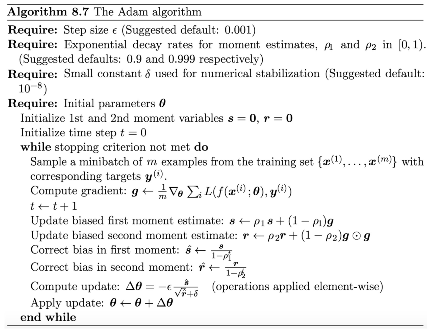

**Summary**：

- **1st-order information**: Gradient $g=∇L(w)$, describes the **slope** of the loss landscape.
- **2nd-order information**: Gradient squared / Hessian-related terms, reflects the **curvature** of the loss landscape.

| Optimizer               | 1st / 2nd Order | Uses historical gradient                         | Key Features                                                 |
| :---------------------- | :-------------- | :----------------------------------------------- | :----------------------------------------------------------- |
| Momentum                | 1st-order only  | Yes (exponential moving average)                 | Accelerate convergence, reduce oscillation                   |
| Nesterov Momentum (NAG) | 1st-order only  | Yes (look-ahead + moving average)                | More accurate update than standard Momentum                  |
| Adagrad                 | 1st + 2nd-order | Yes (cumulative sum of squared gradients)        | Per-parameter adaptive lr; learning rate decays continuously |
| RMSprop                 | 1st + 2nd-order | Yes (moving average of recent squared gradients) | Fix Adagrad’s excessive learning rate decay                  |
| Adam                    | 1st + 2nd-order | Yes (EMA for both gradient and squared gradient) | Combine momentum & adaptive lr; robust for most tasks        |

**optimal optimiser**:

reading:

[优化器可视化](https://github.com/Jaewan-Yun/optimizer-visualization)

[优化器](http://ruder.io/optimizing-gradient-descent/)

[Intro to optimization in deep learning: Momentum, RMSProp and Adam](https://blog.paperspace.com/intro-to-optimization-momentum-rmsprop-adam/)

**Regularisation**

Deep networks have too many paramerters, lead to overfitting.
Possible methods include L1 regularisation, L2regularisation, and Dropout. The goal is to reduce the model capacity

**Dataset augmentation**

generate transformed version fo input data, suitable for object recognition tasks

**Early stopping**

stop training when validation set error starts increasing, even if training
error is still decreasing

**Dropout**

Faster training, Less overfitting, Units become more robust

During training, Dropout essentially trains a different sub-network for each batch. At test time, it performs ensemble inference over all these sub-networks. Ensemble learning is a powerful technique to improve generalization performance.

## CNN & RNN

### CNN

Convolution in CNN naturally leverages local information and weight sharing, and achieves translation invariance.

Growing receptive fields（感受野）, Parameter sharing, Convolution with stride

**dimention after convolution**：

$$
[C, H, W] \times N \cdot [C, H, W] \rightarrow [N \cdot C, \frac{h_{in} - h_{f}}s + 1, \frac{w_{in} - w_{f}}s + 1]
$$

**pooling** :

downsample, reduces feature map size, cuts computation cost, enlarges receptive fields, retains key features, improves translation invariance and robustness, and mitigates overfitting.

Strided convolution can replace pooling. The core difference is that strided convolution has learnable parameters while pooling does not, and they apply to different scenarios.

history of CNN: Lenet -> Alexnet -> VGG16 -> GoogLeNet -> Inception network V3 -> Resnet

**AlexNet**:

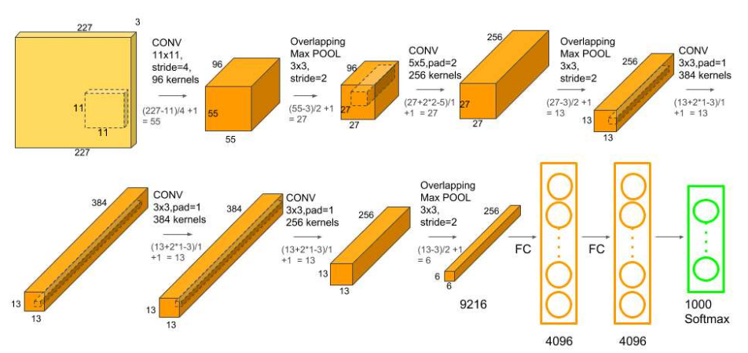

Increasing the number of channels enhances the model's representational power, allowing it to build complex features from simple ones. Random initialization and data-driven learning make each channel specialize in different patterns, forming complementary detectors that encode full image information.

**VGG16**:

- The number of filters increases with depth.
- It uses stacked 3×3 convolutions (2 or 3 in a group).
- Stacking small filters achieves the same receptive field as a larger filter (e.g., 2×3×3 = 1×5×5).

1. More ReLU operations → stronger non-linearity → more powerful model.
2. Fewer parameters (e.g., 3×3×3=27 vs. 7×7=49), which reduces computation and overfitting risk

**GoggleNet**

Key features: inception units, batch normalization, image distortions(augmentation), RMSprop
key solution to:

1. Very deep networks are prone to overfitting due to the large number of parameters
2. Naively stacking large convolution operations is computationally expensive: if two convolutional layers are chained, any uniform increase in the number of their filters results in a quadratic increase of computation
make network wider instead of deeper having filters of multiple sizes operating at the same level (Use padding to make sure filter outputs have same size.)
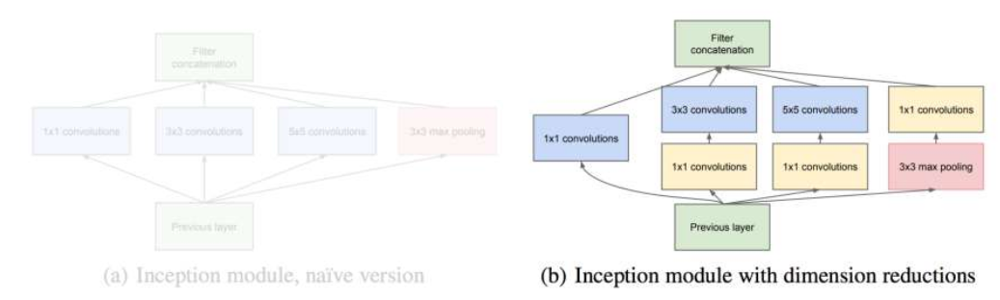
This naive version of the Inception unit is very expensive! use 1x1 convolutions to limit the number of channels

- The wide multi-branch architecture fuses multi-scale features for stronger feature representation.
- 1×1 convolutions serve as bottlenecks to reduce computation. Global average pooling removes heavy fully connected layers, making the deep network lightweight.

**ResNet**

The residual module Introduce skip or shortcut connections
Make it easy for network layers to represent the identity mapping

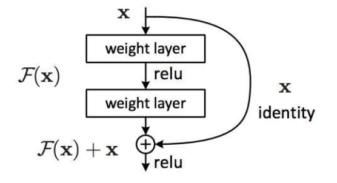

Interpreting ResNets: ResNet has multiple paths with different lengths due to skip connections. Short paths dominate training because they effectively avoid gradient vanishing.

**FractalNet**

good performance relies on the coexistence of shallow and deep paths, rather than residual connections.

**Stochastic depth**

randomly drops entire residual blocks during training, while all blocks are active at inference. It creates short paths to avoid gradient vanishing, reduces training cost, and improves generalization by training an ensemble of sub-networks with different depths

**Use a trained network for a new task**

- Treat activations from fully connected layers as fixed features, and only train a new classifier.
- Fine-tune the entire network together with the new classifier for better adaptation.

**Summary**

- CNN use convolutions to exploit grid structure
- Parameters sharing and sparse connections allow toscale to larger inputs
- Pooling introduces invariance to transformations
- Modern architectures use several tricks to increase depth and reduce computational cost

### Recurrent Neural Networks (RNN)

Modeling the temporal dependences.Transition matrix:$f(S_t) = f(S_{t-1},X_t)$ if we have $X_t$

**Input representation**

- one-hot
- embedding

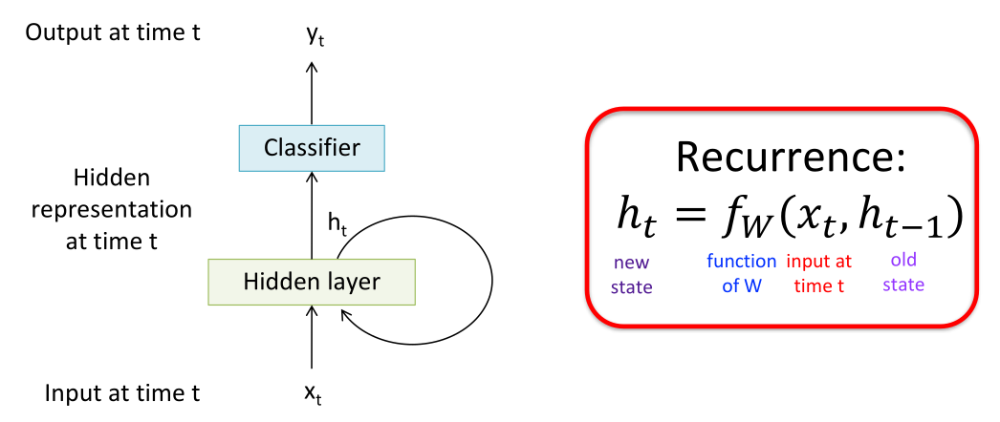

Vanilla RNN Cell:
$$
h_t = \tanh\left( W \begin{pmatrix} x_t \\ h_{t-1} \end{pmatrix} + b \right) = \tanh(W_xx_t + W_hh_{t-1})
$$
$$
\frac{d}{da}\tanh(a) = 1 - \tanh^2(a)
$$
Tanh is zero-centered with a wider useful gradient range. It stabilizes hidden states and eases gradient vanishing in RNNs.

**BPTT**

- The weight updates are computed for each copy in the unfolded network, then summed (or averaged) and applied to the RNN weights
- In practice, truncated BPTT is used: run the RNN forward k1 time steps, propagate backward for k2 time steps
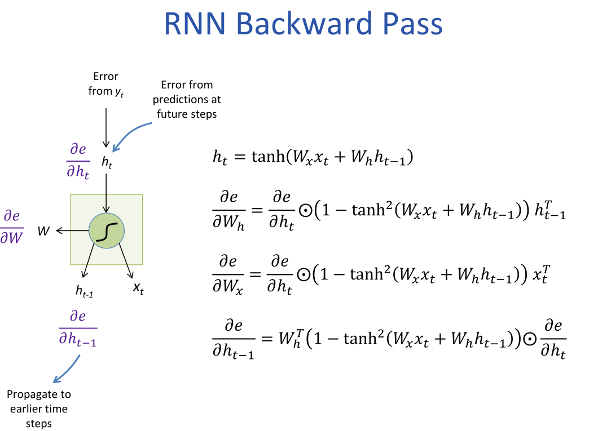
For long sequences, this is a problem Vanishing/exploding gradients (Gradients will vanish if
largest singular value of $W_h$ is less than 1)

**LSTM & GRU**

Both are **gated RNN variants** using gates to control information flow, solve long-term dependency and gradient vanishing problems.

**LSTM**

Has **3 gates** and a long-term memory called **cell state Ct**.

- Forget gate: decide what old info to drop
- Input gate: decide what new info to store
- Output gate: decide what to output to hidden state

$$
f_t = \sigma(W_f [h_{t-1}, x_t] + b_f)
$$
$$
i_t = \sigma(W_i [h_{t-1}, x_t] + b_i)
$$
$$
o_t = \sigma(W_o [h_{t-1}, x_t] + b_o)
$$
$$
\tilde{C}_t = \tanh(W_C [h_{t-1}, x_t] + b_C)
$$
$$
C_t = f_t \odot C_{t-1} + i_t \odot \tilde{C}_t
$$
$$
h_t = o_t \odot \tanh(C_t)
$$

**GRU**

Simplified LSTM with **2 gates only**, no separate cell state. Faster to train.

- Reset gate: control how much past info to forget
- Update gate: control how much old state to keep & new info to add

$$
% Gates
r_t = \sigma(W_r [h_{t-1}, x_t] + b_r)
$$
$$
z_t = \sigma(W_z [h_{t-1}, x_t] + b_z)
$$
$$
% Candidate hidden state
\tilde{h}_t = \tanh(W_h [r_t \odot h_{t-1}, x_t] + b_h)
$$
$$% Update hidden state
h_t = (1-z_t) \odot h_{t-1} + z_t \odot \tilde{h}_t
$$

## attention & transforemer

attention is not first intro from transformer
Two pain points: **long-range dependency problem** and **lack of parallelism**.Transformer uses self-attention and parallel computation to fix them, plus positional encoding for order.

**Sequence to Sequence with RNNs : Encoder - Decoder**
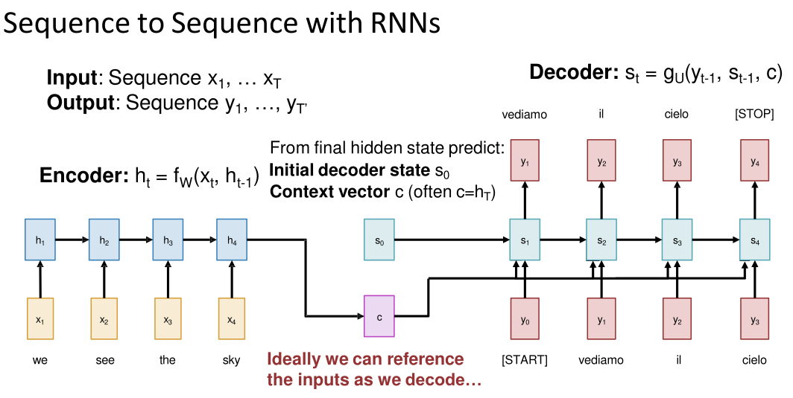
During Training:
Often, we use the “correct” token state even if the model is wrong. Called teacher forcing
During Test-time:
from the model’s outputs until we sample [STOP]

Input sequence bottlenecked through fixed-sized vector. What if T=1000?
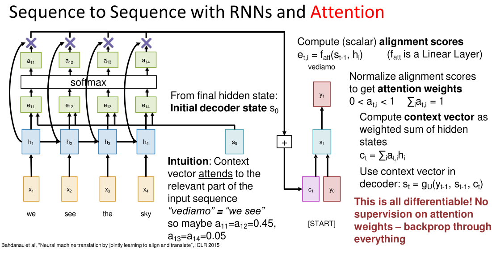
Repeat: Use s1 to compute new context vector c2
Compute (scalar) alignment scores $e_{t,i} = f_{att}(s_{t-1}, h_i)$($f_{att}$ is a Linear Layer)
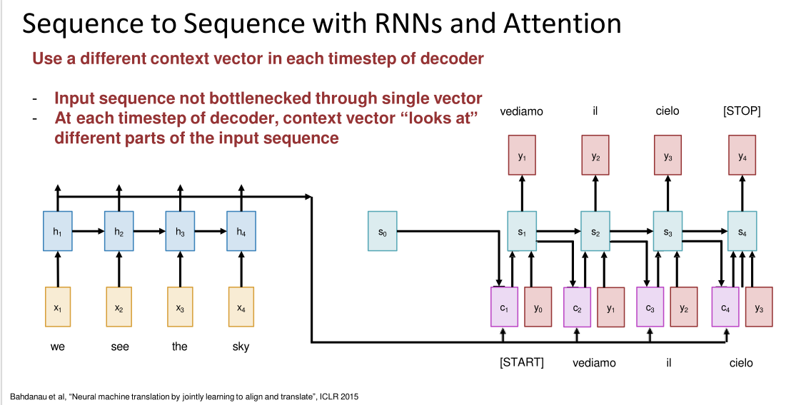

**Attention RNN for image captining：**

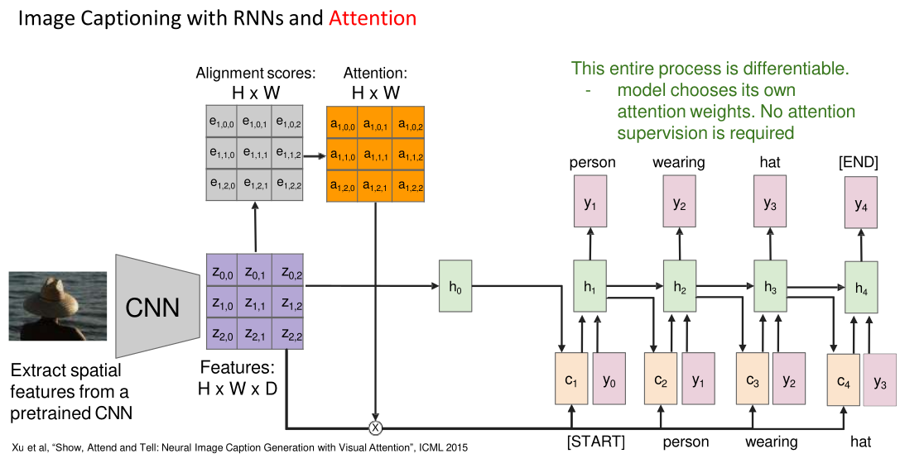
Each timestep of decoder uses a different context vector that looks at different parts of the input image

**General attention layer**

- attention operation is permutation invariant.
- Change fatt(.) (the function to get alignment) to a dot product, this actually can work well in practice: Dot product increases logit variance, causing softmax to become too sharp. Dividing by D stabilizes the distribution, similar to Xavier/Kaiming initialization.
- Multiple query vectors: each query creates a new, corresponding output context vector (Allows us to compute multiple attention context vectors at once)
- input vectors are used for both the alignment as well as the attention calculations. (We can add more expressivity to the layer by adding a different FC layer before each of the two steps.)

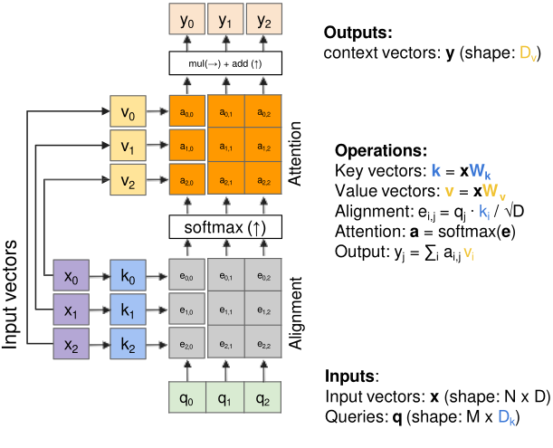

**Self-attention**
leverages the strengths of attention layers without the need for separate query vectors.

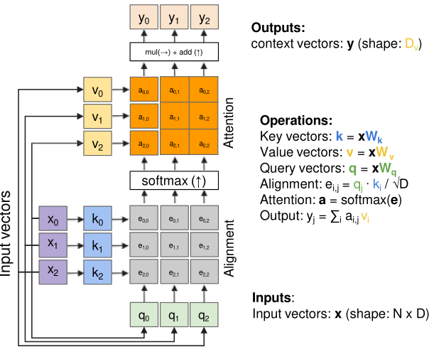

$$
[x_0,x_1,x_2]\rightarrow[self-attention]\rightarrow[y_0,y_1,y_2]
$$

**Positional encoding**

The attention block in the transformer is invariant to the permutation of Key/Values for a give query.
Positional embedding: a function mapping positions (of words) into vectors

- It should output a unique encoding for each time-step (word’s position in a sentence)
- Distance between any two time-steps should be consistent across sentences with different lengths.
- The model should generalize to longer sentences without any efforts. Its values should be bounded.
- It must be deterministic.

$$
\overrightarrow{p}_t^{(i)} = f(t)^{(i)} := \begin{cases}\sin(\omega_k \cdot t), & \text{if } i = 2k \\ \cos(\omega_k \cdot t), & \text{if } i = 2k + 1\end{cases}, \text{ where }\omega_k = \dfrac{1}{10000^{2k/d}}
$$

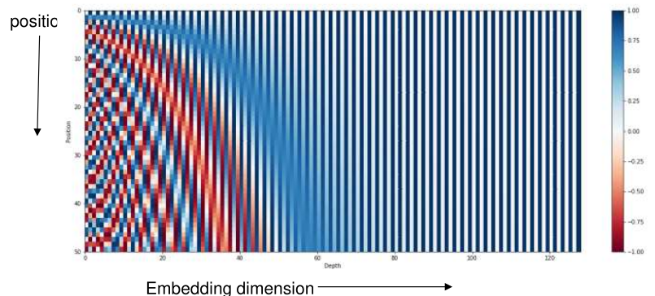

- Frequencies decreasing along depth for the give position. This is consistent with the trend in the positional binary coding.
- It allows the model to attend relative positions effortlessly. since for any fixed offset k, PEpos+k can be represented as a linear function of PEpos

[details and proof](https://blog.timodenk.com/linear-relationships-in-the-transformers-positional-encoding/)

We can Add the positional embedding to the token embedding, requires the same number of the dimensions; or Concatenate the positional embedding to the token embedding, dimensions can be different, however, require more memory spaces

positional encoding could also be learnable (but it is difficult to handling squences longer than that seen in training.)

some other positional encoding:
Relative positional encodings for text (by Shaw et al 2018) and for image (Bello etal 2019).
Complex-value encodings (wang et al 2019). Rotary encodings in Roformer (Su et al 2021)
Conditional positional encoding ( Chu et al, ICLR2023).

**Masked self-attention layer**

A self-attention module with masks to block future positions, ensuring each token only attends to preceding elements, widely used in sequence generation.

**Multi-head self-attention layer**

Splits attention into multiple parallel heads to capture diverse types of contextual relationships and enrich feature representation.

**Transformer**

combine all of above together
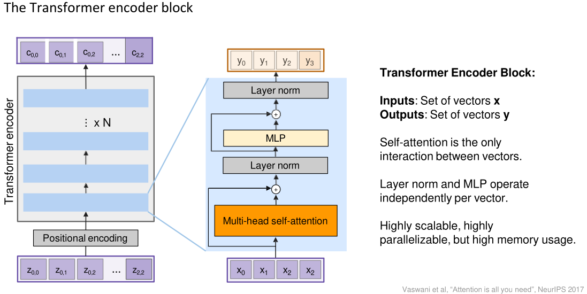
Layer Normalization:It normalizes values across feature dimensions of each token, keeping distribution stable and preventing gradients from becoming too small during backpropagation.
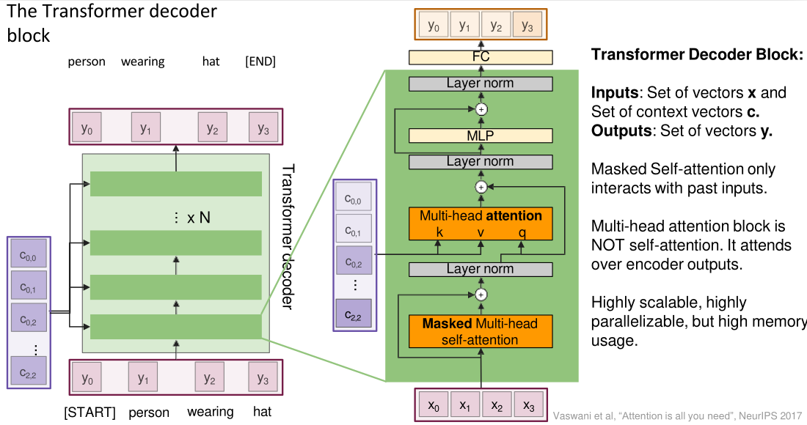
there could be more MLP (parallel) after LN

Transformers are a type of layer that uses self-attention and layer norm.
- It is highly scalable (could parallelize) and highly parallelizable
- Faster training, larger models, better performance across vision and language tasks
- They are quickly replacing RNNs, LSTMs, and may(?) even replace convolutions.

## Vision Transformers (ViT)

- Add attention to existing CNNs did not replace convolution entirely
- Replace Convolution with “Local Attention”: Lots of tricky details, hard to implement, only marginally better than ResNets
- Standard Transformer on Pixels: Memory intensive

VIT: Standard Transformer on Patches
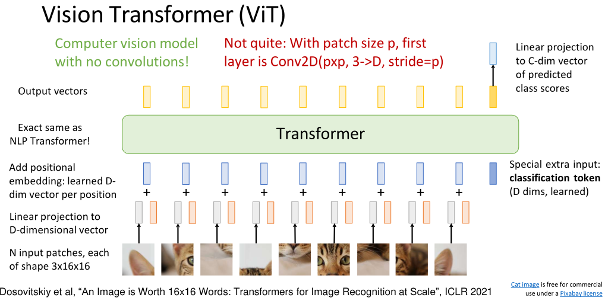

**Improving ViT**

Regularization for ViT models:

- Weight Decay
- Stochastic Depth
- Dropout (in FFN layers of Transformer)
Data Augmentation for ViT models:
- MixUp
- RandAugment
Distillation:
Train a teacher model on images and ground-truth labels
Train a student model to match predictions from the teacher (sometimes also to match GT labels)
(Add a distillation woken as Classification token, to predict class scores; should match teacher)

**Hierarchical ViT: Swin Transformer**

Standard ViT uses an isotropic design with fixed resolution and channels, which lacks the multi-scale hierarchical feature extraction of CNNs. Thus researchers propose hierarchical ViT to introduce resolution downsampling and channel expansion, just like CNNs, to better handle multi-scale objects in images.
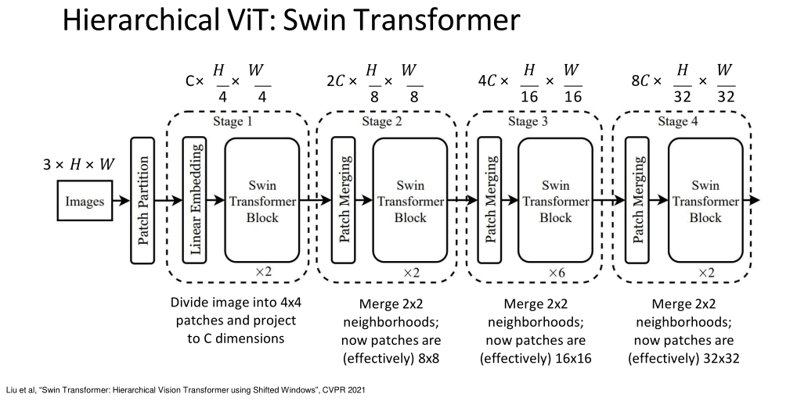

**[Window attention & Shifted window attention](https://blog.csdn.net/weixin_43135178/article/details/118696021)**

don’t use full attention, instead use attention over patches
tokens only interact with other tokens within the same window; no communication across windows -> Shifted Window Attention

$$
\operatorname{SW-Attention}(Q,K,V) = \operatorname{Softmax}\left(\frac{QK^\top}{\sqrt{d}}+B+M\right)V
$$

**teacher's takeaway**

Vison transformers are an evolution, not a revolution. Main benefit is probably speed

## **Self-Supervised Learning**

Model is trained to predict some naturally-occurring signal in the raw data rather than human annotations. Model learn some underlying hidden structure of the data

Pretrain a network on a pretext task that doesn’t require supervision, and Transfer encoder to downstream tasks via linear classifiers, KNN, finetuning. Goal: Pretrain + Transfer does better than
supervised pretraining, and better than directly training on downstream

- **Generative**: Predict missing input content
    AutoEncoder (sparse/denoising/masked), Autoregressive, GANs, Colorization, Inpainting
- **Discriminative**: Predict input attributes
    Context prediction, Rotation, Clustering, Contrastive learning
- **Multimodal**: Combine RGB with other signals
    Video, 3D, Sound, Language

**AE**

Autoencoders are data-dependent, lossy in reconstruction, and can learn representations automatically from training samples.

Autoencoder tries to reconstruct inputs. Hidden layer (hopefully) learns good representations
H < D is the only thing forcing non-trivial hidden representations

**sparse AE**

(H > D)Sparse autoencoders map inputs to a **high-dimensional hidden layer** and apply sparsity constraints. The constraints keep the average activation of most neurons low, so only a small number of neurons are activated to learn meaningful features.

Many ways to implement sparsity penalties. Sparse activation means only a few neurons fire. Such features correspond to distinct visual patterns, thus being more interpretable.

**Denoising AE**

reconstruct the clean version of the noisy inputs

**VAE (variational AE)**: Next part

**Context Prediction**

Two networks with shared weights sometimes called a ”Siamese network”

Extension: Solving Jigsaw Puzzles
The image is split into 9 patches and shuffled. The model takes these patches as input and predicts their correct permutation via fully connected layers.

**Context Encoders**
Learning by Inpainting: Input -> Encoder -> Decoder -> output

**Colorization**
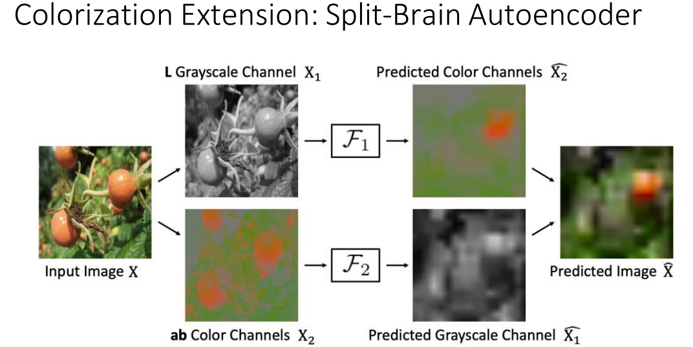
Generative pretext tasks force the model to learn trivial pixel-level details (e.g., precise color tones) that are useless for downstream tasks. Split-Brain Autoencoder solves this by predicting one set of image channels from another, focusing on meaningful cross-channel relations instead of exact pixel reconstruction.

**Deep Clustering**
Deep Clustering jointly learns data representations and cluster assignments via neural networks. It uses an autoencoder to compress input into low-dimensional features, then iteratively clusters features (e.g., K-means) and trains the network with cluster-based loss, grouping similar samples without labels.

It is hard to fairly compare SSL methods due to diverse experimental settings, including network architectures, datasets, evaluation protocols and hyperparameters.

### Contrastive representation learning

[awesome blog](https://zhuanlan.zhihu.com/p/346686467)

SimCLR, MOCO, MAE, CLIP(modality contrastive learning)

pretext tasks are built on image transformations, yet their learned representations are task-specific. Researchers aim to design more general pretext tasks for better feature transfer.

**Formulation**:

$$
score(f(x),f(x^+))>>score(f(x),f(x^-))
$$
we aim to learn an encoder function f that yields high score for positive pairs $(x, x^+)$ and
low scores for negative pairs $(x, x^-)$.

**InfoNCE loss**

$$
L_{InfoNCE}=−E_x[log\frac{exp(f(x,y))}{exp(f(x,y))+∑_{i=1}^{N−1}exp(f(x,yi))}]
$$

Looks like Cross entropy loss for a N-way softmax classifier!

Minimizing the InfoNCE loss is equivalent to maximizing the lower bound of mutual information between two variables.

[proof](https://blog.csdn.net/iiiiii11/article/details/154584585)

$$
I(X;Y)≥log(N)−L_{InfoNCE}
$$

[Variational Bounds on Mutual Information](https://m-wiesner.github.io/Variational-Bounds-on-Mutual-Information/)

[Mathematical Foundations of Contrastive Loss](https://ekbanaml.github.io/applied%20machine%20learning/mathematical-foundation-contrastive-loss/)

**SimCLR**

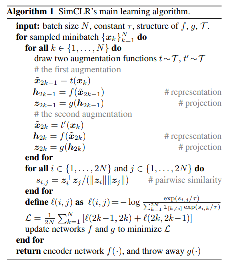

- Projection head: Linear or non-linear projection heads boost representation learning. The contrastive loss may drop useful features; the head keeps more information in the encoder output space.
- Large batch size: Large batches are essential for SimCLR, but bring high memory cost, requiring distributed training with TPUs.
- For any sample in a batch of 2N augmented views, there is **only 1 positive pair** and 2N−2 negatives.
- Drawbacks: extreme positive-negative imbalance, heavily relies on large batch size and high computing resources.

**MOCO**

Momentum Contrastive Learning

- Keep a running queue of keys (negative samples).
- Compute gradients and update the encoder only through the queries. (The key encoder disables gradient computation to maintain stable negative samples in the queue and ensure steady training.)
- Decouple min-batch size with the number of keys: can support a large number of negative samples.
- The key encoder is slowly progressing through the momentum update rules:

$$
\theta_k\leftarrow m\theta_k+(1-m)\theta_q
$$

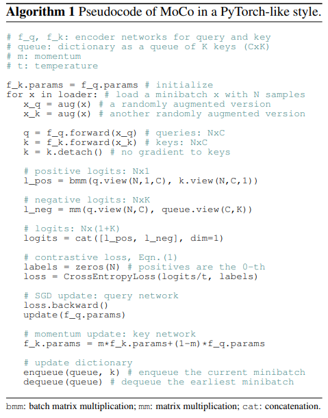

**MOCO V2**

combine SimCLR & MoCo

- From SimCLR: non-linear projection head and strong data augmentation.
- From MoCo: momentum-updated queues that allow training on a large number of negative samples (no TPU required!).

**MAE**

A old method dethrones contrastive learning. Denoising Autoencoder with Vision Transformer

input (full image) → patch embedding → shuffle & mask (keep 25%) → Encoder (ViT) (only visible patches) → concat mask tokens → unshuffle (restore original order) → add full positional embedding → Decoder (light ViT) → output (reconstruct image) → MSE loss on masked patches

**Multimodal Self-Supervised Learning**

Video, Sound, 3D, Language

**CLIP**

- ${v_i}$: Image feature vector of the i-th image
- ${t_j}$: Text feature vector of the j-th text
- $L_{I→T}$: Loop over every **row** (each image), treat all texts in the batch as candidates.
- $L_{T→I}$: Loop over every **column** (each text), treat all images in the batch as candidates.

$$
S_{ij} = v_i \cdot t_j
$$

$$
\mathcal{L}_{\text{InfoNCE}} = -\frac{1}{N}\sum_{i=1}^N \log\frac{e^{S_{ii}/\tau}}{\sum_{j=1}^N e^{S_{ij}/\tau}}
$$

$$
\mathcal{L} = \mathcal{L}_{I \to T} + \mathcal{L}_{T \to I}
$$

$$
\min \mathcal{L}_{\text{InfoNCE}} \iff \max \; \text{lower bound of } I(v;t)
$$

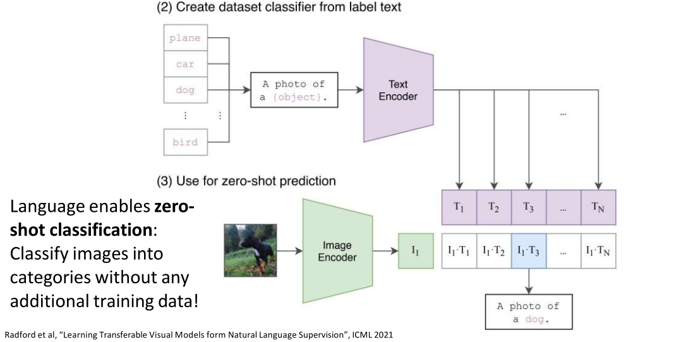

## VAE & GAN

### VAE

We can use autoencoders for data generation via latent code z. However, standard autoencoders do not regularize the distribution of z, so we cannot easily sample valid latent codes.

Instead of outputting a single latent vector, VAE produces a Gaussian distribution  $N(\mu,\sigma)$. It models the latent distribution for each input $x$. Then, we can sample a representation/code $z$ from $q_θ(z∣x)$(where the subscript θ means that the probability is parametrised by θ), the decoder is another NN like $p_ϕ(x∣z)$

**Loss**

loss function for i-th datapoint - the total loss is the sum of all the $l_i$

- $\log p_ϕ(x∣z)$ measure the information loss from low demention z to high demention x, This term encourages decoder to learn to reconstruct the data.
- KL  divergence is regularisation term - measures how close q is to p, This make sure the encoder doesn’t cheat and map each datapoint in different regions of the space

$$
l_i(\theta, \phi) = -\mathbb{E}_{z \sim q_\theta(z|x_i)}\left[\log p_\phi(x_i|z)\right] + KL\left(q_\theta(z|x_i) \parallel p(z)\right)
$$

The prior distribution of latent variables is set to standard Gaussian distribution $\mathcal{N}(0,1)$. The model regularizes the encoded distribution to approach the prior, forming a continuous and smooth latent space for new sample generation.

[KL divergence](https://s-ai-unix.github.io/posts/2026-02-03-kl-divergence-information-theory/)

**variational**

In this context, learning is called inference
> Variational inference is an approximate method in probabilistic machine learning. The true posterior distribution $p(z∣x)$ is intractable due to high-dimensional integration ($p(x)=∫p(x∣z)p(z)dz$).

Objective: maximize $\log p(x)$

**probabilistic perspective**

we use a simple, parameterized distribution $q_\lambda(z∣x)$ to approximate $p(z∣x)$. Minimize the KL divergence $\mathrm{KL}\big(q_\lambda(z\mid x) \parallel p(z\mid x)\big)$  to perform variational inference, which leads to the ELBO objective.

$$
\mathrm{KL}\big(q_\theta(z\mid x) \parallel p(z\mid x)\big) = \mathbb{E}_{q_\theta(z\mid x)}\left[\log\frac{q_\theta(z\mid x)}{p(z\mid x)}\right]
$$
Substitute Bayes' rule
$$
p(z\mid x) = \dfrac{p(x\mid z)p(z)}{p(x)}
$$
$$
\mathrm{KL}\big(q_\theta(z\mid x) \parallel p(z\mid x)\big) = \mathbb{E}_{q_\theta(z\mid x)}\big[\log q_\theta(z\mid x)\big] - \mathbb{E}_{q_\theta(z\mid x)}\big[\log p(x\mid z)\big] - \mathbb{E}_{q_\theta(z\mid x)}\big[\log p(z)\big] + \log p(x)
$$
Rearrange to get ELBO
$$
\log p(x) = \underbrace{\mathbb{E}_{q_\theta(z\mid x)}\big[\log p(x\mid z)\big] - \mathrm{KL}\big(q_\theta(z\mid x) \parallel p(z)\big)}_{\text{ELBO}} + \mathrm{KL}\big(q_\theta(z\mid x) \parallel p(z\mid x)\big)
$$
Optimization target: minimize KL $\iff$ maximize ELBO Final loss (negative ELBO):
$$
\mathcal{L}(\theta,\phi) = -\mathbb{E}_{z\sim q_\theta(z\mid x)}\big[\log p_\phi(x\mid z)\big] + \mathrm{KL}\big(q_\theta(z\mid x) \parallel p(z)\big)
$$
Maximising ELBO means 1) q close to p and 2) higher p (better generator)

**Generative / Reconstruction Perspective**

We maximize the evidence lower bound to indirectly optimize the log-likelihood of observed data.

prof. jianguo's scripts

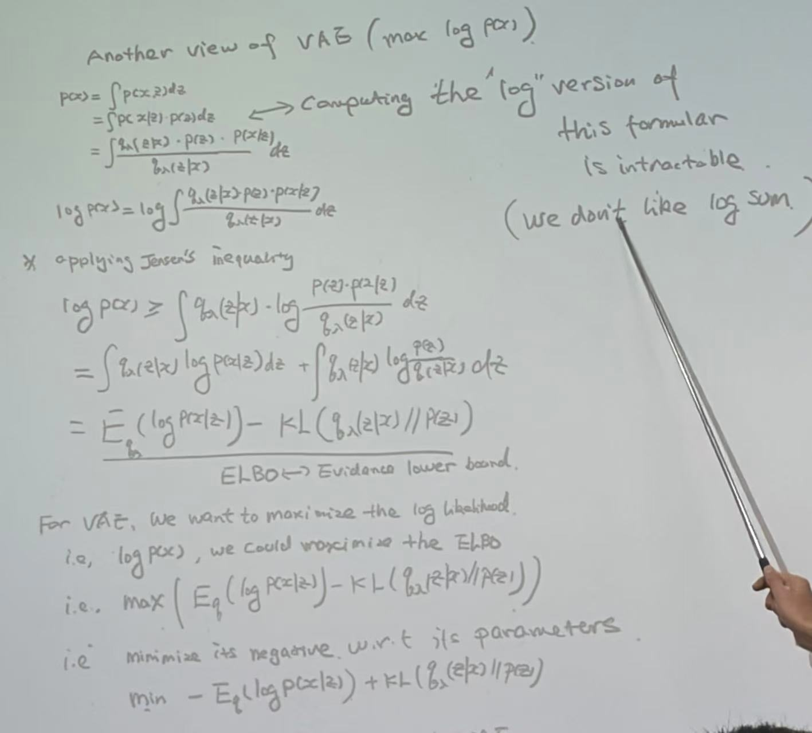

### GAN

Generative adversarial networks: can we learn just the generator?
- GANs propose to learn the loss function
- The training process is a game between two networks

- Generator: learns to generate samples
- Discriminator: learns to distinguish between generated and real samples
- Adversarial training: the generator tries to fool the discriminator while the discriminator tries to get better at distinguishing fake vs real images. When the discriminator spots a fake the generator adjusts its parameters, until at the end the generator reproduces the true data distribution and the discriminator is unable to find differences
Note: both the generator and the discriminator need to be differentiable

**minimax strategy**

$$
\min_{G} \max_{D} V(D,G) = \mathbb{E}_{x \sim p_{\text{data}}} \big[\log D(x)\big] + \mathbb{E}_{z \sim p_z} \big[\log\big(1-D(G(z))\big)\big]
$$

| Symbol      | Meaning                                                                                  |
| ----------- | ---------------------------------------------------------------------------------------- |
| $D$         | Discriminator network, outputs a value in [0,1]: probability that the input is real data |
| $G$         | Generator network, maps random noise z to fake samples                                   |
| $p_{data}$ | Distribution of real training data                                                       |
| $p_z$      | Prior distribution of latent noise (usually standard Gaussian)                           |
| $E[⋅]$      | Expectation, calculates the average value over sampled data                              |


Gradient ascent for discriminator to tell real and fake samples apart.
$$
D^* = \arg\max_D V(G,D)
$$
Theoretical gradient descent for generator to fool discriminator.
$$
G^* = \arg\min_G \mathbb{E}_{z\sim p_z}\big[\log(1-D(G(z)))\big]
$$
Practical gradient ascent to avoid gradient vanishing.
$$
G^* = \arg\max_G \mathbb{E}_{z\sim p_z}\big[\log D(G(z))\big]
$$


**Problems**

- Finite sample size: training set is finite, not the full distribution
- Limited capacity: the generator has limit capacity, i.e. cannot perfectly represent any distribution
- Optimisation errors: optimisers can get stuck in local optima or never exactly converge to global optima
- Saddle point problem: harder than finding a maximum or minimum
- Balancing updates: D too weak/strong means no gradient for G to improve

**CGAN (conditioanl GAN)**

$$
G(z,c),\ D(x,c)
$$
Both generator and discriminator take an additional condition embedding $c$ to perform conditional generation.
$$\min_G\max_D V(D,G) = \mathbb{E}_{x,c}[\log D(x,c)] + \mathbb{E}_{z,c}[\log(1-D(G(z,c),c))]
$$
The GAN objective is conditioned on $c$, guiding the model to generate samples matching the given condition.

## diffusion model

[Awsome blog](https://lilianweng.github.io/posts/2021-07-11-diffusion-models/)(Weng, Lilian. (Jul 2021). What are diffusion models? Lil’Log.)

[A good blog](https://blog.csdn.net/m0_59012280/article/details/155040575)

- Idea: Estimating and analyzing small step sizes is more tractable/easier than a single step from random noise to the learned distribution.
- Convert a well-known and simple base distribution (like a Gaussian) to the target (data) distribution iteratively, with small step sizes, via a Markov chain:

- Denoising diffusion models consist of two processes:
  - Forward diffusion process that gradually adds noise to input
  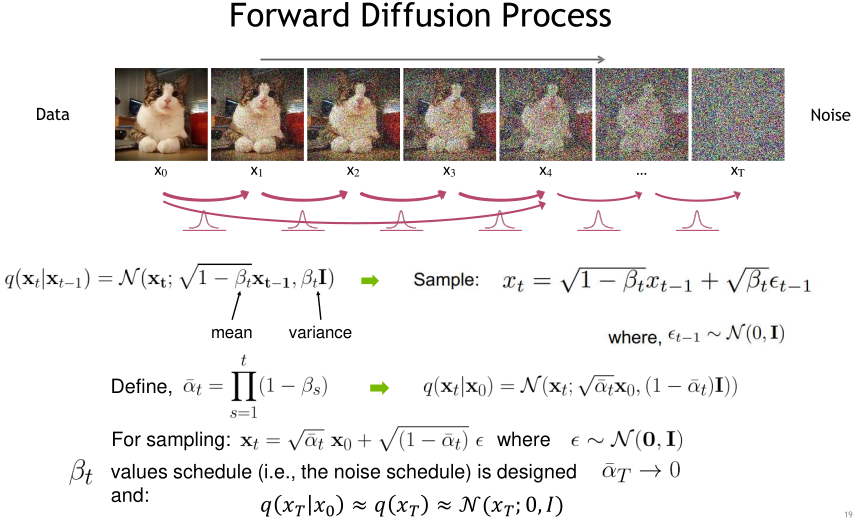

$$
q(\mathbf{x}_t) = \int q(\mathbf{x}_0) q(\mathbf{x}_t|\mathbf{x}_0) d\mathbf{x}_0
$$
we can Sample clean data:
$$
\mathbf{x}_0 \sim q(\mathbf{x}_0)
$$
, then sample diffused data:
$$
\mathbf{x}_t \sim q(\mathbf{x}_t|\mathbf{x}_0) = \sqrt{\bar{\alpha}_t}\mathbf{x}_0 + \sqrt{1-\bar{\alpha}_t}\epsilon
$$

- Reverse denoising process that learns to generate data by denoising Generative Learning by Denoising: At $t=T$, the distribution becomes pure noise:

$$
q(\mathbf{x}_T) \approx \mathcal{N}(\mathbf{x}_T; \mathbf{0}, \mathbf{I})
$$
We can sample noise:
$$
\mathbf{x}_T \sim \mathcal{N}(\mathbf{0}, \mathbf{I})
$$
then Iteratively denoise:
$$
\mathbf{x}_{t-1} \sim q(\mathbf{x}_{t-1}|\mathbf{x}_t)
$$
Since $q(\mathbf{x}_{t-1}|\mathbf{x}_t)$ is unknown, we approximate it with a normal distribution (valid when${\beta_t \in (0,1)}_{t=1}^T$ is small). so
$$
p_\theta(\mathbf{x}_{t-1} \mid \mathbf{x}_t) = \mathcal{N}\big(\mathbf{x}_{t-1}; \boldsymbol{\mu}_\theta(\mathbf{x}_t, t), \boldsymbol{\Sigma}_\theta(\mathbf{x}_t, t)\big)
$$
In practice, $Σ$ is set to $\sigma_t^2I$ ($\sigma_t$ as hyperparameter), so we only need to learn the mean of the distribution

**Training a Diffusion Model**

Objective: learn $p_\theta(\mathbf{x}_{t-1} \mid \mathbf{x}_t)$, more precisely $\boldsymbol{\mu}_\theta(\mathbf{x}_t, t)$ (by U-net)

GT (Posterior Distribution): $q(\mathbf{x}_{t-1} \mid \mathbf{x}_t,\mathbf{x}_0) = \mathcal{N}\big(x_{t-1}; \hat{\boldsymbol{\mu}}_t(x_t, x_0), \hat{\beta}_t \mathbf{I}\big)$, where $\tilde{\mu}_t(x_t, x_0) = \frac{\sqrt{\alpha_t}(1-\bar{\alpha}_{t-1})x_t + \sqrt{\bar{\alpha}_{t-1}}\beta_t x_0}{1-\bar{\alpha}_t}$ and $\tilde{\beta}_t = \frac{1-\bar{\alpha}_{t-1}}{1-\bar{\alpha}_t}\beta_t$

by bayesian
$$
q(x_{t-1} \mid x_t, x_0) = \frac{q(x_t \mid x_{t-1}) \, q(x_{t-1} \mid x_0)}{q(x_t \mid x_0)}
$$
$$
q(x_t \mid x_{t-1}) = \mathcal{N}(x_t; \sqrt{\alpha_t}x_{t-1}, \beta_t I), \quad \alpha_t = 1-\beta_t
$$
$$
  q(x_t \mid x_0) = \mathcal{N}(x_t; \sqrt{\bar{\alpha}_t}x_0, (1-\bar{\alpha}_t)I), \quad \bar{\alpha}_t = \prod_{i=1}^t \alpha_i
$$

Loss (KL divergence, ELBO) or simply align $\mu_\theta \ \& \ \tilde{\mu}_t \text{ with MSE}$ (this two is equivalent for $L_{t-1}$):
$$
\mathbb{E}_q\left[ \underbrace{D_{\text{KL}}\big(q(x_T|x_0) \parallel p(x_T)\big)}_{L_T} + \sum_{t>1} \underbrace{D_{\text{KL}}\big(q(x_{t-1}|x_t,x_0) \parallel p_\theta(x_{t-1}|x_t)\big)}_{L_{t-1}} - \underbrace{\log p_\theta(x_0|x_1)}_{L_0} \right]
$$
$$
L_{t-1} = \mathbb{E}_q\left[ \frac{1}{2\sigma_t^2} \left\| \tilde{\mu}_t(x_t, x_0) - \mu_\theta(x_t, t) \right\|^2 \right] + C
$$

and also, We can get

$$
\tilde{\mu}_t(x_t, x_0) = \frac{\sqrt{\alpha_t}(1-\bar{\alpha}_{t-1})x_t + \sqrt{\bar{\alpha}_{t-1}}\beta_t x_0}{1-\bar{\alpha}_t} = \frac{1}{\sqrt{\alpha_t}}\left(x_t - \frac{\beta_t}{\sqrt{1-\bar{\alpha}_t}}\epsilon\right), \text{becuase } \mathbf{x}_t \sim q(\mathbf{x}_t|\mathbf{x}_0) = \sqrt{\bar{\alpha}_t}\mathbf{x}_0 + \sqrt{1-\bar{\alpha}_t}\epsilon
$$

so we can just predict the residual (the added noise) $\epsilon_\theta(x_t, t)$(by Unet)

**loss**

$$
L_{\text{simple}} = \mathbb{E}_{\mathbf{x}_0 \sim q(\mathbf{x}_0), \epsilon \sim \mathcal{N}(\mathbf{0}, \mathbf{I}), t \sim \mathcal{U}(1, T)} \left[ \left\| \epsilon - \epsilon_\theta\left( \underbrace{\sqrt{\bar{\alpha}_t} \mathbf{x}_0 + \sqrt{1-\bar{\alpha}_t} \epsilon }_{\mathbf{x}_t}, t \right) \right\|^2 \right]
$$

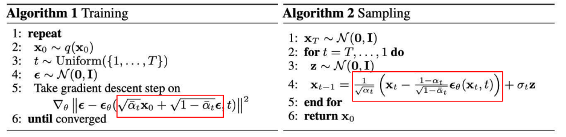

**But Why we just pridict the niose is OK?**

We can prove The noise-prediction objective is mathematically equivalent to optimizing the evidence lower bound (ELBO) of the log-likelihood, under the DDPM's Gaussian reverse process parameterization with fixed variances.

This is beyond the scope of this course, we can just look through the blog I cited

prof. jianguo's scripts

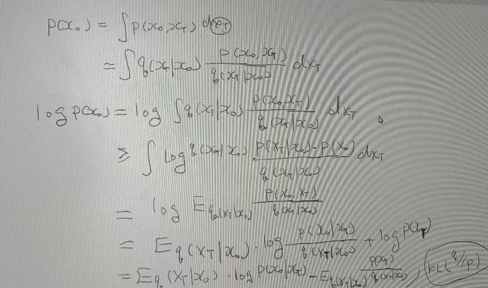

**Implementation**

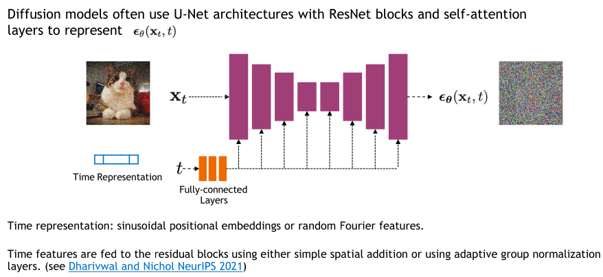

- In the forward diffusion, the high frequency content is perturbed faster.
- In reverse process: at small t The denoising model is specialized for generating the high-frequency content (i.e., low-level details), and at large t the denoising model is specialized for generating the low-frequency content (i.e., coarse content)
So The weighting of the training objective for different timesteps is important!

### **Conditional diffusion models**

Include condition as input to reverse process
The reverse process is modified into a conditional distribution:

$$
p_\theta(\mathbf{x}_{0:T}|\mathbf{c}) = p(\mathbf{x}_T)\prod_{t=1}^T p_\theta(\mathbf{x}_{t-1}|\mathbf{x}_t, \mathbf{c})
$$
At each step:
$$
p_\theta(\mathbf{x}_{t-1}|\mathbf{x}_t, \mathbf{c}) = \mathcal{N}\big(\mathbf{x}_{t-1}; \boldsymbol{\mu}_\theta(\mathbf{x}_t, t, \mathbf{c}), \boldsymbol{\Sigma}_\theta(\mathbf{x}_t, t, \mathbf{c})\big)
$$

The model's mean $\boldsymbol{\mu}_\theta$ and variance $\boldsymbol{\Sigma}_\theta$ both take the condition `c` as input.

- Condition Injection into U-Net - Scalar conditioning (e.g., class labels, style): Encode the scalar into a vector embedding, then inject it via spatial addition or adaptive group normalization (AdaGN).
- Image conditioning (e.g., sketches, masks): Concatenate the conditional image with the input image along the channel dimension.
- Text conditioning (e.g., prompts): - Single vector embedding: Use spatial addition or AdaGN. - Sequence of vector embeddings (e.g., word tokens): Use cross-attention.

**Classifier guidance: a tool for conditional generation**

Using the gradient of a trained classifier as guidance

Objective: To optimize the conditional distribution $p(x∣y)$ such that the generated samples x are both realistic and aligned with the condition y.

Denoising process can also be thought as:

- Using denoising U-Net to predict gradient
- Predicted noise as gradient to update $𝑥_t → 𝑥_{t−1}$
- Direction to clean image $∇𝑥_t \log 𝑞(𝑥_t | 𝑥_0)$ (the predicted “score function”)

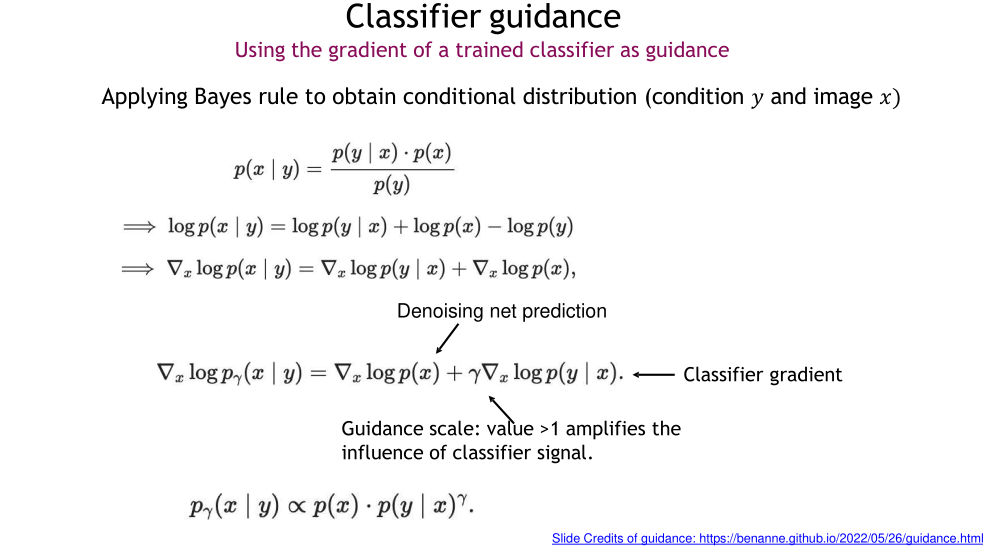

Need to train a separate ”noise-robust” classifier + unconditional diffusion model.
Gradient of the classifier w.r.t. input yields arbitrary values

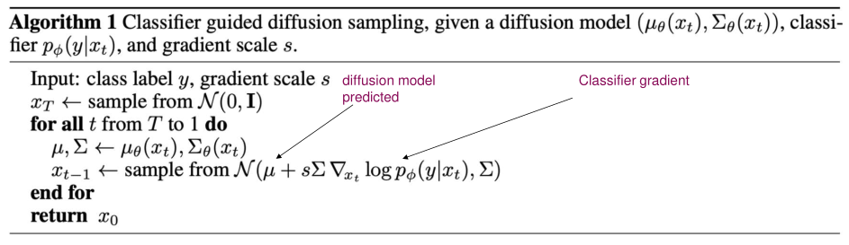

**CFG (Classier free guidance)**
CFG amplifies the difference between conditional and unconditional noise predictions from the same model to strengthen adherence to given conditions.
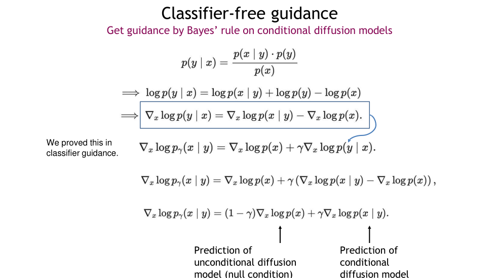
Train conditional & unconditional diffusion model jointly via drop-out.
All pixels in input receive equally ‘good’ gradients. (CG: Gradients concentrate on local regions only. Pixels get uneven & noisy gradients.)

**Some other application**
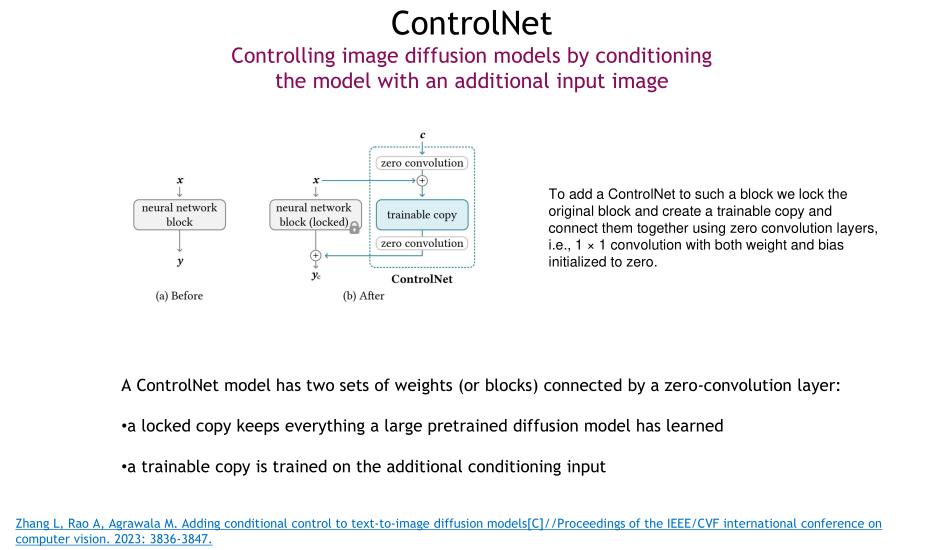


## Object Detection

Predict: bounding boxes, class labels, confidence scores
2 stage -> 1 stage -> other detectors

### Two-stage Detectors

**Multiple Objects**

- Multitask Loss (many things to predict), Each image needs a different number of outputs
- Problem: Need to apply CNN to huge number of locations, scales, and aspect ratios, very computationally expensive!

Region Proposals: Selective Search

**Intersection over Union (IoU)**

for evaluation

$$
\text{IoU} = \frac{\text{Intersection}}{\text{Union}}
$$

**Non-maximum suppression (NMS)**

Problem: Detectors often output many overlapping detections

Solution: Post-process raw detections using Non-Max Suppression (NMS)

```txt
1. Select next highest-scoring box
2. Eliminate lower-scoring boxes with IoU > threshold (e.g. 0.7)
3. If any boxes remain, GOTO 1
```

**Evaluating object detectors**

1. Run object detector on all test images (with NMS)
2. For each category, compute Average Precision (AP) or area under Precision vs. Recall Curve

$$
\text{𝑃𝑟𝑒𝑐𝑖𝑠𝑖𝑜𝑛} = \frac{\text{t𝑟𝑢𝑒 𝑝𝑜𝑠𝑖t𝑖𝑣𝑒 𝑑𝑒t𝑒𝑐t𝑖𝑜𝑛𝑠}}{\text{t𝑜t𝑎𝑙 𝑑𝑒t𝑒𝑐t𝑖𝑜𝑛𝑠 𝑠𝑜 𝑓𝑎𝑟}}
$$
$$
\text{𝑅𝑒𝑐𝑎𝑙𝑙} = \frac{\text{t𝑟𝑢𝑒 𝑝𝑜𝑠𝑖t𝑖𝑣𝑒 𝑑𝑒t𝑒𝑐t𝑖𝑜𝑛𝑠}}{\text{t𝑟𝑢𝑒 𝑝𝑜𝑠𝑖t𝑖𝑣𝑒 t𝑒𝑠t 𝑖𝑛𝑠t𝑎𝑛𝑐𝑒𝑠}}
$$
For each detection (highest to lowest score)
-If it matches some GT box with IoU > 0.5, mark it as positive and eliminate the GT
-Otherwise mark it as negative
-Plot a point on PR Curve

**Two-stage Detectors**

**R-CNN**

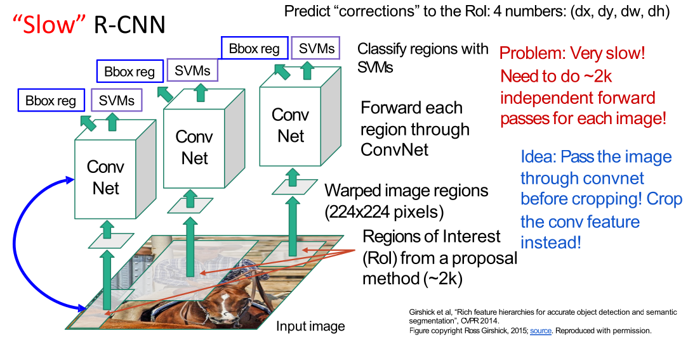

**Fast R-CNN**

Fast R-CNN still generates proposals on the original image, then uses RoI Pooling and RoI Align to crop corresponding regions from the feature map.

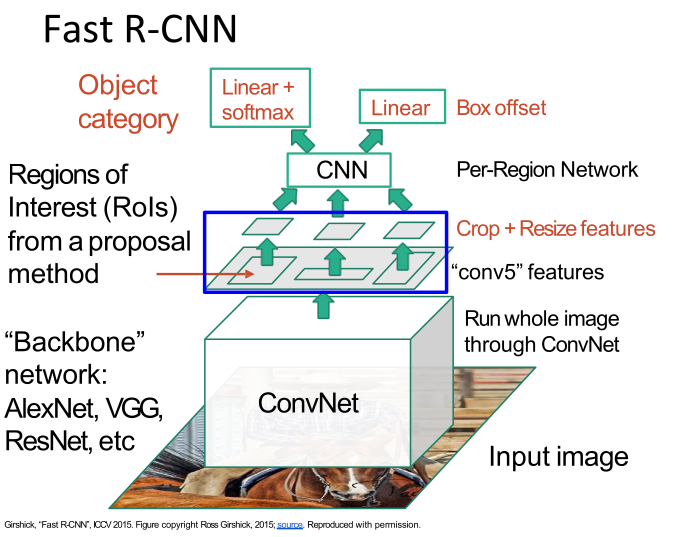

- RoI Pooling

1. First rounding：Align the coordinates of the RoI (from the original image) to integer pixel boundaries on the feature map.
2. Second rounding：When dividing the mapped RoI into a fixed number of bins, round the boundaries of each bin to integer coordinates.
3. Apply max pooling to each bin to obtain fixed-size region features.

- RoI Align
  Eliminates rounding errors entirely by using floating-point coordinates and bilinear interpolation to sample values at sub-pixel positions. The bilinear interpolation formula is:
  $$
  f_{xy} = \sum_{i,j=1}^2 f_{i,j} \max(0, 1 - |x - x_i|) \max(0, 1 - |y - y_j|)
  $$
  Then apply max pooling to the sampled values to obtain region features without spatial misalignment.

**Faster R-CNN**

RPN: The Region Proposal Network (RPN) generates object proposals on the shared feature map output by the CNN. It places multiple (K) multi-scale anchors at each spatial location, performing binary classification (foreground/background) and bounding-box regression to select ~300 high-quality foreground proposals for the subsequent RoI head.

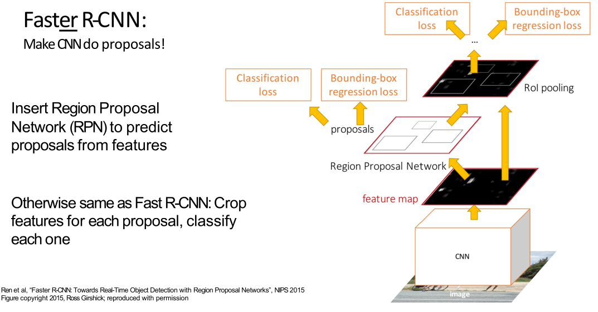

First stage: Run once per image

- Backbone network
- Region proposal network
Second stage: Run once per region
- Crop features: RoI pool / align
- Predict object class
- Prediction bbox offset

Jointly train with 4 losses:

1. RPN classify object / not object
2. RPN regress box coordinates
3. Final classification score (object classes)
4. Final box coordinates

### Single-Stage Object Detectors

put proposal generation and region classification together so that we can do detection in one-shot

Within each grid cell:

- Regress from each of the B base boxes to a final box with 5 numbers:
  $$(dx, dy, dh, dw, confidence)$$
- Predict scores for each of C classes (including background as a class)
- Looks a lot like RPN, but category-specific!
Output:
- 7 x 7 x (5 * B + C)

**YOLO**

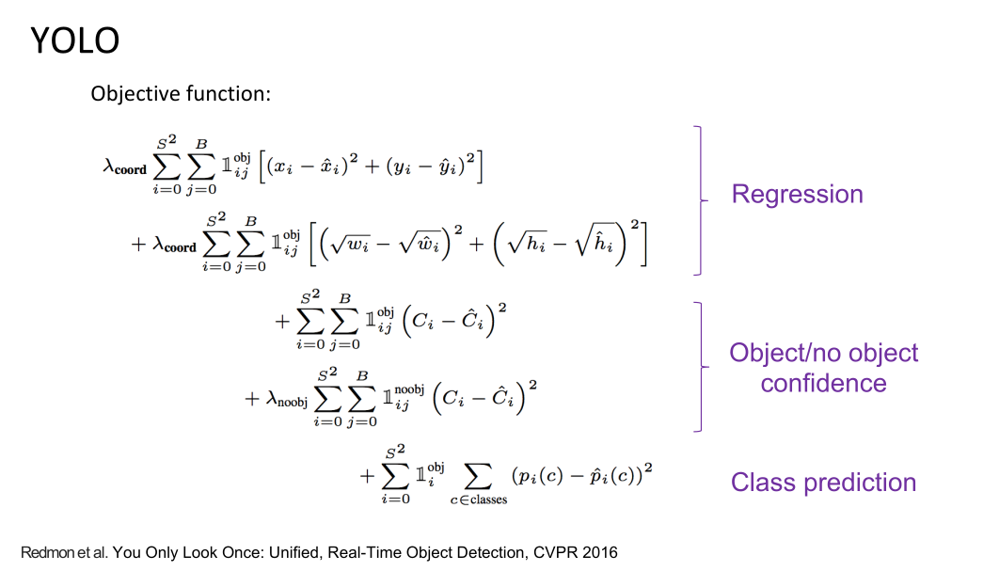

Each grid cell predicts only two boxes and can only have one class – this limits the number of nearby objects that can be predicted

**Multi-resolution prediction: SSD**

- Improve predictive power of lower-level feature maps by adding contextual information from higher-level feature maps
- Predict different sizes of bounding boxes from different levels of the pyramid (but share parameters of predictors)

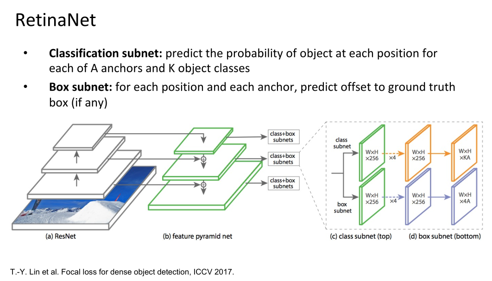

### Other Detectors

transformer based detector

**DETR (DEtection TRansformer)**

Basic idea:

- Extracting features using CNN backbone network;
- Learning global features using Transformer encoder;
- Generate prediction boxes using Transformer decoder;
- Match the prediction box with the ground truth box to calculate the loss;

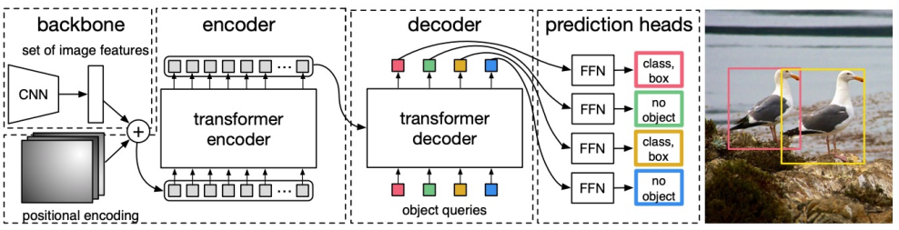

- Learning a fixed number of object queries using transformer decoder
- Predict one box and class for each query by FNN
- Using the Hungarian matching algorithm to match predicted boxes with ground truth boxes and calculate loss. Matched queries are treated as positive samples, while unmatched ones are regarded as negative samples. Positive samples are supervised by classification loss and regression loss to learn to detect objects. Negative samples are only supervised by classification loss (background) to learn to reject background.

[Hungarian matching algorithm & KM alg](https://zhuanlan.zhihu.com/p/444518253)

[KM alg](https://zhuanlan.zhihu.com/p/677501913)

**DINO (DETR with Improved deNoising anchOr boxes)**

Innovations:
- Contrastive denoising training (CDN)

    CDN (Contrastive Denoising) is a training-only, plug-and-play module that complements DETR without altering its native pipeline.

	In CDN, both positive and negative queries are generated entirely relative to the ground-truth box. Positive queries are created by adding minor geometric offsets to the ground truth to help the model learn precise localization recovery, while negative queries are created by applying larger offsets to the ground truth, forcing the model to learn to reject these nearby distracting boxes as no-object.

	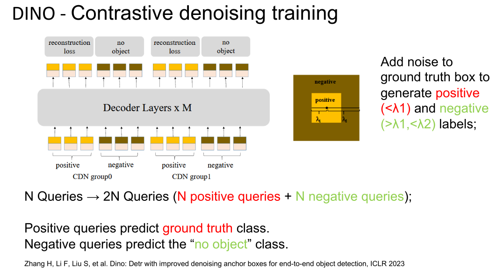

	noise refers to the random geometric offsets applied to a ground-truth box to simulate prediction errors, while lambda is the human-defined hyperparameter that scales this noise by setting the maximum allowed ratio of position and size deviation.

	During training, for each of the $N$ ground-truth (GT) boxes in an image, CDN generates one positive and one negative sample, feeding a total of $2N$ CDN queries into the decoder. Using a strict attention mask, these $2N$ queries are completely isolated from the native matching queries to enable parallel computation without mutual interference. During inference, the CDN component is fully bypassed, leaving only the native queries. This design keeps the test phase clean and efficient while leveraging the $2N$ contrastive queries during training to significantly enhance the model's boundary awareness and localization precision.

- Mixed query selection
	
	- Static Queries (In DETR) : Decoder queries are static embeddings without taking any encoder features from an individual image. They learn anchors or positional queries from training data and set the content queries as 0 vectors.
	- Vanilla Query Selection (In Deformable DETR) : It selects positions with top K classification scores as reference points and the content queries are linear transform of the positional embeddings of the reference points.
	- Mixed Query Selection (In DINO) : Using selected positions as anchors and learnable query embeddings as the content queries. (Only enhances location queries with top-K selection features and maintains the learnability of content queries. This helps the model to utilize better positional information to gather more comprehensive content features from the encoder)

| Query Type                | Positional Query Source (Where)  | Content Query Source (What)               | Core Philosophy                                                                   |
| ------------------------- | -------------------------------- | ----------------------------------------- | --------------------------------------------------------------------------------- |
| Static (DETR)             | Static, learnable dataset priors | Constant $0$ vectors                      | Completely blind to the input image at initialization.                            |
| Vanilla (Deformable DETR) | Top-K locations from Encoder     | Linear transformation of Positional Query | Fully tied to the image; content is strictly bound to position.                   |
| Mixed (DINO)              | Top-K locations from Encoder     | Static, learnable embeddings              | Best of both worlds: image-specific locations + highly flexible content learners. |

-  Look forward twice

	

	In DETR, a stop-gradient is applied between decoder layers to ensure stability, which forces each layer to optimize in isolation.

	DINO allows the prediction results of the current layer to affect the parameter updates of the first two layers. This strategy enables the model to better utilize the gradient information of subsequent layers to optimize the parameters of early layers, thereby significantly improving detection accuracy

**Grounding DINO**

an open-set detector:

- Changeable categories
- Open scenarios
- Zero-shot predict
- Multimodal learning


- Deformable attention: only samples a small number of sparse key sampling points around each query, instead of attending to all positions, which greatly reduces computation and improves efficiency for vision tasks.
- corss-attention

$$
\boldsymbol{A} = \mathrm{Softmax}\left( \frac{\boldsymbol{T}\boldsymbol{I}^\top}{\sqrt{d}} \right)
$$
$$
\boldsymbol{O} = \boldsymbol{A} \cdot \boldsymbol{I}
$$

## LLM brief intro

### Tokenization & BPE

- Word tokenization
	- Word tokenizers require lots of specialized rules about how to handle specific inputs
	- With word level tokenization, we have no way of assigning an index to an unseen word! This means we don’t have a word embedding for that word and thus cannot process the input sequence
	- $<UNK>$ lose lots of information about texts with a lot of rare words / entities
	- Word-level tokenization treats different forms of the same word (e.g., “open”, “opened”, “opens”, “opening”, etc) as separate types -> separate embeddings for each
- character tokenization：It greatly increases the length of input sequences, raising the computational overhead and sequence processing pressure for models such as the Transformer.
-  subword tokenization & Byte pair encoding
	1. Form base vocabulary (all characters that occur in the training data)
	2. count up the frequency of each character pair in the data, and choose the one that occurs most frequently
	3. choose the most common pair (ug) and then merge the characters together into one symbol. Add this new symbol to the vocabulary. Then, retokenize the data
	4. Keep repeating this process
	5. Eventually, after a fixed number of merge steps, we stop
	- to avoid $<UNK>$, all possible characters / symbols need to be included in the base vocab. This can be a lot if including all unicode characters (there are ~138K unicode symbols)!
	- GPT-2 uses bytes as the base vocabulary (size 256) and then applies BPE on top of this sequence (with some rules to prevent certain types of merges).
- Limitations of subwords
	- Hard to apply to languages with agglutinative (e.g., Turkish) or non-concatenative (e.g., Arabic) morphology
	- Pretokenization rules don’t work on some languages (Thai, Chinese don’t use spaces between words; Hawaiian uses punctuation as consonants)

### Transformer-Based Models

- Encoder-only transformer: BERT (full attention is used)
- Decoder-only transformer: GPT, DALL-E, Robot control (only masked attention is used)
downstream task

### Scaling Laws

Model performance is jointly determined by three factors: the number of parameters (N), training dataset size (D) and training compute (C), and follows a power-law relationship. All three factors must be scaled up simultaneously; increasing only a single dimension will lead to diminishing returns.

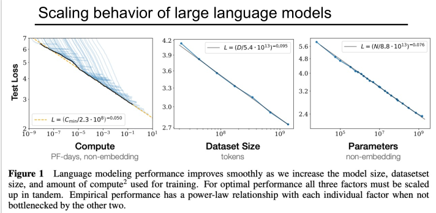
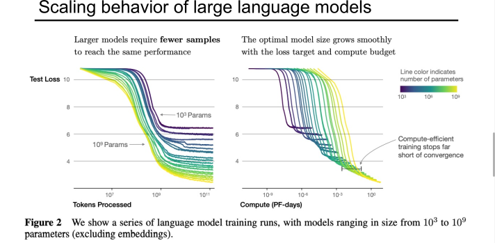


### GPT-3

if the model and training datasets are big enough, model can adapt to new tasks without fine-tuning

- fewshot learning
- One-shot learning
- zeroshot learning

### Alignmnet

Alignment aligns LLM behavior with human values: SFT first establishes basic instruction-following, then RLHF builds on it to refine responses toward human preferences.
this is not a part of this course, but it is quite important.

**pretraining**

**SFT**

**RLHF**

- PPO
- DPO
- GRPO

Without SFT, RLHF has no foundation to build upon (the random policy's exploration space is too vast); with SFT alone, the model's upper bound is limited by the quality of the demonstration data.

### prompt engineering
CoT and so on

## Parameter Efficient Fine-Tuning (PEFT)

**Few-shot Learning**

**Fine-Tuning vs. In-Context Learning**
even for very large LMs, fine-tuning often beats in-context learning

In a fair comparison of fine-tuning (FT) and in-context learning (ICL), we find that FT
outperforms ICL for most model sizes on RTE and MNLI

**Parameter Efficient Fine-Tuning**

Goal: perform fine-tuning of fewer parameters, but achieve performance on a downstream task that is comparable to fine-tuning of all parameters

**Subset (top-k layer)**

Pick a subset of the parameters and fine-tune only those (e.g. only the top K layers of a K+L layer deep neural network)
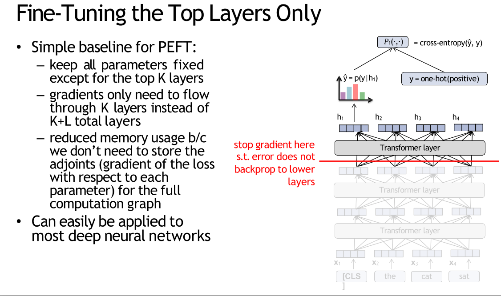
The underlying network of the pre-trained LLM has already extracted general linguistic features (syntax, semantics, basic representations). Downstream tasks only require task-specific feature mapping and classification on top of these general features. Fine-tuning only the top layers is sufficient to accomplish the task, and the general features in the lower layers do not need to be modified.

**Adapters**

add additional layers that have few parameters and tune only the parameters of those layers, keeping all others fixed
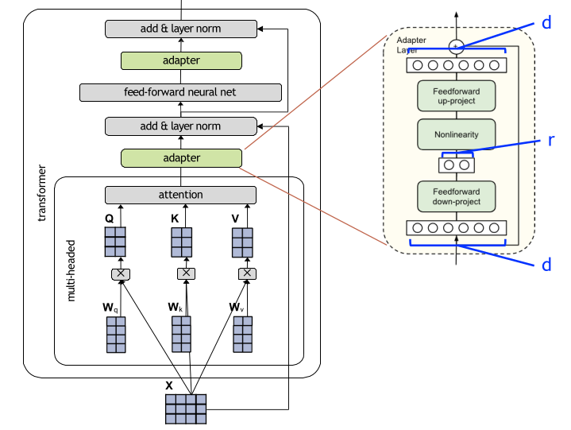
- An adapter layer is simply a feed-forward neural network with one hidden layer, and a residual connection
- For input dimension, d, the adapter layer also has output dimension d, but bottlenecks to a lower dimension m in the middle
- Adapters achieve nearly the performance (i.e. 0% delta) of full fine-tuning but with substantially fewer parameters
- Sometimes adapters even outperform full fine-tuning

- **MLM Pretraining**
	Rather than trying to predict the next word from the previous ones mask out a word (or a few words) and predict the missing words from the remaining ones

The main disadvantage of Adapter is that it introduces additional inference latency and parameters: because extra computation modules are inserted into the middle of the model, even if each module is small, they add computational time and memory access overhead during inference; additionally, each task requires saving its own set of Adapter parameters, so resource consumption accumulates when deploying multiple tasks.

**Prefix Tuning**

for a Transformer LM, pretend as if there exist many tokens that came before your sequence and tune the keys/values corresponding to those tokens

Also works for encoder-only Transformer models, but we inject prefix tokens before both the source tokens x and the target tokens y

this is not in prompt. For the same downstream task, the prefix is fixed after training is completed.

**Intrinsic Dimensionality**

the number of parameters in a model is not a great measure of how many degrees of freedom are needed to successfully learn some problem (maybe it is too much)

Intrinsic Dimension Definition from Li et al. (2018):

- Learn a neural network with D parameters in a random lower dimensional subspace, d
- Then repeat, gradually increasing the dimensionality, d
- Let the intrinsic dimension be the value of d when good solutions (above 90% threshold of full parameterization) start to appear

Empirical results suggest that pre-training finds parameters that have low intrinsic dimensionality Aghajanyan et al. (2020)


**LoRA**
learn a small delta for the each of the parameter matrices with the delta chosen to be low rank

- Motivation 1:
	“We take inspiration from Li et al. (2018a); Aghajanyan et al. (2020) which show that the learned over-parametrized models in fact reside on a low intrinsic dimension.”
- Motivation 2:
	Directly optimizing the prompt, as in prefix tuning, leads to non-monotonic changes in performance as the number of parameters increases (we want more parameters to mean better performance!)
- Motivation 3:
	Adapters and related methods introduce inference latency at test time that is non-trivial!

Key Idea

- Keep the original pretrained parameters W0 fixed during fine-tuning
- Learn an additive modification to those parameters $ΔW$
- Define $ΔW$ via a low rank decomposition:$\Delta W = BA$
where BA has rank r, which is much less than the input dimension k or the output dimension d

Initialize

- $A_{ij} \sim \mathcal{N}(\mathbf{0}, \mathbf{\sigma^2}), \forall i,j \text{ and } B = 0$
- This ensures at the start of fine tuning, the parameters have their pretrained values: $\Delta W = BA = 0 \text{ and } W_0+BA = W_0$

Hot Swapping Parameters
$W_0$ and BA have the same dimension, so we can ”swap” the LoRA parameters in and out of a Standard Linear Layer

where $r << min(d, k)$

Takeaways

- Applied to GPT-3, LoRA achieves performance almost as good as full fine- tuning, but with far fewer parameters
- On some tasks it even outperforms full fine- tuning
- For some datasets a rank of r=1 is sufficient
- LoRA performs well when the dataset is large or small

**PEFT FOR VISION TRANSFORMER**

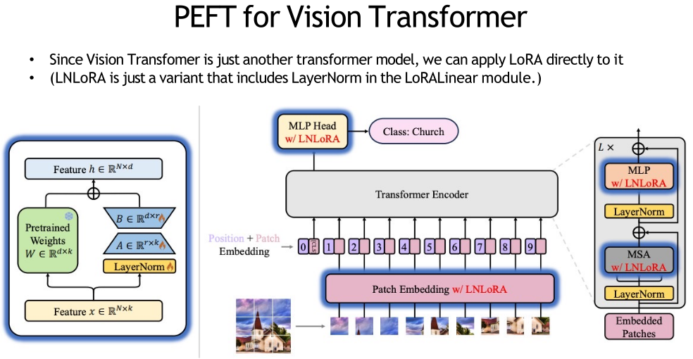
For various computer vision tasks, parameter efficient transfer-learning (PETL) is sometimes better than full fine-tuning!

## References

- [Entropy & Cross-Entropy](https://zhuanlan.zhihu.com/p/149186719)
- [优化器可视化](https://github.com/Jaewan-Yun/optimizer-visualization)
- [优化器](http://ruder.io/optimizing-gradient-descent/)
- [Intro to optimization in deep learning: Momentum, RMSProp and Adam](https://blog.paperspace.com/intro-to-optimization-momentum-rmsprop-adam/)
- [Linear relationships in the Transformer's positional encoding](https://blog.timodenk.com/linear-relationships-in-the-transformers-positional-encoding/)
- [Window attention & Shifted window attention](https://blog.csdn.net/weixin_43135178/article/details/118696021)
- [Contrastive representation learning (awesome blog)](https://zhuanlan.zhihu.com/p/346686467)
- [InfoNCE proof](https://blog.csdn.net/iiiiii11/article/details/154584585)
- [Variational Bounds on Mutual Information](https://m-wiesner.github.io/Variational-Bounds-on-Mutual-Information/)
- [Mathematical Foundations of Contrastive Loss](https://ekbanaml.github.io/applied%20machine%20learning/mathematical-foundation-contrastive-loss/)
- [KL divergence](https://s-ai-unix.github.io/posts/2026-02-03-kl-divergence-information-theory/)
- [What are diffusion models? Lil'Log](https://lilianweng.github.io/posts/2021-07-11-diffusion-models/)
- [扩散模型介绍](https://blog.csdn.net/m0_59012280/article/details/155040575)
- [Hungarian matching algorithm & KM alg](https://zhuanlan.zhihu.com/p/444518253)
- [KM alg](https://zhuanlan.zhihu.com/p/677501913)