[Brady Neal, "Introduction to Causal Inference"](https://claude.ai/chat/91febc5d-b8aa-4dd8-8063-44300a4e8bfb)
：written from a machine learning perspective

## Chapter 1 Course Overview

因果推断：Inferring the effects of any (effect of X on Y)

**Simpson's paradox**: 不均衡的子组权重分配导致分组和最终总和得到的结果不同。

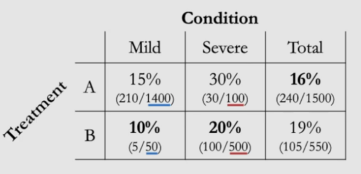
但是因果图可能根据情况不同而不同（比如治疗方式可能影响病人的情况，或者情况决定治疗方式）所以我们不能盲目的说哪个效果是更好的

### Correlation doesn't imply causation

比如穿鞋上床睡觉更容易在起来的时候头疼（causal）。但是可能是因为穿鞋数较的大多数人都喝酒。（confounding）
- Associational只描述同时观测到的统计同步性
- Causal主动干预带来的真实作用
- confounding：存在一个同时影响干预 T 和结果 Y 的第三方变量 C（混杂变量 confounder），它会制造虚假相关性，让观测到的关联 ≠ 真实因果效应。

> Total association (eg.correlation) is the mixuture of causal and confounding association

### Correlation = Causation is a cognitive bias

- Availability heuristic：我们最可能想到的原因
- Motivated reasoning：我们为了证明正确对此作的解释

### Potential outcomes: intuition

$$
\text{causal effect} = Y_i|_{do(T=1)} - Y_i|_{do(T=0)} = Y_i(1) - Y_i(0).
$$

这里要说明的是两者在数学上是相等的，但是物理意义不同$Y_i(1)$是属性，代表事情自然发生而应有的结果，而$Y_i|_{do(T=1)}$是涉及物理干预，强行给T赋值的观测结果。两者由于T相同，所以结果应该相同，但是过程不一样。

**Individual treatment effect (ITE)**

fundamental problem of causal inference

我们不能同时观测到两件事((无法观测到反事实（Counterfactual))

**Average treatment effect (ATE)**
$$
\text{ATE} = \mathbb{E}\big[Y(1) - Y(0)\big] = \underbrace{\mathbb{E}\big[Y(1)\big] - \mathbb{E}\big[Y(0)\big]}_{causal\ quantity} \neq \underbrace{\mathbb{E}\big[Y| T = 1\big] - \mathbb{E}\big[Y| T = 0\big]}_\text{associational difference}
$$
因为有混杂（confounding）并且不可以比较 (not conparable)（群体的组成不同）

很容易混淆：$Y(1)$是和现实无关的。而$Y| T = 1$是和现实相关的。大多数情况两者不等，因为后者分配规则会受混杂变量影响，导致该群体基线特征与全人群存在偏差，而前者是和现实无关的理想状态。但是当满足条件（Ignorability）时候，两者可以相等，因为条件对于观测没有影响，偏差被消除。

**Randomized control trials (RCTs)**

experimenter randomizes subjects into treatment group or control group

1. T cannot have any causal parents 
2. Groups are comparable

随机对照试验（RCT）从期望层面消除了所有观测 / 未观测混杂，但无法完全抹除单次样本里的偶然不平衡。

### Causation in observational studies

没有办法进行试验（RTCs）因为现实或者道德原因

Solution: adjust/control for confounders

If $W$ is a sufficient adjustment set, we have
$$
\mathbb{E}\big[Y(t) \mid W = w\big] = \mathbb{E}\big[Y \mid do(T = t), W = w\big] = \mathbb{E}\big[Y \mid t, w\big]
$$
$$
\mathbb{E}\big[Y(t)] =\mathbb{E}_W\mathbb{E}\big[Y \mid t, W\big]
$$

充分调整集（sufficient adjustment set）等价于条件可忽略性 Ignorability / Unconfoundedness（在概率图上截断了C到T的箭头）
（按照上面的例子病情严重与否就是一个充分调整集合a）
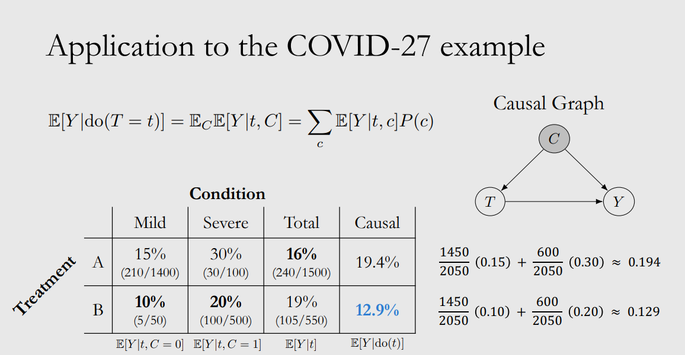
Solution 2: frontdoor adjustment.

## Chapter 2 Potential Outcomes

$$
\underbrace{\mathbb{E}\big[Y(1)\big] - \mathbb{E}\big[Y(0)\big]}_{causal\ quantity} = \underbrace{\mathbb{E}\big[Y| T = 1\big] - \mathbb{E}\big[Y| T = 0\big]}_{\text{statical  quantities}}
$$

### What assumptions would make the ATE equal to the associational difference

**Ignorability**

$$
(Y(1), Y(0))\perp\!\!\!\perp T
$$

$$
\begin{aligned}
\mathbb{E}[Y(1)] - \mathbb{E}[Y(0)]
&= \mathbb{E}[Y(1) \mid T = 1] - \mathbb{E}[Y(0) \mid T = 0] \quad \text{(by ignorability)} \\
&= \mathbb{E}[Y \mid T = 1] - \mathbb{E}[Y \mid T = 0] \quad \text{(by consistency)}
\end{aligned}
$$

当满足Ignorability的时候，ATE = AD (associatial difference)，因为cofouder完全不相关，这可以理解为随机性的分配（即Y的群体选择1还是0都是随机的，所以$\mathbb{E}[Y(1) \mid T = 1] = \mathbb{E}[Y(1) \mid T = 0] = \mathbb{E}[Y(1)]$）。

对公式的翻译可以是这样：在原本Y群体在使用t有效的期望=目前在使用t的群体中在原本使用t就有效的期望=目前在使用t的群体中有效的期望。即“全人类的潜力” = “吃药组的潜力” = “吃药组的现实”。Ignorability 的作用，就是废除了“选择偏差”。consistency 取消了其他变量的影响

也可以理解为exchangebility，两者是同一个概念的不同角度

**Exchangeability**

如果交换两组的实验对象，得出结果不变
$$
\mathbb{E}[Y(1)\mid T = 1] =  \mathbb{E}[Y(1)\mid T = 0] = \mathbb{E}[Y(1)]
$$
$$
\mathbb{E}[Y(0)\mid T = 0] =  \mathbb{E}[Y(0)\mid T = 1] = \mathbb{E}[Y(0)]
$$

**identifiability**

可识别的：当一个因果量（$\mathbb{E}\big[Y(t)\big]$）可以从一个统计量$\mathbb{E}\big[Y\mid t\big]$）中计算得出，这是我们最后的目标

**RCT**

通过随机可以满足ignorability的假设成立

**conditional exchangebility**

$$
(Y(1), Y(0))\perp\!\!\!\perp T \mid X
$$
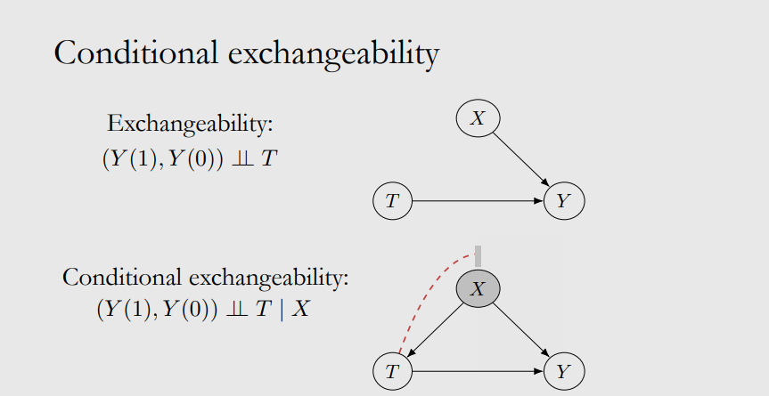
**conditional ATE**

$$
\text{Conditianl ATE} = \mathbb{E}\big[Y(1) - Y(0)\mid X\big] = \mathbb{E}\big[Y(1)\mid X\big] - \mathbb{E}\big[Y(0)\mid X\big] =  \mathbb{E}\big[Y\mid T = 1, X\big] - \mathbb{E}\big[Y\mid T = 0, X\big]
$$
 
**The adjudgement formula (Identification of ATE)**

$$
\mathbb{E}\big[Y(1) - Y(0)\big] = \mathbb{E}_X\mathbb{E}\big[Y(1) - Y(0)\mid X\big]
$$

### 4 main assumptions

#### **Unconfoundedness**

Unconfoundedness = conditional ignorability = conditional echangeablity

Unconfoundedness是一个不能被验证的假设因为我们不知道除了我们已知还是否有其他因素影响（缺失潜在结果）

#### **Positivity (overlap)**

$$
0 < P(T=1 \mid X) < 1,\quad \forall X\in\mathcal{X}
$$
也就是每个协变量分组里，必须同时有处理组 (T=1) 和对照组 (T=0) 样本
- $\mathbb{E}\big[Y\mid T = 0, X\big]$的展开分母中不能出现0
- 反事实的缺失

**Positivity-Unconfoundedness tradeoff**

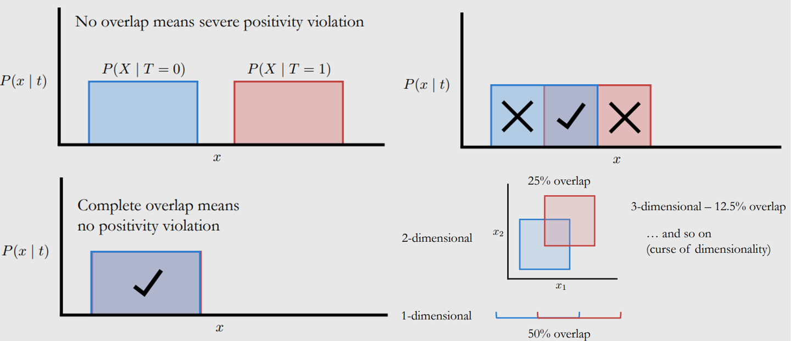
增加协变量提升无混杂，但损害重叠；删减协变量保住重叠，但引入遗漏混杂

**Extrapolation**

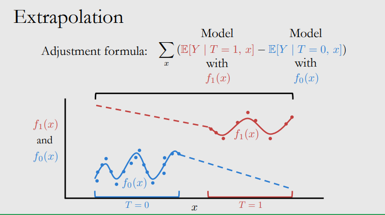
不满足 positivity 的时候要估计反事实，只能依靠模型向无重叠区域做预测

**Adjustment Formula**

在满足无混杂假设下，用观测数据算出因果期望，消除协变量带来的人群偏差。

$$
\text{ATE} = \sum_x \Big(\mathbb{E}[Y \mid T=1, X=x] - \mathbb{E}[Y \mid T=0, X=x]\Big) f_X(x)
$$

#### No interference

$$
Y_i(t_1, \dots, t_{i-1}, t_i, t_{i+1}, \dots, t_n) = Y_i(t_i)
$$
只与$t_i$相关

#### Consistency

$$
T = t \rightarrow Y = Y(t)
$$
$$
Y_i=T_iY_i(1)+(1−T_i)Y_i(0)
$$
你实际看到的结果，就是你对应干预下本该出现的反事实结果

### Adjustment Formula

在满足三大核心假设（Unconfoundedness + Positivity + Consistency）的前提下，我们可以直接用观测数据中的“条件均值差”来估计“平均因果效应（ATE），也就是说理论上可以用数据区推断因果关系

$$
\begin{aligned}
\mathbb{E}[Y(1) - Y(0)] 
&= \mathbb{E}[Y(1)] - \mathbb{E}[Y(0)] 
   \quad \text{(linearity of expectation)} \\
&= \mathbb{E}_X[\mathbb{E}[Y(1) \mid X] - \mathbb{E}[Y(0) \mid X]] 
   \quad \text{(law of iterated expectations)} \\
&= \mathbb{E}_X[\mathbb{E}[Y(1) \mid T = 1, X] - \mathbb{E}[Y(0) \mid T = 0, X]] 
   \quad \text{(unconfoundedness and positivity)} \\
&= \mathbb{E}_X[\mathbb{E}[Y \mid T = 1, X] - \mathbb{E}[Y \mid T = 0, X]] 
   \quad \text{(consistency)}
\end{aligned}
$$

### estimation

- Estimand：估计量
- estimate：用数据去近似估计量
- estimation：从获得数据到处理估计量的整个流程

$$
\text{Causal Estimand} \xrightarrow{\text{Identification}} \text{Statistical Estimand} \xrightarrow{\text{Estimation}} \text{Estimate}
$$

以上是逻辑上的推导顺序，我们实际上是希望得到因果关系，但是数据不足，我们通过多种假设将因果关系转化为数据估计，可以用现有数据得出因果关系

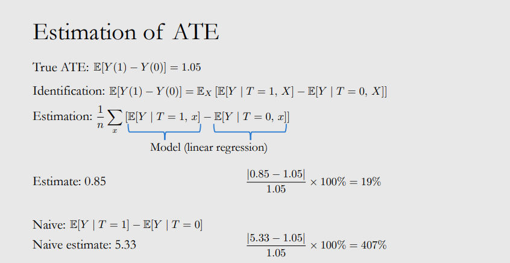

## Chapter 3 Graphical Models

- Ancestor：祖先节点
- Descendant：子结点
- Immorality：一个子结点有两个不相关的父节点

### Bayesian networks & causal graphs

**Bayesian networks**

贝叶斯网络是一个概率图模型，用有向无环图（DAG）来表示一组变量之间的“条件依赖关系。节点代表随机变量，有向边代表直接的概率依赖。图中的箭头表示直接的概率影响，而不是因果关系。

**Statistical modeling (no causality)**

$$
P(x_1,x_2,...,x_n)= P(x_1)\prod_i
P(x_i \mid x_{i-1},...,x_1)
$$

**Local Markov assumption**

X 与其所有非后代节点相互独立。也就是只与自己的夫节点相关

$$
P(x_1,x_2,...,x_n) = \prod_i
P(x_i \mid pa_i)
$$

等价于Bayesian network factorization(贝叶斯因子分解)

**Minimality assumption**

图里画出的每一条边（箭头），在数据中都必须有对应的 Statistical Dependencies（统计依赖性），这杜绝了多与的边

极小性假设 = 局部马尔科夫 + DAG中的相邻节点需要相关（局部极小）

极小性能在“统计等价类”内帮助选最简约的图，但它无法得出箭头方向（Minimality假设可以用来描述我们希望选择什么样的图来刻画分布。）

**cause**

如果变量 Y 能随着变量 X 的变化而发生变化，则称变量 X 是变量 Y 的一个原因（cause）。

**Causal edges assumption**

在有向图中，每个父节点都是其所有子节点的直接原因。直接代表X对Y的影响不通过图中其他变量，即因果性。

因果边假设承诺这个图包含了所有重要的共同原因（没有遗漏的混杂因子）

**assumption flow chart**
$$
\begin{aligned}
\text{DAG Structure} + \text{Markov Assumption} 
&\implies \text{Statistical Independencies} \\
\text{DAG Structure} + \text{Minimality Assumption} 
&\implies \text{Statistical Dependencies} \\
\text{DAG Structure} + \text{Causal Edges Assumption} 
&\implies \text{Causal Dependencies}
\end{aligned}
$$

### The basic building blocks of graphs

图的基本模块

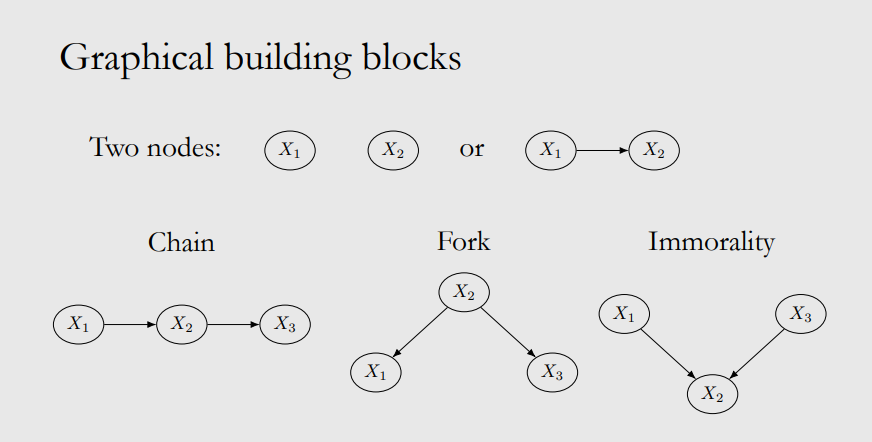

- chain：传递因果效应，控制了 $X_2$，那么$X_1$和 
$X_3$之间的信息流就被切断了，它们变得独立。
- Fork：制造虚假相关（混杂）。 这是混淆偏差（Confounding）的根源。如果不控制 $X_2$，那么$X_1$和$X_3$是相关的（因为它们有共同的源头$X_2$，比如“夏天”同时导致“冰淇淋销量”和“溺水”）。如果控制 $X_2$则关联被切断
- Immorality：天然阻断路径，但控制后会打开（选择偏差）。如果不控制 $X_2$（Collider）或其子结点，那么$X_1$和$X_3$是独立的（因为两个独立的原因共同导致一个结果，它们本身没有关系）。但是如果控制$X_2$或其子结点，那么$X_1$和$X_3$反而可能有相关性，

| 结构名称 | 图 | 不控制中间节点时 | 控制中间节点时 |
| :--- | :--- | :--- | :--- |
| **Chain（链）** | $( X \to Z \to Y )$ | **相关**（信息流通） | **独立**（阻断信息） |
| **Fork（叉）** | $(X \gets Z \to Y )$| **相关**（虚假相关） | **独立**（去除混杂） |
| **Immorality（碰撞）** | $( X \to Z \gets Y)$ | **独立**（天然阻断） | **相关**（制造选择偏差） |

**证明**

1. Chain：当控制$X_2$，$X_1$和$X_3$是独立的
2. Fork：当控制$X_2$，$X_1$和$X_3$是独立的
3. Immorality: $X_1$和$X_3$是独立的
4. Immorality: 当控制$X_2$或者其子结点，$X_1$和$X_3$是相关的

### The flow of association and causation

**blocked path**

来判断信息是否能在X和Y之间传递，
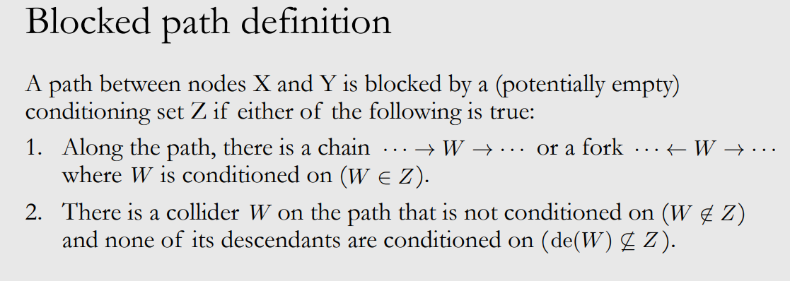

- Conditioning Set：条件集合，可以我们认为控制的变量

**d-separation**

d-分离（有向分离）是用来判断：在给定某组变量 Z 后 T 和 Y 是否在图中被阻断

如果两个节点（或节点集合）$X$ 和 $Y$ 之间的所有路径都被 $Z$ 阻断，则称 $X$ 和 $Y$ 被 $Z$ d-分离。
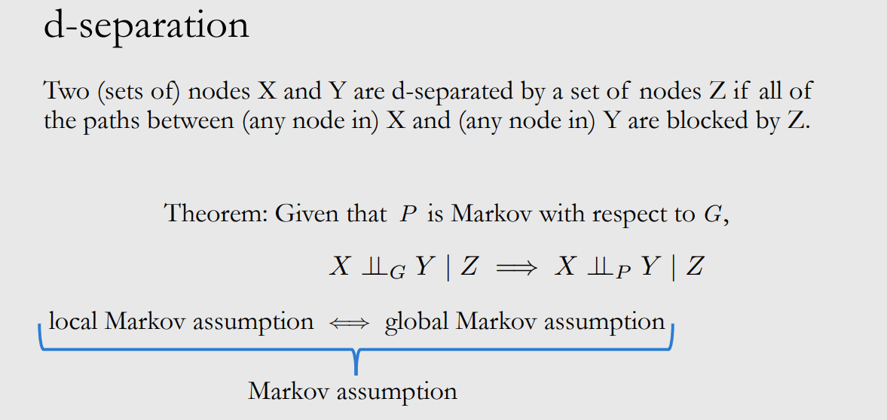
**图中的 d-separated 意味着分布中的条件独立性。**

全局马尔科夫假设可以让我们通过寻找d-separated：

1. 进行模型检验
2. 指导该控制哪些变量（混杂识别）
3. 在未知结构下自动学习图（因果发现）

## Causal Models

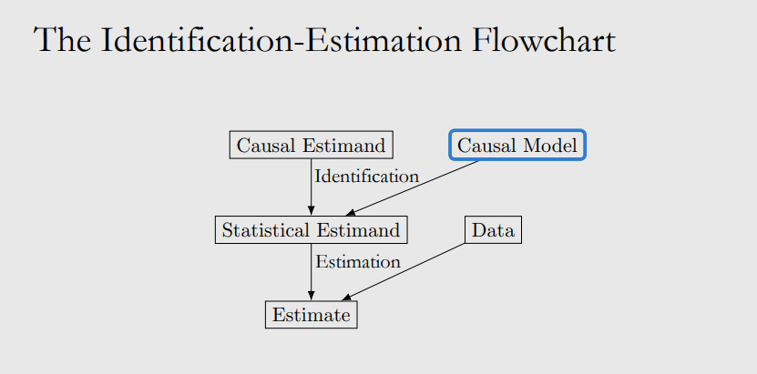
Identification是利用 Causal Model（尤其是 DAG 和假设）将 Causal Estimand 转化为 Statistical Estimand 的过程

### The do-operator

do算子起到了干预的作用，就像之前说的，他可能和现实无关，do算子估计总体**如果**全部采用某种条件结果会是怎么样。也就是说do算子得到的其实是因果关系（因果估计量），我们应该通过假设计算得到数据估计（Statistical Estimand）

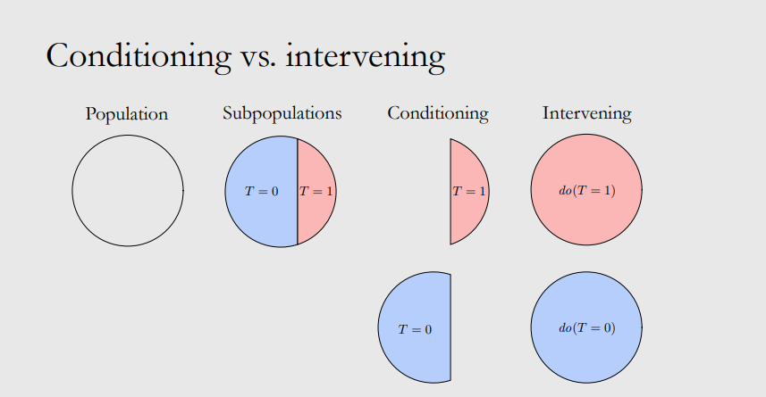

**Interventional distributions**

$$
P(Y(t) = y) \triangleq P(Y = y \mid do(T = t)) \triangleq P(y \mid do(t))
$$

**Average treatment effect (ATE)**

$$
\underbrace{\mathbb{E}[Y \mid do(T = 1)]}_{Observational} - \underbrace{\mathbb{E}[Y \mid do(T = 0)]}_{Interventional}
$$

**Observational vs. Interventional**

|  | Observational | Interventional |
| :---: | :---: | :---: |
|  | $$P(Y, T, X)$$ | $$P(Y \mid do(T = t))$$ |
|  | $$P(Y \mid T = t)$$ | $$P(Y \mid do(T = t), X = x)$$ |

$$
P(Y \mid do(T = t)) = \mathbb{E}_X[P(Y \mid do(t), X = x)]
$$

### Main assumption: modularity

**Causal mechanism**

DAG中，因果机制就是“有向路径”（Directed Path）

**Modularity assumption / Autonomy**

假设因果机制是模块化的：如果我们对节点 $X_i$ 进行干预，那么只有该节点的（因果）机制会发生改变，所有其他机制保持不变。

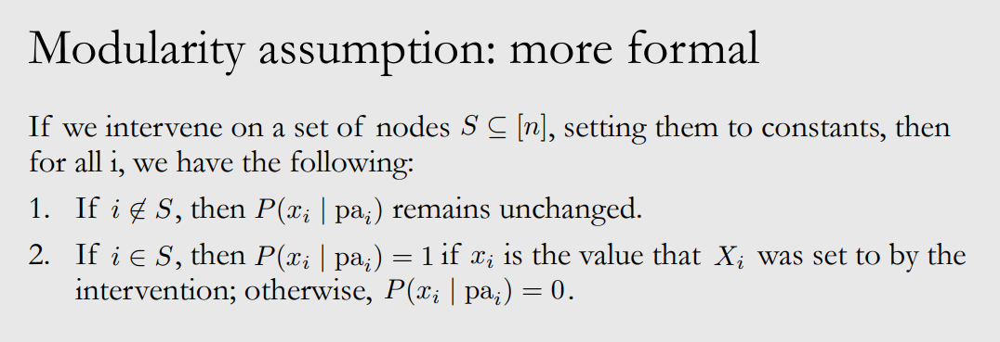

**Manipulated graph**

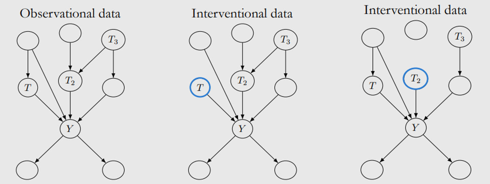

**Truncated factorization**

$$
P(x1,x2,...,xn\mid do(S = s))= \prod_{i \notin S}
P(x_i \mid pa_i)\ \text{if X is consistent with the intervention.}
$$

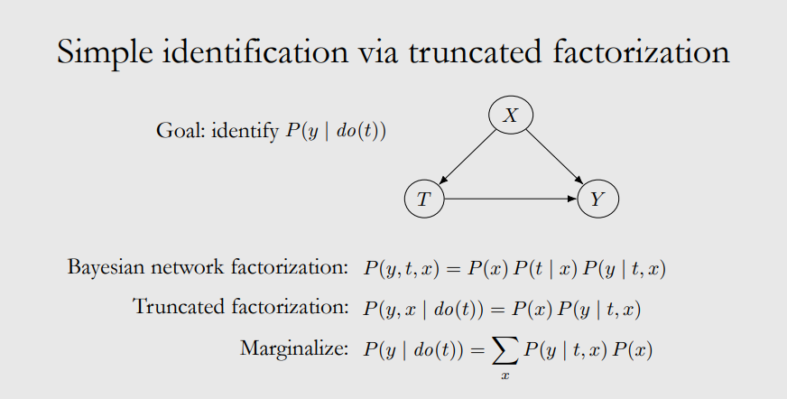

$$
P(y | do(t)) \neq P(y | t)
$$

$P(y | t)$包括混杂因素，$P(y | do(t))$隐含了对所有x求期望的含义

### Backdoor adjustment

**backdoor paths**

连接因果的无向通路，满足：
1. 第一步箭头反向离开 $T$ ：$T\rightarrow …$
2. 通路无原生阻断（无未控制的对撞节点），能传递虚假相关
正向因果链 
3. $T→⋯→Y$ 永远不是后门。

我们希望阻后门路径，以此得到causal association

**Backdoor criterion and backdoor adjustment**

后门准则（Backdoor criterion）：如果变量集$W$满足以下两个条件，则说明 $W$ 满足关于 $T$ 到 $Y$ 的后门准则：

1. $W$ 阻挡了所有从 $T$ 到 $Y$ 的后门路径（d-separation）
2. $W$ 不包含任何 $T$ 的后代 （inducing new post-treatment association / blocking causal association）

Given the modularity assumption and $W$ that satisfies the backdoor criterion, we can identify the causal effect of $T$ on $Y$:

$$
P(y | do(t)) = \sum_X P(y | t, w) P(w)
$$

$W$被称作sufficient adjustment set

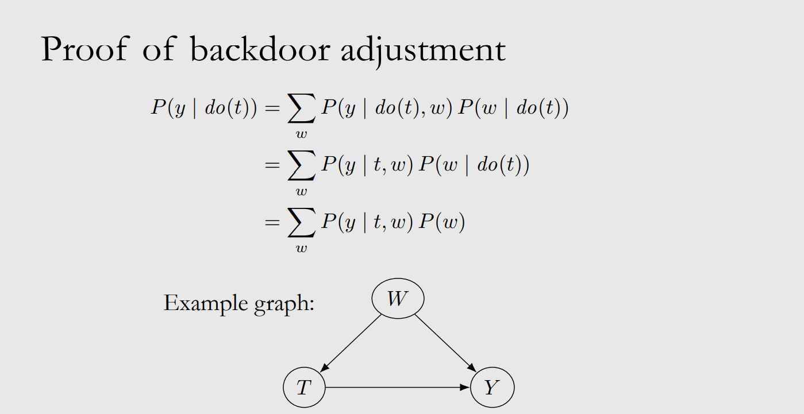
第二个=因为 W 阻断了所有从 T 到 Y 的后门路径。

第三个=因为当我们干预 T 时，不会出现进入 T 的箭头

**Backdoor criterion as d-separation**

1. $W$ blocks all backdoor paths from $T$ to $Y$
2. $W$ does not contain any descendants of $T$

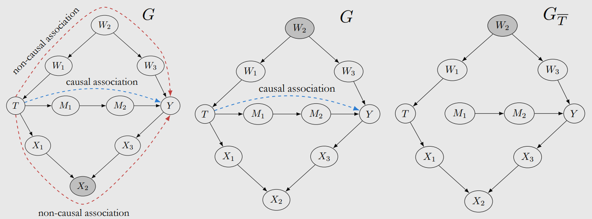

其中$W_2$是fork，控制之后切断关系。$X_2$是Immorality，不控制则切断了关系

第三张图是假设我们控制T，即$do(T = t)$则 $T$ 和 $Y$ d 分离

$$
Y \perp\!\!\!\perp_{G_{\overline{T}}} T \mid W
$$

后门准则 = 用 d-分离去判断哪些变量能同时满足“阻断所有后门路径”和“不阻断任何因果路径”。如果一组变量能做到，那它就是合法的后门调整集。

ATE 等价于 backdoor adjustment，只不过一个是求期望后相减，另一个是直接求出分布，他们都消除了混杂因素的影响。

## Structural causal models（SCM）

**=** 不传递因果信息，我们使用 **:=** 来表示因果 

**Structural Equations（SEM）**

$$
B:= f(A)
$$ 
代表A是原因，B是结果（f不可逆）

**Nonparametric Structural Equations Model（NPSEM）** 

$$
B:= f(A, U)
$$
其实U代表不确定性，函数f内的变量都是直接原因

### Structural causal models (SCMs)

SCM是多个结构方程的集合

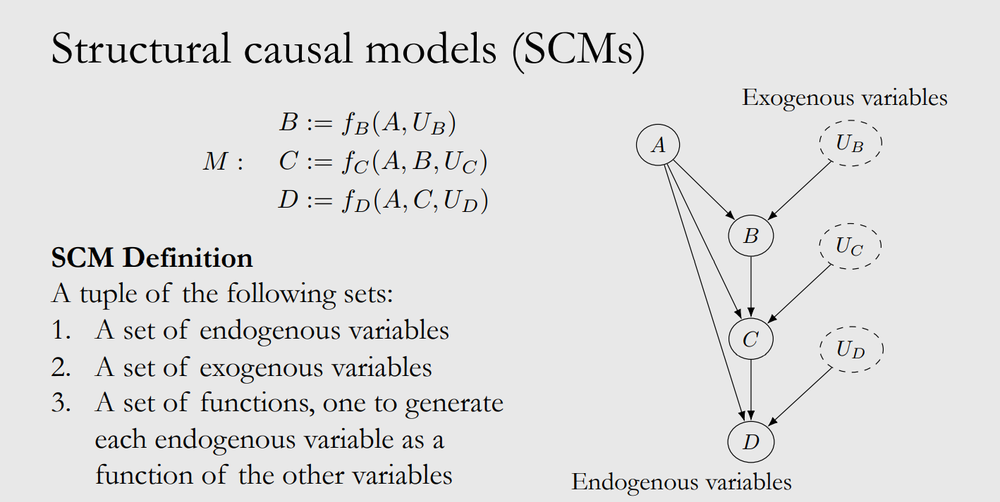

**Endogenous variables**
1. 在方程左侧（被解释变量：$B,C,D$）
2. 存在箭头指向自身，拥有父节点
3. 模型系统内部生成，会被图中其他变量因果影响

**Exogenous variables**

1. 在方程右侧（解释变量）
2. 无任何箭头指向自身，无父节点，是因果图起点
3. 定义：内生变量之外的变量，不受模型内其他变量影响，无需探究其生成来源
4. 原始状态下所有外生变量相互独立，$Z_1 \perp\!\!\!\perp Z_3$，不存在原生 pretreatment association

**SCM Definition**

A tuple of the following sets:
1. A set of endogenous variables
2. A set of exogenous variables
3. A set of functions, one to generate 
each endogenous variable as a 
function of the other variables

**Interventions**

产生 $T$ 的函数被取消，带有干预的结构因果模型 $M$ 可以写为  $M_t$

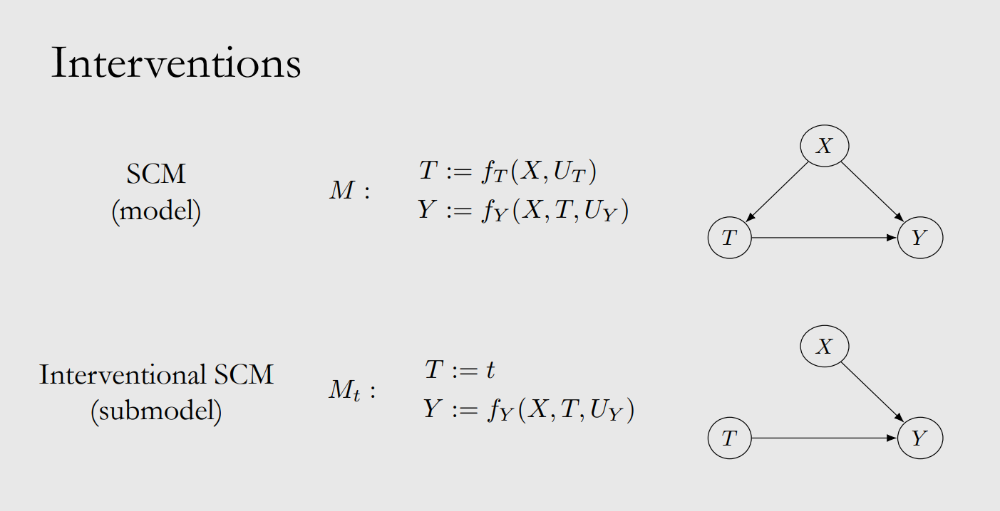

**Modularity assumption for SCMs**

加入干预的SCM和未加干预的SCM只在干预变量上的结构方程是不同的（干预只在T的局部，改变一个不会影响其他）。

$$
T:=t \text{  in  } M_t
$$

**pretreatment association**

在干预 $T$ 发生之前变量间的统计相关性，本质：观测层面的相关关系

也叫做 **M-bias**

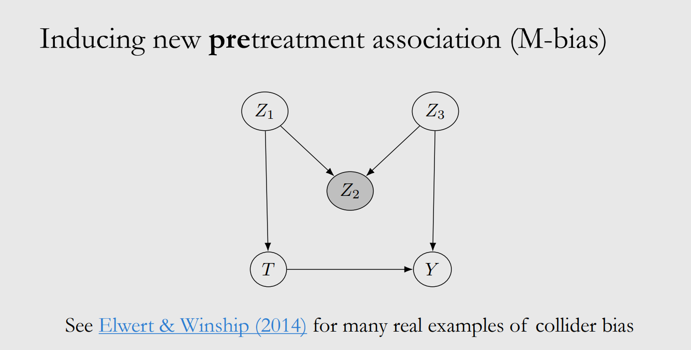

图中 $Z_1 \perp\!\!\!\perp Z_3∣Z_2$,只需要 $Corr(A,B)\neq 0$ 就可以，$Z_2$ 是内生对撞节点；控制该内生变量会诱导出新的虚假 pretreatment association，打开虚假后门路径

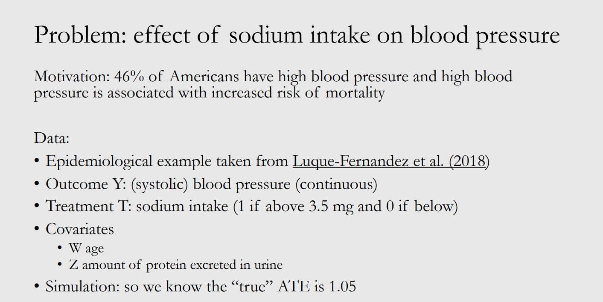

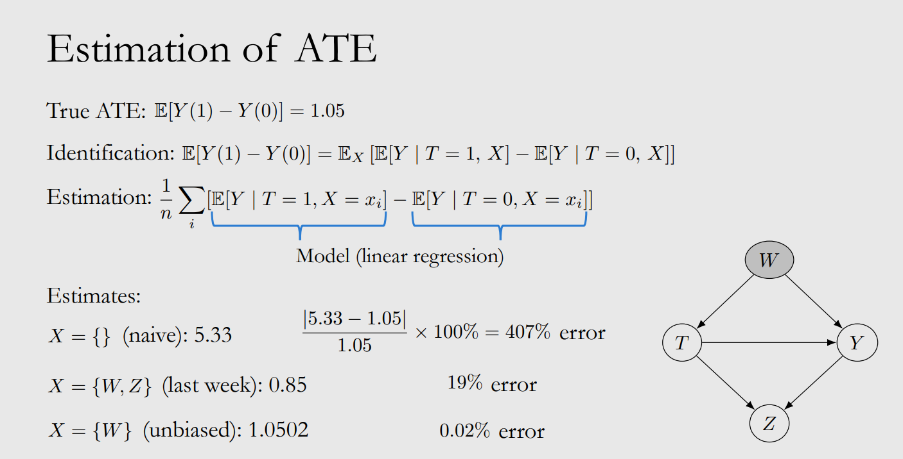

## Identification

$$
\text{Causal Estimand} \xrightarrow{\text{Identification}} \text{Statistical Estimand}
$$

### The magic of randomized experiments

#### Few different perspectives on the magic

**Comparability and covariate balance**

除了treatment对照组和实验组所接受的其他条件都是相同的

Covariate balance definition：the distribution of covariates $X$ is the same across treatment groups. 

$$
P(X \mid T = 1) \stackrel{d}{=} P(X \mid T = 0)
$$

随机性代表了分布相等，因为 $T \perp\!\!\!\perp X$

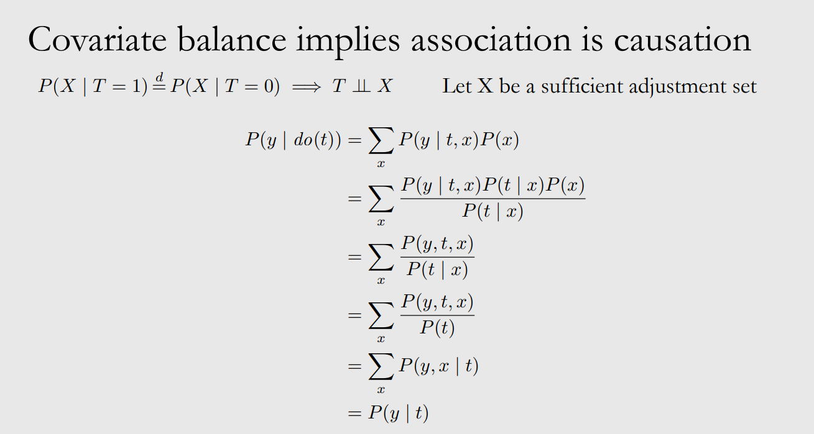

**Exchangeability**

对照组和实验组的个体交换不影响结果

> Question:
Write down the formal definition of 
(mean) exchangeability. Then, prove that this yields “association is causation.”

1. $(Y(0),Y(1))\perp\!\!\!\perp T$
2. $\mathbb{E}[Y(1) - Y(0)] = \mathbb{E}[Y(1)] - \mathbb{E}[Y(0)] =  \mathbb{E}[Y\mid T = 1, ] - \mathbb{E}[Y\mid T = 0]$

**No backdoor paths**

随机实验抹除了干预，所以也是等价于没有后门路径了

### Frontdoor adjustment

当后门路径上的变量不可被观测的时候，我们使用前门调整：通过关注only causal association

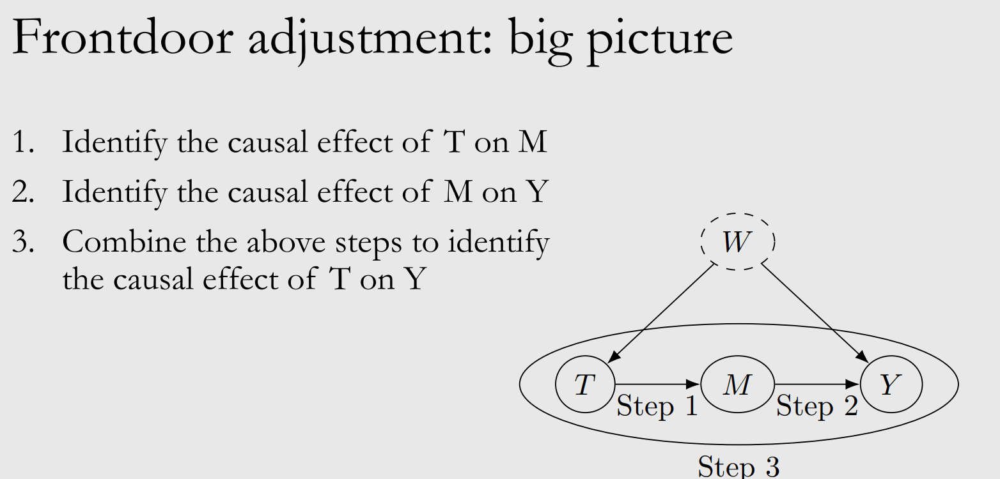

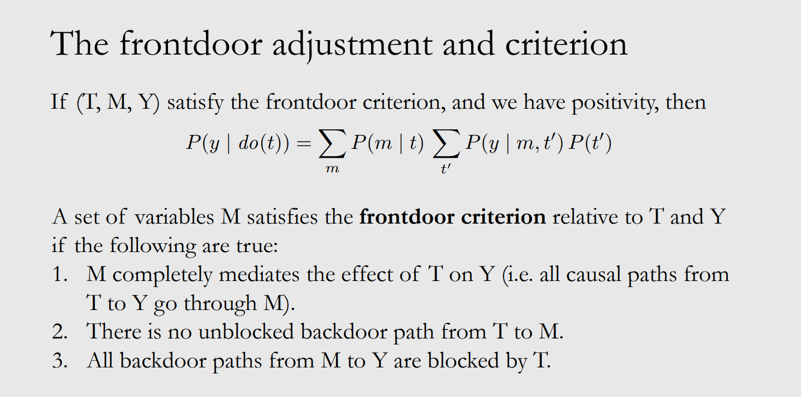
- step1:没有后门路径$P(m\mid do(t)) = P(m\mid t)$
- step2:后门路径$M-T-W-Y$, 控制t：$P(y\mid do(m)) = \sum_t P(y \mid m,t)P(t)$

**proof of frontdoor adjustment using the truncated factorization**

**Question:What is the intuition for why the frontdoor criterion gives us identifiability?**

因为 $T$ 对 $Y$ 的因果必须全部经过中介 $M$，我们把长因果链拆成两段分别净化估计：第一段 $T→M$ 本身无混杂，第二段控制 $T$ 消除 $M−Y$ 的隐藏混杂，合并两段干净的子效应，就能避开不可观测混杂 $W$ ，实现因果效应识别。

### Pearl’s do-calculus

**Can we identify the causal effect if neither the backdoor criterion  nor the frontdoor criterion is 
satisfied?**

Pearl’s do-calculus可以让我们识别任何可识别的causal quantity $P(Y \mid do(T = t,X= x))$ 其中其中 $T,X,Y$ 为任意集合（可以是多个treatment或多个outcome）

对于图中任意节点 $X$：
1. $\overline{X}$（上横线）：执行 $do(X=x)$，**移除所有指向 $X$ 的入边**，切断所有上游对 $X$ 的因果影响；
2. $\underline{X}$（下横线）：移除所有从 $X$ 出发的出边，阻断 $X$ 对下游变量的全部因果传递。

Rule1：观测条件里增减条件变量（d分离等价替换）
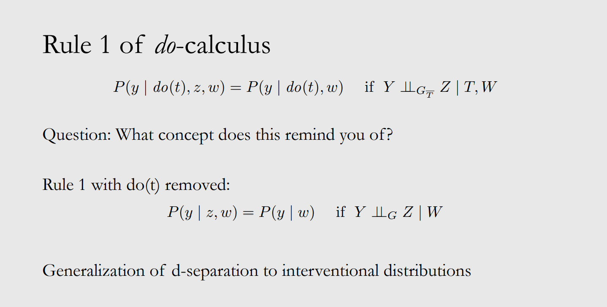
d-分割在干预分布下的拓展（把do(t)移走可以看出来）

Rule2：$do(\cdot) \leftrightarrow$ 观测条件（后门准则本质）
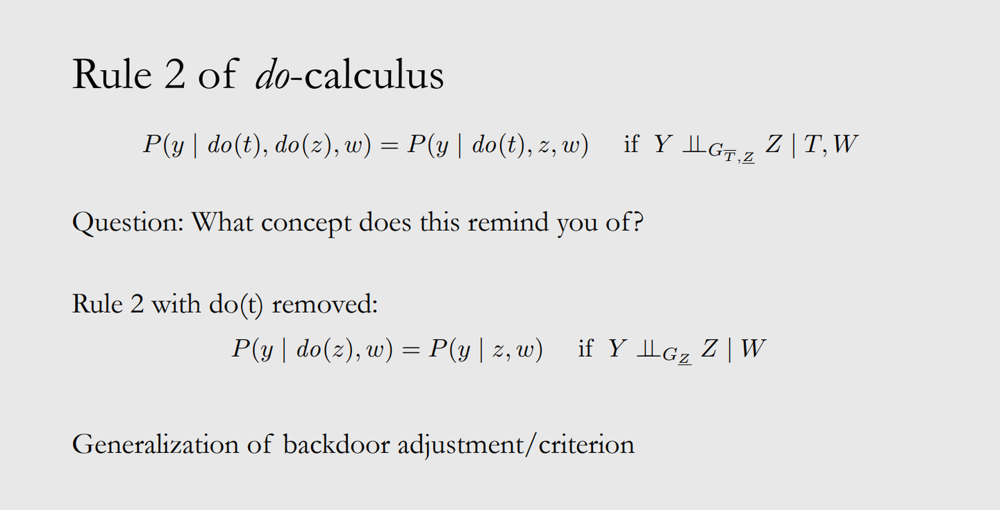
d-分割下后门调整的框架把do(t)移走可以看出来）

Rule3：直接删掉无因果作用的 $do(\cdot)$
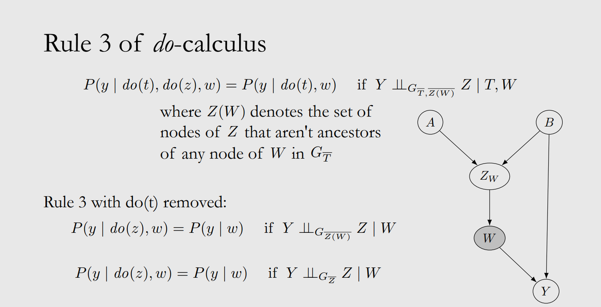
Q：为什么这里的角标是 $Z_W$ 而不是 $Z$ 呢？

A：$Z_W$ 是对撞节点；控制它的后代 $W$ 会导致通路 $A \to Z_W \leftarrow B \to Y$ 被打开，产生虚假关联。如果直接用全集合 $Z$（不用子集 $Z(W)$）、画 $G_{\overline{Z}}$：会删掉 $Z_W$ 入边，阻断这条虚假通路，误判独立。所以必须限定只用子集 $Z(W)$：只剔除 $Z$ 中 $W$ 的祖先，保留这条伪通路，保证d分离判断准确

**Proof of the frontdoor adjustment using do-calculus in Section 6.2.1 of the course book (compare with proof using truncated factorization in Section 6.1)**

**Completeness of do-calculus**

只要某个因果量  $P(y∣do(x))$ 在给定 DAG 下本身是可识别的，仅靠 do 演算三条规则，就一定能把它化简成纯观测分布（不带 $do(\cdot)$）。

### Determining identifiability from the graph

**Unconfounded childern criterion**

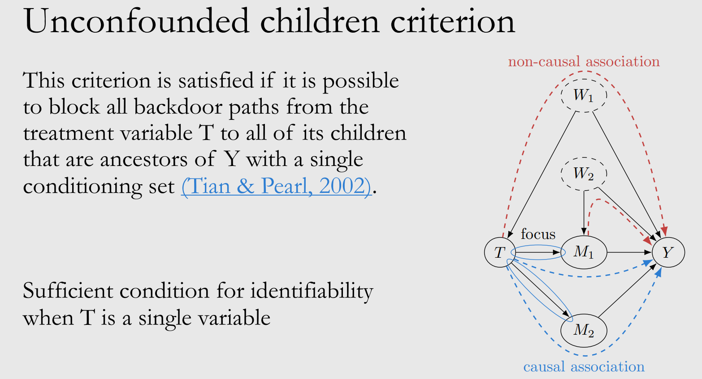

目前 $M_2$ 满足前门准则，但是 $M_1\to Y$ 包含不可观测的混杂变量，所以目前这个图前门后门准则都用不了。

Unconfounded childern criterion：当 $T$ 和它直接子代中介之间无混杂时，我们拆分多条 $T→M$ 干净子因果链，分段计算再合并，绕开全局不可观测混杂，完成因果识别。

$$
P(y \mid do(t)) = \sum_{m_1,m_2} P(m_1 \mid t)\, P(m_2 \mid t)\, P(y \mid m_1,m_2)
$$

- $P(m_1|t),P(m_2|t)$：T与子节点无混杂，观测直接等价干预
- $P(y|m_1,m_2)$：普通观测条件，无需操纵$M_1,M_2$

**Necessary condition for identifiability** 

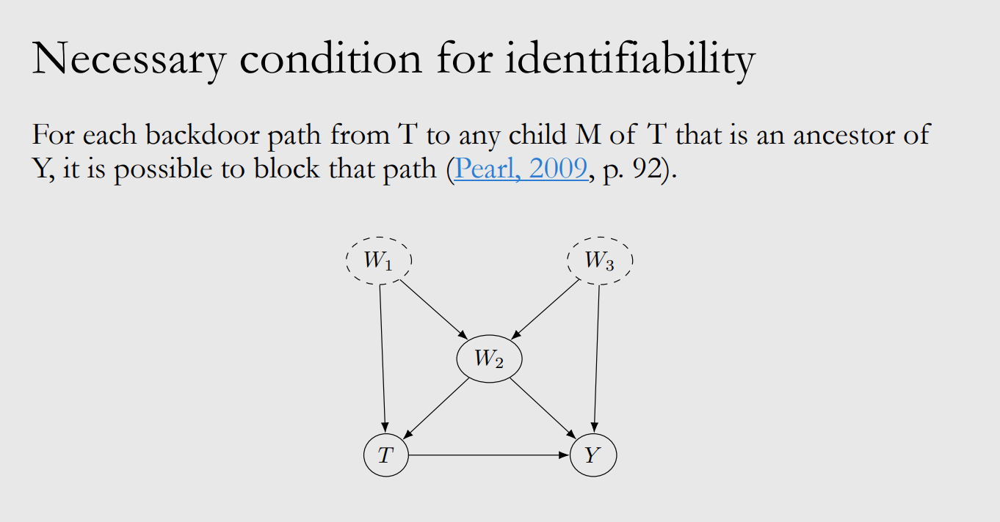

**Necessary and sufficient condition**

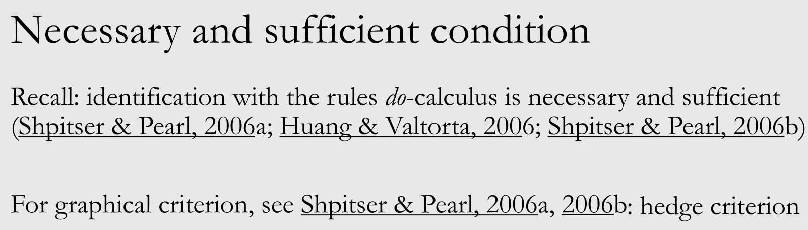

## Estimation

因果关系的估计：把不可观测的因果理论（Target Parameter），通过数学方法转化为可以用真实数据计算的统计数值（Statistical Estimate）

**Estimation portion of the flowchart**

$$
\text{Statistical Estimand} \xrightarrow{\text{Estimation}} \text{Estimate}
$$

通过estimate来确定关系的强弱（条件的影响）

### Conditional Outcome Modeling / S-learner

COM 实际上把“因果推断”完全简化为了一个“监督学习的预测问题”

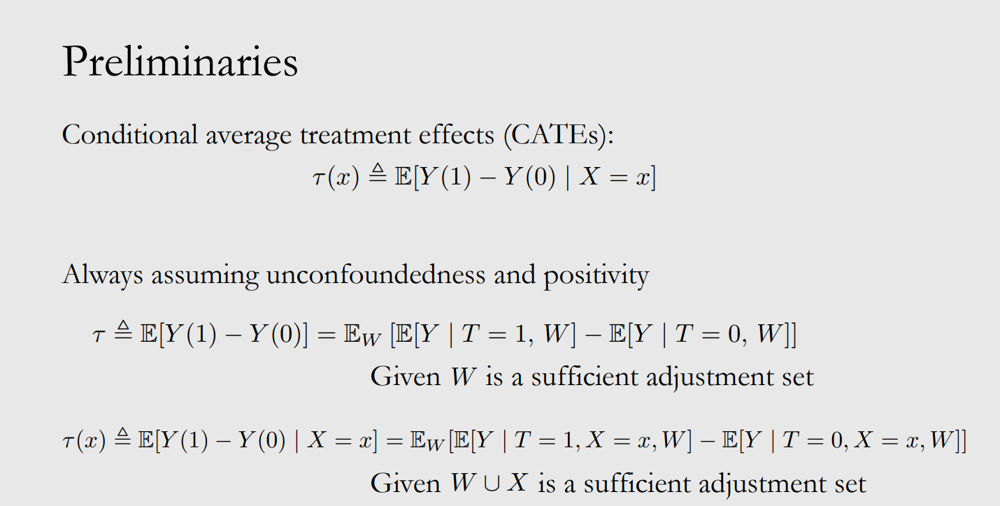

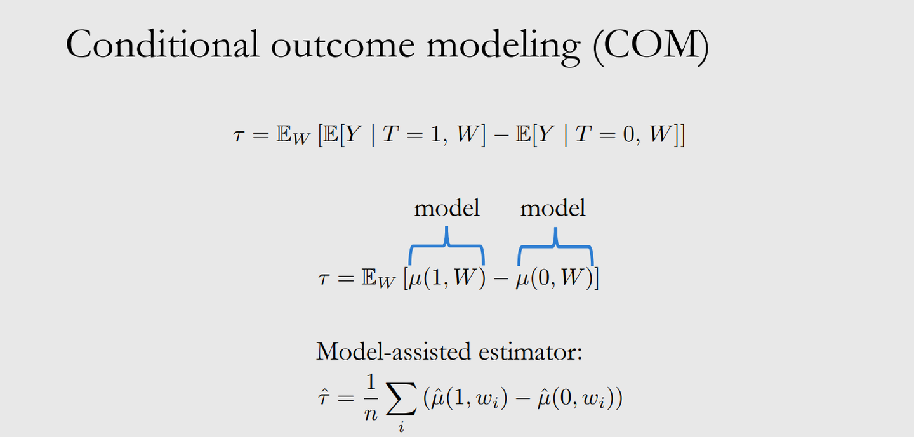

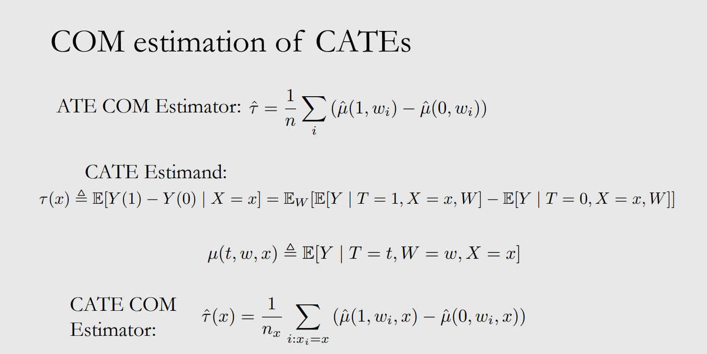

Q：$\hat{\tau}(x_i)=\hat{\mu}(1,w_i,x_i)-\hat{\mu}(0,w_i,x_i)$ 的问题在哪里

如果 $W$ 和 $X$ 各自独立都是suffecient adjustment set，则出现了对 $W$ 的过度控制。如果要求 $\hat{\tau}(x_i)$，需要对所有的 $W$ 取期望

$$
\text{CATE}(x_i) = \sum \Big( \hat{\mu}(1, w, x_i) - \hat{\mu}(0, w, x_i) \Big) P(W \mid X=x_i)
$$

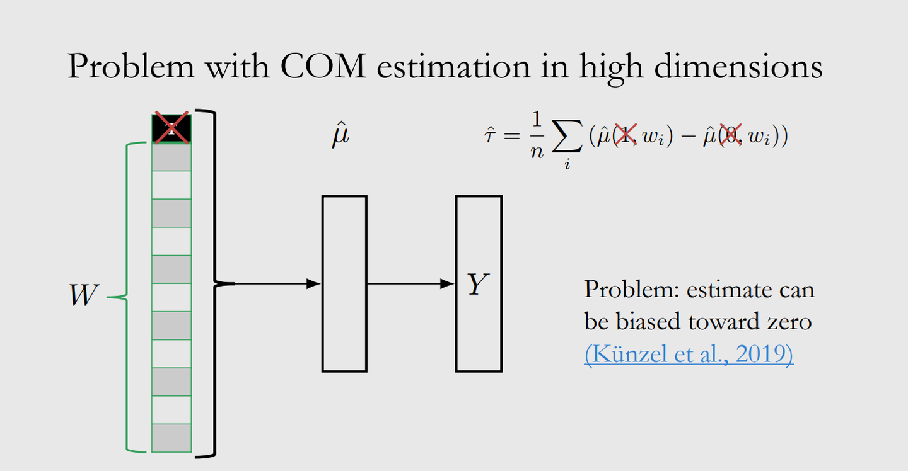

当输入的维度较高时，模型忽略 $T$

### Grouped COM（GCOM）/ T-learner

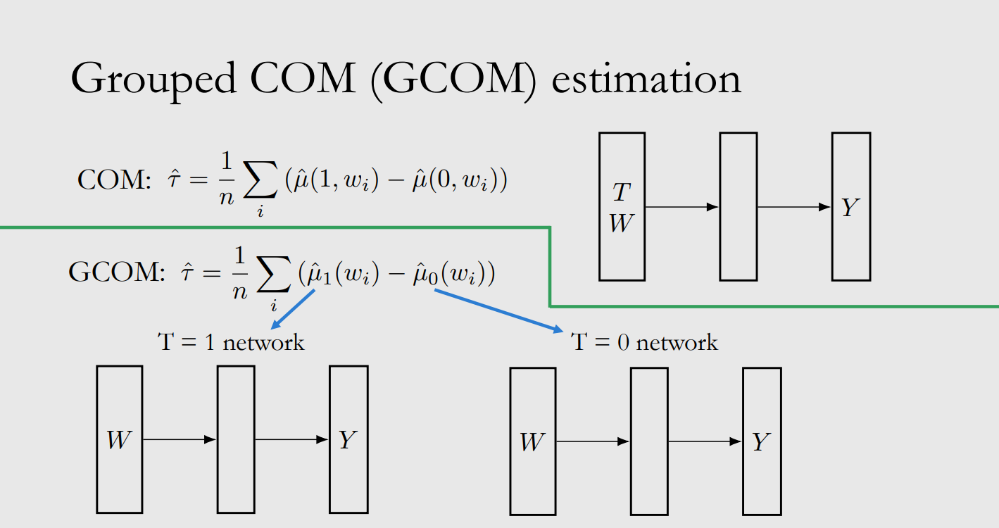
根据t的不同选用不同的网络。

1. **样本利用率低，估计方差大**
   
   处理、控制组分开训练模型，数据割裂；组别样本不均衡时模型不稳定，小样本MSE高于S-Learner。
2. **无法共享协变量公共模式，易过拟合**
   
   协变量与结果的基础关联不能跨组共享，单组样本不足时泛化能力差。
3. **双重模型误设风险**
   
   需要$μ₀, μ₁$两个模型同时设定正确，任一模型错配都会造成效应估计偏误；S-Learner仅需单个模型正确。
4. **异质性估计精度不足**
   
   分组拆分放大噪声，对强协变量-处理交互的捕捉效果弱于X-Learner、TARNet、Dragonnet等改进方法。

### Increasing Data Efficiency

解决COM估计器的bias问题（倾向于得到零估计）

**TARNet**

COM Too much bias! GCOM Too much variance!

结合这两个，TARNet 将网络分为两阶段：**共享表征层** + **独立假设分支层**。

共享表征层 ($\Phi$)：输入所有样本的特征 $X$，强迫网络利用全量数据学习底层的通用表征（Embeddings），提升数据稀疏区域的拟合能力。

假设分支层 ($h_0, h_1$)：网络在此分裂为两个独立的分支。
   - 若样本 $T_i=1$，其表征进入实验组分支 $h_1$ 预测 $\hat{Y}(1)$；
   - 若样本 $T_i=0$，其表征进入对照组分支 $h_0$ 预测 $\hat{Y}(0)$。

**X-Learner**

解决在实际业务中实验组和对照组样本极度不平衡导致的估计不准问题。核心思想是“交叉（Crossover）”：利用对照组的模型去预测实验组的反事实，再用实验组的模型去预测对照组的反事实。

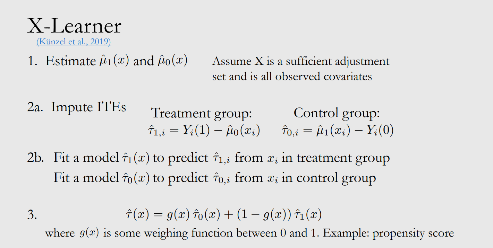

### Propensity Scores and IPW

**Propensity Score Theorem**

Propensity scores:
在重合性假设（Positivity）成立的前提下：如果已知条件 $W$ 能够满足无混淆性假设（Unconfoundedness），那么已知条件改为倾向性得分 $e(W)$ 时，同样能满足无混淆性假设。

$$
\big( Y(1), Y(0) \big) \perp \!\!\! \perp T \mid W \implies \big( Y(1), Y(0) \big) \perp \!\!\! \perp T \mid e(W)
$$

其中，
$$
e(W) = P(T = 1 \mid W)
$$

即使 $W$ 是高维的，$e(W)$ 也仅仅是1维的！

倾向性分数定理
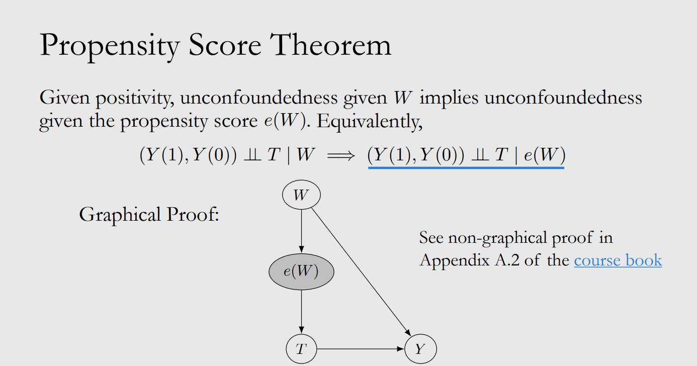
positivity violation的概率变小了，因为W的维度变化不会造成positivity的变化（破除了维度的诅咒Positivity-Unconfoundedness Tradeoff）

然而我们只能通过模型学习$e(W)$而不能直接得到，所以实际上他并没有解决高维 $W$ 带来的重合性低下的问题

Q: What is the intuition behind why we can 
condition on e(W) instead of W?

A: 倾向性得分 $e(W)$ 是混淆变量 $W$ 的“充分统计量”（Sufficient Statistic）。它把高维特征中所有“能够解释干预分配（Treatment Assignment）”的有用信息给完全提炼了出来。

**Pseudo-populations**

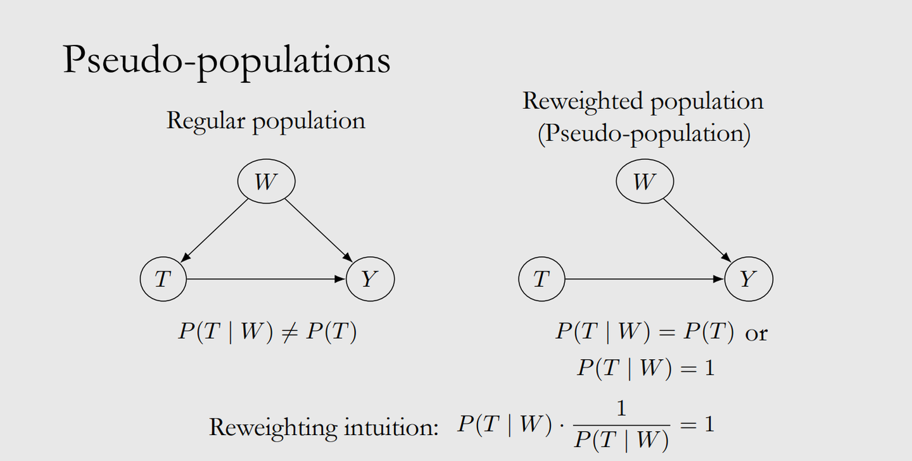
伪总体：通过对原始观测数据进行加权（Weighting）或匹配（Matching）后，在数学上虚拟构建出的一个新总体。有IPW和PSM等加权方式来构造伪总体。所以我们在加权后T和W独立，且 $(Y(1), Y(0)) \perp \!\!\! \perp T$。所以我们可以不用模型估计ATE而是直接计算

$$
\text{ATE} = \mathbb{E}_{pseudo}[Y \mid T=1] - \mathbb{E}_{pseudo}[Y \mid T=0]
$$

缺点：
1. 极端权重引发方差膨胀（Variance Inflation Due to Extreme Weights）
   - 机制：若某些样本的倾向性得分 $e(W)$ 极度趋近于 $0$ 或 $1$（即高维特征空间中重合度极低），其逆概率权重 $\frac{1}{e(W)}$ 或 $\frac{1}{1-e(W)}$ 将呈指数级放大。
   - 后果：极少数边缘异常样本在伪总体中获取了过高的统计权重，从而绑架全局估计量，导致最终因果效应估计的方差剧烈爆炸，数值结果极不稳定。

2. 对未观测混淆变量缺乏鲁棒性（Vulnerability to Unobserved Confounders）
   - 机制：伪总体的构建（无论是基于加权还是匹配）本质上属于基于显性变量的调整法，完全依赖于已观测到的协变量集合 $W$。
   - 后果：若数据中存在未被观测或未纳入模型的关键混淆变量（如隐藏的用户心理动机或外生政策冲击），伪总体在这些未观测维度上依然存在选择性偏差，无法消除由于后门路径未完全关闭导致的因果偏误。

**Inverse probability weighting (IPW)**

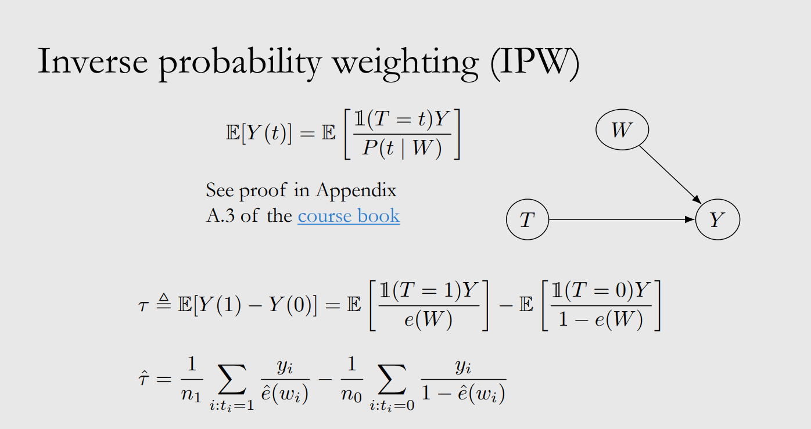
重加权通过改变比例，在数学上强行制造了独立性

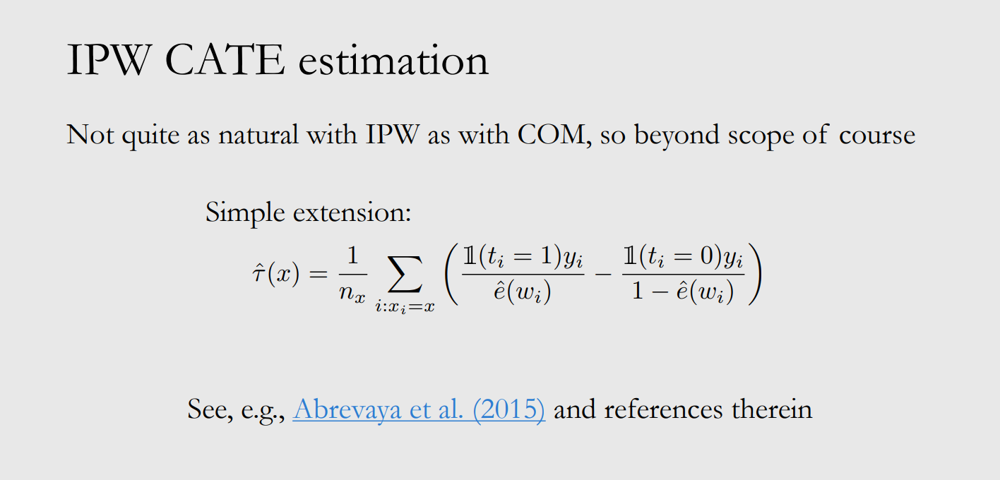

### Other Methods

**AIPW（Augmented Inverse Probability Weighting）**

AIPW（增强逆概率加权）是现代因果推断的行业标准估计器。它完美结合了“基于结果建模（如 TARNet）”与“基于倾向性得分（如 IPW）”两大流派，具有极其硬核的统计学性质。

AIPW 内部同时驱动两个模型：
1. 结果模型 $\hat{\mu}(T, X)$：预测用户的观测结果（如消费额）。
2. 倾向性得分模型 $\hat{e}(X)$：预测用户接受干预的概率（如发券率）。

> 双重稳健（Double Robust）：只要这两个模型中任意一个是正确设定的，AIPW 就能推导出完全无偏的因果效应估计。只有当两个模型同时猜错时，结果才会失效。这极大地提高了抗模型设定偏误（Misspecification）的能力。

AIPW 估计全局平均干预效应（ATE）的公式如下：

$$\hat{\tau}_{AIPW} = \frac{1}{N}\sum_{i=1}^N \left[ \left( \hat{\mu}_1(X_i) + \frac{T_i(Y_i - \hat{\mu}_1(X_i))}{\hat{e}(X_i)} \right) - \left( \hat{\mu}_0(X_i) + \frac{(1-T_i)(Y_i - \hat{\mu}_0(X_i))}{1 - \hat{e}(X_i)} \right) \right]$$

- 主干部分（结果模型预测）：$\hat{\mu}_1(X_i) - \hat{\mu}_0(X_i)$。先用结果模型强行“脑补”出两个世界的差值（即传统的 COM 减法）。
- 尾巴部分（残差加权纠偏）：$\frac{T_i(Y_i - \hat{\mu}_1(X_i))}{\hat{e}(X_i)}$。模型用真实观测值 $Y_i$ 减去预测值得到**残差**，并用倾向性得分的倒数作为权重。
  - 直觉：如果结果模型预测得很准，残差为 0，尾巴消失，全靠结果模型；如果结果模型画歪了，残差不为 0，尾巴会利用概率权重把画歪的部分动态修正回来。

相比于纯 IPW（伪总体），AIPW 引入了结果模型来平滑数据，从而在很大程度上缓解了极端权重导致的“方差海啸”。

渐进正态性：即使第一阶段用的是非线性的强机器学习（如随机森林、神经网络），AIPW 最终计算出的 ATE 依然满足优良的中心极限定理，可以直接用于计算置信区间和 P 值。

缺点：依然要求满足无混淆性假设（无未观测混淆变量）。若关键特征缺失，双重稳健也无能为力。

**Matching**

为每一个样本在对立组中寻找最相似的克隆人，以此模拟随机对照实验（RCT）

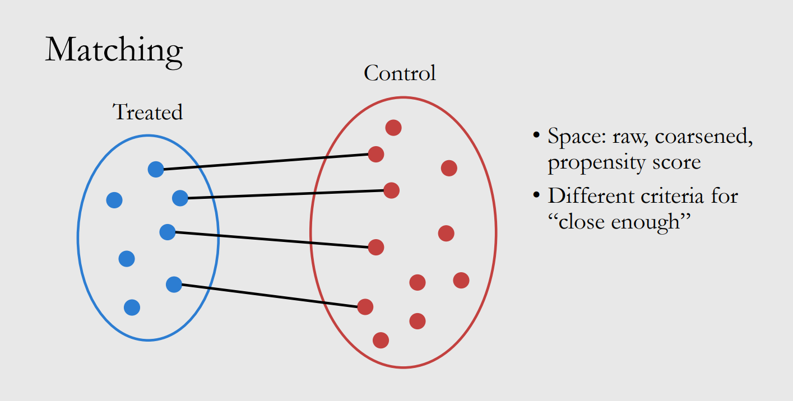

1. 针对实验组中具有高维特征 $W_i$ 的个体，在对照组中搜寻一个（或多个）特征 $W_j$ 极其相近的个体进行配对。
2. 成功配对后，直接对两组的观测结果进行差值计算。未成功匹配的“边缘样本”则被直接剔除（Trim）。

**double machine learning**

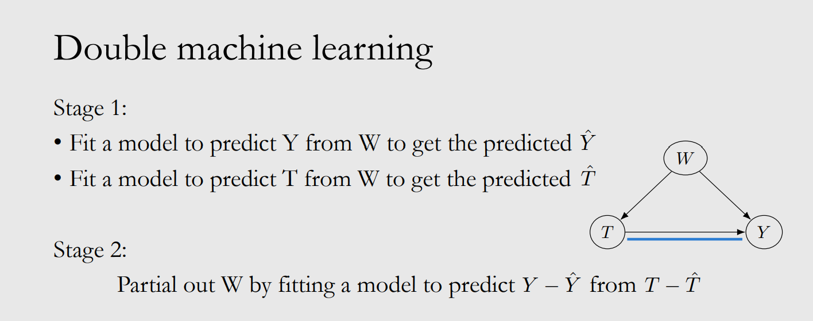

**Causal trees and forests**

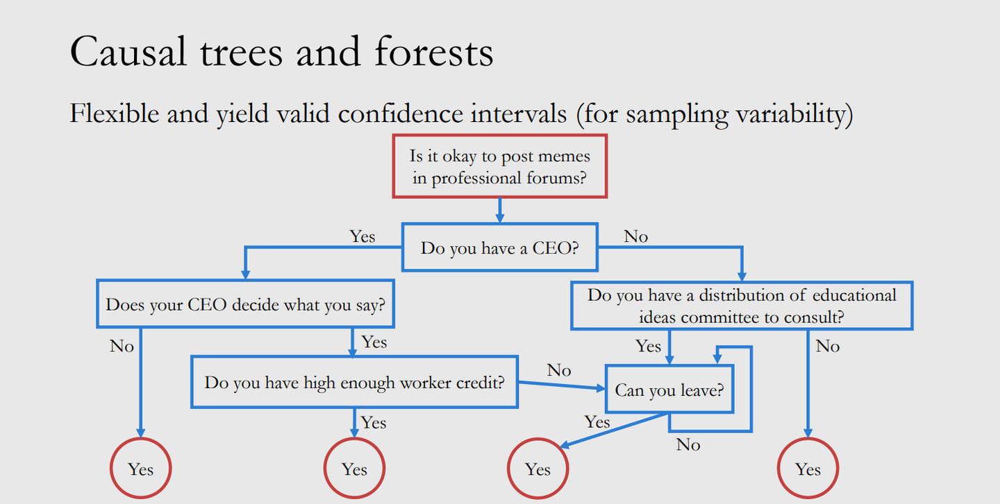

## reference

[Datahacker](https://www.zhihu.com/people/tinky2013)