[Brady Neal, "Introduction to Causal Inference"](https://www.bradyneal.com/causal-inference-course)
：written from a machine learning perspective

## Chapter 8 Unobserved Confounding, Bounds, and Sensitivity Analysis

Unobserved Confounding：不可观测混杂。

Q: 前门准则中的不可观测和这里的区别？

A: 不用前门的核心原因正是我们根本无法证实（甚至大概率会怀疑）是否存在未知的 $U$ 污染了中介路径，或者是否存在未被拦截的直接路径。（条件太过于苛刻：1. 无遗漏混杂 2. 完全中介/严格排他性）**你无法用数据去证明一个不包含在数据里的假设（You cannot test untestable assumptions）**

对于不可观测混杂，我们没有办法用 Adjustment Fomula 调整。我们只能调整可观测变量，因此会和真正的ATE有所误差（Confounding Bias），所以我们的目标是我们如何在算不准的前提下得出一个范围，而且我们希望这个范围尽可能的紧致。

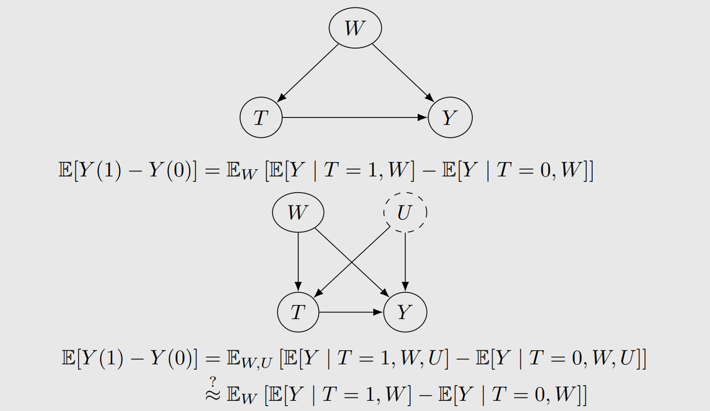

### Bounds

没有不可观测的混杂假设不现实，当我们假设没有不可观测的混杂，我们可以轻松的算出ATE，是一个点，如果我们有不可观测假设，我们最终得到一个区间，我们把这识别方式称为partial identification或者set identification。

> The Law of Decreasing Credibility: The credibility of inference decreases with the strength of the assumptions maintained
Manski(2003)

**No Assumption Bound**

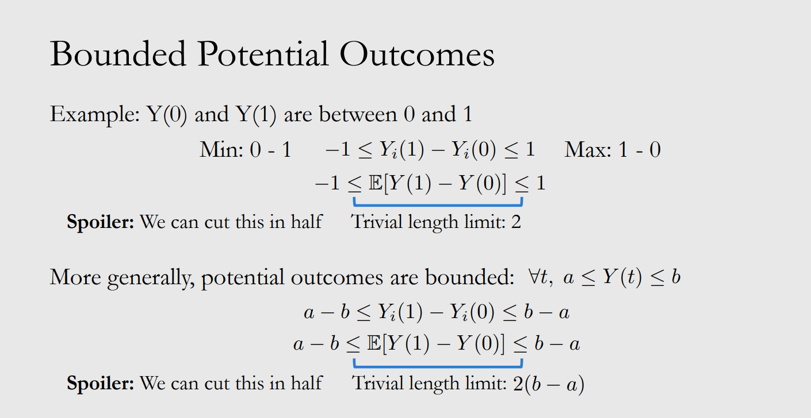

- Observational-Counterfactual Decomposition
    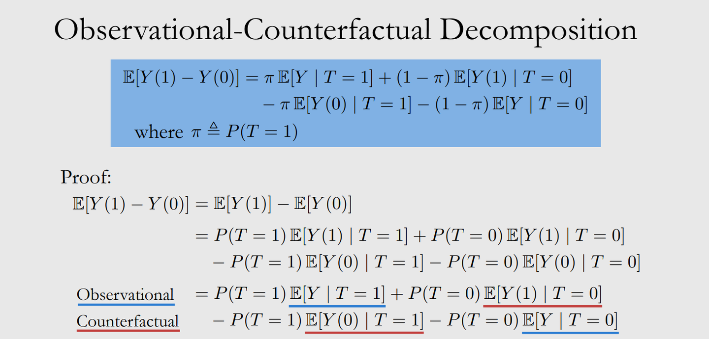
    对于反事实的部分我们期望我们能够得知他的区间范围。
    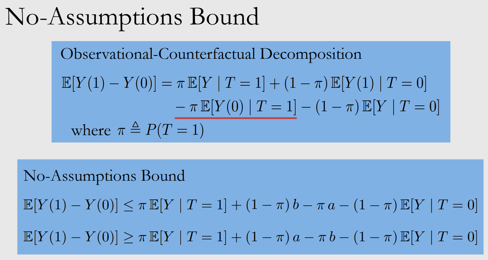
    No-assumptions interval length: $(1 - \pi)b + \pi b - \pi a - (1 - \pi)a$

Questions:
1. What kind of bounds can we get on the ATE if the potential outcomes are unbounded?

$$
(-\infty, +\infty)
$$

2. Assuming bounded potential outcomes, how much smaller of an interval can we get than the trivial interval [a – b, b – a]?

$$
\text{Width} = b - a
$$

4. Derive a more general no-assumptions bound where $a_1 \le Y(1) \le b_1$ and $a_0 \le Y(0) \le b_0$

$$
\tau_{\text{lower}} = \Big( \mathbb{E}[Y \mid T=1]\pi + a_1(1-\pi) \Big) - \Big( \mathbb{E}[Y \mid T=0](1-\pi) + b_0\pi \Big)
$$

$$
\tau_{\text{upper}} = \Big( \mathbb{E}[Y \mid T=1]\pi + b_1(1-\pi) \Big) - \Big( \mathbb{E}[Y \mid T=0](1-\pi) + a_0\pi \Big)
$$

$$
\text{Width} = \tau_{\text{upper}} - \tau_{\text{lower}} = (b_0 - a_0)\pi + (b_1 - a_1)(1-\pi) = (b-a)\pi + (b-a)(1-\pi) = b-a
$$

**Monotone Treatment Response (MTR)**

单调处理效应假设：

Nonnegative Monotone Treatment Response

所有个体处理效应都是非负的（treatment always helps）

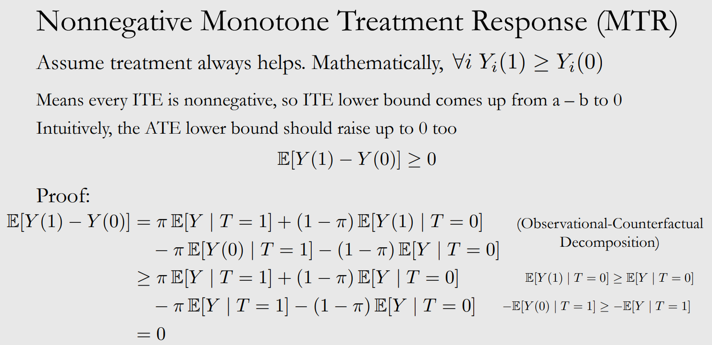

**Monotone Treatment Selection (MTS)**

单调处理选择假设：假设处理组的潜在结果好于对照组的

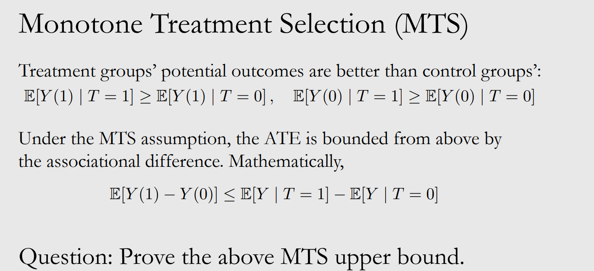
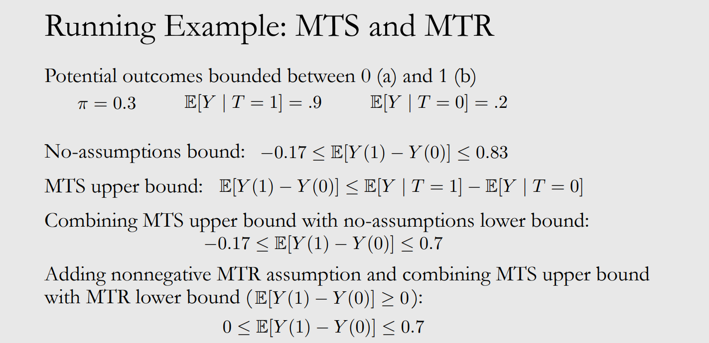
MTS估计出来的区间是包含0点的，这就说明这些边界的假设并不足以识别出treatment effect的符号

**Optimal Treatment Selection (OTS)**

最优处理选择假设：个体收到的处理对于他们而言是最好的

**OTS Bound 1**

假设： 控制组的人如果换一条路，表现会比他们自己现在的选择更差。

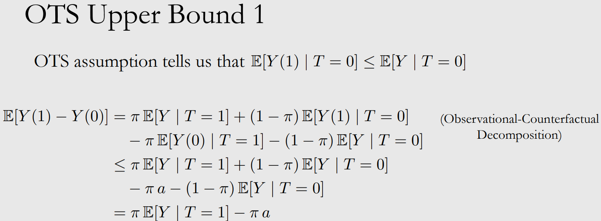
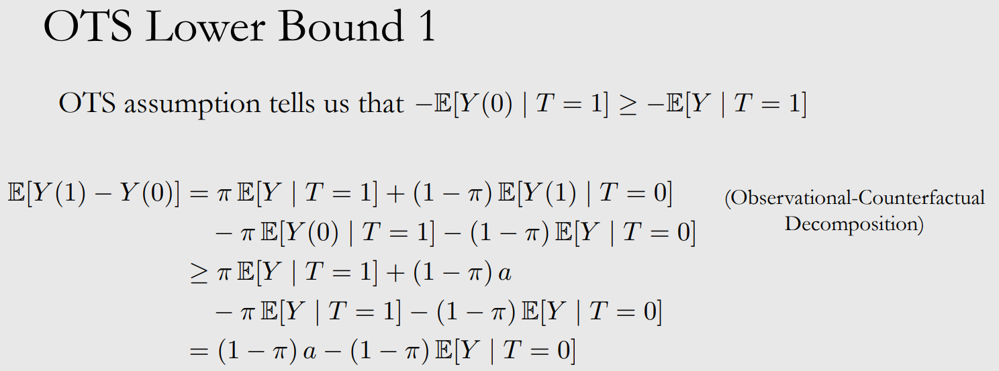
$$
\text{Interval Length} = \pi \mathbb{E}[Y \mid T = 1] + (1 - \pi) \mathbb{E}[Y \mid T = 0] - a
$$

**OTS Bound 2**

假设： 控制组的人如果换一条路，表现会比天生就选了那条路的那群人更差。

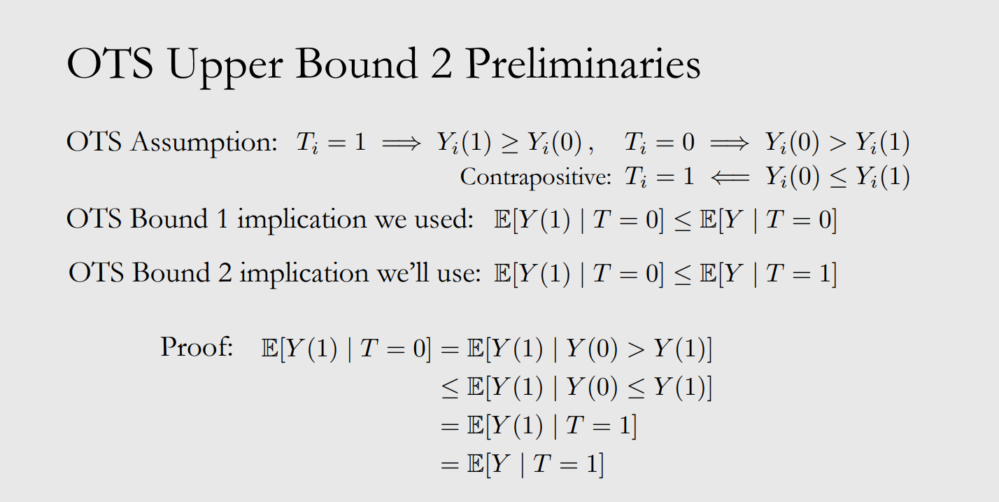

Upper Bound 2 (上界)：
$$
\mathbb{E}[Y(1) - Y(0)] \le \mathbb{E}[Y \mid T = 1] - \pi a - (1 - \pi) \mathbb{E}[Y \mid T = 0]
$$
Lower Bound 2 (下界)：
$$
\mathbb{E}[Y(1) - Y(0)] \ge \pi \mathbb{E}[Y \mid T = 1] + (1 - \pi) a - \mathbb{E}[Y \mid T = 0]
$$
Interval Length (区间长度)：
$$
\text{Interval Length}_2 = (1 - \pi) \mathbb{E}[Y \mid T = 1] + \pi \mathbb{E}[Y \mid T = 0] - a
$$

| 边界版本 | 猜测控制组去处理 ($\mathbb{E}[Y(1)\mid T=0]$) | 猜测处理组不处理 ($\mathbb{E}[Y(0)\mid T=1]$) | 适用场景（哪组更窄） |
| --- | --- | --- | --- |
| **Bound 1** | $\le \mathbb{E}[Y \mid T=0]$ *(跟自己比)* | $\le \mathbb{E}[Y \mid T=1]$ *(跟自己比)* | 处理人数少时 ($\pi < 0.5$) |
| **Bound 2** | $\le \mathbb{E}[Y \mid T=1]$ *(跟优势组比)* | $\le \mathbb{E}[Y \mid T=0]$ *(跟优势组比)* | 处理人数多时 ($\pi > 0.5$) |

Bound2可以识别因果效应的符号，但是代价就是估计区间的范围更大了。由于bound1和bound2都是处于同一个假设，因此我们可以在这两个区间中取一个交集（bound2的下界和bound1的上界）作为因果效应的估计

### Sensitivity Analysis

我们现在假设可以观测的 $W$ 和不可观测的 $U$ 给我们混杂

敏感性分析：confounder对treatment的影响有多强，以及confounder对outcome的影响有多强。（敏感性分析在现实中的作用是说明我们的结论可能有在假设和前提条件漏洞的情况下，是否仍然成立）

**Linear Single Confounder**

在有内生性问题（Endogeneity）的情况下，如何准确识别（Identify）出处理变量对结果变量的纯因果效应 $\delta$

Endogeneity:特指在估计某个具体的因果效应（比如 $T \to Y$）时，解释变量（$T$）与系统中的不可观测误差项（$U$）相关联的状态。

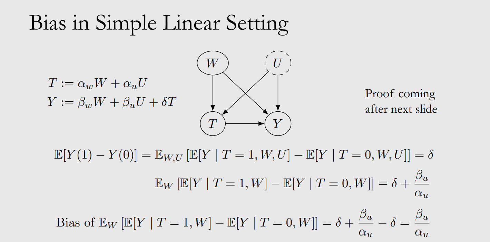

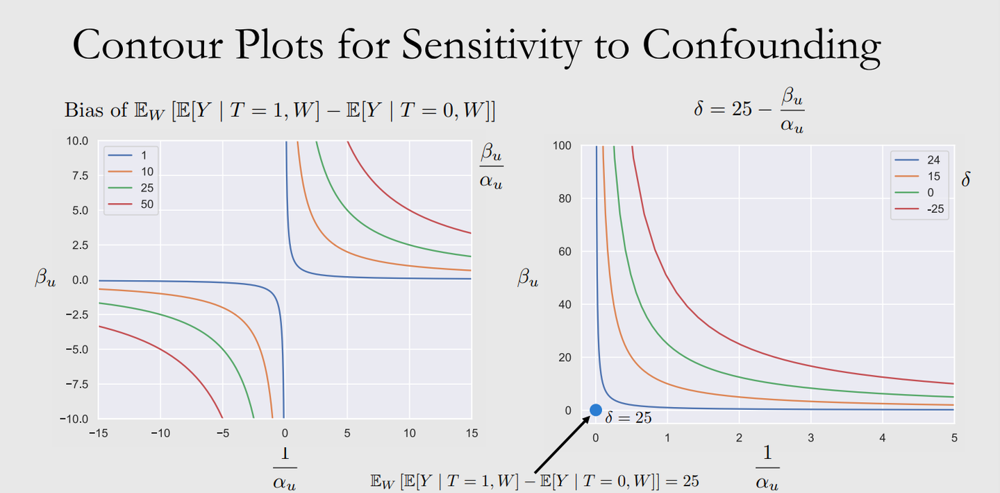
confounder对于treatment和outcome不同程度的影响，将会导致不同程度的bias，敏感性分析为我们提供了这种数量上的见解

proof：
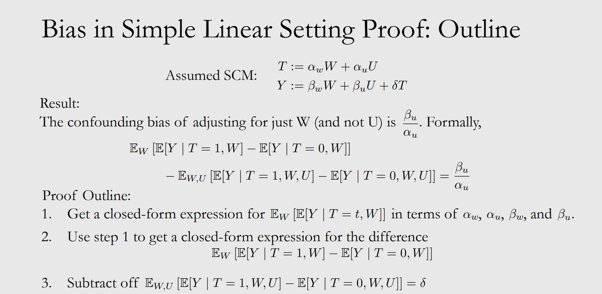
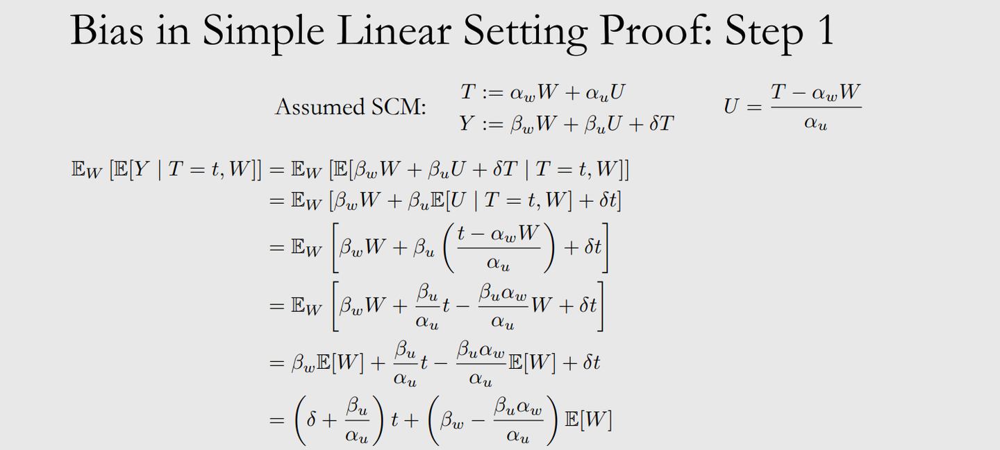
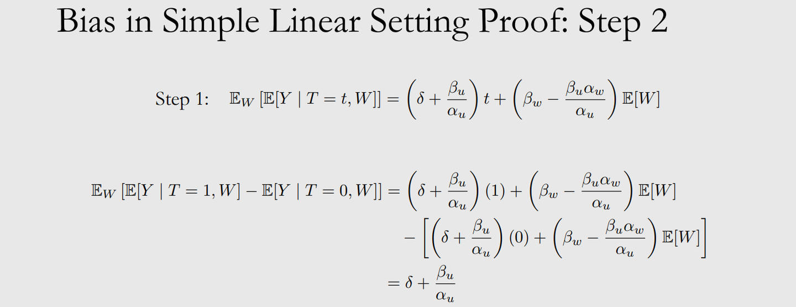
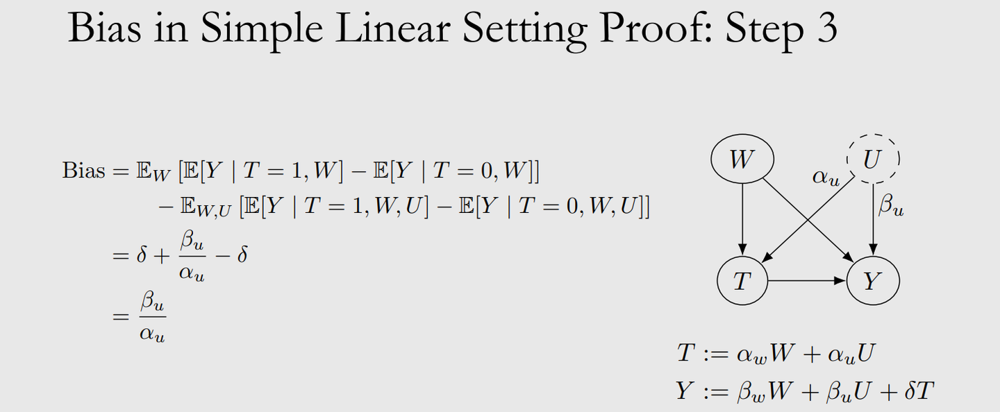

**Question 1: Proof of the Expectation Identity**

$$
\mathbb{E}[Y \mid T, W, U] = \beta_w W + \beta_u U + \delta T
$$

$$
\mathbb{E}[Y \mid T = 1, W, U] - \mathbb{E}[Y \mid T = 0, W, U] = (\beta_w W + \beta_u U + \delta) - (\beta_w W + \beta_u U) = \delta
$$

**Question 2: Does it work if $W$ is a vector?**

是的，依然成立。如果 $W \in \mathbb{R}^d$ 是一个向量，系数 $\alpha_w$ 和 $\beta_w$ 将相应地变为行向量（在 $T$ 和 $Y$ 为标量的情况下）。此时，方程中的乘积项转变为内积形式：$\alpha_w W = \sum_{i} \alpha_{w,i} W_i$ 以及 $\beta_w W = \sum_{i} \beta_{w,i} W_i$。在计算 $\mathbb{E}[Y \mid T = 1, W, U] - \mathbb{E}[Y \mid T = 0, W, U]$ 时，由于条件中固定了相同的 $W$ 向量，线性项 $\beta_w W$ 在相减时会完全抵消，剩下的结果依然只有 $\delta$。

**Question 3: Does it work if $U$ is a vector?**

情况与 $W$ 完全相同。若 $U$ 是一个向量，则 $\beta_u U$ 表示一个线性组合（内积）。由于条件期望中同时对 $U$ 的精确值进行了控制（Conditioning），在 $T=1$ 和 $T=0$ 的两个因果状态下，$\beta_u U$ 的值保持完全一致。通过减法操作后，该项被消去，最终结果保持 $\delta$ 不变

**Towards More General Settings**

**Binary Treatment**

干预变量（Treatment Variable）只有两种可能取值的情形（接受或者不接受）

N代表“噪声项”（Noise Term），也被称为外生变量（Exogenous Variable）或误差项（Error Term）。
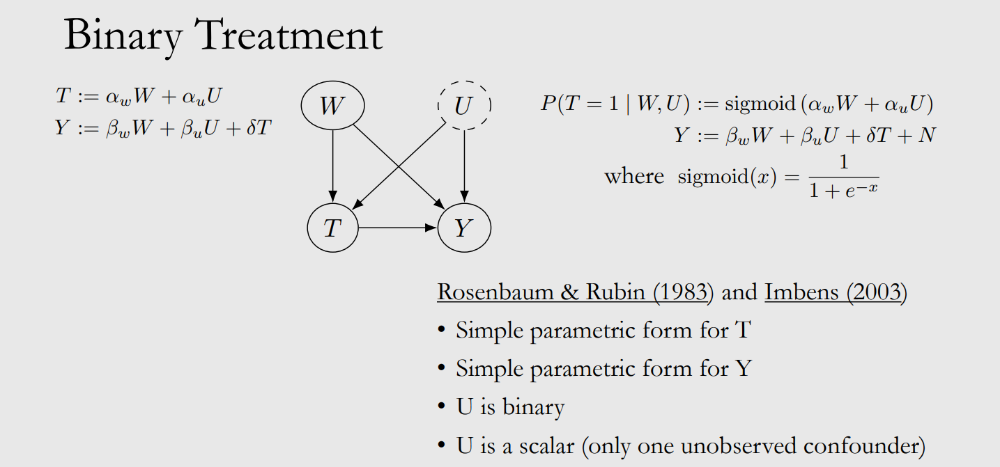

干预方程：$P(T = 1 \mid W, U)$ 其实就是广义线性模型中的 倾向得分（Propensity Score）。$\alpha_u$ 决定了隐藏混杂项 $U$ 对个体是否接受干预有多大影响

结果方程：$Y := \beta_w W + \beta_u U + \delta T + N$ 这是一个线性模型，其中 $\delta$ 是真实的因果效应（Treatment Effect），$N$ 是外生噪声项（Noise Term），$\beta_u$ 决定了 $U$ 对结果 $Y$ 的影响有多强。

Cinelli&Hazlett(2020)的文章中，他们去掉了第1,3,4条假设，提出了一个全新的敏感性分析框架，并开发了广受欢迎的 R/Python 工具包 sensemakr。它分析一个结论能承受多大强度的“隐藏干扰”（用百分比 $R^2$ 或 RV 表示）。只要现实中的干扰（比如贫富差距）达不到这个破坏强度，因果结论就是安全的。

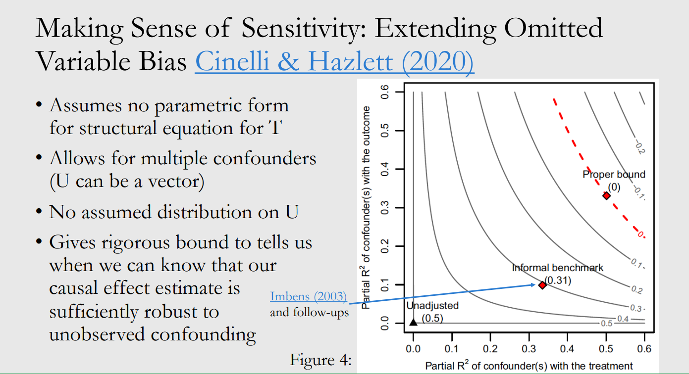

## Chapter 9 Instrumental Variables

### What is an Instrument?

工具变量是解决内生性问题（Endogenous Problem）以及识别因果关系的一种核心方法。它承认“未观测混杂”的存在，并且放弃去测量它，而是通过引入一个“外部的随机冲击”来强行破局。

> 既然 $X$ 被 $U$ 污染了（$U \rightarrow X$ 且 $U \rightarrow Y$），那我就不看 $X$ 的全貌。我引入一个外生变量 $Z$，让 $Z \rightarrow X$。 -- Gemini

工具变量需要满足三个假设：

1. **Relevance（相关性）**：工具变量 $Z$ 必须对自变量 $X$ 有因果效应，即在图模型中必须存在 $Z \rightarrow X$ 的路径。
2. **Instrumental Unconfoundedness（工具变量外生性/无混杂）**：工具变量 $Z$ 自身不能受到任何未观测混杂因素的污染，即 $Z$ 与因变量 $Y$ 的潜在结果（Potential Outcomes）独立。（不存在 $U \rightarrow Z$ 且 $U \rightarrow Y$）
3. **Exclusion Restriction（排他性约束）**：工具变量 $Z$ 对因变量 $Y$ 的任何影响都必须完全通过自变量 $X$ 来传导，即不存在 $Z \rightarrow Y$ 的直接路径或其他中介路径。（Removing edges corresponds to adding assumptions）

可以看出工具变量对外部冲击的要求高到了近乎苛刻的地步。在现实也很难找到合适的工具变量，即使找到了算出来的，通常只是局部平均因果效应（LATE, Local Average Treatment Effect）

Conditional Instruments 算是一个退而求其次的方法，是在控制了某些协变量 $W$ 之后才变得合格的工具变量。

### No Nonparametric Identification of the ATE

只有把所有后门路径都堵死，才能在不做任何功能形式假设的前提下，干净地剥离出 $T \rightarrow Y$ 的因果效应。

当有不可观测的混杂因素 $U$。这条后门路径（$T \leftarrow U \rightarrow Y$）是永远无法被堵死的。因为后门路径没被堵死，如果你不做任何数学假设（非参数），工具变量绝对无法帮你唯一确定全样本的 ATE。数据只能给你一个极其宽泛的边界（Bounds），而无法精准锁定一个值。

工具变量用以下两种方式算出精确值：
- 不再追求算全样本的 ATE，而是改算 LATE（局部平均因果效应）。在单调性（Monotonicity）等额外假设下，工具变量可以非参数地识别 LATE。

- 强行假设变量之间是线性关系（比如我们在两阶段最小二乘法 2SLS 里建立的线性结构方程）。一旦引入了“线性”这个强大的结构假设，工具变量就能算出 ATE。

### Warm-Up: Linear Setting

假设这里的因果是线性的，其中$Y := \delta T + \alpha_u U$（Z没有出现是因为排他性约束）
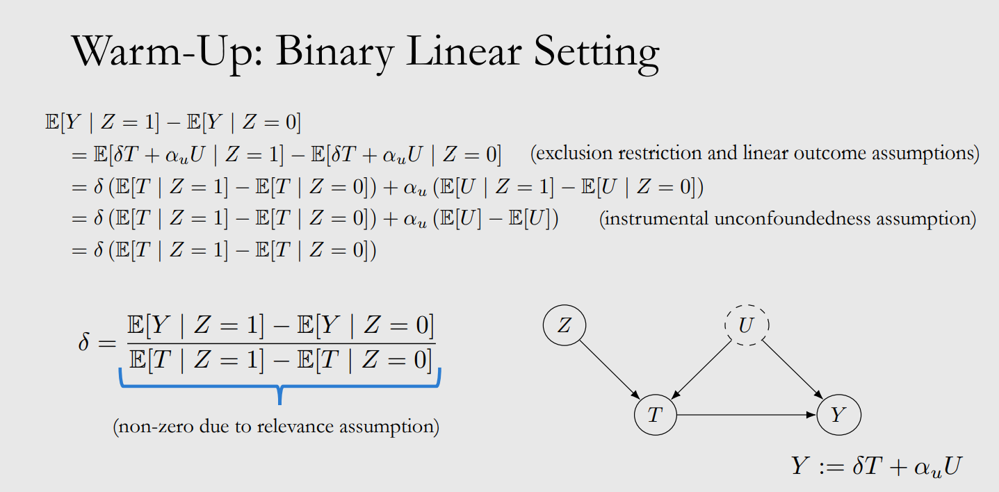
上面这样展示了工具变量如何用三个假设在数学上消除未观测混杂因素 $U$，从而精确识别出因果效应 $\delta$ 的全过程。

在线性假设下，我们可以从路径系数的图形学视角非常直观地理解工具变量（IV）的作用：
- **目标效应**：$\delta$ 是路径 $T \rightarrow Y$ 上的因果系数。
* **分子含义**：代表从 $Z$ 到 $Y$ 的总因果效应。因为 $Z$ 只能通过 $T$ 间接影响 $Y$（排他性约束），所以该效应可表示为两条路径系数的乘积：$\alpha_z \cdot \delta$（其中 $\alpha_z$ 是路径 $Z \rightarrow T$ 上的系数）。
* **分母含义**：代表从 $Z$ 到 $T$ 的因果效应，即路径系数 $\alpha_z$。

上述关于 $\delta$ 的因果识别式被称为 **Wald Estimand**。在实际应用中，我们可以直接将观测到的样本数据代入以下公式，计算出对应的 **Wald Estimate**：

$$
\delta = \frac{\frac{1}{n_1} \sum_{i:z_i=1} Y_i - \frac{1}{n_0} \sum_{i:z_i=0} Y_i}{\frac{1}{n_1} \sum_{i:z_i=1} T_i - \frac{1}{n_0} \sum_{i:z_i=0} T_i}
$$

**Continuous Linear Setting**

在 $T$ 和 $Y$ 连续的时候也可以使用
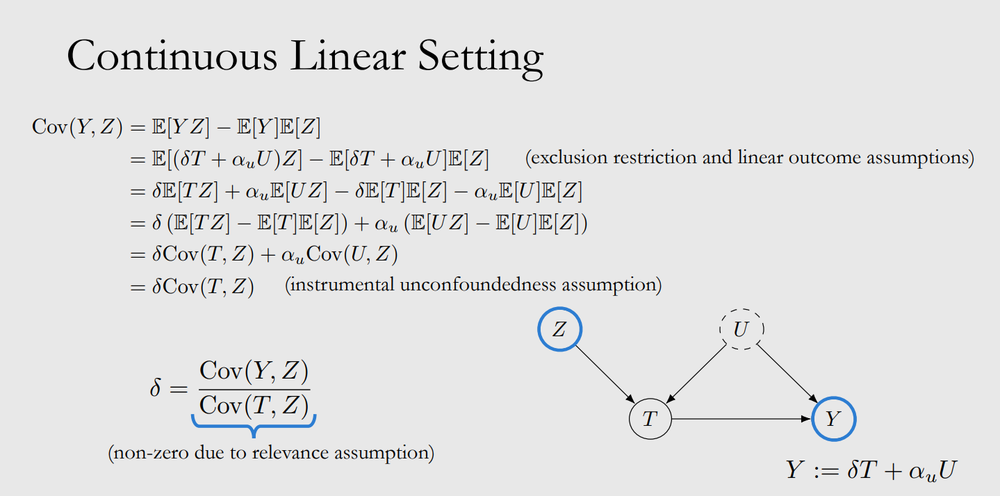

**Two-Stage Least Squares Estimato (2SLS)** 

通过回归，在数学上作投影，把和混杂变量相关的部分当作误差（Bias-Variance Tradeoff）
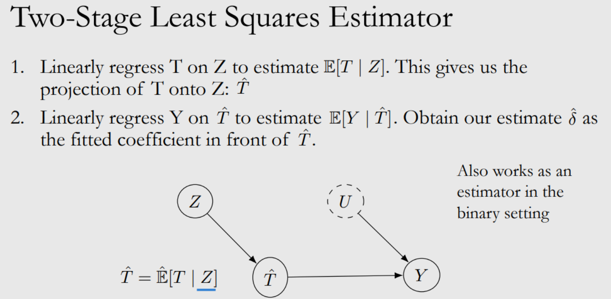
通过将 $T$ 替换为 $\hat{T}$，不可观测混杂 $U$ 对于因果识别的影响就被当作误差项不被考虑了。2SLS 在存在有效且足够强的工具变量时，利用外生处理变化绕开未观测混杂。当工具变量有效的时候，可以直接进行无偏的因果效应估计。
	​
2SLS 的两阶段处理逻辑和图形截断机制，在二元设定（Binary Setting）中也同样完全适用。

缺点：如果 $U$（未观测混杂）在现实中对 $T$ 的影响非常大，而工具变量 $Z$ 对 $T$ 的影响非常小，那么第一阶段过滤出来的 $\hat{T}$ 确实会“缩水”得非常厉害，甚至导致整个估计崩溃。（Weak Instruments Problem）。

### Nonparametric Identification of Local ATE

线性结果假设（Linear Outcome）限制极大。该假设隐含规定处理效应 $\delta$ 对所有个体（All Units）都是一个完全相同的常数（Homogeneous）。

如果在不做任何函数形式假设（Nonparametric）的前提下，工具变量还能实现因果识别吗？

**Potential Treatment**

如果改变工具变量 $Z$，个体的行为/选择（$T$）将会变成什么样

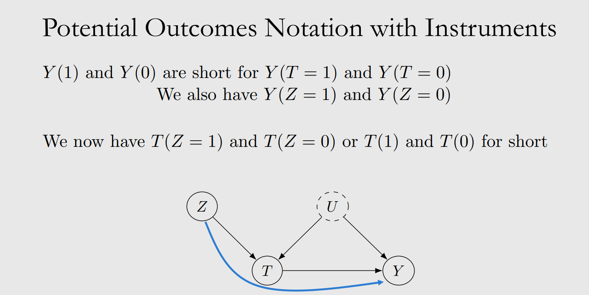

**Principle Strata**

它基于SUTVA，即假设每个人的行为反应是确定性的

Principal Strata 就是根据个体在面对外部冲击（工具变量 $Z$）时表现出的“潜在行为模式”，将全样本划分为四个互不重叠的“平行世界群体”。

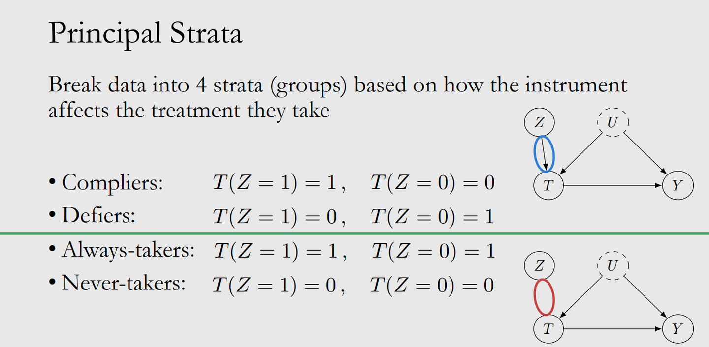

它允许我们在不观测具体混杂因素 $U$、不做线性假设的情况下，通过逻辑和条件独立性，把全样本的平均效应（ATE）精准降维剥离，聚焦到特定阶层的平均效应（LATE）上。

但是我们无法直接从观测数据中区分每个个体在哪个组

**Monotonicity Assumption  (No Defiers)**

假设对所有个体，恒有 $T(1) \ge T(0)$。即外部冲击（$Z$），对所有人行为的影响方向必须是一致的（单调递增的）。

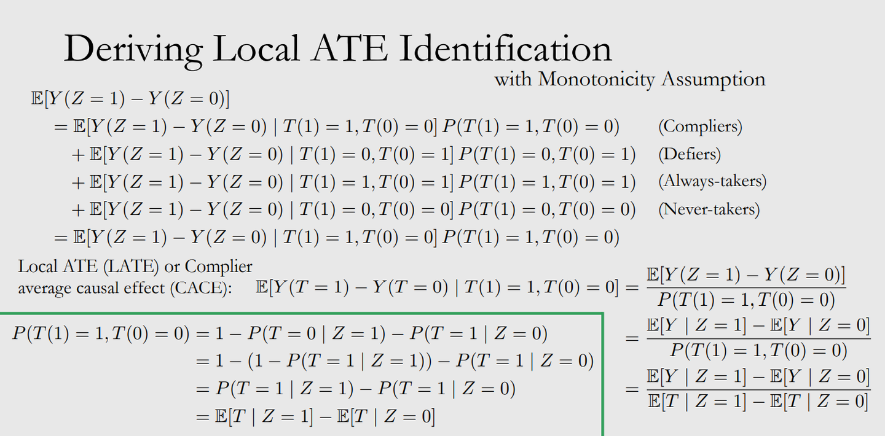

强行规定Defiers（刺头）的人数比例为 0。这样：Always-takers 恒等于 1，Never-takers 的恒等于 0，$Z$ 变不变对他们没影响，所以他们对结果的改变贡献为 0。Defiers 被单调性假设排除（人数为 0）。最终，整个数据中观测到的所有变化，百分之百纯粹是由 Compliers（顺从者阶层）这一个特定的 Principal Stratum 贡献的。

可以看到，公式右边的statistical estimand其实就是之前提到的Wald estimand。这种对于Local ATE的非参识别方式还面临着一些问题，比如Monotonicity的假设并不一定总是能够满足等。

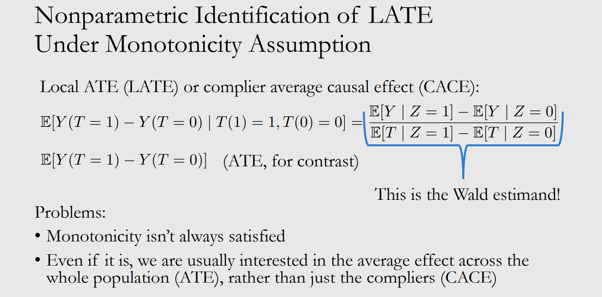

Q：为什么叫做LATE

A：因为他求出的效果是在特定假设下专门针对于依从者着一个群体的，在这个群体上干涉产生了什么效果

### More General Settings for the ATE

**Nonparametric Outcome with Additive Noise (Semi-parametric)**

$$
Y:= f(T,W) + U
$$

where $f$ can be some very flexible model such as a deep neural network 
(see, e.g., Hartford et al. (2017), Xu et al. (2020), and references therein)

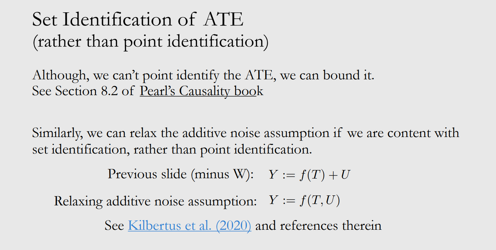

## Chapter 10 Difference-in-Differences

### Motivation and Preliminaries

双重差分：DID 的核心思想是通过两次求差（Double Differencing）来剔除无关因素，通过控制组的“自然演变”来模拟处理组“如果没有受到干预会怎样”，从而锁定真正的因果效应。之前学的工具（后门准则、敏感性分析、工具变量等）主要在解决“如何从单一时点（Cross-sectional）或强假设下消除混杂”，而 DID（双重差分法，Difference-in-Differences）用来解决“存在无法观测且随个体异质但随时间平稳的混杂”这一致命问题的。（消除不随时间改变的隐性混杂）

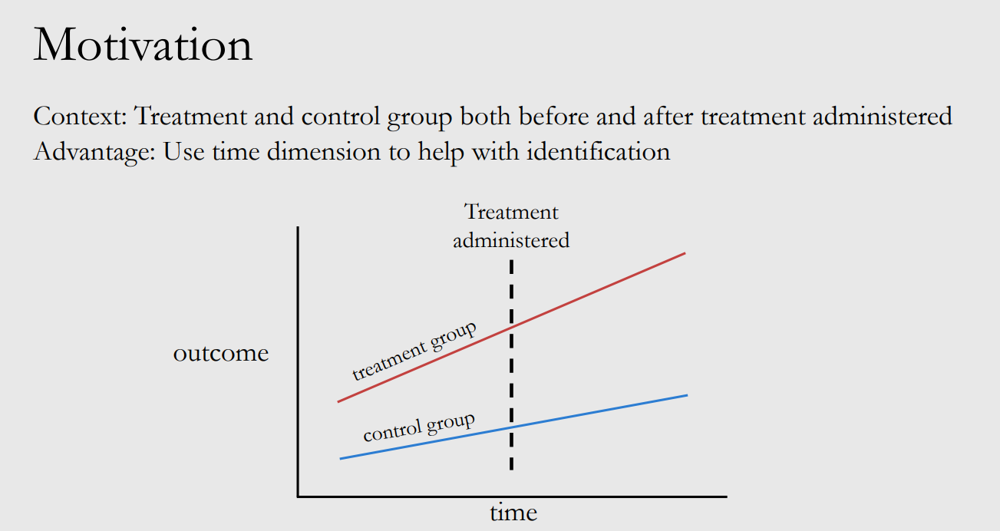
treatment group直到某个时间点才会得到它的treatment。因为引入了时间维度，我们才能观察到个体在政策前后的动态变化。通过扣除控制组随时间发生的自然演变，我们得以“识别（Identify）”出那部分纯粹由策略引起的、干净的因果净效应。

**ATT（Average Treatment Effect on the Treated）**

Treated Group在接受treatment前后发生的变化。
$$
\begin{aligned}

\text{ATT} =
\mathbb{E}[Y(1) - Y(0) \mid T = 1] &= \mathbb{E}[Y(1) \mid T = 1] - \mathbb{E}[Y(0) \mid T = 1] \\
&= \mathbb{E}[Y \mid T = 1] - \mathbb{E}[Y(0) \mid T = 1] \\
&= \mathbb{E}[Y \mid T = 1] - \mathbb{E}[Y(0) \mid T = 0] \quad \quad (Y(0) \perp\!\!\!\perp T) \\
&= \mathbb{E}[Y \mid T = 1] - \mathbb{E}[Y \mid T = 0]
\end{aligned}
$$

因为只是观察治疗组，所以只需要满足弱的无混杂（weaker Unconfoundedness）：$Y(0) \perp\!\!\!\perp T$，ATT观察这群已经干预的人，如果当时没干预会怎样。

### Difference-in-Differences Overview

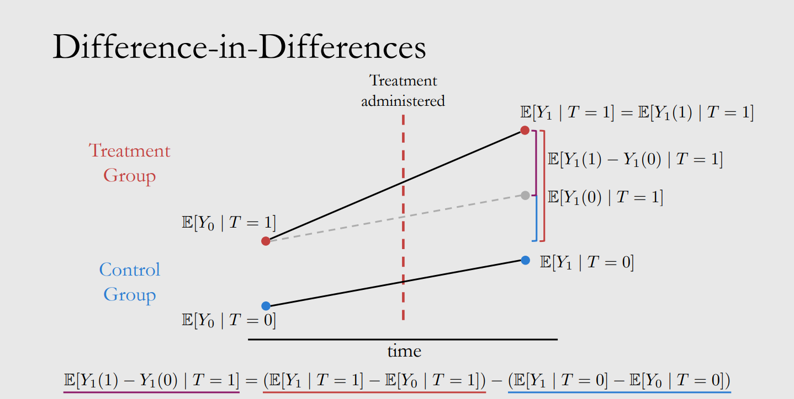
图中左边的点没有重合因为选择偏差（Selection Bias），无法实现RCT，所以我们并不能保证$(Y(0) \perp\!\!\!\perp T) $，因此我们引入了时间轴，现在$\mathbb{E}[Y \mid T = 1]$ 代表这一组 $Y$ 将会在未来接受 $T = 1$

> Unobserved confounders that are constant with time are no problem, since they’ll cancel out in the time differences

用现实中实际观测到的样本平均值（Sample Mean），去代替期望值来估计双重差分（DID）等式右侧

### Assumptions and Proof

**Consistency Assumption Extended to Time**

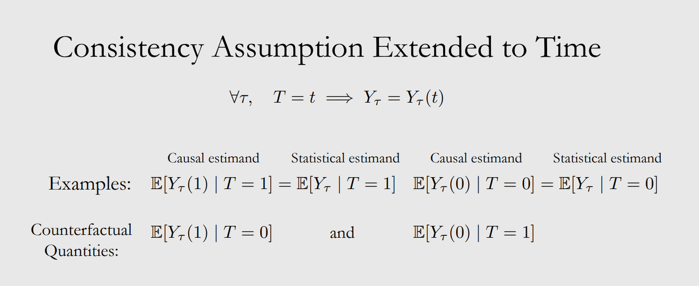
一致性假设对所有的时间点都成立。但是假设并不能为我们提供counterfacual quantities需要的信息，因此我们需要**Parallel Trends Assumption**

**Parallel Trends Assumption**

实验组随着时间的变化应该和对照组相同，也就是说灰线需要和蓝线平行：

$$
\mathbb{E}[Y_1(0) - Y_0(0) \mid T = 1] = \mathbb{E}[Y_1(0) - Y_0(0) \mid T = 0]
$$

**No pretreatment effect**

策略的发布和落地不能让处理组提前做出反应。 只有确保干预前的数据是纯粹的事实、没有掺杂对未来的预期，我们才能安全地用时点 0 的观测值作为基准，去和对照组做平行外推。

$$
\mathbb{E}[Y_0(1) \mid T=1] = \mathbb{E}[Y_0 \mid T=1]
$$

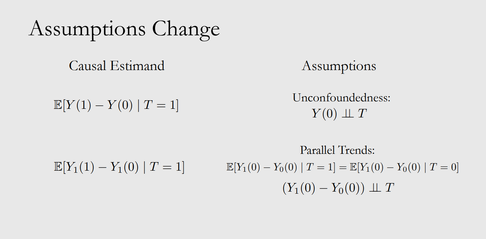
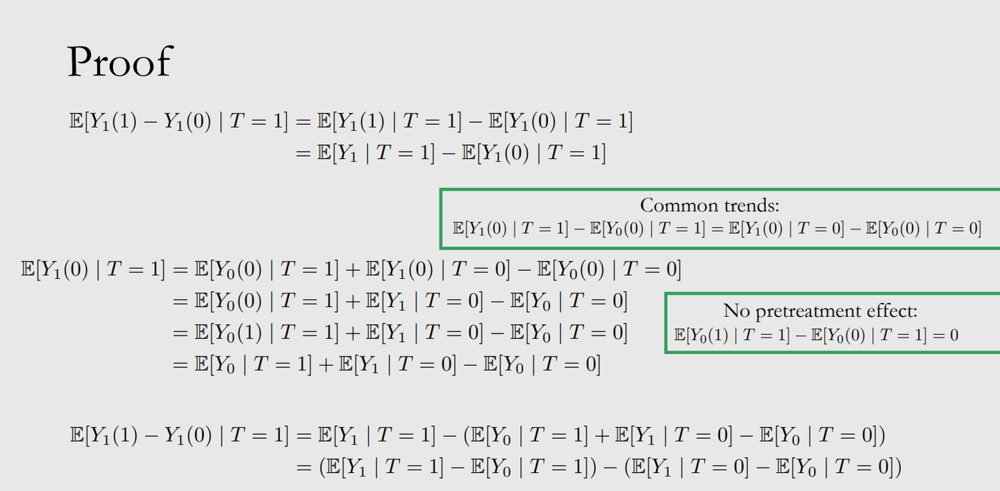

### Problems with Difference-in-Differences

**Violations of Parallel Trends**

平行趋势假设可能不成立：如果 $Y$ 的结构方程中包含 $T \tau$（干预标签 $T$ 与时间 $\tau$ 的交叉相乘项 / 交互项），说明处理组和对照组随时间变化的轨迹天然就是分叉的

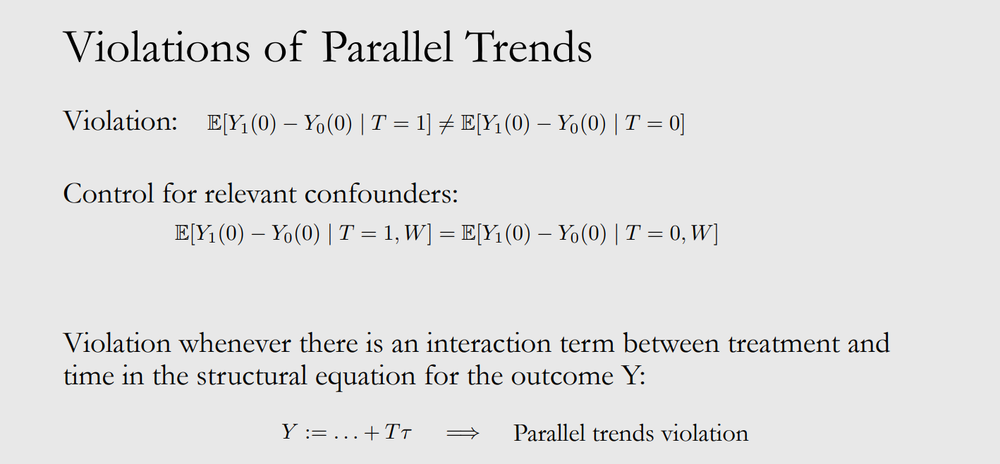

两组在初始状态下存在随时间变化的混杂变量（Time-varying Confounders），通常称为 $W$。我们可以把那些导致它们不平行的非时间平稳协变量 $W$ 给控制（Condition on）住：
$$
\mathbb{E}[Y_1(0) - Y_0(0) \mid T = 1, W] = \mathbb{E}[Y_1(0) - Y_0(0) \mid T = 0, W]
$$
在这些特定的 $W$ 分层内部，它们的趋势就是平行的。
当我们在 DID 中引入协变量 $W$ 来挽救平行趋势时（即要求在相同的 $W$ 下趋势平行），必须同时满足假设：
1. 无重叠假设 / 共同支撑域 (Overlap / Common Support)

    在 $W$ 的任何一个细分内，既要有实验组，也要有对照组。
$$
0 < P(T=1 \mid W) < 1
$$

2. 协变量的时间平稳性 (Covariates Unaffected by Treatment)
    
    控制的特征 $W$，其数值绝对不能被干预（Treatment）本身所改变。如果策略会改变 $W$（$T \rightarrow W \rightarrow$ 结果 $Y$），此时 $W$ 就变成了中间变量（Mediator）。如果在模型里强行控制中间变量，就会犯“过量控制偏差（Overcontrolling Bias）”的错误。

**Parallel Trends is Scale-Specific**

平行趋势假设依赖于（Scale-Specific）：特定度量尺度/具体函数形式
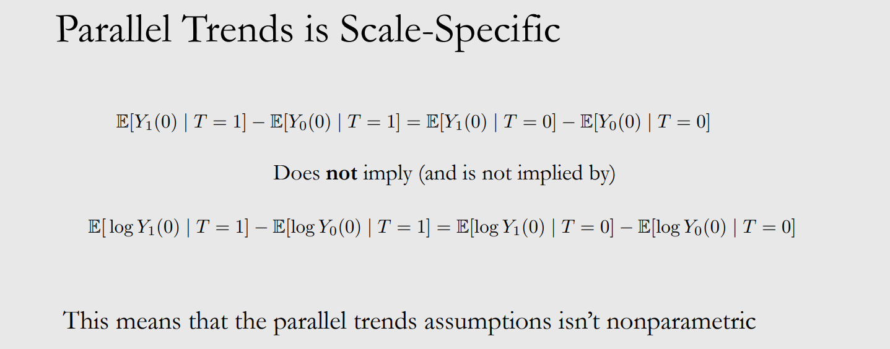

Question:
1. Is parallel trends satisfied if time and treatment interact in producing the outcome?

    No
2. If parallel trends is satisfied, is it also satisfied for arbitrary transformations of the outcome variable?
    绝大多数情况下不满足（No）
**This means that the parallel trends assumptions isn't nonparametric.**
1. “检验”与“建模”的尺度必须绝对统一
2. 根据业务逻辑选择尺度，而不是根据数据分布

## Chapter 11 Causal Discovery from Observational Data

现实场景中我们只有观测数据，不知道变量间真实因果有向无环图（DAG），因果发现（Causal Discovery） 就是从纯观测数据反向还原因果图的整套方法，也叫结构识别（Structure Identification）。

### Independence-Based Causal Discovery

在无法进行干预实验、只有观测数据时，我们最直接的想法是利用变量之间的条件独立性来推导因果图。为了从概率分布（数据）反推因果结构（图），必须建立数据和图之间的桥梁。这需要满足一系列基本假设。

**Markov Assumption**
$$
X \perp_{G} Y | Z \Rightarrow X \perp_{P} Y | Z
$$
如果在因果图 $G$ 中，变量 $X$ 和 $Y$ 在给定 $Z$ 的情况下是 d-分离（d-separated） 的，那么在数据产生的真实概率分布 $P$ 中，$X$ 和 $Y$ 在给定 $Z$ 时也一定是条件独立的。简单来说，因果图中的分离关系可以转化为数据中的独立性。（反过来不可以）

**Faithfulness Assumption**

$$
X \perp_{G} Y | Z \iff X \perp_{P} Y | Z
$$
它是马尔可夫假设的反向延伸。它要求数据中的所有条件独立性，都必须是由图的结构（d-分离）引起的，而不能是由于参数的巧合而相互抵消。
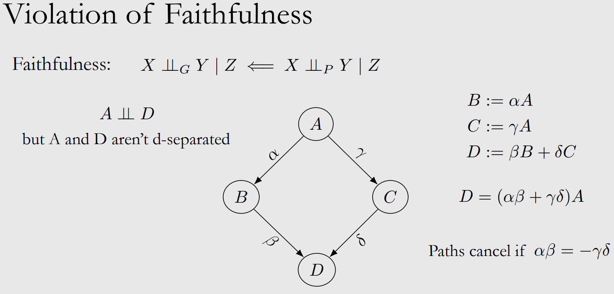

**Causal Sufficiency**

假设图中所有变量的共同原因（混杂因素，Confounders）都已经被观测到了，不存在未观测到的隐变量同时影响图中的两个或多个变量。

**Acyclicity**

假设真实的因果系统不存在反馈环路（即因果图是一个 DAG）。

Q：Why is the Markov assumption (plus causal 
sufficiency and acyclicity) not enough for 
learning causal graphs from data?

A: 1.存在马尔可夫等价类（Markov Equivalence Classes）2. 缺少忠实性假设时会出现忠实性违背（虚假条件独立）

### Markov Equivalence and Main Theorem

有了上述假设，因果发现依然困难？因为不同的因果图可能表达完全相同的独立性（Markov Equivalence Classes）

**Markov equivalence class**：一组不同的有向无环图 (DAG)，若它们能生成完全一样的全部条件独立关系，就同属一个马尔可夫等价类。定义为独立关系完全相同（图能推导出的所有（条件 / 无条件）独立、不独立规则）

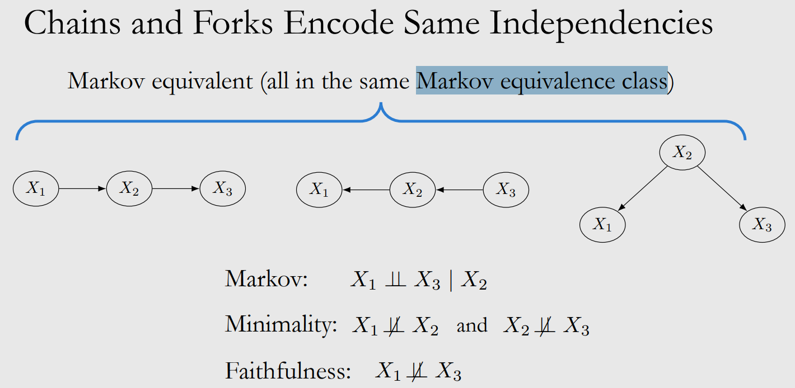

**Immoralities are Special**

冲突结构（Immorality）无法和其他结构归入同一个马尔可夫等价类，有独一无二的概率独立性特征。

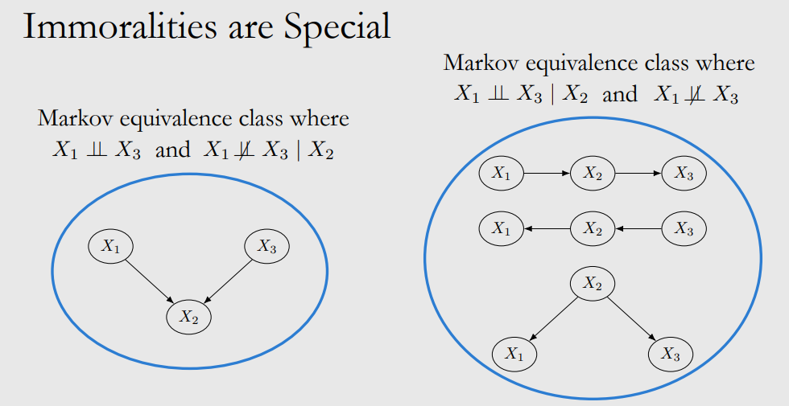

**Skeleton**

忽略因果图中所有箭头的方向，只保留连接关系的无向图。

**Markov Equivalence via Immoral Skeletons**

判定定理（Verma & Pearl）两个 DAG 等价，当且仅当二者：
- 拥有完全相同的骨架（去掉所有箭头后的无向图）；
- 拥有完全相同的冲突点（V 型对撞 immorality）。

CPDAG（Essential Graph）： 基于这个定理，基于独立性的算法能学到的极限就是一个部分有向无环图（CPDAG），其中无法确定的边（如链和叉）保持无向，而能确定的边（如V结构）保持有向。

所以找等价图可以翻转任何不发生冲突的边

### The PC Algorithm

基于独立性寻找 CPDAG 的经典算法

1. 识别骨架（Identify the Skeleton）：
    - 先构造全连接无向图；
    - 若存在条件集$Z$（可以是空集）使得$X \perp\!\!\!\perp Y \mid Z$，就删掉$X-Y$无向边；
    - 从空条件集开始，逐步增大$Z$的规模判断独立性。 
2. 识别并定向 V-结构（Identify Immoralities and orient them）：
    - $X$和$Y$之间没有直接边（上一步骨架构建时，已经通过独立性删掉了$X-Y$的边）；
    - 让$X$、$Y$条件独立的条件集里，不包含中间节点$Z$。
 
    则说明 $Z$ 无法将它们分离，因此该路径必为 V-结构：$X \rightarrow Z \leftarrow Y$。  
3. 合理延伸（Orient qualifying edges incident on colliders）：
    
    利用已识别出全部对撞结构这一结论（不能产生新的V结构”和“不能产生有向环”的逻辑规则（如 Meek 规则）），为更多无向边确定箭头方向

    Meek 规则：因果发现中给骨架定向的约束推导工具，靠禁止 “新增对撞 / 生成环路” 锁定必须固定的箭头，最终输出唯一的 Essential Graph 代表整个马尔可夫等价类

**Removing Assumptions**

独立性方法的局限性与扩展移除假设的扩展：

如果有未观测到的混杂因素（无因果足备性）：使用 FCI 算法。  

如果有环路（无阿周期性）：使用 CCD 算法。  

两者都无：使用 基于 SAT（可满足性）的因果发现。  

**Hardness of Conditional Independence Testing**

致命弱点：条件独立性检验的硬伤

这些算法严重依赖独立性检验的准确性。

想要得到可靠、准确的检验结论，往往需要极大规模的数据支撑。若拥有无穷多数据，条件独立检验可以精准判定 $X \perp\!\!\!\perp Y \mid Z$，不会出错。在数据有限（Finite Data）的情况下，尤其是非线性、高维变量的因果发现，条件独立性检验极其不准确且极度消耗样本。 

衍生问题：
- 条件集$Z$维度越高，检验所需样本量指数级增长；
- 样本不足时会出现检验误判（假独立/假相关），直接导致骨架、对撞结构识别出错，破坏整个因果图结果。

**Can We Do Better?**

忠实性假设满足时，我们通过观测数据最多只能识别出本质图，也就是一整个马尔可夫等价类。但是我们没有办法找到哪个唯一的DAG，也就没办法确认真实的因果方向。

离散多项式(Meek, 1995)、线性高斯(Geiger & Pearl, 1988)这两类最常用模型，观测数据无法突破马尔可夫等价限制，不能唯一还原真实 DAG。

What about non-Gaussian structural equations?（如线性但噪声非正态，代表算法：ICA-LiNGAM）
关键突破：噪声非高斯时，等价类内不同箭头方向对应的分布不再重合，可以唯一识别完整 DAG，不再受等价类约束。

Or nonlinear structural equations?
如后非线性模型 PNL、加性噪声模型 ANM）
关键突破：非线性映射下，因果方向和反因果方向的数据拟合存在不对称性，仅观测数据就能判定唯一因果箭头，跳出马尔可夫等价限制。

### Semi-Parametric Causal Discovery

核心思想：如果顺着正确的因果方向做预测，误差（残差）应该是纯粹的随机噪声；如果反过来，误差就会和原因纠缠在一起。利用数据分布的更高阶矩（如偏度、峰度）或函数形式的限制，强行打破马尔可夫等价类。

半参数因果发现通过引入线性非高斯、非线性加性噪声两类温和结构假设，解决传统 PC 算法只能识别等价类的缺陷，仅凭观测数据唯一确定完整因果图。

**Issues with Independence-Based Causal Discovery**
- Requires faithfulness assumption
- Large samples can be necessary for conditional independence tests
- Only identifies the Markov equivalence class

### No Identifiability Without Parametric Assumptions

**Two Variable Case**

Markov Equivalence view，本质图为无向边，条件独立无法区分。

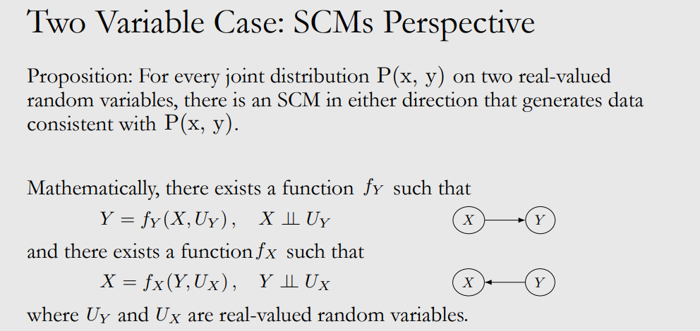
仅靠观测联合分布无法区分谁是因、谁是果；

想要唯一识别完整因果图，必须增加额外参数 / 分布假设，这是引入半参数 / 参数因果发现的理论动机。

**Linear Non-Gaussian Setting / LiNGAM**

前提背景： 如果变量关系是线性的，且噪声是高斯分布（Linear Gaussian），那么方向是不可识别的。

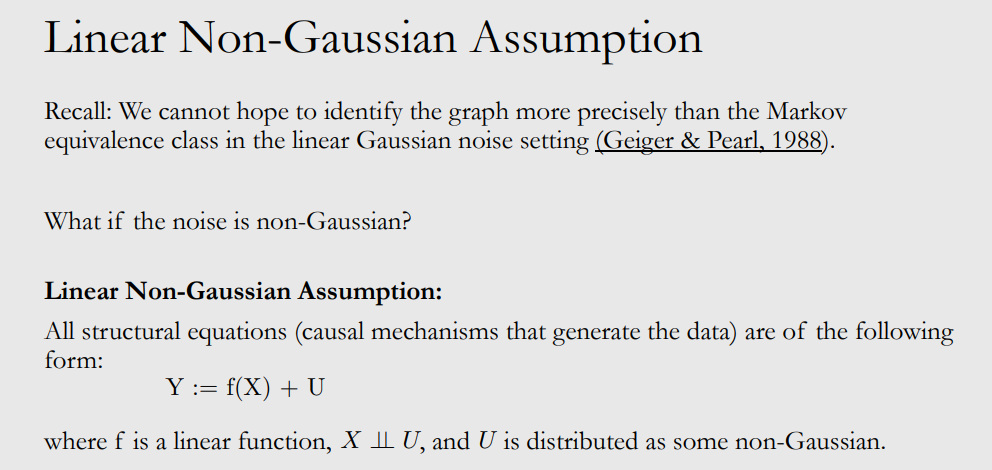
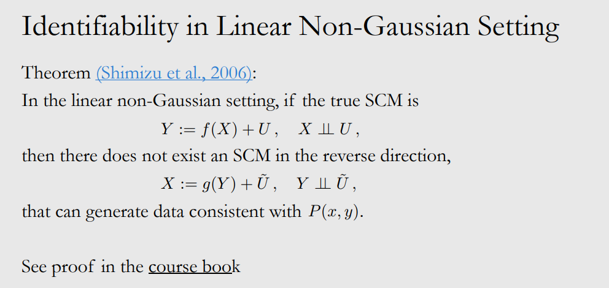
该方法已被扩展到多变量、存在隐变量、甚至是存在环路的场景中。

**Nonlinear Additive Noise Setting**

背景：在线性高斯模型中，仅观测数据最多只能识别马尔可夫等价类，无法唯一确定因果箭头方向。
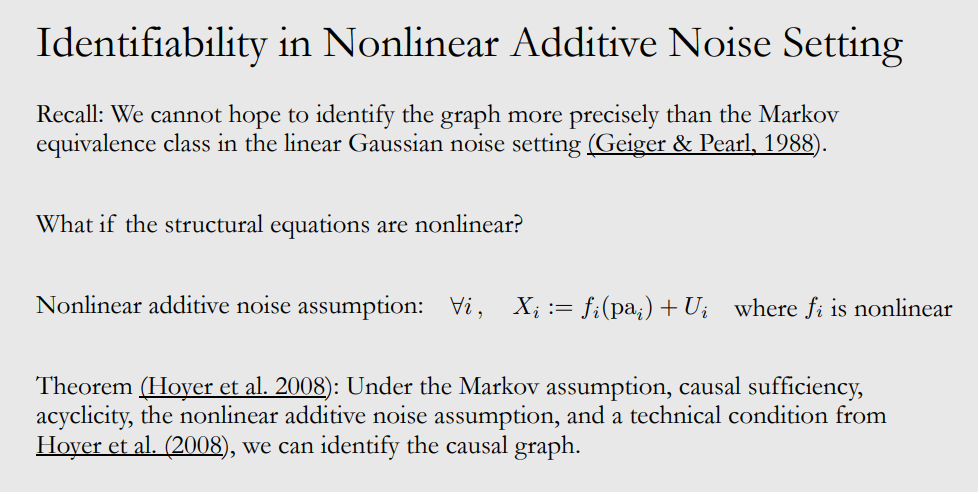
除了极个别的特例（技术性条件外），只要真实世界的关系是非线性的，且噪声是以加性方式（Additive）复合进来的，因果图就是完全可识别的。我们同样可以通过检验正反向回归后残差的独立性来判定因果方向。

扩展：

**Post-Nonlinear Setting / PNL**
$$
Y := g(f(X) + U)
$$

它在非线性加性噪声的基础上，允许在最后施加一个外界的非线性畸变/测量函数 $g$（例如传感器的非线性饱和效应）。在这种更加复杂的现实假设下，因果方向在绝大多数情况下依然是可识别的。

## Chapter 12 Causal Discovery from Interventions

半参数模型本质上是用“不可验证的强假设”去交换“数据的因果方向”。它对函数形式（如加性噪声）、噪声独立性或分布特性有着极其严苛的数学限制，一旦现实数据发生轻微的模型失配（Model Misspecification），算法就会在没有任何报错提示的情况下，强行产出一个完全颠倒或错误的因果图，存在严重的系统性识别风险。

本章学习在有实验条件的情况下如何用最少的干预代价，找出相对更精确的因果图。

### Structural Interventions

也叫硬干预（Hard Interventions）、完美干预（Perfect Interventions）
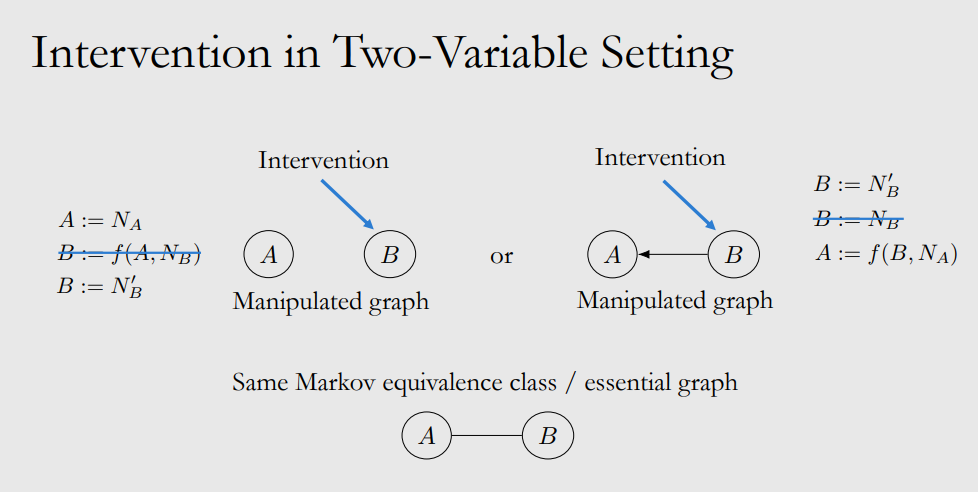
施加完全相同的干预（操纵 B） 后，两种真实因果对应的操纵图、数据响应行为完全不一样

干预会破坏原有因果图结构，制造出观测层面不存在的差异；仅凭观测分不清的等价类，通过简单干预就能直接锁定唯一真实因果流向。

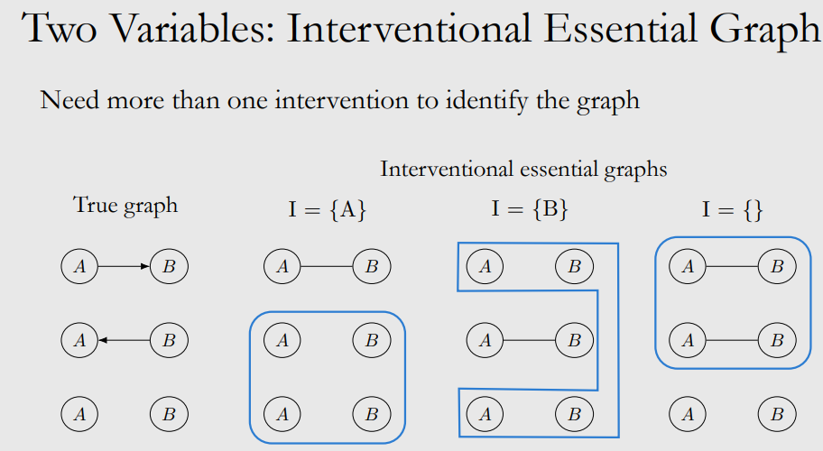
只做 1 次单点干预，不足以唯一确定真实因果图。

Complete Graphs Are the Worst Case：完全图里不存在任何 immorality（V 结构）所以PC 算法这类纯观测方法，最后输出的本质图只能是全无向边的完整骨架，一条箭头都定不下来，所有因果方向全部模糊。

**Single-Node Interventions**

当系统中有 n 个变量，且我们每次只能选择一个变量进行干预时：$n - 1$ Are Sufficient for $n > 2$

定理 (Eberhardt et al., 2006)：在最坏情况下（即图是一个完整图/满导图，没有任何现成的独立性可以利用），n−1 次干预是完全识别因果图的充分必要条件 。

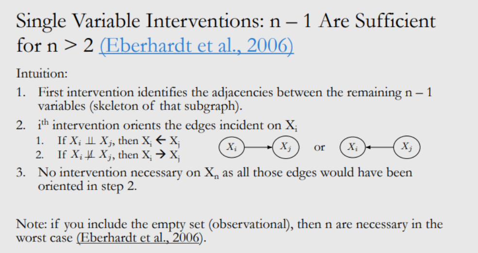
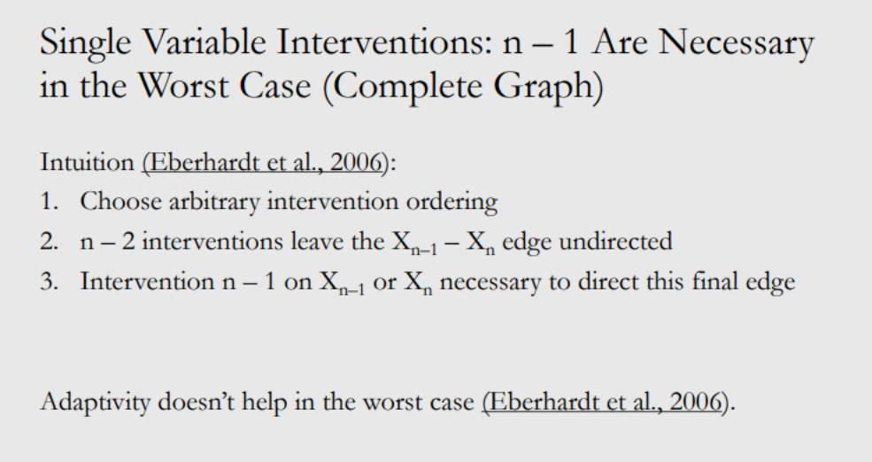

**Multi-Node Interventions**

定理 (Eberhardt et al., 2005)：如果不限制每次干预的节点数量，在最坏情况下，只需要 $\lfloor \log_2(n) \rfloor + 1$ 次干预就能完全识别因果图 。

这实际上利用了类似于二分查找（Binary Search）或编码的逻辑。通过每次将变量集分成干预组和非干预组，可以通过 $\log_2(n)$ 次的组合，把任意两个节点之间的因果方向唯一确定下来。

非完整图的进一步优化 (Hauser & Bühlmann, 2014)：如果因果图本身不全连通（非完全图），我们已经通过观测数据知道了它的马尔可夫等价类 ，那么所需的干预次数可以进一步缩减到 $\lceil \log_2(c) \rceil$ 次，其中 $c$ 是图中最大团（Largest Clique：每一个团是一个完全图）的大小 。

### Parametric Interventions

也叫Soft Interventions
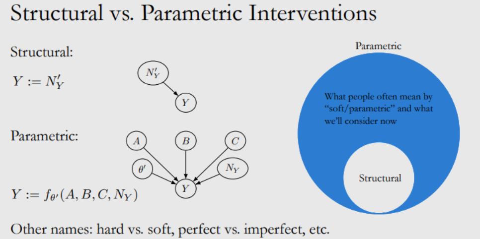
结构干预（Hard）：直接把原图中的因果断开，彻底改变图的拓扑结构 。 

参数干预（Soft）：它不破坏原图的依赖关系，只是改变了条件概率的参数或增加了外部影响，即 $Y := f_{\theta'}(A, B, C, N_Y)$ 。 

**Number of Parametric Single-Node Interventions**

same as with structural interventions

Sufficient: $n−1$ parametric single-node interventions can fully identify DAG

Necessary: Worst case (complete graph) requires at least 
$n−1$

**Partial Identification with Fewer Interventions**

干预次数在 $0\to n-1$ 会怎么样，在给定次数的识别次数下我们能识别多少呢

**Interventional Markov Equivalence**

Interventions Introduce Immoralities
干预会引入非正则结构（immorality），但是参数干预不会像硬结构干预那样删掉原图的边

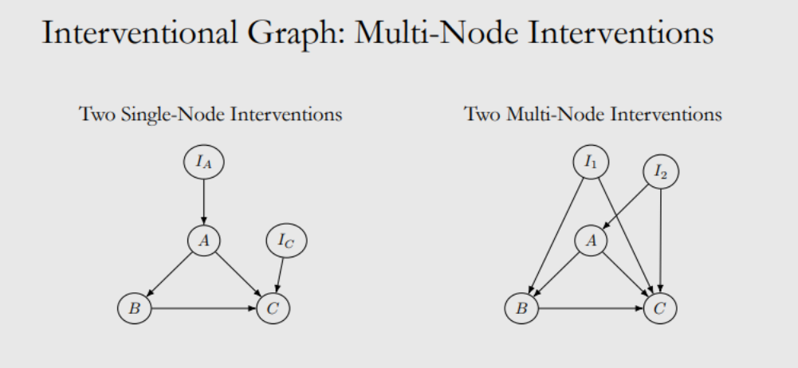

等价类定理 (Tian & Pearl, 2001 / Yang et al., 2018)：

引入单节点/多节点干预后，两个图如果属于干预马尔可夫等价类（Interventional MEC），当且仅当它们在扩充了干预节点（Intervention Nodes, 比如 $I_A, I_B$）的增强图中，拥有相同的骨架（Skeleton）和 V-结构（Immoralities） 。

我们在每次干预过后都能确定一部分有向边，当我们k次干预后找到最后干预图的马尔科夫等价类的图，就是我们能确定的因果关系？

**Miscellaneous Other Settings**

术界其他四类更贴合现实的干预设定与对应的干预次数下界
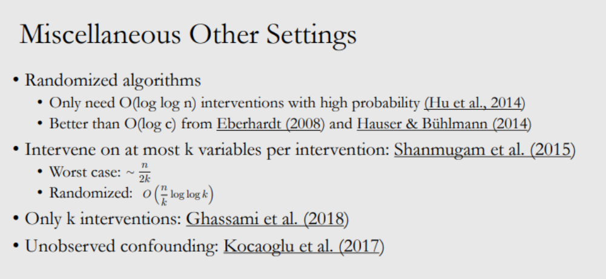

## Chapter 13 Transfer Learning and Transportability

如何利用因果结构（Causal Structure）来解决机器学习模型在面对分布偏移（Distribution Shift）时的鲁棒性与泛化问题。

### Causal Insights for Transfer Learning

- 迁移学习（Transfer Learning）：通常涉及两个或多个不同的任务。我们在任务 1（Task 1）的训练数据上训练模型 1，然后将学到的知识“迁移”到任务 2（Task 2）中，辅助模型 2 的训练。
- 领域泛化（Domain Generalization）：其核心在于应对环境/领域（Domain）的变化。我们在训练集 $P_{train}(x, y)$ 上训练一个模型，希望这个模型能够直接应用（迁移）到分布不同的测试集 $P_{test}(x, y)$ 上。

根本挑战：在传统机器学习中，通常假设训练和测试数据独立同分布（i.i.d.）。但在实际中，$P_{train}(x, y) \neq P_{test}(x, y)$，这会导致直接复制的模型在测试集上表现崩溃。

**Covariate Shift**

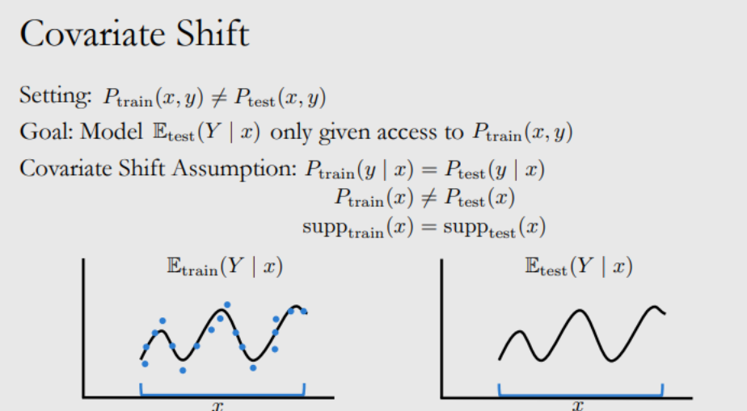
Common Support：训练集里包含测试集里可能出现的所有 $x$ 类型，否则模型无法外推（Extrapolate）

目标：由于条件机制 $P(y|x)$ 没变，我们的目标是仅通过访问 $P_{train}(x, y)$ 来准确建模测试集上的条件期望 $\mathbb{E}_{test}(Y|x)$

**In-distribution Prediction of Y – Markov Blanket**

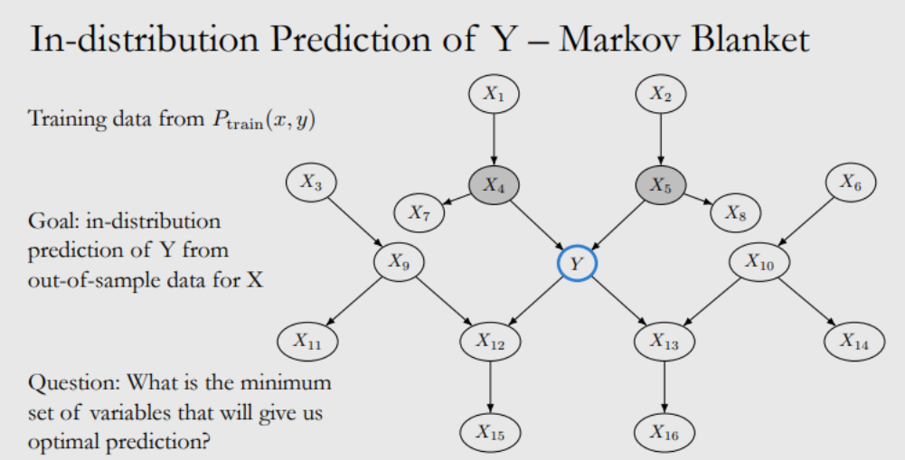
目标节点 $Y$ 的马尔可夫毯由三部分组成：
- $Y$ 的所有父节点（Parents）
- $Y$ 的所有子节点（Children）
- 所有子节点的其他父节点（Co-parents / 配偶节点）

如果环境不改变，找齐马尔可夫毯就能拿到最高的预测精度和最精简的特征集（当给定马尔可夫毯时，$Y$ 与图中所有其他变量都条件独立。）

如果对原图做因果干预，测试集的分布偏移，那么不同干预对应不同测试分布，每一种干预对应一个独立预测任务。根据模块化原理（Modularity），被干预变量的生成机制会改变。一旦后代节点或配偶节点的因果机制被外界干预破坏，在训练集学到的条件概率 $P(y \mid \text{Markov Blanket})$ 在测试集上就会直接崩溃失效。

**Causal Mechanism is Optimal in Robust Sense**

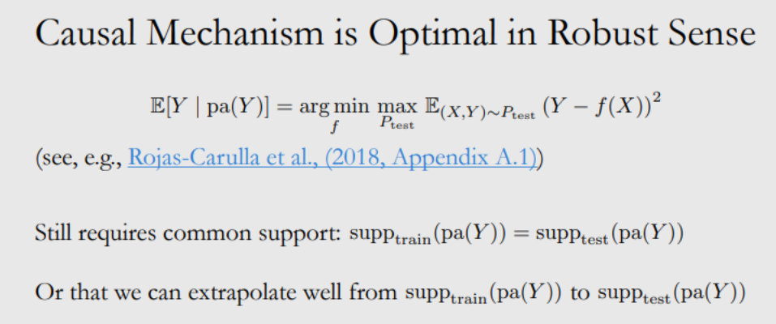
只用父母节点 $pa(Y)$ 在训练集上的预测精度可能不如完整的马尔可夫毯，但因为模块化原理，它的条件机制 $P(y \mid pa(Y))$ 在面临各种环境干预时是绝对保持不变（Invariance）的。它能保证模型在最坏的测试集环境下，均方误差（Max 误差）达到最小。

**Relaxation of Covariate Shift**

不要求所有特征 $X$ 不变，而是只需要 $Y$ 的因果父节点不变。
$$
P_{train}(y|pa(Y)) = P_{test}(y|pa(Y))
$$

### Transportability of Causal Effects Across Populations

**Transportability Problem**

我们在源人群（Source Population $\Pi$）中进行了因果实验（例如随机对照试验 RCT），得到了因果效应 $P(y|do(t), x)$。但我们真正的目标是将该结论应用到另一个不同的目标人群（Target Population $\Pi^*$）中，$P^*(y|do(t), x)$ 是否和 $P(y|do(t), x)$ 相等呢？

**Selection Diagrams**

用于显式表征两个不同群体之间因果机制的异质性。

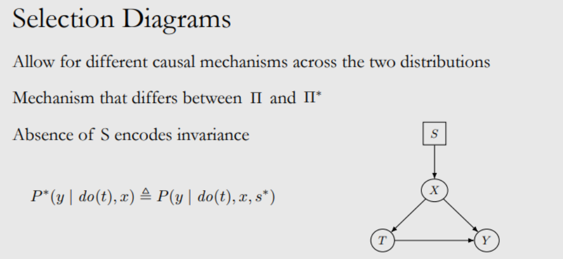

$S$ 被称为选择节点（Selection Node）
$S \rightarrow X$ 意味着：$X$ 这个变量在源域和目标域里的生存/生成机制可能不同。没有 $S$ 指向的变量（比如 $Y$），意味着它的因果机制在两个群体里完全一样（invariance）

当进行跨群体的因果推断时，有可以有以下三种方案拿到目标群体的因果效应

**Direct Transportability**

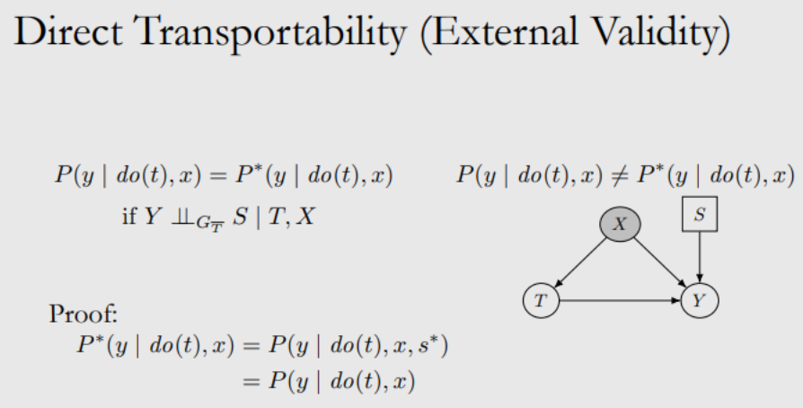
条件 $Y \perp\!\!\perp_{G_{\overline{T}}} S \mid T, X$是为了防止引入下图中 $S$ 和 $Y$ 的虚假关联
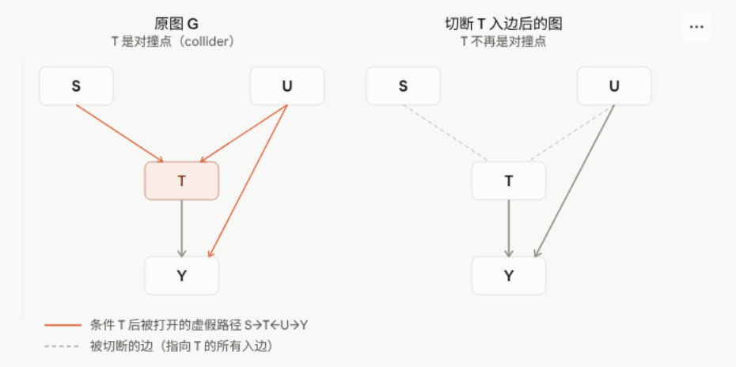

**Trivial Transportability**

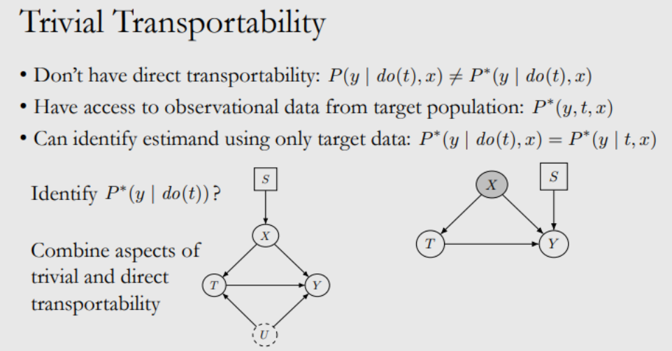

**$S$-Admissibility & Transport Formula**

- $S$-可采纳性（$S$-Admissibility）：如果存在一组变量 $W$（不是 $X$ ），在移除 $T$ 的指向箭头的图 $G_{\overline{T}}$ 中，能隔绝 $S$ 对 $Y$ 的所有影响，即满足条件独立性：

$$
Y \perp\!\!\perp_{G_{\overline{T}}} S \mid T, W
$$

则称变量集 $W$ 是 $S$-可采纳的（$S$-admissible）。它等同于跨群体调整的“足够调整集（Sufficient Adjustment Set）”。

输运公式（Transport Formula）：如果 $W$ 满足 $S$-可采纳性，我们就可以将源群体的实验效应通过 $W$ “加权输运”到目标群体：

$$
P^*(y|do(t)) = \sum_{w} P(y|do(t), w) P^*(w)
$$

Pearl & Bareinboim (2014)。

| 方法 | 解决的问题 |
|---|---|
| **Trivial transportability** | 目标域自己的观测数据 $P^*$，配上目标域自己的因果图 $G^*$，能不能用普通的因果推断方法（后门调整、前门准则等）直接把 $P^*(y\mid do(x))$ 算出来——**完全不需要源域** |
| **Direct transportability** | 源域和目标域之间的差异 $S$，是不是"够不上"影响 $X\to Y$ 这条机制——如果够不上，源域测出来的数值**直接照搬**给目标域用，**不需要重新计算，不需要目标域的任何额外数据** |
| **S-admissibility + transport formula** | 当上面两条都不行时，怎么把"源域的实验结果"和"目标域的观测数据"**组合**起来，算出目标域的效应——这是真正意义上的"数据融合（data fusion）" |

直接迁移中的 $X$ ：是一个“分层器”，用来限定“在什么条件下，两个域完全一样”。

$S$-可采纳性中的 $W$：是一个“调整集”，用来“把源域的实验证据，按目标域的分布重新加权”。

## Chapter 14 Counterfactuals and Mediation

现实中很多关心的问题，并不在我们所得到的数据中，光靠总体统计量原则上无法从数据里唯一确定。通过反事实和控制中间变量可能可以找到真正关心的问题或者变量，但是必须承担更多的假设开销

### Counterfactuals Basics

**Counterfactuals**

$$
P(Y(t) \mid T=t', Y=y')
$$
这是个体/单元层面的概念

在已知某人实际接受了干预 $t'$ 且其实际结果为 $y'$ 的条件下（事实），如果当初假设（Hypothetical condition）他接受的是干预 $t$，那么他的潜在结果为 $Y$ 的概率是多少

**CATE**

$$
\mathbb{E}[Y(t) \mid X=x] = \mathbb{E}[Y \mid do(t), X=x]
$$
这是群体层面的概念，是干预而非反事实

**General Steps for Deterministic Counterfactuals**

有SCM、映射可逆：反事实唯一确定

- 外推/溯因 (Abduction)： 利用该个体的实际观测数据（如 $T=t', Y=y'$），倒推计算出决定该个体特质的不可观测外生变量 $U$ 的具体值。  
- 行动 (Action)： 修改 SCM 模型。将模型中原本决定 $T$ 的方程删掉，强制替换为反事实的假设：$T := t$。  
- 预测 (Prediction)： 将第 1 步推导出的 $U$ 值，带入第 2 步修改后的新 SCM 模型中，计算出反事实结果 $Y(t)$。

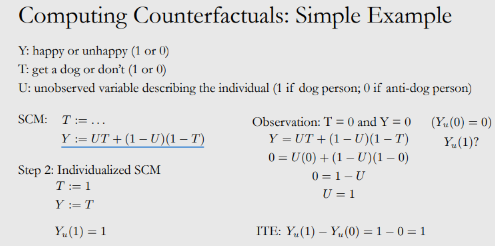

**Can’t Always Determine Counterfactual**

有SCM、映射不可逆：反事实存在多种可能

即使拥有 Y 的结构方程，也不一定能 100% 唯一算出反事实结果。

因为给定固定观测$T=t$，映射隐变量$U \to Y$的函数不可逆（non-invertible）：
同一个观测$(T,Y)$，会对应多个不同的$U$取值；
不同$U$代入干预$do(T=0)$会算出完全不同的$Y(0)$，因此反事实无法唯一确定。
因此我们只能更新 $U$ 的后验概率分布

**General Steps for Probabilistic Counterfactuals**

- Abduction： 计算 $P(U \mid \text{观测数据 } Z)$，更新 $U$ 的概率分布。  
- Action： 修改模型，令 $T := t$。  
- Prediction： 利用 $U$ 的后验分布和新模型，计算出反事实结果的概率分布 $P(Y(t))$。  

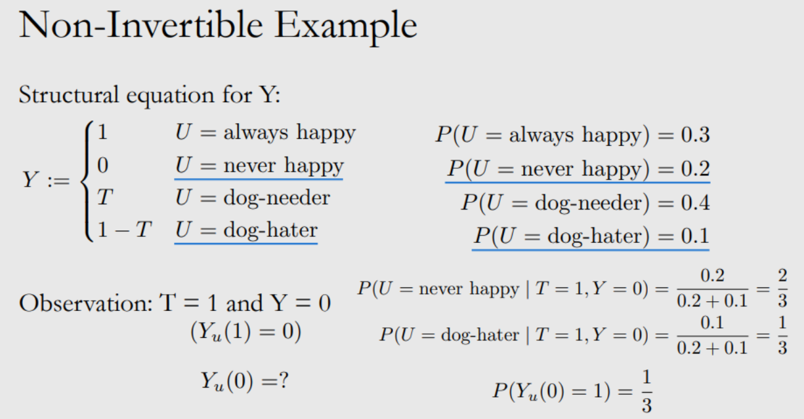

**No Unit-Level Counterfactuals without Parametric Model**

无SCM：完全算不出个体反事实

想要推算个体级别的反事实，必须依赖参数化模型（Parametric Model）。如果没有模型方程，在个体层面就无法识别。

1. 计算个体反事实的必要条件：已知$Y$的参数化结构方程SCM
2. 该假设约束很强，现实难完全满足
3. 无参数模型则无法突破因果推断根本难题：单个个体只能观测一种处理下的结果，缺失的反事实无法求解

**Population-Level Doesn’t Require a Parametric Model**

群体层面反事实不需要参数模型。在群体层面，我们关心的是 $E[Y(1)] - E[Y(0)]$。如果我们能通过某种方式，用可观测的群体平均值（比如 $E[Y|T=1]$ 和 $E[Y|T=0]$）来代表这些不可观测的潜在结果均值，问题就解决了。

群体反事实 $\mathbb{E}[Y(t) \mid T=t']$，

$$
\mathbb{E}[Y(t)]=\mathbb{E}_U\big[f(t,U)\big]
$$
通过期望平均了因变量$U$

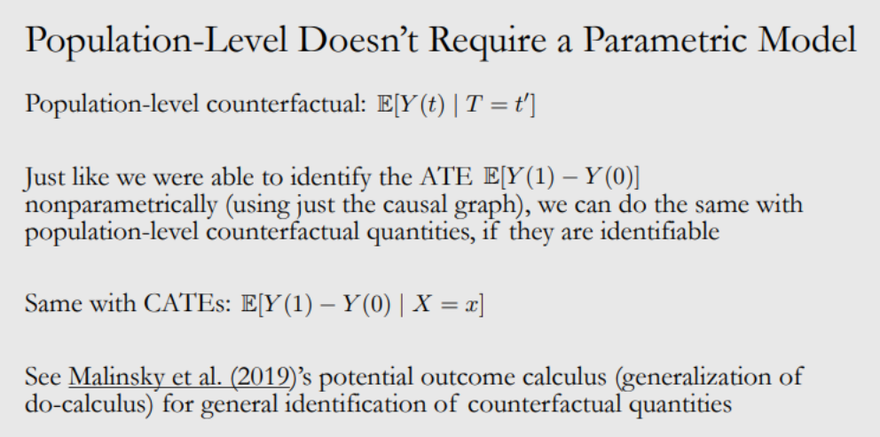

### Important Application: Mediation

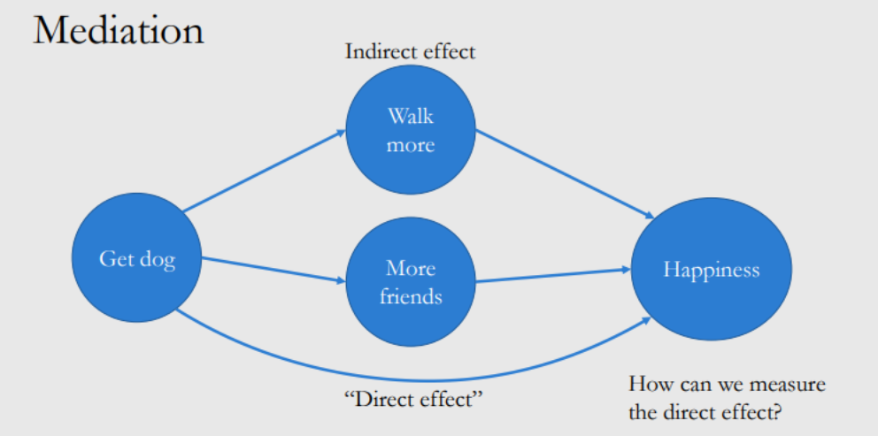

在因果推断中，干预 $T$ 对结果 $Y$ 的影响往往不是单一维度的。中介分析的目的，就是拆解总效应（Total Effect）：
- 直接路径 (Direct Effect)： $T \to Y$ （例如：养狗本身直接让人开心）。 
- 间接路径 / 中介路径 (Indirect Effect)： $T \to M \to Y$ （例如：养狗 $\to$ 迫使你每天出门遛狗 $M$ $\to$ 运动让你开心 $Y$）。 

在标准的因果图（DAG）中，我们用 $M$ 表示中介变量（Mediator）。

**Controlled Direct Effect, CDE**

强制将中介变量 $M$ 固定在某一个特定值 $m$ 时的**直接效应**

$$
CDE(m) \triangleq \mathbb{E}[Y \mid do(T = 1, M=m)] - \mathbb{E}[Y \mid do(T = 0, M=m)]
$$

纯粹通过 $do$-算子定义，完全可以通过实验（强制干预 $T$ 和 $M$）来测量。  

缺点：
1.  $CDE$ 的大小取决于你对 $m$ 的主观选择（比如你强制所有人每天遛狗0小时还是2小时，得到的效应可能完全不同）。
2.  无法完美分解总效应： 无法通过“总效应 - 直接效应”直接得到间接效应。  

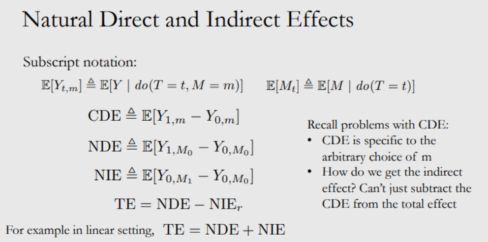

- 潜在结果（Potential Outcomes）
    - $\mathbb{E}[Y_{t,m}] \triangleq \mathbb{E}[Y \mid do(T=t, M=m)]$是双重干预下的潜在结果期望值。通过 $do$ 算子，人为强制将处理变量设为 $t$，同时强制将中介变量设为 $m$ 时，$Y$ 的期望表现。
    - $\mathbb{E}[M_t] \triangleq \mathbb{E}[M \mid do(T=t)]$ 当强制将处理变量设为 $t$ 时，中介变量 $M$ 自然会达到的潜在期望值。
- 自然直接效应 (Natural Direct Effect, NDE)
    - 允许中介变量 $M$ 自然地展现出它在没有受到干预（$T=0$）时应该有的状态（即 $M_0$）。在这个背景下，对比干预 $T=1$ 和 $T=0$ 对 $Y$ 的平均差异。  
    - 关闭中介路径（让 $M$ 假装不知道干预 $T$ 已经发生，保持原样 $M_0$），只看 $T \to Y$ 路径暴露出来的直接效应。
- 自然间接效应 (Natural Indirect Effect, NIE)
    - 强制让直接路径上的干预保持在不干预状态（$T=0$）。此时，对比由于干预发生而导致的中介变量从 $M_0$ 变为 $M_1$ 后，对 $Y$ 产生的平均差异。
    - 关闭直接路径（让直接路径上的 $T$ 保持为 0），只看干预通过中介路径 $T \to M \to Y$ 传导过去的效应。
- 总效应（Total Effect, TE）
    - $\text{TE} \triangleq \mathbb{E}[Y_{1,M_1} - Y_{0,M_0}]$
    - 当你把处理变量 $T$ 从 $0$ 变为 $1$ 时，自然任由中介变量 $M$ 自由发展，最终在结果 $Y$ 上所能观察到的总变化量。
- 反向自然间接效应（Reverse/Pure NIE）
    - $\text{NIE}_r$ （或写作 $\text{NIE} = \mathbb{E}[Y_{1,M_1} - Y_{1,M_0}]$）。
- 如果系统是线性的，且变量之间没有交互作用（No Interaction），那么“总效应 = 自然直接效应 + 自然间接效应”。此时不需要担心复杂的反向定义，两者的实际数值可以直接相加等于总效应。

| 评估维度 | 控制中介 (CDE) | 自然中介 (NDE / NIE) |
| --- | --- | --- |
| 能否做物理实验测量？| **能**（通过 $do$ 算子同时强制管死 $T$ 和 $M$） | **通常不能**（因为混合了不同平行宇宙的变量，属于反事实） |
| 能否完美拆解总效应？| **不能**（因为固定 $m$ 是武断的，切断了自然传导） | **能**（$\text{TE} = \text{NDE} + \text{NIE}$，科学家的最爱） |

在做中介分析时，我们往往需要通过额外的因果识别假设（Identification Assumptions），用观察数据和统计学公式（比如中介公式 Mediation Formula）去估计出那个无法直接做实验测出来的 NDE 和 NIE。

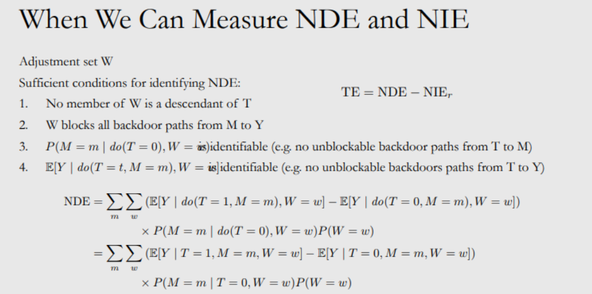
如何利用可观测的数据（观测数据）把原本属于“反事实”、无法直接做实验测量的 NDE 和 NIE 给计算（识别）出来
## reference

[Datahacker](https://www.zhihu.com/people/tinky2013)
