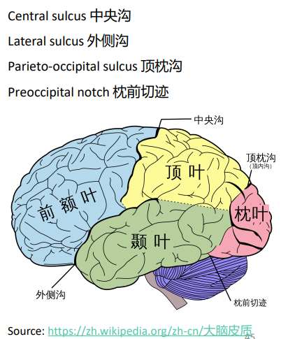
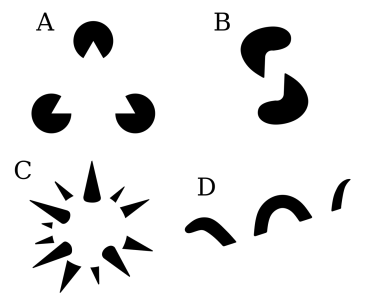
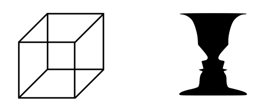
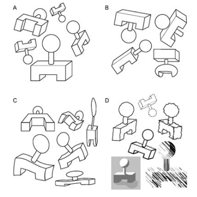

[课程网页链接](https://clcs-sustech.github.io/zh/course/cse5026/)

## Course Introduction & Overview

### background

Psychology, Gestalt, Behaviorism, S-R theory, Information Processing Theory

### Methodology

- Internalism

    心智状态完全由大脑内部的物理状态决定，过于主观
    1. Reductionism
    2. Functionalism
    3. Introspectionism
    4. Cognitivism / Symbolism

- Externalism

    心智状态部分由外部世界决定
    1. Behaviorism
    2. connectionism

#### Technology
 - Brain-related Technology
 - Behavioral Studies
 - Tools; Experimental designs; Math and statistics.

### Supplementar: CPM & Hypothesis Testing

对于两类假设
- $H_0$：原假设（null hypothesis）
- $H_A$：备择假设（alternative hypothesis）

以及显著性水平（significance level）
- $\alpha$

假设检验通常包括：
- Type I error（$α$）：$H_0$ 为真，却错误拒绝 $H_0$；
- Type II error（$β$）：$H_A$ 为真，却没有拒绝 $H_0$；
- Power：$H_A$ 为真，并成功拒绝$H_0$。

$\alpha$ ,$\beta$, $power$ 的关系是：

- $\beta$：在计算Type I error 使用 $\alpha$ 确定临界值后，用 $H_A$ 的分布算出没有在拒绝区域的概率：
$$
\beta=P_{\mu_A}(Z\le 1.645) \text{   OR   } 
\beta=P_{\mu_A}\left(\bar X\le c_\alpha\right)
$$
- $power=1−β$
- 增加样本量会提高 power：标准误变小，样本均值的分布变窄，因此更容易超过拒绝阈值。
- 一般性的样本量与 power 关系，适用于许多正态近似的假设检验：在给定噪声大小、显著性水平、目标 power 和最小可检测效应后，需要多少样本。
    
    $\Delta$：希望检测到的真实效应大小
$$
n\ge
\frac{\sigma^2\left(z_{1-\beta}+z_{1-\alpha}\right)^2}{\Delta^2}
$$

## Neural Basis of Cognition

从神经元到数学模型到真实大脑结构

### Neuron

树突主要接收其他神经元传来的信号，胞体包含细胞核并维持细胞生命，同时也参与整合输入；轴突则把神经元产生的信号传向其他位置。

- Soma/Cell 胞体：出现在脑，脊髓灰质，神经节，结构和其他细胞相似
- Cell Membrane 细胞膜：神经细胞膜敏感，上面有蛋白质构成受体(receptors)和离子通道(ion channels )，受体和神经递质结合传递信号， 乙酰胆碱(Acetylcholine) 或 γ-氨基丁酸(GABA)的结合 改变膜电位 (membrane permeability and potential)，造成兴奋(excitation)或抑制(inhibition)
- Synapse 突触: 由Charles Sherrington 提出，认为信息在这些位置传递
    - 
    - 信号的的传递是电信号到化学信号再到电信号
        1. 突触前兴奋（Presynaptic excitation）使突触前膜（presynaptic membrane）发生去极化（depolarization），钙离子（Ca²⁺）内流。
        2. 神经递质（Neurotransmitters）释放进入突触间隙（synaptic cleft），在间隙中扩散，并与突触后受体（postsynaptic receptors）结合。
        3. 离子通道（Ion channels）开放，引发突触后膜去极化（depolarization，膜内负电位减少）或超极化（hyperpolarization，膜内负电位增多）。
    - 突触连接（synaptic connections）可以发生改变 (Hebbian learning)：神经元反复共同激活会建立关联，使得其中一个神经元有助于激活另一个。若神经元 A 反复激活神经元 B，二者之间的突触连接会增强。
    - 突触可塑性（synaptic plasticity）一起放电的神经元，连接在一起（Cells that fire together, wire together.）fire是神经元放电
- 神经递质（Neurotransmitters）

- 神经递质（Neurotransmitters）是由突触前末梢（presynaptic terminals）释放的化学物质。它们结合突触后神经元（postsynaptic neurons）或效应器细胞（effector cells）上的受体，用来传递信息。
  - 乙酰胆碱（Acetylcholine）
  - 儿茶酚胺（Catecholamines）：去甲肾上腺素（norepinephrine）、多巴胺（dopamine）
  - 5-羟色胺 / 血清素（Serotonin / 5-HT）

### Resting Membrane Potential & Action Potential

#### Resting Membrane Potential  静息电位

静息膜电位约 −70 mV，膜内电位相对于膜外为负。膜外 Na⁺、Cl⁻浓度更高；膜内 K⁺浓度更高。

钠钾泵（sodium–potassium pump）消耗 1 分子 ATP，将 3 个 Na⁺运出细胞，同时将 2 个 K⁺运入细胞。

##### Hodgkin–Huxley Experiments

- 英国生理学家 A. L. 霍奇金（A. L. Hodgkin）与 A. F. 赫胥黎（A. F. Huxley）将玻璃微电极（glass microelectrodes）插入乌贼巨轴突（squid giant axons），记录细胞内部的膜电位。（后续二人建立霍奇金‑赫胥黎数学模获得诺奖）
- 电压钳（Voltage clamp）技术：HH 实验操作，向神经元（轴突，axon）内部注入电流（current），观察膜电位相对于静息电位（约‑70 mV）如何发生变化。

细胞膜可以近似等效为电容与电阻并联
- 电容 $C$：在膜两侧储存电荷
- 电阻 $R$：代表离子跨膜漏电流
- 输入电流 $I(t)$：外部注入电流

$$
I(t)=I_C(t)+I_R(t) = \frac{dQ}{dt} + \frac{V}{R} = C\frac{dV}{dt} + \frac{V}{R}
$$

$$
RC\frac{dV}{dt}=IR-V
$$

$$
\frac{dV}{dt}=-\frac{V}{RC}+\frac{I}{C}
$$

注入恒定电流，电压不变，膜电位最终趋近的稳定电压 $\boldsymbol{V_\infty=I_0R}$

定义膜时间常数 $\boldsymbol{\tau=RC}$

$$
\frac{dV}{dt}=-\frac{V}{\tau}+\frac{V_\infty}{\tau}
$$

$$
\boldsymbol{\frac{dV}{dt}=\frac{V_\infty-V}{\tau}}
$$

电压变化速率和当前电压距离稳态值的差值成正比

$$
V(t)=V_\infty+\big(V(0)-V_\infty\big)e^{-t/\tau}
$$

$\tau$ 的意义：当时间等于 \($\tau$\)，电位完成从起点到稳态总变化量的 63.2%。

#### Action Potential 动作电位

膜内电压高于膜外，触发动作电位需要刺激强度超过阈值电位，一旦超过，动作电位迅速达到顶峰，然后返回静息电位

- Propagation（传导）：在某一区域，刺激引发膜电位发生快速反转。该区域相当于电池，使邻近细胞膜电位上升至阈电位以上，从而触发新的动作电位。动作电位可远距离不衰减传导（without decrement）

###  Leaky Integrate-and-Fire (LIF) Neurons 渗漏积分激发模型

#### Neuromorphic Computing 神经形态计算（类脑计算）

- 设计模仿生物神经系统(biological nervous systems)信息处理方式的计算系统。
- 主流范式：神经元维持内部状态，通过脉冲（spike）通信，并依靠带权重的突触完成相互作用。
- 脉冲神经网络（Spiking neural networks, SNN）：可在软件中运行，也可部署在专用硬件上。
- 一套简单规则决定神经元什么时候发放脉冲。神经元接收突触前神经元的脉冲信号时，会不断累积势能（膜电位）。当该势能超过阈值，神经元就发放脉冲

#### LIF Neurons

突触后神经元对来自所有突触前神经元的输入做累加（积分），但该电位值会随时间衰减（渗漏）。如果输入累加总和达到最低阈值，神经元就发放脉冲。（A Leaky Bucket Analogy：累加的越多，衰减的越快）

#### Neuromorphic Computing 神经形态计算（类脑计算）

- 设计模仿生物神经系统(biological nervous systems)信息处理方式的计算系统。
- 主流范式：神经元维持内部状态，通过脉冲（spike）通信，并依靠带权重的突触完成相互作用。
- 脉冲神经网络（Spiking neural networks, SNN）：可在软件中运行，也可部署在专用硬件上。
- 一套简单规则决定神经元什么时候发放脉冲。神经元接收突触前神经元的脉冲信号时，会不断累积势能（膜电位）。当该势能超过阈值，神经元就发放脉冲

#### Resistor-Capacitor (RC) circuit model

>Q：为什么把神经元的活动总是比做RC电路呢？

>A：胞内外总有电压差$\rightarrow$电容。胞上离子通道的通过难易度$\rightarrow$电阻。突触信号：电流。但是没办法描述脉冲（fire）

$$I(t)=I_R(t)+I_C(t)=\frac{v(t)}{R}+C\frac{dv(t)}{dt}
$$

$$
v'(t)=\frac{1}{C}I(t)-\frac{1}{RC}v(t)
$$
$$
\frac{dv(t)}{dt}=-\frac{v(t)}{\tau}+\frac{v_\infty}{\tau}
$$
1. 当膜电位 $v(t) \ge v_{th}$ ($v_{th}$ 发放阈值)，神经元发放脉冲（fire，产生动作电位动作电位）。
2. 发放后进入不应期（refractory period）：膜电位被重置，此阶段无法再次发放脉冲

$$
\frac{dv(t)}{dt}\approx\frac{v(t+\Delta t)-v(t)}{\Delta t}
$$

$$
v[t] = v[t-1]\left(1-\frac{\Delta t}{\tau}\right) + \frac{\Delta t}{\tau}I[t]
$$
可以根据上述公式写出LIF，然后拼几个成为SNN。

#### STDP

SNN权重如何更新：
权重变化完全看两个神经元脉冲的先后顺序 & 时间差

1. 前神经元先放、后神经元后放（Pre $\rightarrow$ Post）是因果正确（输入激活了输出）$\rightarrow$ 权重增强（LTP）
2. 后神经元先放、前神经元后放（Post $\rightarrow$ Pre）
无因果、乱同步
$\rightarrow$ 权重减弱（LTD）

> Q：SNN和NN的区别是什么

> A：持续积累变化（时间维度），到达阈值才启动（稀疏）。SNN使用STDP更新权重
### Brain

- The brain includes the cerebrum (大脑), cerebellum (小脑), brainstem (脑干), and diencephalon (间脑).
- The cerebrum has two hemispheres (大脑半球). Each has four lobes (脑叶): frontal (额叶), parietal (顶叶), temporal (颞叶), and occipital (枕叶)
- 大脑皮层由灰质（gray matter）构成，负责高级脑功能，有沟回，神经元数量百亿级别，哺乳动物特有新皮层（neocortex）由外到内分为6层

**一张重要的图片**

| 脑叶（英文） | 核心功能 |
| --- | --- |
| 额叶（frontal lobe） | 高级认知：学习、语言、决策、抽象思维、情绪 |
| 顶叶（parietal lobe） | 躯体感觉（somatosensation）；整合空间、视觉、身体信息 |
| 颞叶（temporal lobe） | 听觉、嗅觉、高级视觉加工、左右分辨、长期记忆（long‑term memory） |
| 枕叶（occipital lobe） | 视觉处理（visual processing） |

重要解剖沟：中央沟（Central sulcus）、外侧沟（Lateral sulcus）、顶枕沟（Parieto‑occipital sulcus）、枕前切迹（Preoccipital notch）

- 布罗德曼分区（Brodmann Areas）K. Brodmann，依据脑组织染色后的神经元组织形态，把大脑皮层划分52 个区域。皮层三大功能分区：
    1. 感觉皮层（sensory cortex）
    2. 运动皮层（motor cortex）
    3. 联合皮层（association cortex）

- 皮层电活动（Electrical Activity of the Cortex）：皮层神经元持续产生节律性电压波动，称为自发脑电活动（spontaneous brain electrical activity），即脑电波（brain waves）。按频率划分四类脑波（慢波振幅大，快波振幅小）：

    1. δ 波（Delta）：0.5‑3 Hz
    2. θ 波（Theta）：4‑7 Hz
    3. α 波（Alpha）：8‑13 Hz
    4. β 波（Beta）：＞14 Hz

## Perception and Attention

这一节讨论两个相互关联的问题：我们如何把感官收到的刺激组织成对世界的理解，以及在信息过多时，我们如何选择优先处理的内容。

### Perception

Perception（感知 / 知觉）并不是对外界刺激的简单记录，而是大脑对感觉信息进行获取、筛选、组织、识别和解释的过程。它最终形成的是我们对物体或环境的整体理解。

从低层到高层，可以将这一过程写成：

$$
\text{Sensation}\longrightarrow\text{Perception}\longrightarrow\text{Representation}
$$

- Sensation（感觉）：感觉器官受到刺激后，大脑首先记录颜色、亮度、声音强度等局部属性。
- Perception（知觉）：把分散的感觉信息整合成完整的对象或经验。
- Representation（表征）：在反复感知同一对象或同一类对象后形成的内部印象，使我们即使不直接面对对象，也能在心中表示它。

因此，感觉更接近“接收到了什么信号”，知觉则要回答“这些信号意味着什么”。

#### Perceptual systems

感知系统可以按照感觉器官和受体类型进行划分：

| System | 典型活动 | 主要受体 | 主要结构 |
| --- | --- | --- | --- |
| Basic orienting | 身体定向和平衡 | Mechanoreceptors | 前庭器官 |
| Auditory | Listening、声音定位 | Mechanoreceptors | 耳蜗、中耳和外耳 |
| Haptic | Touching、主动探索 | Mechanoreceptors / thermoreceptors | 皮肤、关节、肌肉 |
| Olfactory | Smelling | Chemoreceptors | 鼻腔 |
| Gustatory | Tasting | Chemical / mechanical receptors | 口腔 |
| Visual | Looking | Photoreceptors | 眼睛、眼肌及相关身体结构 |

感知并不局限于视觉。不同系统接收不同形式的物理或化学刺激，但都需要将刺激转换成神经系统能够处理的信息。

#### Sensory thresholds and psychophysics

并非所有刺激都能产生感觉。刺激需要达到一定强度，才可能被感知。

- Absolute threshold（绝对阈限）：一个人能够检测到某种刺激的最低强度。
- Difference threshold（差别阈限）：能够察觉两个刺激存在差异所需的最小变化，也称为 just noticeable difference, JND（最小可觉差）。
- Psychophysics（心理物理学）：研究物理刺激的变化如何对应感觉经验的变化。

##### Weber's Law

在一定范围内，差别阈限与原刺激强度近似成固定比例：

$$
\frac{\Delta I}{I}=k,
$$

- $I$：原刺激强度；
- $\Delta I$：刚好能够被察觉的强度差；
- $k$：Weber fraction，不同感觉通道具有不同的 $k$。

Weber 定律的重点不是“增加了多少”，而是“相对于原来的强度增加了多少”。例如，从 10 个点增加到 20 个点与从 110 个点增加到 120 个点，虽然都增加了 10 个点，但前者的相对变化为 $1$，后者只有约 $0.09$，因此前者明显得多。

##### Weber-Fechner Law

Fechner 在 Weber 定律的基础上进一步提出：主观感受强度随物理刺激强度近似呈对数增长，

$$
p=\alpha\ln\frac{S}{S_0},
$$

其中 $p$ 表示主观知觉强度，$S$ 表示刺激强度，$S_0$ 表示初始或阈限刺激。

这意味着：当刺激本来已经很强时，再增加同样的物理量，主观上带来的变化会更小。

### Perceptual Constancy

Perceptual constancy（知觉恒常性）是指：即使观察条件和感觉输入不断变化，我们仍会把物体的大小、形状和颜色知觉为相对稳定的属性。

真实世界中的同一物体会因为距离、角度和光照不同，在视网膜上形成完全不同的图像。如果没有恒常性，我们每次改变观察位置，看到的都像是一个新物体。所以 perceptual constancy 实际上是人类能够生活在稳定世界里的基础之一。他同时告诉我们perception也是一种inferencce，输入是什么是由大脑解释的，而不是我们真实看到了什么。

> 输入在变，世界没变，大脑必须学会“忽略不重要的变化”。

#### Size constancy

物体离我们越远，它在视网膜上的成像越小，但我们通常不会认为物体本身真的缩小了。大脑会利用距离、透视和环境背景等线索，对视网膜图像进行解释。

这也会产生一些视觉错觉：

- Ponzo illusion（庞佐错觉）：汇聚的线条提供深度线索，使视网膜尺寸相同的物体看起来大小不同。
- Müller-Lyer illusion（缪勒-莱尔错觉）：线段两端箭头的方向改变了我们对线段长度的判断。
- Ebbinghaus illusion（艾宾浩斯错觉）：两个大小相同的中心圆，会因为周围圆的大小不同而显得不一样大。

大小恒常性会受到情境影响：丰富的深度线索通常能加强恒常性；距离过远时恒常性可能减弱；水平观察通常也比垂直观察更有利于判断真实大小。

#### Shape constancy

Shape constancy（形状恒常性）是指：即使观察角度或物体朝向发生变化，导致视网膜图像的形状改变，我们仍会认为物体的真实形状保持不变。

例如，一扇矩形的门逐渐打开时，它在视网膜上的投影会从矩形变成越来越窄的四边形，但我们仍然知道这是一扇矩形的门。

#### Color constancy

Color constancy（颜色恒常性）是指：即使照明条件发生变化，物体的颜色仍被知觉为相对稳定。例如，同一个绿色苹果在正午和日落时反射到眼睛中的光谱并不相同，但我们通常仍认为它是绿色的。

Checker shadow illusion 中，A、B 两个方格可以具有相同的像素值，但阴影和周围棋盘提供的光照线索会使它们看起来深浅不同。这说明我们感知的并不只是孤立的 RGB 数值，而是结合场景对“物体在当前光照下应当是什么颜色”进行推断。

#### Perceptual constancy in VLMs

课件引用的实验显示，Vision-Language Models 的知觉恒常性仍明显落后于人类：模型在形状恒常性上相对较好，但在大小恒常性和颜色恒常性上更容易受图像表面特征影响。

例如，模型可能正确理解远处的栈桥只是因为透视而显得更窄，却把绿色光照下魔方中央方块的表面颜色直接回答成绿色，而不能恢复其真实颜色。

> 知觉恒常性测试的不是模型能否识别像素，而是模型能否区分“观察条件造成的变化”和“物体本身属性的变化”。

### Organization of Perception

20 世纪初的 Gestalt psychology（格式塔心理学）强调：知觉经验是以整体形式被组织起来的，不能只还原为孤立感觉元素的总和。

#### Gestalt Theory

$$
\text{Whole}\neq\sum \text{Parts}
$$

Holism: The brain organizes experience into wholes

这里并不是说整体中凭空多出某种物质，而是说部分之间的关系和组织方式本身也携带信息。同一组局部元素以不同方式排列，可以形成完全不同的整体知觉。

#### Three properties of Gestalt perception

- Reification（具体化 / 实体化）：知觉会主动补充感觉输入中没有明确画出的结构。例如，若干缺口图形可以让我们看见一个并未真正画出的三角形或球体。

- Multistability（多稳态）：一个模糊刺激可以支持两种或更多种合理解释，知觉会在它们之间切换。例如 Necker cube、Rubin vase 和 Escher 的背景—前景图形。

- Invariance（不变性）：即使图形经历旋转、平移、缩放、形变、光照变化或绘制元素变化，我们仍能识别其结构。

#### Law of Prägnanz

Law of Prägnanz（简洁律）认为，人倾向于把感觉输入组织成尽可能规则、有序、对称和简单的形式。常见的组织原则包括：

- Proximity（邻近律）：空间距离较近的元素更容易被看作一组。
- Similarity（相似律）：形状、颜色或大小相似的元素更容易被归为一组。
- Closure（封闭律）：即使轮廓存在缺口，我们仍倾向于看见完整的物体、字母或图形。（IBM标志）
- Symmetry（对称律）：对称元素更容易被组织成一个连贯整体。
- Continuity（连续律）：相交或被遮挡的线条更容易被理解为平滑延续的整体，而不是互不相关的片段。

中国文字中的会意字也可以帮助理解“整体不同于部分之和”：例如“好”由“女”和“子”组合，“信”由“人”和“言”组合。新字的意义来自部件及其组合关系，而不只是两个部件意义的机械相加。

> Q：为什么我们没有显示的训练过这种能力，但是我们的大脑却自然的让我们有这样的能力？
> A: 人类的大脑里存在大量inductive bias，是通过进化塑造的。而我们在持续学习，且人类的数据是交互式的，世界不断在给人类反馈，所以人本身在不断的自监督学习。且人类特有的多模态同一性质，让所有的模态映射到一个隐空间，让我们的经验更加深刻。​

### Attention

Attention（注意）可以理解为对意识的定向：在多个对象或事件中，选择性地优先处理某些信息。

在认知科学中，注意是一种调节刺激加工的内部机制。它试图解决一个基本矛盾：环境中的输入非常丰富，但认知系统的深层处理能力有限，因此必须决定哪些信息继续加工，哪些信息被削弱或延迟。

#### Dichotic listening

Dichotic listening task（双耳分听任务）会同时向左右耳播放不同内容，并要求被试只关注其中一侧。这类实验被用于判断信息在加工的哪个阶段被选择。

##### Broadbent's Filter Model

Broadbent 的过滤器模型认为：

1. 感觉信息先短暂进入 sensory memory；
2. 一个 all-or-none filter 一次只允许一个通道通过；
3. 选择依据是声音位置、音高等低层物理特征；
4. 只有通过过滤器的信息才继续接受语义分析。

因此，它是一种 early selection model（早期选择模型）。过滤发生在意义分析之前，其作用是防止有限容量的系统过载。

但严格的全有或全无过滤很难解释 cocktail party effect（鸡尾酒会效应）：我们在嘈杂环境中专注于一个人的谈话时，仍可能注意到另一段谈话中出现了自己的名字或熟悉的母语。未被注意的通道似乎没有被彻底阻断。

##### Treisman's Attenuation Model

Treisman 的衰减模型把“完全阻断”改成了“降低信号强度”：

- 注意与非注意通道的信息都可以通过；
- 非注意信息会被削弱，但仍可能接受进一步加工；
- 不同词语具有不同的 activation threshold；
- 自己的名字等高相关信息阈值更低，即使信号被衰减，也可能达到激活阈值。

它仍然保留了早期选择的基本假设，但比严格过滤模型更能解释鸡尾酒会效应。

##### Late Selection Model

Deutsch and Deutsch 的后期选择模型认为，选择发生在语义分析之后：

- 被注意和未被注意的信息都可以接受语义加工；
- 信息的相关性决定哪些内容进入意识，或控制最终反应；
- 注意限制的主要是 conscious access / response，而不是最初的语义识别。

一个经典双耳分听结果是：左耳播放 “Dear - 7 - Jane”，右耳播放 “9 - Aunt - 6”。被试没有按照左右耳分别报告，而可能报告 “Dear - Aunt - Jane” 和 “9 - 7 - 6”。这表明选择可以依据意义进行，而不只是依据声音来自哪只耳朵。

三类模型的差异可以概括为：

| Model | 选择位置 | 未注意信息 | 选择依据 |
| --- | --- | --- | --- |
| Broadbent filter | 语义分析前 | 基本阻断 | 低层物理特征 |
| Treisman attenuation | 较早阶段 | 被削弱但未消失 | 信号强度与激活阈值 |
| Late selection | 语义分析后 | 可完成语义加工 | 相关性、意识与反应需求 |

#### Flanker Task

Eriksen flanker task（侧翼干扰任务）用于研究视觉选择性注意。被试需要对中央目标作出反应，同时忽略两侧的干扰物：

- Congruent：干扰物与目标对应相同反应；
- Incongruent：干扰物诱导竞争性反应；
- Neutral：干扰物不对应任何反应。

不一致条件下的反应通常更慢，说明即使被要求忽略，侧翼刺激仍会参与加工并造成反应冲突。EEG 实验还发现，不一致刺激出现后会引发明显的 N200 成分，它与冲突检测和控制过程有关。

### Attention in AI

#### Transformer attention

Transformer 中的 attention 根据 query 与 key 的匹配程度，为不同 value 分配权重：

$$
\alpha_{ij}=\operatorname{softmax}_j\left(\frac{q_i^\top k_j}{\sqrt{d_k}}\right),
\qquad
a_i=\sum_j\alpha_{ij}v_j.
$$

从“信息不是全部通过，而是获得不同权重”这一点看，它在形式上更像 attenuation，而不是 Broadbent 式的 all-or-none filter。但这种类比是有限的：Transformer attention 是一种可微分的信息路由与加权计算，心理学中的 attention 则描述有限认知资源、意识访问和行为选择。二者使用了同一个词，不代表机制相同。

#### Human gaze guides visual attention

Gaze-VLM 使用人类 gaze heatmap 指导模型学习图像 patch 的注意分布：训练时使模型 attention 接近人的注视位置，测试时则不再需要眼动输入。

在课件展示的 Ego4D 实验中：

| Task | Baseline | Gaze-guided |
| --- | ---: | ---: |
| Future activity prediction | 0.653 | 0.751 |
| Current activity understanding | 0.718 | 0.785 |

人的视线可以提供“当前哪些物体与下一步动作最相关”的线索。例如，普通模型可能只预测一个人正在伸手拿饮料，而 gaze-guided 模型可以进一步判断他正在拿巧克力。

#### Human fixation guides reading comprehension

课件还介绍了用人类阅读注视模式监督 decoder attention 的研究：

1. 让读者先阅读段落，再看到问题；
2. 统计回答正确的读者在每个词上的平均停留时间；
3. 将其归一化为 word-level fixation target；
4. 训练模型同时完成 QA，并使最后若干 decoder layers 对段落词语的 attention 接近人类注视分布。

在 Qwen3-0.6B、OneStop 数据上的结果为：

| Measure | QA only | QA + fixation |
| --- | ---: | ---: |
| Four-choice QA accuracy | 86.17% | 89.45% |
| Human-model correlation (Pearson) | 0.228 | 0.812 |

加入 fixation supervision 后，QA 准确率提高了 3.28 percentage points。打乱注视位置会削弱效果，说明收益不只是来自额外的正则化，而与人类实际关注的词语位置有关。

> 人类注意可以作为训练信号改善模型注意，但 attention map 变得更像人类，并不能直接证明模型与人脑使用了相同机制。

> Q：人类大脑的注意力和我们计算机算的attention矩阵有哪些区别，根据这节课的内容来回答

> A：人类的注意力并不一定代表着和当前任务相关，而是大脑决定什么应该信息应该接收，并且什么信息应该在现在处理，当我们处理信息的时候，人类才能主管上感知到注意力被吸引。所以人类的注意力更像是多种信息来源，每种信息的阈值不同，比如自己专注事情上的激活阈值就低，其他的会提高，只要达到阈值就被注意。大脑更像是一个优先系统，优先级由很多种因素决定。而attention矩阵似乎都是一样的阈值。