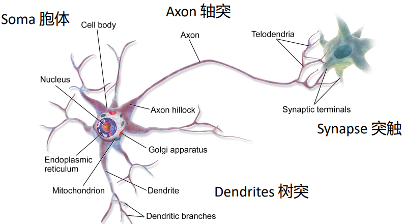
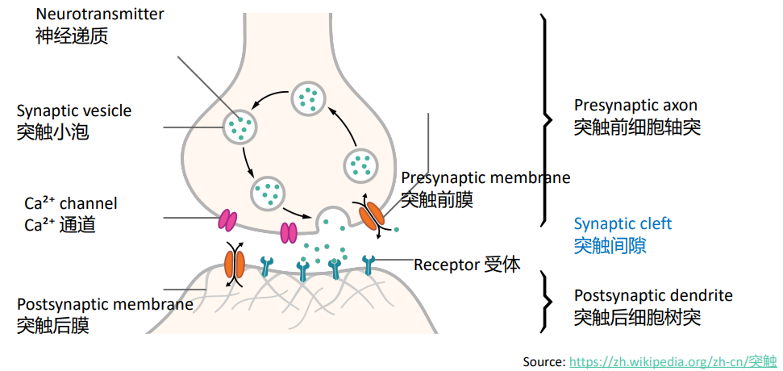
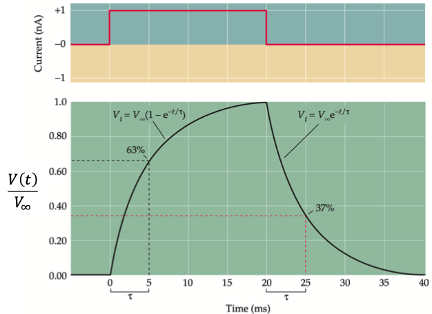
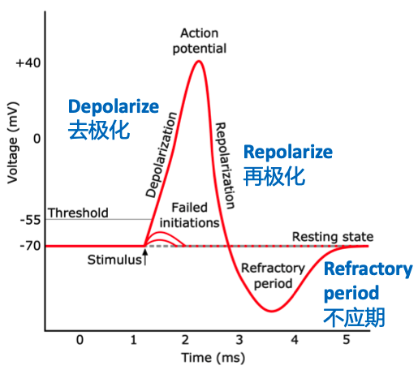

[课程网页链接](https://clcs-sustech.github.io/zh/course/cse5026/)

## Course Introduction & Overview

### background

Psychology, Gestalt, Behaviorism, S-R theory, Information Processing Theory

### Methodology

- Internalism

    心智状态完全由大脑内部的物理状态决定，过于主观
    1. Reductionism
    2. Functionalism
    3. Introspectionism
    4. Cognitivism / Symbolism

- Externalism

    心智状态部分由外部世界决定
    1. Behaviorism
    2. connectionism

#### Technology
 - Brain-related Technology
 - Behavioral Studies
 - Tools; Experimental designs; Math and statistics.

### Supplementar: CPM & Hypothesis Testing

对于两类假设
- $H_0$：原假设（null hypothesis）
- $H_A$：备择假设（alternative hypothesis）

以及显著性水平（significance level）
- $\alpha$

假设检验通常包括：
- Type I error（$α$）：$H_0$ 为真，却错误拒绝 $H_0$；
- Type II error（$β$）：$H_A$ 为真，却没有拒绝 $H_0$；
- Power：$H_A$ 为真，并成功拒绝$H_0$。

$\alpha$ ,$\beta$, $power$ 的关系是：

- $\beta$：在计算Type I error 使用 $\alpha$ 确定临界值后，用 $H_A$ 的分布算出没有在拒绝区域的概率：
$$
\beta=P_{\mu_A}(Z\le 1.645) \text{   OR   } 
\beta=P_{\mu_A}\left(\bar X\le c_\alpha\right)
$$
- $power=1−β$
- 增加样本量会提高 power：标准误变小，样本均值的分布变窄，因此更容易超过拒绝阈值。
- 一般性的样本量与 power 关系，适用于许多正态近似的假设检验：在给定噪声大小、显著性水平、目标 power 和最小可检测效应后，需要多少样本。
    
    $\Delta$：希望检测到的真实效应大小
$$
n\ge
\frac{\sigma^2\left(z_{1-\beta}+z_{1-\alpha}\right)^2}{\Delta^2}
$$

## Neural Basis of Cognition

从神经元到数学模型到真实大脑结构

### Neuron

树突主要接收其他神经元传来的信号，胞体包含细胞核并维持细胞生命，同时也参与整合输入；轴突则把神经元产生的信号传向其他位置。

- Soma/Cell 胞体：出现在脑，脊髓灰质，神经节，结构和其他细胞相似
- Cell Membrane 细胞膜：神经细胞膜敏感，上面有蛋白质构成受体(receptors)和离子通道(ion channels )，受体和神经递质结合传递信号， 乙酰胆碱(Acetylcholine) 或 γ-氨基丁酸(GABA)的结合 改变膜电位 (membrane permeability and potential)，造成兴奋(excitation)或抑制(inhibition)
- Synapse 突触: 由Charles Sherrington 提出，认为信息在这些位置传递
    - 
    - 信号的的传递是电信号到化学信号再到电信号
        1. 突触前兴奋（Presynaptic excitation）使突触前膜（presynaptic membrane）发生去极化（depolarization），钙离子（Ca²⁺）内流。
        2. 神经递质（Neurotransmitters）释放进入突触间隙（synaptic cleft），在间隙中扩散，并与突触后受体（postsynaptic receptors）结合。
        3. 离子通道（Ion channels）开放，引发突触后膜去极化（depolarization，膜内负电位减少）或超极化（hyperpolarization，膜内负电位增多）。
    - 突触连接（synaptic connections）可以发生改变 (Hebbian learning)：神经元反复共同激活会建立关联，使得其中一个神经元有助于激活另一个。若神经元 A 反复激活神经元 B，二者之间的突触连接会增强。
    - 突触可塑性（synaptic plasticity）一起放电的神经元，连接在一起（Cells that fire together, wire together.）fire是神经元放电
- 神经递质（Neurotransmitters）

- 神经递质（Neurotransmitters）是由突触前末梢（presynaptic terminals）释放的化学物质。它们结合突触后神经元（postsynaptic neurons）或效应器细胞（effector cells）上的受体，用来传递信息。
  - 乙酰胆碱（Acetylcholine）
  - 儿茶酚胺（Catecholamines）：去甲肾上腺素（norepinephrine）、多巴胺（dopamine）
  - 5-羟色胺 / 血清素（Serotonin / 5-HT）

### Resting Membrane Potential & Action Potential

#### Resting Membrane Potential  静息电位

静息膜电位约 −70 mV，膜内电位相对于膜外为负。膜外 Na⁺、Cl⁻浓度更高；膜内 K⁺浓度更高。

钠钾泵（sodium–potassium pump）消耗 1 分子 ATP，将 3 个 Na⁺运出细胞，同时将 2 个 K⁺运入细胞。

##### Hodgkin–Huxley Experiments

- 英国生理学家 A. L. 霍奇金（A. L. Hodgkin）与 A. F. 赫胥黎（A. F. Huxley）将玻璃微电极（glass microelectrodes）插入乌贼巨轴突（squid giant axons），记录细胞内部的膜电位。（后续二人建立霍奇金‑赫胥黎数学模获得诺奖）
- 电压钳（Voltage clamp）技术：HH 实验操作，向神经元（轴突，axon）内部注入电流（current），观察膜电位相对于静息电位（约‑70 mV）如何发生变化。

细胞膜可以近似等效为电容与电阻并联
- 电容 $C$：在膜两侧储存电荷
- 电阻 $R$：代表离子跨膜漏电流
- 输入电流 $I(t)$：外部注入电流

$$
I(t)=I_C(t)+I_R(t) = \frac{dQ}{dt} + \frac{V}{R} = C\frac{dV}{dt} + \frac{V}{R}
$$

$$
RC\frac{dV}{dt}=IR-V
$$

$$
\frac{dV}{dt}=-\frac{V}{RC}+\frac{I}{C}
$$

注入恒定电流，电压不变，膜电位最终趋近的稳定电压 $\boldsymbol{V_\infty=I_0R}$

定义膜时间常数 $\boldsymbol{\tau=RC}$

$$
\frac{dV}{dt}=-\frac{V}{\tau}+\frac{V_\infty}{\tau}
$$

$$
\boldsymbol{\frac{dV}{dt}=\frac{V_\infty-V}{\tau}}
$$

电压变化速率和当前电压距离稳态值的差值成正比

$$
V(t)=V_\infty+\big(V(0)-V_\infty\big)e^{-t/\tau}
$$

$\tau$ 的意义：当时间等于 \($\tau$\)，电位完成从起点到稳态总变化量的 63.2%。

#### Action Potential 动作电位

膜内电压高于膜外，触发动作电位需要刺激强度超过阈值电位，一旦超过，动作电位迅速达到顶峰，然后返回静息电位

- Propagation（传导）：在某一区域，刺激引发膜电位发生快速反转。该区域相当于电池，使邻近细胞膜电位上升至阈电位以上，从而触发新的动作电位。动作电位可远距离不衰减传导（without decrement）

###  Leaky Integrate-and-Fire (LIF) Neurons 渗漏积分激发模型

#### Neuromorphic Computing 神经形态计算（类脑计算）

- 设计模仿生物神经系统(biological nervous systems)信息处理方式的计算系统。
- 主流范式：神经元维持内部状态，通过脉冲（spike）通信，并依靠带权重的突触完成相互作用。
- 脉冲神经网络（Spiking neural networks, SNN）：可在软件中运行，也可部署在专用硬件上。
- 一套简单规则决定神经元什么时候发放脉冲。神经元接收突触前神经元的脉冲信号时，会不断累积势能（膜电位）。当该势能超过阈值，神经元就发放脉冲

#### LIF Neurons

突触后神经元对来自所有突触前神经元的输入做累加（积分），但该电位值会随时间衰减（渗漏）。如果输入累加总和达到最低阈值，神经元就发放脉冲。（A Leaky Bucket Analogy：累加的越多，衰减的越快）

### Brain