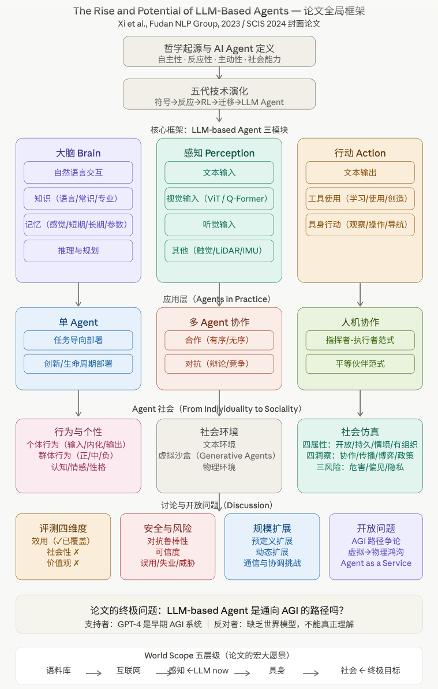
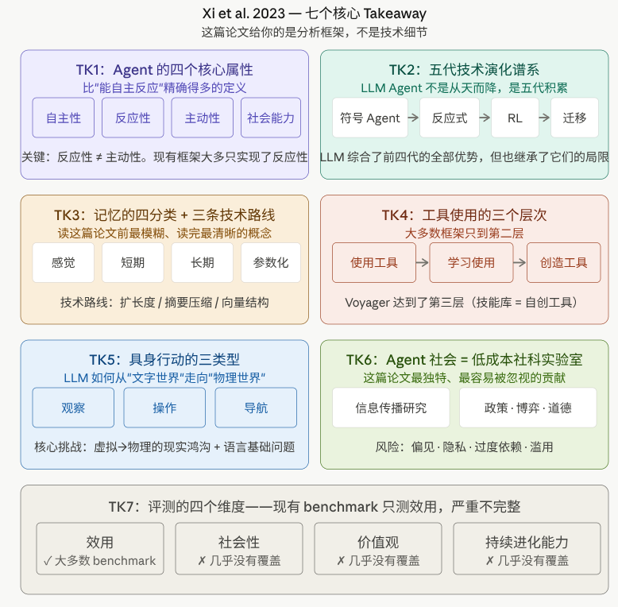
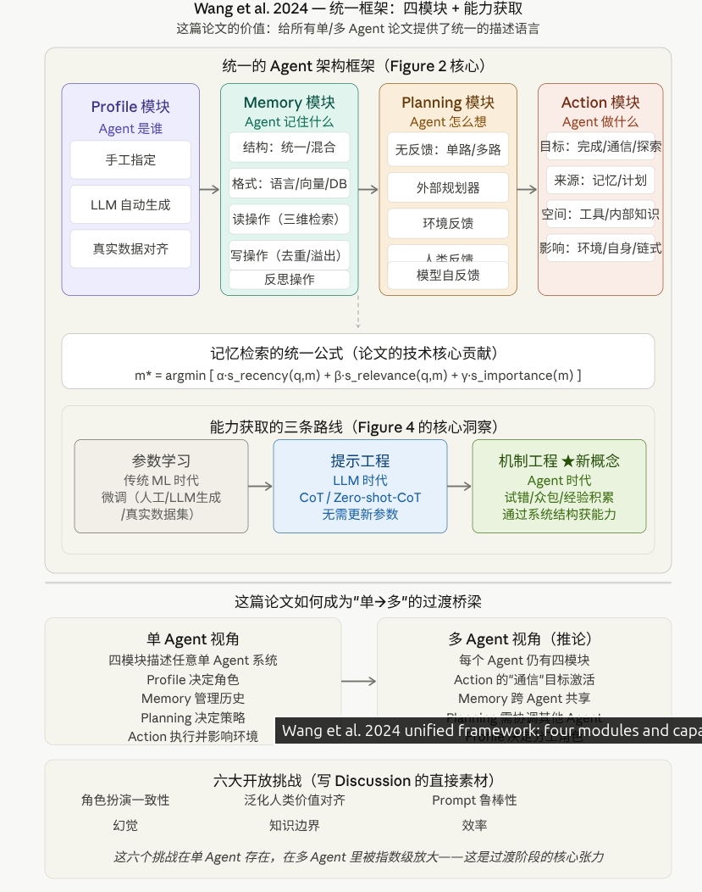
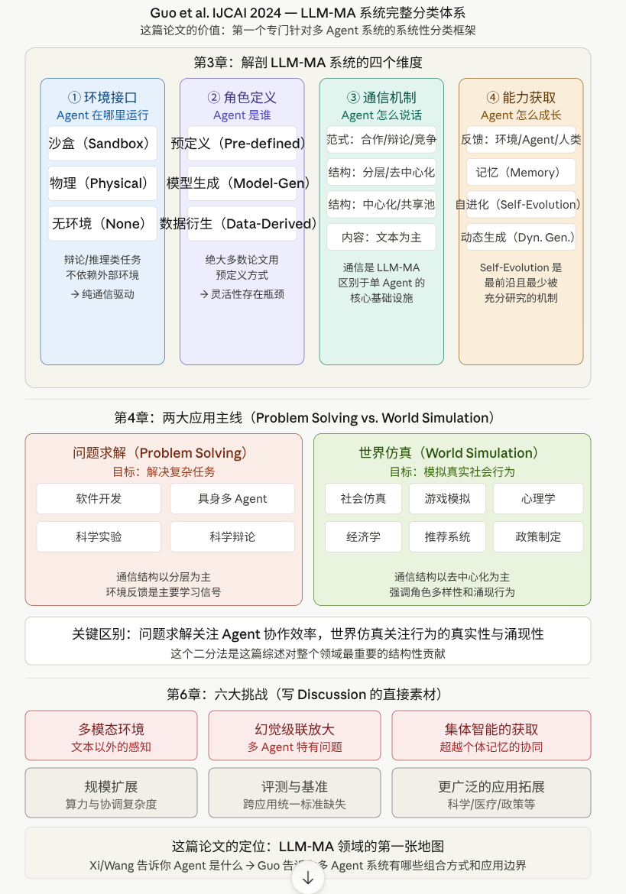
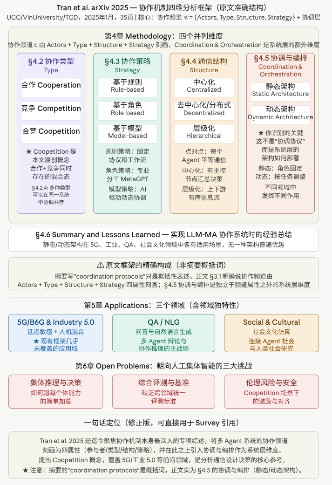
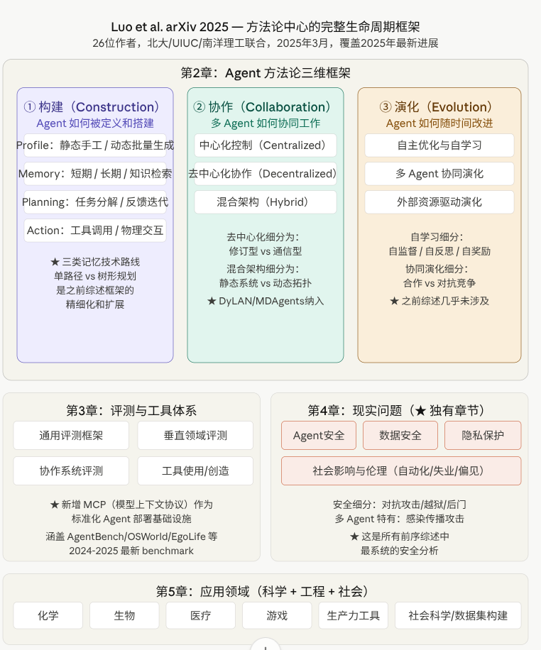

在transformer之后，GPT横空出世，让大模型时代正式开启。这之后关于大模型的研究，大致分以下几种：

- 继续优化大模型结构，以及优化训练方式。
- 多模态理解与生成，同时扩展长上下文与记忆机制，以及持久化记忆。
- 增强推理能力（如思维链）和高效推理与模型压缩（如蒸馏）
- 可信与对齐：对齐与安全（RLHF、DPO）以及评估与基准持续升级，动态检验模型的多维能力、安全性与幻觉问题。
- 检索增强生成（RAG）率先将模型与外部知识库打通。在此基础上，Agent与自主智能体将推理、RAG、工具使用、长记忆与多模态全面整合。

GPT-4及其后续版本的发布从根本上改变了人工智能研究的格局。大型语言模型不再仅仅充当文本生成工具，而是作为能够进行规划、工具使用和自我反思的通用推理引擎。大型语言模型作为基础模型的出现，催化了一次从孤立AI系统向协作式、多智能体架构的范式转变，后者能够处理复杂的、长期的任务。The Rise and Potential of Large Language Model Based Agents: A Survey（The Rise and Potential of LLM Based Agents，Xi et al. 2023）在LLM-based agent话题中总结了Agent的起源、目前agent的实现，并预测了未来发展。





## 单智能体

在回顾多智能体系统之前，需要首先理解它们所依赖的单一智能体能力，这一领域的基础性贡献确立了所有后续多智能体工作所依赖的基本操作——推理、行动和自我修正。多智能合作起源于单智能体，当时GPT之后人们发现只要模型足够大，那么给予少量提示词语和示例，模型就能非常出色的完成很多任务（Few-Shot Learners，Brown et al. 2020），然而模型经常答错，特别是在推理类的任务上，模型经常上下文无法对齐，且会产生幻觉。（Chain-of-Thought，Wei et al. 2022）通过让模型在中间输出自然语言表述的思考过程，显著提升了多步推理中上下文的一致性与逻辑连贯性。（claude的instruction中总会出现：让我们把大问题拆成小问题，逐步完成）。CoT后来被用于指令微调和模型蒸馏，这进一步证明了推理能力是可以被提取、固化并高效迁移的。（ReAct，Yao et al. 2023）让大语言模型在行为层面重回经典智能体理论（BDI模型）所描述的“sense-think-act”闭环。尽管其内部机制仍基于动态文本生成，而非LLM形式化的信念库与意图规划，但ReAct首次使其从被动语言生成器变为可自主与环境交互的智能体。（Reflexion，Shinn et al. 2023）在此基础上引入了语言化的反思记忆，使智能体在行为层面具备了“从失败中学习”的能力。

（A Survey on LLM-based Autonomous Agents，Wang et al. 2024）提供了关于基于LLM的自主智能体的全面综述，将能力组织为四个模块：感知、记忆、规划和行动(Profiling, Memory, Planning, Action): Profiling 模块的目的是识别 Agent 的角色，Memory 和 Planning 模块将 Agent 置于动态环境中，使其能够回忆过去行为并规划未来行动，Action 模块负责将 Agent 的决策转化为具体输出。论文列出的六个挑战：角色扮演一致性、泛化人类价值对齐、Prompt 鲁棒性、幻觉（agent会容易被其他agent误导）、知识边界、效率。


## 多agent

多agent系统借用LLM的能力，通过提示词工程让agent合作表现出比单agent更强的能力。CAMEL采用了一种“初始提示”（inception prompting）技术（CAMEL，Li et al. 2023）：在协作开始前，每个智能体都会被提供详细的角色描述、任务说明以及关于其他智能体角色的明确指示。这种引导机制使得两个智能体能够保持一致的角色身份，并在无需进一步人工干预的情况下自主合作。ChatDev（ChatDev，Qian et al. 2024）和 MetaGPT（MetaGPT，Hong et al. 2024）在不同的方向解决这个多 Agent 自由对话会产生大量幻觉的问题：ChatDev引入了“通信式去幻觉”（communicative dehallucination），而MetaGPT将工作流约束（SOP）明确编码到提示结构中。通过要求智能体产生和消费结构化工件而非自由文本，MetaGPT显著减少了“级联幻觉”。AutoGen（AutoGen，Wu et al. 2023）在多智能体框架上进行抽象，提供了一个通用的基础设施，让多智能体框架变得简单易用。AgentVerse（AgentVerse，Chen et al. 2024）对于固定角色的范式提出质疑，引入动态调整智能体团队，在需要时招募专家，并在其贡献完成时释放他们。斯坦福大学的Generative Agents（Generative Agents，Park et al. 2023）创造出了agent society，获得了最佳论文奖，通过解决复杂的记忆以及planning问题，完整地构建出了一个小型的虚拟社会。（Large Language Model based Multi-Agents: A Survey of Progress and Challenges，Guo et al. 2024）在多智能系统方面做了总结。

（对于综述中：集体智能的获取：在传统多 Agent 系统中，Agent 通常使用强化现在所有系统都是调整单个 Agent，没有系统真正实现了多 Agent 的联合优化。目前这个空缺应该已经被快速弥补，如：MACT (Multi-Agent Cooperative Tuning)，有时间可以多了解）（以及self-evolution部分现在应该正在处于研究热点）

## 通信拓扑与辩论机制

在了解了多agent框架之后，我们需要补充多agent框架之中一个重要的部分：agent通信。除了单个智能体的能力，智能体间的通信结构深刻影响着系统性能。

Du等人提出了一个开创性的多智能体辩论（MAD）框架（Multiagent Debate，Du et al. 2023），该框架借鉴了“心智社会”假说。多个LLM实例独立生成对某个查询的候选答案，然后迭代地阅读和批评彼此的回答，经过几轮后最终达成共识答案。（虽然实验验证了比单智能体问多轮好，但是我其实存在问题是他单智能体多轮用的prompt中给的例子只有一个，变量没有统一）。Liang等人提出的“鼓励发散思维”框架（Encouraging Divergent Thinking through Multi-Agent Debate，Liang et al. 2024）扩展了辩论范式以解决一个关键限制：当所有辩论智能体共享同一个基础模型时，它们往往会收敛得过快，强化了共同的偏见而非探索多样化的解决方案。这一框架强制智能体在初始轮次中支持不同的立场，从而防止了过早共识，并提高了生成推理路径的多样性。

Zhuge等人提出了GPTSwarm（GPTSwarm，Zhuge et al. 2024），它提供了迄今为止最严谨的多智能体拓扑形式化。GPTSwarm将一个多智能体系统建模为一个计算图，其中节点实现函数（例如，查询LLM、调用工具或聚合结果），而有向边定义了信息流。图可以按层次结构组合，使得能够构建由相互交互的子系统组成的“蜂群”。GPTSwarm引入了两个层次上的自动图优化：节点级的提示优化（改进每个智能体的个体指令）和Agent级的拓扑优化（重构通信图以最大化任务性能）。

Liu等人提出了动态LLM-智能体网络（DyLAN）（DyLAN，Liu et al. 2024），解决了固定智能体团队中所有成员无论相关性如何都参与每个推理步骤的低效问题。DyLAN引入了一个“智能体重要性分数”——衡量每个智能体对当前推理步骤贡献的轻量级指标——并动态地仅为每一轮选择最相关的智能体子集。重要性分数持续低下的智能体将从活跃团队中被剪枝。这种方法通过过滤掉分散注意力或冗余的智能体贡献，同时减少了Token消耗并提高了输出质量。（有点像HMM的前向后向，具体的忘记了）后续的其他工作很多是给出了其他的评分机制和learning的方式来看哪个LLMagent是更合适合作的

Multi-Agent Collaboration Mechanisms: A Survey of LLMs（Multi-Agent Collaboration Mechanisms Survey，Tran et al. 2025）注重于通信和协调机制（协作人工智能）。论文有强大的野心：“所有未来工作都是朝向集体智能这个目标的不同路径：更好的协调协议解决涌现的信道效率问题，更系统的演化机制解决集体学习问题，形式化的合竞理论解决激励设计问题”）（AI模型之间的主动协作可以显著提高效率和效果）**其核心贡献是提出了一个以协作为中心的可扩展框架，通过五个维度刻画协作机制，并覆盖 5G/6G 网络、工业 5.0、问答和社会文化等跨领域应用，最终识别出朝向人工集体智能的关键挑战和研究方向。**

论文介绍了基于大语言模型的多智能体协作系统的基本概念，包括智能体的定义、协作系统的组成部分以及协作机制的关键特征。定义了基于LLM的多智能体系统中的协作问题，并提出了协作机制的数学表达（$y_{collab}=S(O_{collab},\mathcal{E},x_{collab}|\mathcal{A},C)=\{c_{j}(\{a_{i}(o_{i},\mathcal{E},x_{i})|a_{i},o_{i},x_{i}\in c_{j}\})|c_{j}\in C\}$）。论文引入了Coopetition（合竞，概念来自博弈论和商业战略领域，出现于当 Agent 既需要合作完成共同任务，同时又在某些子目标上存在资源竞争，现在已经是agent的研究热点）还有Coordination of Different Collaboration Channel Types.（协调不同类型协作渠道：复杂任务可能需要结合合作与竞争，形成混合协作模型。不同智能体参与不同的协作渠道 $c$，共同实现整体目标 $O_{collab}$，如LEGO框架）

文章总结了通信结构的类别以及协调与编排，即多个通道之间的关系和交互。静态和动态的架构在不同领域中发挥着不同的重要作用。并总结了实现基于 LLM 的多智能体协作系统时的经验：

1. 建立清晰可靠的协作通道，有效设计可超越单智能体，反之则被反超；
2. 整合领域知识预定义静态架构，确保专业性与一致性；
3. 动态分配角色与通道，提升系统灵活性与任务适应性；
4. 按任务特性选择最优策略——规则保公平、角色利分工、模型适动态；
5. 采用可扩展架构，避免智能体增多带来的性能下降；
6. 内置伦理安全约束，防止有害行为与意外后果。

5G/6G 网络调度需要大量异质 Agent 实时协调（基站、设备、用户），这个场景对协作机制提出了极端的延迟和可靠性要求，是现有 LLM-MA 框架几乎没有考虑的应用域。这两个领域的存在说明LLM-MA 在延迟敏感场景（5G）和人机混合场景（工业）的应用缺口。语义通信（LLM-SC, LaMoSC, LAM-MSC, GMAC）为多智能体系统提供了一套“用LLM压缩、理解、对齐和传输语义信息”的通信方案，从而解决传统通信中带宽不足、信息异构、语义歧义等核心难题。相关的概念还有Industry5.0, Natural Language Generation (NLG); and Social and Cultural Domains (S&C)


## 自动化多智能体系统设计

多智能体框架的一个基本限制是它们的拓扑、智能体角色和工作流结构都是人类定义的。最近的研究开始将多智能体架构本身视为一个搜索问题，自动发现高性能配置。

Hu等人介绍了自主智能体系统自动化设计（ADAS）（ADAS，Hu et al. 2024），这是第一个将多智能体系统设计框定为搜索问题的研究。ADAS采用一个元智能体来迭代地提出、评估和完善用Python代码表示的新型智能体配置。元智能体维护一个已发现架构的注册表，使用启发式搜索来探索设计空间。ADAS证明了自动发现的架构可以超越专家设计的手工系统，开启了一个新的研究方向。

Zhang等人提出了AFlow（AFlow，Zhang et al. 2025a），AFlow将智能体工作流表示为代码图，并采用蒙特卡洛树搜索来导航搜索空间。工作流搜索在一组预定义的操作符上运行，这些操作符是可组合的构建块，包括集成（采样并聚合）、评审（生成并批评）、修正（迭代细化）和测试（根据示例验证）。AFlow还提供了帕累托最优的成本-性能权衡曲线，使实践者能够选择适合其Token预算的工作流。

Zhang等人提出了MaAS（MaAS，Zhang et al. 2025b），MaAS观察到ADAS和AFlow共享一个基本限制：无论每个实例的难度变化如何，它们都为整个数据集优化单一的架构。相反，MaAS训练一个元控制器，对于给定的特定查询，从学习到的架构分布中采样一个查询自适应的多智能体架构。这种实例自适应方法使MaAS能够为简单查询部署轻量级的单智能体配置，仅在必要时部署复杂的多智能体集成，与手工基线和数据集级自动化基线相比，实现了优越的性能成本比。

## 补充

Large Language Model Agent: A Survey on Methodology, Applications and Challenges（Large Language Model Agent Survey，Luo et al. 2025）从"构建-协作-演化"三维度覆盖单/多 Agent 全生命周期，且增加了安全、隐私、社会影响等现实问题的深度讨论，演化维度描述的是 Agent 系统随时间怎么变。这是从静态架构到动态生命周期的视角升级。

记忆三分法比 Xi 等人的四分法（感觉/短期/长期/参数化）更贴合工程实践（The Rise and Potential of LLM Based Agents，Xi et al. 2023）。论文中提到的去中心化协作可以进一步分为两种不同方法：修订型系统（revision-based），其中 Agent 只观察同伴生成的最终决策，并通过结构化编辑协议迭代细化共享输出；通信型系统（communication-based），这类方法具有更灵活的组织结构，允许 Agent 直接参与对话并观察同伴的推理过程。MedAgents 是修订型（独立提案+投票），AutoGen 是通信型（群聊辩论）（AutoGen，Wu et al. 2023）。两者在表面上都是"去中心化"，但失败模式完全不同：修订型容易产生偏见堆叠（所有人基于错误的初始答案修订），通信型容易产生从众效应（早期强势意见影响整体）。

演化内容是最新的内容：自主优化和自学习允许 LLM 在无需大量监督的情况下提升能力，包括自监督学习、自反思、自纠正和自奖励机制；多 Agent 协同演化通过合作学习（Agent 共享信息和协调行动）和竞争性协同演化（Agent 通过对抗交互优化策略）来提升能力；外部资源驱动演化通过整合结构化信息和反馈来增强 Agent 的演化。Self-Rewarding（LLM 给自己打分作为奖励信号）、竞争性对抗训练（Red-team LLMs）、ProAgent（从队友行为中学习），这些都是在 Agent 部署后持续改进的机制。（这些都没有看过，可以找时间看看）

MCP 是 Anthropic 2024 年底推出的协议，到 2025 年已经成为 Agent 工具集成的事实标准。这个协议的存在意味着：不同 Agent 框架（AutoGen、LangChain、Claude）现在可以通过同一协议接入同一套工具，这从根本上解决了工具碎片化的问题。（还有另外的一些评估方法和其他工具）

文献同样提到了安全问题，比如AgentSmith 的研究表明，感染传播以指数级速度发生。而感染性递归阻塞攻击（CORBA）被设计为破坏 Agent 间通信，允许感染在整个通信网络中传播。多 Agent 系统引入了单 Agent 没有的全新攻击面——感染传播。一个被攻击的 Agent 可以把攻击传播给所有它通信过的 Agent，速度是指数级的。这不是"幻觉"或"错误"，而是主动攻击。一系列的安全问题和社会影响


## 对于agent的一些思考

根据Rethinking the Value of Multi-Agent Workflow（Rethinking the Value of Multi-Agent Workflow，Anonymous 2025）所说，绝大多数框架使用同一个基础模型实例化所有智能体。这种同质性限制了辩论和协作过程中可用视角的多样性。然而目前能力强大的模型都是混合体，我们应该如何避免同质化呢？以及有没有可能用多个特定功能的小模型来尝试这种异质化的合作会比较有用

现在agent是否还可能会存在被误导而改变自己想法的情况，如果这样多智能体框架是否可以引入一个类似分布式一致性的算法来减少这种被误导情况的发生：可以且已经有严谨的理论工作。那么多agent博弈通信应该也有这部分，需要继续读论文，补充为agent通信部分。

Agent记忆或者是说大语言模型的记忆是怎么做的，（如何在有限的上下文情景下能记住更抽象的东西），我们又如何判断他有没有将知识内化呢？首先找出这方面的论文或综述我知道有一些作品是连接外部数据库然后将某些记忆让LLM总结后作为新的记忆，叫做思考过程。我的想法是人类并不是所有的抽象记忆都是能表述出来的，这在我看来也许是知识内化，也就是参数化记忆更改的过程，但是我感觉他又不同于模型微调，不知道如何解释。或许之后需要再看看这部文章

## 一些读论文时候的问题（AI回答）

Q：像刚才我们说的这种提示词工程，他只通过例子证明自己的发现有效，而且对于大模型这种生成很随机的东西，他只通过提出：我们规定大模型说什么给下一步，然后证明这样的流程能提升准确率，那么站在评审的角度来说，他凭什么能登上顶期刊：就是讲了一个更好的故事么？那么他的创新点和工作量是什么？我的意思是，他对于创新点甚至没有任何工程的创新，而是简单的打字定义输出，工作量更像是和llm聊天然后搜集不同话术的效果，这真的有算工作量么

A：提示词工程之所以能登上顶会，并非依靠工程创新或叙事包装，而是通过严谨实验首次揭示了大模型的涌现能力，并以极简、通用、可复现的方式定义了推理与交互的新范式；其核心贡献是科学发现与范式构建，而非简单的提示调试，因此具备顶会级别的学术价值。

---

Q：为什么当时提示词工程热极一时，但是现在似乎没什么声音了

A：传统手工提示词工程之所以曾热极一时，是因为早期大模型理解能力有限，依靠精心设计的指令就能显著解锁推理与工具使用能力；而如今看似无人问津，并非这项技术失去价值，而是模型能力大幅提升让手工调优的边际收益快速衰减，且手写提示脆弱难以工业化落地，同时研究重心已从单纯设计话术，转向自动化提示优化、上下文工程、结构化提示、推理时对齐与多智能体系统等更高级范式，老式手工提示工程被吸收、升级并融入现代大模型系统，因此不再作为独立热点出现在公众视野中。

---

Q：你能告诉我为什么Generative Agents: Interactive Simulacra of Human Behavior（Generative Agents，Park et al. 2023）就能得到最佳论文

A：你漏掉了每篇论文真正在问的研究问题。**技术上改了什么**和**解决了什么问题**是两回事。

CAMEL（CAMEL，Li et al. 2023）之前，没有人知道两个 LLM 能不能在没有人类干预的情况下**持续对话并完成任务**。当时的主流做法是：人类写 prompt → LLM 回答 → 人类再写下一个 prompt。CAMEL 的核心发现不是"角色扮演"，而是：**通过 inception prompting，两个 LLM 可以在完全没有人类插手的情况下协作完成任务，而且对话能保持连贯和目标导向。**这听起来现在很平常，但在 2023 年初这是第一次被系统证明的。CAMEL 还做了一件事：收集了大量这种自主对话数据，发现了很多有趣的现象，比如角色扮演中的**角色漂移**（agent 忘记自己的身份）、**话题漂移**（对话跑偏）。这些现象本身就是新的研究发现。所以 CAMEL 的贡献不是"发明了角色扮演的提示词"，而是**第一次系统研究了 LLM 自主多 Agent 协作的可行性和失败模式**。

CAMEL 之后，大家知道多 Agent 可以自主协作了。但立刻出现了一个新问题：多 Agent 自由对话会产生大量幻觉和错误，而且错误会层层传递放大。ChatDev（ChatDev，Qian et al. 2024）和 MetaGPT（MetaGPT，Hong et al. 2024）都是在解决这个幻觉传播的问题，但思路完全不同：**ChatDev 的思路：限制对话范围。** 每次只让两个 Agent 就一个具体小问题对话（Chat-chain），对话完成后产出一个具体的东西（一段代码、一个决策），然后进入下一个环节。这样每一步的上下文都很干净，错误不容易积累。另外加了 communicative dehallucination：如果一个 Agent 说了对方没法验证的事情，对方要追问直到澄清。**MetaGPT 的思路：完全不让 Agent 自由对话。** Agent 只能按照 SOP 产出规定格式的文档（PRD、系统设计图、代码），下一个 Agent 只能读这些文档，不能和上一个 Agent 随便聊。这相当于把软件公司的工作流程硬编码进去。所以这两篇论文的核心区别不是"谁更像真实公司"，而是：**ChatDev 用结构化对话来抑制幻觉，MetaGPT 用消灭对话来抑制幻觉**。这是两种完全不同的设计哲学，各有优劣。MetaGPT 更稳定但更死板，ChatDev 更灵活但更容易出错。

---

Q: Generative Agents 为什么能拿 Best Paper

A: Generative Agents（Generative Agents，Park et al. 2023）问的是：能不能用 LLM 创造出有可信人类行为的虚拟社会？是科学问题。Generative Agents 让 25 个 Agent 在虚拟世界里**持续生活两天**，每个 Agent 需要记住几百件事情，要和其他 24 个 Agent 随机相遇、建立关系、传播信息、做计划、改变计划。这里有三个技术难题是 ：

- **难题一：记忆爆炸。** 两天内一个 Agent 会经历几百件事，全放进 context 窗口放不下，但如果丢掉，Agent 就会"失忆"。论文提出的记忆流（memory stream）+ 重要性评分 + 检索机制，是专门解决这个问题的，和 ReAct（ReAct，Yao et al. 2023）的短期 observation 完全不是一回事。
- **难题二：从记忆到洞察。** 人类不只是记住事情，还会从很多事情里归纳出更高层的认知（"我的朋友 Klaus 最近很忙，他可能压力很大"）。论文的**反思机制**专门让 Agent 定期从低层记忆归纳出高层洞察，这样 Agent 的行为就有了长期连贯性。这和 Reflexion（Reflexion，Shinn et al. 2023）的"任务失败后反思"是完全不同的场景和目的。
- **难题三：多 Agent 之间的信息传播。** 当 25 个 Agent 相遇时，他们会互相分享信息，信息会在社区里传播。论文发现这种传播产生了真实人类社会里才有的现象，比如谣言扩散、派对信息口耳相传、Agent 自发组织集体活动。这些都是**没有被编程进去的涌现行为**。

UIST 是人机交互领域最顶级的会议，它评判的标准不只是技术有多难，还有**这个工作对人类理解自身有什么意义**。Generative Agents 的意义在于：它第一次用计算方法创造出了在行为上可信的虚拟人，这对游戏设计、社会科学仿真、人机交互研究都有深远影响。评审看到的不是"这是一个写代码的工具"，而是"这可能是研究人类社会行为的新科学仪器"。另外，这篇论文的实验设计本身就很严格：他们做了大量的人类评估，让真人来判断 Agent 的行为是否像真实人类，结果远超随机水平。这种严谨性在当时的 LLM 应用论文里很少见。

每篇论文真正的贡献是它回答了一个之前没人回答的问题，或者证明了一件之前没人知道能不能做到的事。技术实现只是手段。CAMEL 改了提示词，但它第一次证明了 LLM 能自主协作；MetaGPT 改了提示词结构，但它第一次系统解决了幻觉传播问题；Generative Agents 加了记忆和反思，但它第一次创造出了可信的虚拟社会。读论文时，最重要的问题永远是：**这篇论文在没有它之前，什么东西是不知道或者不能做的？**

---

Q：怎么读综述？

A：一篇好的综述提供了整合性的框架，并基于此框架列举了具体的实例论文。这使得我们可以快速定位自己感兴趣的方向。更重要的是，在后续阅读具体论文时，我们就能依据这个“地图”清晰地判断：这篇论文主要改进了框架中的哪个部分？它的进步是为了解决综述中提出的哪个难点，或实现什么终极愿景？

---

Q：通信是多智能体系统非常重要的一部分么？为什么你建议我把通信单独列出来呢？

A：所以，通信被突出，不是因为其他不重要，而是因为其他维度在当前LLM范式下要么被很好地解决了（如角色扮演），要么被暂时搁置（如信用分配），而通信是当前提升系统效率和质量的最大杠杆。以下方向在现有调研中基本缺失，值得提及：

- **任务分配策略**：中心化 vs 去中心化；基于拍卖 vs 基于承诺
- **agent技能获取与终身学习**：如何让agent在协作中更新自己的知识/技能（不仅是记忆）
- **信用分配与激励机制**：如何公平评价贡献，避免惰化或搭便车
- **冲突解决的非辩论机制**：比如第三方仲裁、投票机制的设计
- **社会规范与文化的涌现**：长期互动中agent能否形成隐性规则（斯坦福小镇的后续研究）

---
Q：我没理解GPTSwarm（GPTSwarm，Zhuge et al. 2024）论文中的这句话 Moreover, the utility functionis typically non-differentiable due to the tokenization ofLLMs, and this remains true even when a differentiableDAG sampling technique is employed.

A：GPTSwarm（GPTSwarm，Zhuge et al. 2024）想做的事情是：给定一个图 G（节点是 Agent，边是信息流），找到最优的图结构，使得某个效用函数 u(G) 最大化。用符号写就是：

$$G^* = \arg\max_G ; u(G)$$

其中 u(G) 是"这个图在任务上表现有多好"，比如答题正确率。这是一个优化问题，最自然的想法是用梯度下降来解它。梯度下降需要计算 ∂u/∂G，也就是效用函数对图结构的梯度。图结构可以被参数化成边的存在概率。给每条潜在的边 e_ij 一个参数 θ_ij ∈ {0,1}，表示这条边存在的概率。整个图的参数集合就是 θ = {θ_ij}。那么效用函数变成了 u(G(θ))，你想对 θ 求梯度。从 θ 中采样出一个具体的图 G，这个采样过程是不可微的。给定 θ_ij，你要么采样出"这条边存在"（用 0/1 表示），要么采样出"这条边不存在"。这是一个离散决策，离散决策对连续参数 θ 没有梯度。这就是为什么论文说"即使使用了可微的 DAG 采样技术，问题依然存在"——可微的 DAG 采样技术（比如用 Gumbel-Softmax 或者连续松弛）可以解决这第一个不可微，让图的采样步骤变得可微。但还有第二个更根本的问题。
假设图结构问题已经被你用可微松弛解决了，图 G 已经可以连续地参数化了。现在你要计算 u(G)，也就是实际运行这个图，让 Agent 处理任务，得到一个结果，评估这个结果的质量。这个过程里，LLM 做的事情是：

1. 接收 prompt（文本）
2. 生成 token 序列（离散的词表索引）
3. 这些 token 被解码成文字，作为下一个节点的输入
tokenization 把连续的参数空间映射到了离散的 token 空间。更具体地说：LLM 内部的计算（注意力机制、前向传播）是可微的，但最后一步——从 logits 向量里选出一个 token——是一个 argmax 操作：

$$\text{token}_t = \arg\max_v  \text{logits}_v$$

argmax 是不可微的。在 token 被选定的那一刻，梯度消失了。

### Example

假设图的参数 θ 发生了一个微小的变化，导致某个节点的 prompt 从"请分析这道题"变成了"请仔细分析这道题"（多了"仔细"两个字）。这个微小的变化会怎样影响 LLM 的输出？

在理想的可微世界里，输出应该连续地、平滑地变化。但实际上，LLM 的输出是一个 token 序列，每个 token 都是从离散词表里选出来的。加了"仔细"两个字之后，LLM 的第一个输出 token 可能完全不同——比如从"首先"变成了"好的"。这个跳跃是不连续的，没有梯度。

更极端的情况：参数 θ 的微小变化可能导致图的某条边从"存在"变成"不存在"，这意味着某个节点的输出根本就不会被传递到下一个节点，整个计算路径发生了结构性的改变。在这种情况下，∂u/∂θ 是未定义的。

可微 DAG 采样技术（比如 Gumbel-Softmax）做的事情是：把"要么存在要么不存在"的边采样，替换成"这条边以概率 p 存在"的软化版本，让图的结构参数化变得连续可微。这解决了**图结构层面**的不可微问题。但它解决不了**LLM 输出层面**的不可微问题。即使图的结构是连续参数化的，当你真正运行这个图的时候，LLM 仍然要在某个节点生成离散的 token，这个 token 的生成过程依然是不可微的。用数学语言说，效用函数 u(G) 的计算链是：

$$\theta \xrightarrow{\text{可微（用松弛）}} G \xrightarrow{\text{LLM运行}} \text{token序列} \xrightarrow{\text{评估}} u$$

第一个箭头可以通过松弛变成可微的。但第二个箭头——从图结构到 token 序列——包含了 argmax 操作，是不可微的，而且这个不可微来自 LLM 的内部机制，不是图结构采样的问题，所以可微 DAG 采样技术帮不上忙。

既然梯度下降行不通，论文转向了不需要梯度的优化方法。对于图结构优化，论文用的是一种基于采样的方法：多次采样不同的图结构，评估每个图的效用，用效用分数来更新每条边的存在概率 θ。这本质上是一种策略梯度（Policy Gradient）或者说 REINFORCE 风格的方法——用蒙特卡洛采样来估计期望梯度，绕开了需要精确梯度的要求。对于节点 prompt 优化，论文用的是 OPRO——把优化过程本身交给一个 LLM，让 LLM 读取历史的 prompt-分数对，然后生成一个更好的 prompt。这完全绕开了梯度，用 LLM 的元认知能力来替代梯度信号。

---

Q：我对GPTSwarm（GPTSwarm，Zhuge et al. 2024）严重不理解：我看懂了他的论文，但是我不理解他训练出来的东西为什么有泛化性。首先，我写入我几个节点和agent的功能，他就已经生成好图了，他甚至都不知道这个图要做什么，他就认为是最好了？其次他的节点优化是OPRO，这个训练好了有什么用呢？他为什么能泛化

A：它不是一个能泛化到任意新图结构的通用学习系统。它是一个针对固定节点集合的图结构搜索工具，搜索的信号来自真实任务执行结果，搜索的结果（θ）对同任务的新实例能泛化，但对新的节点组合不能直接复用。也就是我们需要训练：

```python
swarm = Swarm(["IO", "IO", "IO"], "gaia")
swarm.optimize(dataset=gaia_dev_set, iterations=200)  # 这里更新θ
answer = await swarm.arun(inputs)  # 这里用优化后的θ来采样图
```

这解释了为什么后续的 ADAS（ADAS，Hu et al. 2024）和 AFlow（AFlow，Zhang et al. 2025a）要进一步改进它：GPTSwarm（GPTSwarm，Zhuge et al. 2024）每次换图结构就要重新优化θ，成本很高；ADAS用代码来表示系统，AFlow用MCTS搜索工作流，都在试图解决GPTSwarm的这个根本局限。

OPRO不是训练，是一个改prompt的功能。

---
Q：Agent怎么解决Scalinglaw

A：Scaling Law 描述的是单一模型的边际收益递减，但系统级性能随 Agent 数量的扩展可能是超线性的。

把 LLM 不擅长的任务外包给专用工具，等效于用工程手段弥补了模型参数不足带来的能力缺口。

一些研究发现：对于某些任务，把同一个模型实例化成多个 Agent 并采样多次答案，然后投票，效果会随 Agent 数量增长而增长，**而且这种扩展有时比单纯增大模型参数更划算**。这是一种新的 Scaling——不是参数 Scaling，而是推理时计算量的 Scaling（Test-time Compute Scaling）。

ADAS（ADAS，Hu et al. 2024）、AFlow（AFlow，Zhang et al. 2025a）、MaAS（MaAS，Zhang et al. 2025b）是这个方向的最新代表。与其人工设计哪些 Agent 做什么、如何通信，不如用搜索算法自动找到对特定任务最有效的 Agent 组合。这意味着：**不再是一个大模型解决所有问题，而是为每个任务动态组合出最优的 Agent 系统**。

---

## Appendix:  Paper Summary

| **类别**                | **论文标题**                                                                         | **Venue**            | **作者**          | **核心贡献摘要**                                                                                               |
| --------------------- | -------------------------------------------------------------------------------- | -------------------- | --------------- | -------------------------------------------------------------------------------------------------------- |
| **Background**        | Chain-of-Thought Prompting Elicits Reasoning in LLMs                             | NeurIPS 2022         | Wei et al.      | 提出思维链提示，通过中间推理步骤让 LLM 处理复杂推理任务，奠定 Agent 推理能力的基础。                                                         |
| **Background**        | ReAct: Synergizing Reasoning and Acting in Language Models                       | ICLR 2023            | Yao et al.      | 提出 Thought-Action-Observation 循环范式，将 LLM 推理与真实环境交互（工具调用）统一，是几乎所有 Agent 框架的底层机制。                          |
| **Background**        | Reflexion: Language Agents with Verbal Reinforcement Learning                    | NeurIPS 2023         | Shinn et al.    | 让 Agent 用自然语言反思失败经验并写入记忆，无需梯度更新即可实现强化学习式的自我改进。                                                           |
| **Background/Survey** | A Survey on LLM-based Autonomous Agents                                          | Frontiers CS 2024    | Wang Lei et al. | 迄今最权威的 Agent 综述，建立感知-规划-行动-记忆四模块框架，是 Multi-Agent 研究的宏观背景蓝图。                                              |
| **Core Framework**    | CAMEL: Communicative Agents for Mind Exploration                                 | NeurIPS 2023         | Li et al.       | 首个系统性角色扮演框架，提出 inception prompting 让两个 Agent 在无人类干预下持续自主协作，并开源大规模对话数据集。                                  |
| **Core Framework**    | MetaGPT: Meta Programming for Multi-Agent Collaborative Framework                | ICLR 2024 Oral       | Hong et al.     | 将软件公司 SOP 编码进提示序列，Agent 产出结构化工件（PRD/设计文档/代码）而非自由对话，大幅减少多 Agent 幻觉级联。                                     |
| **Core Framework**    | ChatDev: Communicative Agents for Software Development                           | ACL 2024             | Qian et al.     | 构建完整虚拟软件公司，提出 Chat-chain 和 communicative dehallucination 机制，实验证明比单 Agent GPT-4 生成更完整、更少 bug 的代码。         |
| **Core Framework**    | AutoGen: Enabling Next-Gen LLM Applications via Multi-Agent Conversation         | COLM 2024            | Wu et al.       | 微软提出的通用多 Agent 对话基础设施，支持任意拓扑（链/星/树/图）和 human-in-the-loop，工业落地最广的开源框架。                                    |
| **Core Framework**    | AgentVerse: Facilitating Multi-Agent Collaboration                               | ICLR 2024            | Chen et al.     | 提出动态 Agent 招募机制，系统随任务进展自动调整团队组成，同时建立任务求解与社会仿真双框架并首次系统研究涌现行为。                                             |
| **Core Framework**    | Generative Agents: Interactive Simulacra of Human Behavior                       | UIST 2023 Best Paper | Park et al.     | Stanford/Google 联合研究，25 个 Agent 的社会沙盒，提出记忆流-反思-计划三层架构，UIST 最佳论文，里程碑式多 Agent 社会仿真工作。                      |
| **Communication**     | Improving Factuality and Reasoning through Multiagent Debate                     | ICML 2024            | Du et al.       | MIT 提出 Society-of-Minds 框架，多个 LLM 实例互相提出答案并辩论多轮，显著提升数学和战略推理准确性，开创 multi-agent debate 研究方向。               |
| **Communication**     | GPTSwarm: Language Agents as Optimizable Graphs                                  | ICML 2024 Oral       | Zhuge et al.    | Schmidhuber 组工作，将 Agent 系统建模为计算图，同时自动优化节点级 prompt 和边级通信拓扑，ICML Oral（前 1.5%）。                             |
| **Communication**     | Dynamic LLM-Agent Network (DyLAN)                                                | COLM 2024            | Liu et al.      | Georgia Tech/Stanford 提出 Agent Importance Score，动态选择每轮参与推理的 Agent 子集，自动剪除冗余通信，在任务求解和代码生成上超越固定拓扑基线。       |
| **Communication**     | Encouraging Divergent Thinking through Multi-Agent Debate                        | EMNLP 2024           | Liang et al.    | 针对 Du et al. 辩论中存在的从众效应，强制 Agent 在初始轮次持不同立场，引入发散思维机制提升辩论多样性和最终答案质量。                                      |
| **Auto Design**       | Automated Design of Agentic Systems (ADAS)                                       | arXiv 2024           | Hu et al.       | UBC/OpenAI 提出首个元 Agent 自动搜索新 Agent 系统设计的范式，以代码为表示空间用启发式搜索发现新颖 Agent 架构，开创自动化设计研究线。                       |
| **Auto Design**       | AFlow: Automating Agentic Workflow Generation                                    | ICLR 2025            | Zhang et al.    | 用 Monte Carlo Tree Search 在代码空间自动搜索最优多 Agent 工作流，内置 Ensemble/Review/Revise 等 Operator 抽象，比手工设计平均提升 5.7%。 |
| **Auto Design**       | MaAS: Multi-agent Architecture Search via Agentic Supernet                       | ICML 2025 Oral       | Zhang et al.    | 提出 Agentic Supernet，训练一个 controller 为每个 query 自适应采样最优 Agent 架构（异质/同质/单 Agent），在保持精度的同时大幅降低 token 成本。     |
| **Survey/Critique**   | LLM-based Multi-Agents: A Survey of Progress and Challenges                      | IJCAI 2024           | Guo et al.      | 同领域最权威综述，按通信结构/角色分工/应用场景建立分类体系（taxonomy），覆盖问题求解与社会仿真两大类应用，是本 Survey 直接参考框架。                              |
| **Survey/Critique**   | The Rise and Potential of LLM Based Agents: A Survey                             | arXiv 2023           | Xi et al.       | Fudan 大学，最早、最高引的 Agent 综述之一，系统梳理 Agent 的感知、记忆、规划、行动四个维度，是 Introduction 宏观背景的核心引用。                        |
| **Survey/Critique**   | Rethinking the Value of Multi-Agent Workflow                                     | arXiv 2025           | Anon.           | 重要批判性工作：在充分调优的强单 Agent 基线下，多 Agent 工作流的性能优势往往消失甚至为负；指出多 Agent 研究存在基线不公平问题。                               |
| **Survey/Critique**   | Multi-Agent Collaboration Mechanisms: A Survey of LLMs                           | arXiv 2025           | Tran et al.     | 这篇论文是迄今为止对"通信和协调机制"本身分析最深、维度最全的综述，是一篇专门解剖"Agent 之间如何说话"的专项工作。                                            |
| **Survey/Critique**   | Large Language Model Agent: A Survey on Methodology, Applications and Challenges | arXiv 2025           | Luo et al.      | 通过以方法论为中心的分类体系来系统解构 LLM Agent 系统，将架构基础、协作机制和演化路径联系起来，揭示 Agent 设计原则与其在复杂环境中涌现行为之间的根本联系。                   |

## References

[1] Wei, J., Wang, X., Schuurmans, D., Bosma, M., Xia, F., Chi, E., Le, Q., & Zhou, D. (2022). Chain-of-thought prompting elicits reasoning in large language models. NeurIPS 2022.

[2] Yao, S., Zhao, J., Yu, D., Du, N., Shafran, I., Narasimhan, K., & Cao, Y. (2023). ReAct: Synergizing reasoning and acting in language models. ICLR 2023.

[3] Shinn, N., Cassano, F., Berman, E., Gopinath, A., Narasimhan, K., & Yao, S. (2023). Reflexion: Language agents with verbal reinforcement learning. NeurIPS 2023.

[4] Wang, L., Ma, C., Feng, X., Zhang, Z., Yang, H., Zhang, J., ... & Wen, J. R. (2024). A survey on large language model based autonomous agents. Frontiers of Computer Science.

[5] Li, G., Hammoud, H. A. A. K., Itani, H., Khizbullin, D., & Ghanem, B. (2023). CAMEL: Communicative agents for mind exploration of large language model society. NeurIPS 2023.

[6] Hong, S., Zhuge, M., Chen, J., Zheng, X., Cheng, Y., Zhang, C., ... & Wu, C. (2024). MetaGPT: Meta programming for a multi-agent collaborative framework. ICLR 2024.

[7] Qian, C., Liu, W., Liu, H., Chen, N., Dang, Y., Li, J., ... & Sun, M. (2024). ChatDev: Communicative agents for software development. ACL 2024.

[8] Wu, Q., Bansal, G., Zhang, J., Wu, Y., Li, B., Zhu, E., ... & Wang, C. (2023). AutoGen: Enabling next-gen LLM applications via multi-agent conversation. COLM 2024.

[9] Chen, W., Su, Y., Zuo, J., Yang, C., Yuan, C., Qian, C., ... & Zhou, J. (2024). AgentVerse: Facilitating multi-agent collaboration and exploring emergent behaviors. ICLR 2024.

[10] Park, J. S., O'Brien, J. C., Cai, C. J., Morris, M. R., Liang, P., & Bernstein, M. S. (2023). Generative agents: Interactive simulacra of human behavior. UIST 2023 (Best Paper).

[11] Du, Y., Li, S., Torralba, A., Tenenbaum, J. B., & Mordatch, I. (2023). Improving factuality and reasoning in language models through multiagent debate. ICML 2024.

[12] Zhuge, M., Wang, W., Kirsch, L., Faccio, F., Khizbullin, D., & Schmidhuber, J. (2024). GPTSwarm: Language agents as optimizable graphs. ICML 2024 (Oral).

[13] Liu, Z., Zhang, Y., Li, P., Liu, Y., & Yang, D. (2024). Dynamic LLM-agent network: An LLM-agent collaboration framework with agent team optimization. COLM 2024.

[14] Liang, T., He, Z., Jiao, W., Wang, X., Wang, Y., Wang, R., ... & Shi, S. (2024). Encouraging divergent thinking in large language models through multi-agent debate. EMNLP 2024.

[15] Hu, S., Lu, C., & Clune, J. (2024). Automated design of agentic systems. arXiv:2408.08435.

[16] Zhang, J., Zhuge, M., Liu, Z., Fang, P., Zhao, Z., Yu, J., ... & Hong, S. (2025). AFlow: Automating agentic workflow generation. ICLR 2025.

[17] Zhang, G., Niu, L., Fang, J., Wang, K., Bai, L., & Wang, X. (2025). MaAS: Multi-agent architecture search via agentic supernet. ICML 2025 (Oral).

[18] Guo, T., Chen, X., Wang, Y., Chang, R., Peng, S., Chawla, N. V., ... & Zhang, X. (2024). Large language model based multi-agents: A survey of progress and challenges. IJCAI 2024.

[19] Xi, Z., Chen, W., Guo, X., He, W., Ding, Y., Hong, B., ... & Gui, T. (2023). The rise and potential of large language model based agents: A survey. arXiv:2309.07864.

[20] Anonymous. (2025). Rethinking the value of multi-agent workflow: A strong single agent baseline. arXiv:2601.12307.

[21]J. Luo et al., “Large Language Model Agent: A Survey on Methodology, Applications and Challenges,” arXiv, Mar. 2025. doi: 10.48550/arXiv.2503.21460.

[22]K.-T. Tran, D. Dao, M.-D. Nguyen, Q.-V. Pham, B. O’Sullivan, and H. D. Nguyen, “Multi-Agent Collaboration Mechanisms: A Survey of LLMs,” arXiv, Jan. 2025. doi: 10.48550/arXiv.2501.06322.