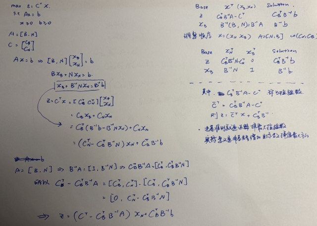
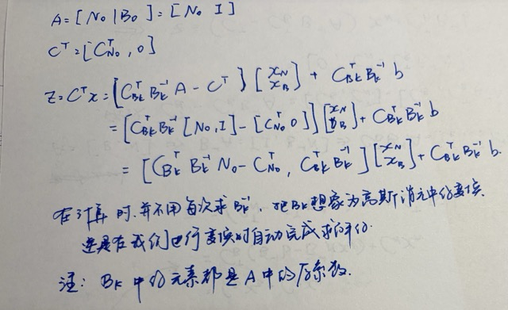

## INTRO

运筹学（Operations Research, OR）利用数学方法对决策问题建模，在资源约束下寻找最优或较优方案。

$$
\min_{{x}} \text{ or } \max_{{x}} \; f({x})
$$
$$
\text{s.t.}
\begin{cases}
g_i({x}) \le 0, & i=1,2,\dots,m \\
h_j({x}) = 0, & j=1,2,\dots,p \\
{x} \in X
\end{cases}
$$

- ${x}$：决策变量向量
- $f({x})$：目标函数
- $g_i({x}) \le 0$：不等式约束
- $h_j({x}) = 0$：等式约束
- $\text{s.t.}$ = subject to，受约束于
- $X$：决策变量的可行集合

运筹学模型的最优解仅对这个特定的模型有效。对问题的抽象简化能力是建模的关键

### 解决问题的步骤

1. 定义问题并收集数据
2. 构造运筹学数学模型
3. 模型求解
4. 模型验证
5. 应用准备和具体措施

## Linear Programming (线性规划)

可行解：满足约束条件
最优解：最好的可行解

线性规划总可以在可行解空间的角点处找到最优解

### LPM 线性规划（标准型）

$$
\max \quad {c}^T {x}  \ 
$$

$$
\text{s.t.}
\begin{cases}
A{x} = {b} \ \text{ where }A \in \mathbb{R}^{m\times n} \\
{x} \ge {0}
\end{cases}
$$

- ${c}$：价值系数向量
- ${x}$：决策变量向量
- $A$：约束系数矩阵，一个良好的模型还会满足 $rank(A) = m$（保证约束唯一）
- ${b}$：右端常数向量，要求 ${b}\ge {0}$
- ${x}\ge {0}$：变量非负约束

例子可以是网络的最大流问题

#### 等式约束

如果碰到不等式，使用：
1. 松弛变量
2. 剩余变量
规划为等式

#### 决策变量

单纯形法要求所有决策变量非负，定义：
$$
x = x^+ - x^-
$$
其中右侧变量均大于等于0，但是不能同时取正值，也就是至少一个为0

### Simplex method 单纯形法

一般线性问题规划问题的代数方法，方法的几何解释是发现最优的角点

$A{x}={b}$ 的解 $x$ 至少有 $n-m$ 个零变量 (非基变量)，剩下需要求解的变量叫做基变量（**基变量最多有N个**），如果基变量没有唯一解，则需要重新选择非基变量（$A$ 满秩的情况下总有唯一解）。

如果有唯一解，则称解为基解(basic solution), basic solution 是corner point的代数表示。基解（角点）的最大数目是$\binom{n}{m}$

**单纯形法之需要考察部分基解，就能找到问题的最优解**

> Q: 为什么我们认为线性规划求出来的是全局最优而不是局部呢？

> A：LP 可行域是有限个半空间的交集；每一个半空间都是凸集；凸集相交仍然是凸集，所以最后得到的集合是凸集。而且目标是线性的。（凸集定义：如果 $ x_1,x_2\in C$ 那么 $\lambda x_1+(1-\lambda)x_2\in C $ 其中：$ 0\leq\lambda\leq1$）（更多知识可以去学习凸优化，线性规划其实是凸优化的一种特殊情况。）

#### 单纯形法的迭代本质

单纯形法要求每次增加一个变量的值（一次只增加一个变量的值），并且选择让目标函数改善最快的变量。每次移动中，非基变量变为基变量是进基变量反之是离基变量。从一个角点移动到另一个是等价于从一个基解转化为另一个基解。

- entering variable (进基变量)
- leaving variable (离基变量)

#### 单纯形法的计算细节

单纯形表：
- 行是目标等式方程(z)和约束等式方程(s)
- 列是z在目标函数等式方程，约束等式方程的系数
- 列解是当前目标函数值 $z=0$ 和基变量值

根据进基准则来选择进基变量，通常又称 $z$ 行系数为检验数。

单纯形表中进基变量所在的列为主列(pivot column)，离基变量所在的行为主行(pivot row)，主列与主行交叉处为主元(pivot element)

离离基准则中比值的意义是直线的截距

#### 单纯形法的总结

**进基准则**　在极大值（极小值）问题中，进基变量是单纯形表 $z$ 行中具有最负（最正）系数的非基变量。如果有多个可任选其一。进基变量是table中z行最负系数的非基变量，当没有符合要求的，达到最优

**最优性检验**　当 $z$ 行中所有非基变量的系数是非负（非正）时，迭代达到最优。“所有非基变量的 $z$行系数是非负（非正）”称为单纯形法求解极大值（极小值）线性规划问题的最优性条件。

**离基准则**　对于极大值和极小值问题，离基变量是具有严格正分母的且有最小非负比的基变量。如果有多个可任选其一。

**无界解检验**　如果无法选取离基变量，即在主列不存在具有严格正分母的基变量，则问题有无界解。

**单纯形法的计算步骤**

1. 确定初始基可行解，构造初始单纯形表。

2. 用进基准则选择一个非基变量作为进基变量。如果无法选取进基变量，则停止计算，当前解为最优解。

3. 用离基准则选择一个基变量作为离基变量。如果无法选取离基变量，则停止计算，问题有无界解。

4. 用初等行运算计算出新的单纯形表（让pivot的系数 = 1, 高斯消元），转到第 2 步。

> Q：进基，离基为什么这样选择，主元是什么意义，为什么在消元的时候要更新“行最前面的那个变量”

>  A：进基是为了选择一个对于z来说“梯度”最大的方向，比如 $z-3x_1-7x_2+3x_3=z_0$这样的，选择$x_2$作为进基，每增加一个单位大7个单位。离基准则考虑的是在保证非负的约束下，最远能走多少。消元的时候，更改变量其实是在标记目前这一行到底是来解哪一个变量的，在最终消元结束后，等于最后一列的解值。本质就是高斯消元加上换基元，书上写的过于复杂。

**注：严格来说，退化情况下可能出现 cycling，所以实际还会使用 Bland's rule 等防循环规则。**

### Artificial starting solution (人工初始解)

右端项非负，当约束是 "$=$" 和 "$\ge$" 的时候，初始解全为0是不可行的，所以我们引入人工变量

### 大M法

适用于等式约束
1. 在约束条件中引入人工变量（artificial variables）$R_1,R_2$。
2. 在目标函数里加入惩罚项，使用一个非常大的常数 $M$。
3. 第一次消元通过行变化让 $z$ 行中 $R$ 的系数等于0（使用行变化修正单纯形表），然后正常使用单纯形法

$$
\min Z = \dots + M R_1 + M R_2
$$

- 新问题中可以直接取 $x_1=0,x_2=0$ 作为初始可行解，给单纯形法提供一个起点。
- 如果人工变量 $R_1,R_2>0$，目标函数就会受到很重的惩罚。
- 如果原问题本身是可行的，优化结束后人工变量 $R_1,R_2$ 会变成 0，此时新问题等价于原问题，我们就得到原问题解。

### 两阶段法 (Two‑phase method)
大M法在目标函数中使用的惩罚系数 $M$ 比其他变量系数大很多，可能会导致严重的舍入误差，降低计算精度。

拆成先后两个线性规划问题，分两步求解：
1. 得到初始基可行解
    1. 约束里面加入人工变量 $R_1,R_2...$，约束条件完全相同。
    2. 最小化所有人工变量之和，如果 $w = 0$ 进入第二阶段（修正单纯形表，不断替换人工变量，当$w = 0$时要求基变量里面没有人工变量）

$$
{\min \ w = R_1+R_2}
$$

2. 退化情况：$w_{min}=0$，但是有部分人工变量依旧是基变量，取值等于 0.
    1. 选一个取值等于 0 的人工变量作为离基变量，它所在行作为主行；从主行里面挑任意一个系数非零的非基变量做进基变量，做一次单纯形转轴迭代。
    2. 这一列直接从单纯形表里删掉。检查是不是所有人工变量全部变成非基变量并且全部删掉。

3. 求解原问题

### 单纯形法中的特殊情况 (Special cases in the simplex method)

1. **Degeneracy（退化）**

    一个基可行解 (basic feasible solution) 中，至少有一个基变量取值等于 0。

    产生原因：单纯形表右端项 b 有等于 0 的元素。可能出现循环，可以用布兰德法则 (Bland’s rule) 规避循环

    实际意义：角点是超定的(多条直线通过一个角点)，这说明约束条件冗余。

2. **Alternative optima /multiple optimal solutions（多重最优解）**

    问题存在无穷多个最优解，目标函数最优值唯一，但最优解不唯一

    单纯形判据：已经达到最优，存在某个非基变量的检验数 = 0：把这个非基变量进基做转轴，目标函数值保持不变，可以得到另一个不同最优顶点解；两个顶点连线上所有点全部都是最优解，无穷多最优解

    实际意义：目标函数等高线和可行域某一条边完全重合，边上每一点都是最优。

>Q:退化解第一次出现的时候，是否可以停止计算，即使最优性条件尚未满足？
>A:退化有可能只是暂时现象。

3. **Unbounded solutions（无界解）**

    可行域朝着某个方向无限延伸，目标函数可以无限变好（最大化可以无限大；最小化可以无限小），没有有限最优值。

    单纯形判据：选好了进基变量（检验数指示可以改善目标），但是进基那一列所有系数全部 ≤0。

    最小比值法则找不到任何有效的比值，没有变量可以离基。可以无限增大这个进基变量，仍然满足全部约束，目标持续优化。

4. **Non‑existing (infeasible) solutions（不可行解，不存在可行解）**

    可行域是空集，不存在任何点同时满足全部约束条件。没有可行解，自然也就没有最优解。
    
    - 两阶段法判据：阶段 I 最优 $w_{min}>0$。至少一个人工变量 > 0。
    - 大 M 法判据：最优解里面仍然人工变量 $R>0$。

### 单纯形法的原理 (Principles of simplex method)

从单纯形法的矩阵表示找到一些规律
1. 单纯形法由基矩阵的逆唯一确定
2. 单纯形法能够找到线性规划问题的最优基可行解 (appendix)

#### 矩阵表示

$$
\begin{aligned}
\max \quad z &=  c^\mathrm T  x \\
\text{s.t.} \quad A x &=  b \\
 x &\ge  0,\quad  b \ge  0
\end{aligned}
$$

$ x\in \mathbb R^n,\ A\in\mathbb R^{m\times n},\  b\in\mathbb R^m,\  c\in\mathbb R^n,\ \mathrm{rank}(A)=m$。

将变量拆分为基变量 $ x_B\in\mathbb R^{m}$ 和非基变量 $ x_N\in\mathbb R^{n-m}$，矩阵 $A$ 按列拆分：
$$
A=\begin{bmatrix}B & N\end{bmatrix}
$$
- $B\in\mathbb R^{m\times m}$：**基矩阵**，取 $A$ 中基变量对应的列，$B$ 可逆；
- $N\in\mathbb R^{m\times(n-m)}$：非基变量对应的子矩阵。

目标系数向量拆分：
$$
 c=\begin{bmatrix} c_B \\  c_N\end{bmatrix}
$$
- $ c_B$：基变量的目标系数向量；
- $ c_N$：非基变量的目标系数向量。

约束 $A x= b$，即 $B x_B+N x_N= b$，两边左乘 $B^{-1}$：
$$
B^{-1}A x = B^{-1}N x_N+ x_B = B^{-1} b
$$
得到基变量显式表达式：
$$
 x_B = -B^{-1}N x_N + B^{-1} b
$$

目标函数展开变形：
$$
\begin{aligned}
z &=  c^\mathrm T  x
= c_B^\mathrm T  x_B+ c_N^\mathrm T  x_N \\
&= \big( c_N^\mathrm T- c_B^\mathrm T B^{-1}N\big) x_N+ c_B^\mathrm T B^{-1} b \\
&= \big( c^\mathrm T- c_B^\mathrm T B^{-1}A\big) x+ c_B^\mathrm T B^{-1} b
\end{aligned}
$$

#### 基解、基可行解
令非基变量 $ x_N= 0$，得到**基解**：
$$
 x_N= 0,\quad  x_B = B^{-1} b
$$
若满足 $B^{-1} b \ge  0$，该解称为**基可行解**，此时目标值：
$$
z= c_B^\mathrm T B^{-1} b
$$

#### 单纯形表矩阵形式

整体单纯形表：

|基|$ x^\mathrm T$|解|
|---|---|---|
|$z$|$ c_B^\mathrm T B^{-1}A- c^\mathrm T$|$ c_B^\mathrm T B^{-1} b$|
|$ x_B$|$B^{-1}A$|$B^{-1} b$|

#### 检验数定义
设 $ a_j$ 为矩阵 $A$ 的第 $j$ 列，定义
$$
z_j \triangleq  c_B^\mathrm T B^{-1} a_j
$$
变量 $x_j$ 的检验数：
$$
\sigma_j = z_j - c_j
$$
最大化问题最优条件：全部检验数 $z_j-c_j \ge 0$。

> 检验数（reduced cost）意义是：在当前基可行解附近，改变一个非基变量，目标函数值会改变多少。单纯性法选择的就是最大检验数作为入基

调整顺序 $ x=( x_N, x_B),\ A=[N\ \ B], c=( c_N, c_B)$：

|基|$ x_N^\mathrm T$|$ x_B^\mathrm T$|解|
|---|---|---|---|
|$z$|$ c_B^\mathrm T B^{-1}N- c_N^\mathrm T$|$ 0$|$ c_B^\mathrm T B^{-1} b$|
|$ x_B$|$B^{-1}N$|$I$|$B^{-1} b$|

>性质：基变量在目标行($z$ 行)系数为 $0$ （**检验数= 0**）；约束行中基变量部分构成单位矩阵 $I$。$B^{-1} b$ 直接算出基变量取值

#### 单纯形表中的逆矩阵

变量拆分 $ x=\begin{bmatrix} x_{N_0}\\ x_{B_0}\end{bmatrix},\ A=\begin{bmatrix}N_0 & I\end{bmatrix},\  c=\begin{bmatrix} c_{N_0}\\ 0\end{bmatrix}$

|基|$ x_{N_0}^\mathrm T$|$ x_{B_0}^\mathrm T$|解|
|---|---|---|---|
|$z$|$- c_{N_0}^\mathrm T$|$ 0$|$0$|
|$ x_{B_0}$|$N_0$|$I$|$ b$|

需修正的初始单纯形表：若初始基变量在原目标函数中的系数$c_{B_0}\neq0$，则直接写出的目标函数行还不是相对于初始基 $B_0$ 的检验数行。需要利用约束行消去目标行中的基变量，将目标行化为检验数形式。大 $M$ 法是典型情形。

>上面的性质已经推导过为什么检验数=0

修正后的初始单纯形表中$z$可能是非0值，在随后的单纯形法迭代中，基变量的组成不断变化。第 $k$ 次迭代，当前基矩阵 $B_k$，单纯形表（每次迭代将基的系数化为单位矩阵）：

|基|$ x_{N_0}^\mathrm T$|$ x_{B_0}^\mathrm T$|解|
|---|---|---|---|
|$z$|$ c_{B_k}^\mathrm T B_k^{-1}N_0- c_{N_0}^\mathrm T$|$ c_{B_k}^\mathrm T B_k^{-1}$|$ c_{B_k}^\mathrm T B_k^{-1} b$|
|$ x_{B_k}$|$B_k^{-1}N_0$|$B_k^{-1}$|$B_k^{-1} b$|

>重要结论：迭代后的逆矩阵 $B_k^{-1}$ 直接体现在单纯形表里；转轴操作本质就是更新 $B^{-1}$，不需要反复做矩阵求逆。
>迭代后的逆矩阵 $B_k^{-1}$ 仍然可以表示整张单纯形表， $B_k$中的系数仍然是从原始$A$中取的

当 $ c_B^\mathrm T B^{-1}N- c_N^\mathrm T \ge  0$（全部非基变量检验数 $\ge 0$），此时这套表格才是最优单纯形表，此时 $B=B^*$（最优基）。

> 补充单纯形法相关定理（证明见附录“单纯形法相关定理证明”）
> 1. 线性规划基本定理：最优一定出现在顶点（基可行解），单纯形只搜索顶点是合理。
> 2. 迭代改善定理，非退化情形：不满足最优条件时，可以进一步改善目标（或者遇到无界解），应当继续迭代。
> 3. 最优性判定定理：满足最优条件时，已经达到最优，可以停止迭代。

### Sensitivity analysis

敏感性分析（Sensitivity Analysis）研究的是：当线性规划模型中的参数发生变化时，原来的最优解、最优基和最优目标值会如何变化。其核心思想不是重新求解整个线性规划，而是判断当前的 optimal basis 在参数变化后是否仍然有效。

对于标准形式
$$
\max \; c^T x,\qquad Ax\le b,\qquad x\ge 0,
$$
敏感性分析主要关注两类参数：约束右端项 $b$ 和目标函数系数 $c$。

当 $b$ 变化时，表示资源数量发生变化，因此可行域会发生移动，(还在同一份直线)。若当前基矩阵为 $B$，则基本变量满足
$$
x_B=B^{-1}b.
$$
当 $b$ 变为 $b+\Delta b$ 时，
$$
x_B'=B^{-1}(b+\Delta b).
$$
只要 $x_B'\ge 0$，当前基仍然可行，因此不需要更换 basis。

资源 $b_i$ 每增加一个单位所引起的最优目标值变化称为 **shadow price（影子价格）**。若
$$
y^T=c_B^TB^{-1},
$$
则
$$
y_i=\frac{\partial z^*}{\partial b_i}.
$$
因此 $y_i$ 可以理解为第 $i$ 种资源的边际价值。但是 shadow price 只在当前 optimal basis 不发生变化的范围内有效，超过允许范围后需要重新确定最优基。

当目标函数系数 $c$ 变化时，可行域不变，但目标函数直线的方向(斜率)会改变。此时主要判断当前 basis 是否仍然满足最优性条件。对于非基变量 $x_j$，其 reduced cost 为
$$
\bar c_j=c_j-c_B^TB^{-1}A_j.
$$
对于最大化问题，在这种定义下，如果所有非基变量满足
$$
\bar c_j\le 0,
$$
则当前 basis 仍然最优。若某个 reduced cost 变为 \(0\)，通常对应 alternative optima 的临界情况；若继续变化使其大于 \(0\)，则该变量可以进基，原来的 optimal basis 将发生改变。

因此可以概括为：
$$
\boxed{
b\text{ 变化：检查 feasibility},\qquad
c\text{ 变化：检查 optimality}.
}
$$

敏感性分析的本质可以理解为：研究当前最优 basis 在参数变化时能够保持有效的范围。在线性规划中，最优目标值通常关于参数呈现分段线性（piecewise linear）的变化。

### application

主要解决满足守恒关系的约束问题
- 最大流

    在一个有向网络里，从起点 \(s\) 往终点 \(t\) 输送“流量”，每条边都有容量上限。问：最多能从 \(s\) 送多少流量到 \(t\)？

    约束：每个节点的输入量 = 输出量

- 最短路
    1. 最大流问题，额外约束是这样的：起点的输出量是1,终点输入量是1，最终我们求解后 = 1的边是最短路
    2. 定义 $x_{i}$ 是从起点到 $i$ 的最小距离，所以我们可以产生的约束是在每一个节点的动态规划：$x_{i} = x_{i-1} + s_{i-1,i}$ ，所以 $x_{i}$ 的最大值一定比其他到节点 $i$ 的路径短，最终求 $\max x_t$
    3. replacement policy 可以转化为最短路，most reliable / safest path取负对数之后转化为最短路问题
    4. dijkatra：松弛
- 投资问题
- 排班问题

## advanced Linear Programming (高级线性规划)

主要内容为对偶理论，对偶单纯形法，后最优分析和内点法
承接基本线性规划和原始单纯形法，讨论四个问题：如何从另一个角度证明最优；已有解失去可行性时怎样继续迭代；模型参数变化后能否复用旧解；以及如何在可行域内部寻找最优解。

### 1. 对偶：为原问题建立另一种描述

对偶问题是原始问题按某种方式直接构造出来的一个新的线性规划问题。可以从原始问题的最优解推出另一个问题的最优解

#### 1.1 从原问题构造对偶问题

先考虑等式标准型的极大化问题：

$$
\begin{aligned}
(P)\quad \max_x\quad &c^\mathsf T x\\
\text{s.t.}\quad &Ax=b,\\
&x\geq 0,
\end{aligned}
\qquad
\begin{aligned}
(D)\quad \min_y\quad &b^\mathsf T y\\
\text{s.t.}\quad &A^\mathsf T y\geq c,\\
&y\in\mathbb R^m.
\end{aligned}
$$

这里 $A\in\mathbb R^{m\times n}$。

$P$ 中每一条等式约束对应 $D$ 中的一个变量 $y_i$；$P$ 中每个非负变量 $x_j$ 对应 $D$ 中的一条不等式 $a_j^\mathsf T y\geq c_j$，其中 $a_j$ 是 $A$ 的第 $j$ 列。**等式对应无符号限制的对偶变量**，因为等式两侧乘正数或负数都不会改变它成立这一事实。

若原问题的约束并非全为等式，可按下表直接判断（各行分别针对原问题的极大化或极小化目标）：

| 原问题 | 对偶目标 | 原问题的一条约束 | 对应的对偶变量 | 原问题的一个变量 | 对应的对偶约束 |
| --- | --- | --- | --- | --- | --- |
| 极大化 | 极小化 | $\leq$ / $=$ / $\geq$ | $\geq0$ / 自由 / $\leq0$ | $x_j\geq0$ / 自由 / $x_j\leq0$ | $\geq$ / $=$ / $\leq$ |
| 极小化 | 极大化 | $\geq$ / $=$ / $\leq$ | $\geq0$ / 自由 / $\leq0$ | $x_j\geq0$ / 自由 / $x_j\leq0$ | $\leq$ / $=$ / $\geq$ |

交换“变量”和“约束”，把系数矩阵 $A$ 转置，再检查目标方向、每个约束的方向和变量的符号。无符号限制变量 $x_j$ 也可拆为 $x_j=x_j^+-x_j^-$，其中 $x_j^+,x_j^-\geq0$；其对应的两条反向不等式共同构成对偶等式。

**例：**

$$
\begin{aligned}
\max\quad &5x_1+12x_2+4x_3\\
\text{s.t.}\quad &x_1+2x_2+x_3\leq10,\\
&2x_1-x_2+3x_3=8,\\
&x_1,x_2,x_3\geq0.
\end{aligned}
$$

第一个约束对应 $y_1\geq0$，第二个等式对应自由变量 $y_2$，所以对偶为

$$
\begin{aligned}
\min\quad &10y_1+8y_2\\
\text{s.t.}\quad &y_1+2y_2\geq5,\\
&2y_1-y_2\geq12,\\
&y_1+3y_2\geq4,\\
&y_1\geq0,\quad y_2\text{ 自由}.
\end{aligned}
$$

#### 1.2 对偶定理

如果 $x$ 是极大化原问题的可行解，$y$ 是对应极小化对偶问题的可行解，那么

$$
\underbrace{c^\mathsf Tx}_{\text{原问题的值}}
\leq x^\mathsf TA^\mathsf Ty
=y^\mathsf TAx
=\underbrace{b^\mathsf Ty}_{\text{对偶问题的值}}.
$$

这就是弱对偶定理。任何一个对偶可行解都为原问题的最优值提供上界；任何一个原问题可行解都为对偶问题的最优值提供下界。若找到一对可行解，有且只有 $c^\mathsf Tx=b^\mathsf Ty$，两同时最优。

在线性规划中，只要存在有限最优解（$y=B^{-\mathsf T}c_B,$），强对偶定理保证另一侧也存在最优解，且两个最优值相等。由弱对偶还可推出：若一侧无界，则另一侧不可行；但一侧不可行时，另一侧可能无界，也可能同样不可行，不能直接下结论。

> 对偶为什么这么构造：用原约束的非负线性组合，构造出一个“至少比目标函数系数 \($c$\) 更大”的系数向量。这样我们能得到约束上界 $b^\mathsf Ty$，当 $c^\mathsf Tx = x^\mathsf TA^\mathsf Ty$ 时取等，即 $\sum_j \big((A^\mathsf T y)_j-c_j\big)x_j = 0$，即 $x_j\big((A^\mathsf T y)_j-c_j\big)=0\quad\forall j.$

#### 1.3 互补松弛与影子价格

在上述等式标准型中，原问题可行解 $x$ 与对偶可行解 $y$ 同时最优，当且仅当

$$
x_j\bigl(y^\mathsf Ta_j-c_j\bigr)=0\qquad(j=1,\ldots,n).
$$

因此 $x_j>0$ 时，第 $j$ 条对偶约束必须取等号；若该对偶约束严格松弛，则 $x_j=0$。

如果原问题还有 $a_i^\mathsf Tx\leq b_i$ 且 $y_i\geq0$，还应检查 $y_i(b_i-a_i^\mathsf Tx)=0$：资源未用尽时，其影子价格为零；影子价格为正时，该资源约束紧束。逆命题并不总成立，紧束约束也可能有零影子价格。

若最优基在 $b\mapsto b+\Delta b$ 后仍可行，目标系数又保持不变，则

$$
\Delta z^*= c_B^\mathsf T\Delta x_B = c_B^\mathsf T B^{-1}\Delta b = y^\mathsf T\Delta b.
$$

这给出 $y_i$ 的经济意义：在当前最优基有效的范围内，资源 $b_i$ 增加一个单位给最优目标值带来的变化。影子价格是局部的；变化太大、最优基改变后，不应继续用同一个 $y_i$ 线性外推。

对偶的几何意义：用原问题各个约束超平面的法向量做非负线性组合，来表示目标函数的方向，并寻找其中代价最小的组合。

#### 1.4 由最优基读出对偶解

设 $B$ 是原问题的一个最优基矩阵，$c_B$ 是基变量的目标系数，$x_B=B^{-1}b$。相应的对偶解由

$$
y=B^{-\mathsf T}c_B,
\qquad
 y^\mathsf T=c_B^\mathsf TB^{-1} 
$$

给出(最优价格)。

为什么是这个式子？当原式子有最优解 $x_B\geq0$，于是由约束：
$$
x_j\big((A^\mathsf T y)_j-c_j\big)=0\quad\forall j.
$$
得到：
$$
(A^\mathsf T y)_j=c_j
$$
对于基变量部分有:
$$
y=B^{-\mathsf T}c_B
$$
对于非基变量部分有:
$$
N^\mathsf T y\ge c_N.
$$
代入得到
$$
N^\mathsf T B^{-\mathsf T}c_B\ge c_N.
$$
定义
$$
\bar c_N
=
c_N-N^\mathsf T B^{-\mathsf T}c_B,
$$
于是最优性条件(最大化问题)就是
$$
\bar c_N\le0.
$$

第 $j$ 个变量的约化成本（reduced cost：把基变量从目标函数里消掉以后，某个非基变量 \($x_j$\) 前面剩下的系数。就是检验数）为

$$
\rho_j=y^\mathsf Ta_j-c_j
=c_B^\mathsf TB^{-1}a_j-c_j.=z_j - c_j
$$
$$
\rho_j=-\bar c_j
$$
对当前基而言，$x_B\geq0$ 表示原问题可行；$\rho_j\geq0$ 对所有 $j$ 成立表示对偶可行。两者同时成立，当前基就最优。

> 单纯形表和对偶的联系：极大化问题的 $z$ 行系数 $c_B^\mathsf TB^{-1}a_j-c_j$，恰好就是对偶约束 $y^\mathsf Ta_j\geq c_j$ 的松弛量。如果原始问题的最优性条件不成立，意味着对应的这个对偶约束不成立。原始问题成立的时候，意味着相应对偶解 $y=B^{-\mathsf T}c_B$ 成为满足约束的可行解，因此可以设计出对偶单纯形法。原始单纯形法在修复这个松弛量的负值；对偶单纯形法在保持它非负的同时修复原问题的负基变量。

### 2. 其他单纯形法

先固定约定：以下用 $\max\{c^\mathsf Tx:Ax=b,\ x\geq0\}$，并使用 $\rho_j=c_B^\mathsf TB^{-1}a_j-c_j$。基矩阵必须可逆，但一个基对应的基解不一定可行。

| 方法 | 开始时已经满足 | 迭代中保持 | 最终修复 |
| --- | --- | --- | --- |
| 原始单纯形法 | $B^{-1}b\geq0$ | 原问题可行 | $\rho_j\geq0$（最优性） |
| 对偶单纯形法 | $\rho_j\geq0$ | 对偶可行 | $B^{-1}b\geq0$（原问题可行） |
| 广义单纯形法 | 两者都可能不满足 | 交替采用上述步骤 | 原问题可行且对偶可行 |

#### 2.1 对偶单纯形法如何选枢轴

写出当前基所对应的约束行：

$$
x_{B_i}+\sum_{j\in N}\bar a_{ij}x_j=\bar b_i,
\qquad \bar A=B^{-1}A_N,\quad \bar b=B^{-1}b.
$$

1. **离基变量**
    
    找 $\bar b_r<0$ 的基变量，可优先选最负的一行。如果所有 $\bar b_i\geq0$，原问题也可行，此时已经最优。
2. **进基变量**
    在第 $r$ 行找 $\bar a_{rj}<0$ 的非基变量；它增加时，才可能把负的 $x_{B_r}$ 修复为零。按保持对偶可行的比值规则，选使
   $$\frac{\rho_j}{-\bar a_{rj}}$$
   最小的候选变量，随后做枢轴运算。
3. **判定不可行**
    若选中的负值行对所有非基变量都满足 $\bar a_{rj}\geq0$，该行左侧不可能等于负的 $\bar b_r$ 且所有变量非负，原问题不可行。

该过程允许原问题的目标值在中间迭代下降，因为中间的基解尚不可行；全程维护的是对偶界。它尤其适合**右端项改变后原最优基失去可行性**或**新增约束切掉原最优解**的情况。

#### 2.2 广义单纯形法的出发点

普通单纯形法从“可行但未必最优”出发；对偶单纯形法从“满足最优性条件但不可行”出发。若初始基两类条件均不满足，必须先构造能够合法启动相应步骤的辅助条件：例如借助人工变量／人工约束建立可行的起点，再依次恢复所需的可行性和最优性。课件称结合原始与对偶步骤的这一思路为**广义单纯形法**。关键是选择枢轴时明确自己正在维护哪一个条件，不能把原始或对偶单纯形规则直接套在两者均不满足的任意表上。

### 3. 后最优分析

已经找到最优基 $B$ 后，模型从 $(A,b,c)$ 变成 $(A',b',c')$，不必一开始就重新求解。先分别检查**可行性**和**最优性**：

$$
\text{可行性： }x'_B=(B')^{-1}b'\geq0;
\qquad
\text{最优性： }(c'_B)^\mathsf T(B')^{-1}a'_j-c'_j\geq0.
$$

只改变 $b$ 或 $c$ 时通常有 $B'=B$；若改变 $A$ 的某列且它属于基，需要同步更新 $B'$，不能沿用旧的逆矩阵。

| 参数变化后的状态 | 下一步 |
| --- | --- |
| 可行且最优 | 直接复用当前基，计算新的变量值和目标值 |
| 不可行但仍满足最优性条件 | 用对偶单纯形法恢复可行性 |
| 可行但不满足最优性条件 | 用原始单纯形法恢复最优性 |
| 两者均不满足 | 重新构造合适的起点，或采用两阶段／广义单纯形方法 |

#### 3.1 右端项 $b$ 改变

保持 $A,c$ 不变时，旧基的约化成本不变，最优性条件自动保留。只需计算

$$
x_B^{\rm new}=B^{-1}(b+\Delta b)=x_B+B^{-1}\Delta b.
$$

如果各分量仍非负，旧基仍最优，且 $z_{\rm new}=z_{\rm old}+y^\mathsf T\Delta b$。否则用对偶单纯形法求新解。

**单一资源的允许变动区间**

若 $b_i$ 改为 $b_i+\delta$，记 $d=B^{-1}e_i$，则只需联立检查 $x_{B_k}+\delta d_k\geq0$。这给出旧基保持可行、影子价格仍适用的 $\delta$ 区间。不能只看“资源增加了多少”，还要检查原基是否仍可行。

#### 3.2 新增一条约束

先把当前最优解代入新约束：

- **满足新约束**
    旧解仍可行；因为可行域缩小且目标不变，旧解仍最优。
- **违反新约束**
    把新约束及其松弛变量加入表中，再用对偶单纯形法修复可行性。新最优值通常变差，也可能原问题变得不可行。

**次要约束**：先解主要约束形成的模型，再逐条检查新增约束；若旧最优解满足它，暂时无需加入求解；若不满足，则加入并重新优化。这个做法在约束很多、但真正起作用的约束较少时很有用。

#### 3.3 目标系数 $c$ 改变

保持 $A,b$ 不变时，旧基的 $x_B=B^{-1}b$ 不变，因此可行性保留；但必须重新检查所有约化成本：

$$
\rho_j^{\rm new}=(c_B^{\rm new})^\mathsf TB^{-1}a_j-c_j^{\rm new}.
$$

若全部非负，旧基仍最优，但新最优目标值一般会改变；若出现负值，用原始单纯形法继续迭代。改变的是**价格／单位收益**时，不能只代入旧产量算出一个新收入，就把它当成新最优值；那只是旧方案在新价格下的收入。

#### 3.4 增加一项活动（一个新变量）

令新变量的资源占用列为 $a_{\rm new}$、目标系数为 $c_{\rm new}$。旧方案令它取零，仍可行。计算

$$
\rho_{\rm new}=y^\mathsf Ta_{\rm new}-c_{\rm new}.
$$

对于极大化问题，如果 $\rho_{\rm new}\geq0$，加入新活动不能提高当前最优目标值（$=0$ 时可能出现别的最优方案）；如果 $\rho_{\rm new}<0$，新活动具有改善潜力，应把该变量加入表中继续做原始单纯形迭代。这里 $y^\mathsf Ta_{\rm new}$ 是新活动占用资源按影子价格计的**机会成本**，应与它的单位收益 $c_{\rm new}$ 比较。

> **一个统一的判断顺序**参数变了以后，先问“旧方案还可行吗”，再问“旧方案还最优吗”，最后才选择继续用哪一种算法。单个影子价格或约化成本只能支持当前最优基有效范围内的判断。

### 4. 线性规划的内点法：从内部靠近边界最优解

单纯形法沿可行多面体的顶点和边移动；本章介绍的内点法从一个**严格位于可行域内部**的点出发，在内部不断改善目标值。课件使用的是“投影梯度 + 中心化（变量尺度调整）”的直观算法，并未展开现代内点法常见的障碍函数或原始－对偶牛顿方程。

#### 4.1 为什么要投影梯度

考虑

$$
\max\ c^\mathsf Tx\quad\text{s.t.}\quad Ax=b,\ x>0.
$$

目标的梯度是 $c$；但沿 $c$ 移动通常使 $Ax=b$ 不再成立。可行的小位移 $d$ 必须满足 $Ad=0$。当 $A$ 满行秩时，投影到 $A$ 的零空间的矩阵为

$$
P=I-A^\mathsf T(AA^\mathsf T)^{-1}A,
\qquad d=Pc.
$$

于是 $Ad=0$，也就是在等式约束不被破坏的前提下，沿目标上升的投影方向移动。若 $A$ 不满行秩，应先去掉冗余等式，或改用合适的广义逆。还必须选足够小的步长，确保新点的各分量继续严格大于零。

#### 4.2 为什么要“中心化”

在约束 $Ax=b,\ x>0$ 下，有的变量离边界 $x_j=0$ 很近，有的还很远。若固定采用原坐标的步长，最靠近边界的变量往往过早限制整体移动。课件引入对角缩放矩阵

$$
D=\operatorname{diag}(x_1,\ldots,x_n),
\qquad x=D\tilde x.
$$

当前点在新坐标中变为 $\tilde x=\mathbf1$，而模型变为

$$
\max\ \tilde c^\mathsf T\tilde x,
\qquad \tilde A\tilde x=b,
\qquad \tilde x>0,
\quad\text{其中 }\tilde A=AD,\ \tilde c=Dc.
$$

然后在缩放后的坐标内求投影梯度

$$
\tilde P=I-\tilde A^\mathsf T(\tilde A\tilde A^\mathsf T)^{-1}\tilde A,
\qquad \tilde d=\tilde P\tilde c.
$$

选 $0<\alpha<1$，令 $\nu=\max_{j:\tilde d_j<0}|\tilde d_j|$，得到新的迭代点

$$
\tilde x^+=\mathbf1+\frac{\alpha}{\nu}\tilde d,
\qquad x^+=D\tilde x^+.
$$

由于 $\tilde A\tilde d=0$，等式约束保持成立；由于负方向上最多走边界距离的 $\alpha$ 比例，新点仍严格为正。再次用 $x^+$ 构造 $D$，重复投影、移动和缩放。在有负分量的有界问题中，上式给出课件使用的步长；如果没有负分量或模型无界，就不能机械地套用这个 $\nu$ 定义。

> 中心化并非把新点直接改成原空间的几何中心，也不是改变原优化问题；它只是重新选变量的单位，使当前点在新坐标中处于 $(1,\ldots,1)$，再计算下一步。

## Appendix
### A 单纯形法定理证明

考虑极小值线性规划问题
$$
\min  c^\mathrm T  x,\quad \text{s.t. } A x= b,\  x\ge  0
$$
其中 $ x\in \mathbb R^n, c\in\mathbb R^n, b\in\mathbb R^m,A\in\mathbb R^{m\times n},\mathrm{rank}(A)=m$。

**定理 2.1（线性规划基本定理）**

1. 若线性规划问题存在可行解，则它存在基可行解。

2. 若线性规划问题存在最优可行解，则它存在最优基可行解。

**证明1**

令 $ a_1, a_2,\dots, a_n$ 为矩阵 $A$ 的列向量。
若 $ x= 0$ 是可行解，则零解本身就是基可行解。
设 $ x=(x_1,x_2,\dots,x_n)$ 为一个非零可行解，则
$$
A x = x_1 a_1+x_2 a_2+\dots+x_n a_n= b
$$
假设 $ x$ 中有 $p$ 个严格大于零的分量，不妨设前 $p$ 个：
$$
 x=(x_1,x_2,\dots,x_p,0,\dots,0),\quad x_j>0,\ j=1,2,\dots,p
$$
于是
$$
x_1 a_1+x_2 a_2+\dots+x_p a_p= b
$$

- 情况1：向量组 $\{ a_1, a_2,\dots, a_p\}$ 线性无关

    由于 $\mathrm{rank}(A)=m$，所以 $p\le m$。
    - 如果 $p=m$，则 $ x$ 就是基可行解，证毕。
    - 如果 $p<m$，可以从剩余列选出 $m-p$ 个向量与前面向量构成极大线性无关组，令对应变量取0，得到一组退化基可行解，证毕。

- 情况2：向量组 $\{ a_1, a_2,\dots, a_p\}$ 线性相关

    存在不全为零常数 $y_1,y_2,\dots,y_p$，至少一个 $y_j>0$，使得
    
    $$
    y_1 a_1+y_2 a_2+\dots+y_p a_p= 0
    $$

    对任意实数$\varepsilon$ 
    
    $$
    (x_1-\varepsilon y_1) a_1+(x_2-\varepsilon y_2) a_2+\dots+(x_p-\varepsilon y_p) a_p= b
    $$

    令 $ y=(y_1,y_2,\dots,y_p,0,\dots,0)$，则  $ x-\varepsilon  y$ 满足等式约束 $A( x-\varepsilon y)= b$。取

    $$
    \varepsilon^*=\min\left\{\frac{x_j}{y_j}\mid y_j>0\right\}
    $$
    当 $\varepsilon=\varepsilon^*$，$ x-\varepsilon^* y$ 仍然可行，但正分量个数至少减少一个。重复该过程，直到正分量对应的列向量线性无关，回到情况1，得到基可行解。

**证明2**

设 $ x$ 是最优可行解，有 $p$ 个正分量 $x_1,\dots,x_p$。
- 情况1：$\{ a_1,\dots, a_p\}$ 线性无关，则 $ x$ 本身就是基可行解，且为最优。
- 情况2：$\{ a_1,\dots, a_p\}$ 线性相关。

    构造向量 $ y$。反证法证明 $ c^\mathrm T y=0$：
    
    假设 $ c^\mathrm T y\neq 0$，取充分小 $\delta>0$，$ x-\delta  y$ 可行。由最优性 $ c^\mathrm T( x-\delta  y)\ge  c^\mathrm T x$，推出 $-\delta( c^\mathrm T y)\ge 0$，得到矛盾。故 $ c^\mathrm T y=0$，于是 $ c^\mathrm T( x-\varepsilon  y)= c^\mathrm T x$。选择 $\varepsilon^*$ 减少正分量数目，反复操作得到最优基可行解。

**定理 2.2（非退化情形迭代改善定理）**

给定一个非退化的基可行解以及相应目标函数值 $z_0$，假设存在检验数 $z_j-c_j>0$，最优性条件不满足。
1. 选取 $x_j$ 作为进基变量。若存在离基变量，则单纯形迭代产生新基可行解，新目标 $z<z_0$；若不存在离基变量，则目标函数可以任意小（无界解）。

2. 存在可行解使得目标函数 $z<z_0$。

**证明**

设 $ x=(x_1,\dots,x_m,0,\dots,0)$ 为基可行解，目标值 $z_0$。目标函数写成
$$
z=z_0-(z_{m+1}-c_{m+1})x_{m+1}-\dots-(z_n-c_n)x_n
$$
不妨 $j=m+1$，$z_{m+1}-c_{m+1}>0$，选 $x_{m+1}$ 进基。

- 情况1：进基对应的主列存在正数元素，可以选出离基变量。迭代后 $x_{m+1}>0$。
    $$
    z-z_0=-(z_{m+1}-c_{m+1})x_{m+1}<0 \Rightarrow z<z_0
    $$
- 情况2：主列所有元素均 $\le 0$。$x_{m+1}$ 可以无限增大，保持可行性，目标值不断减小，问题无界。
**2**由**1**直接可得。

**定理 2.3（最优性判定定理）**

若某基可行解满足单纯形法最优性条件，则该解是最优解。

**证明**

最优条件：对所有下标 $j$，$z_j-c_j\le 0$。
$$
z=z_0-\sum_{j=m+1}^{n}(z_j-c_j)x_j
$$
因为 $x_j\ge 0$，$-(z_j-c_j)x_j\ge 0$，于是 $z\ge z_0$。
$z_0$ 为当前解目标值，任意可行解目标都大于等于 $z_0$，当前基可行解为最优解。
